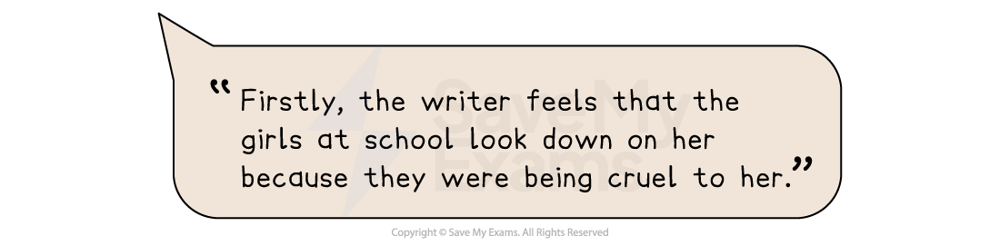
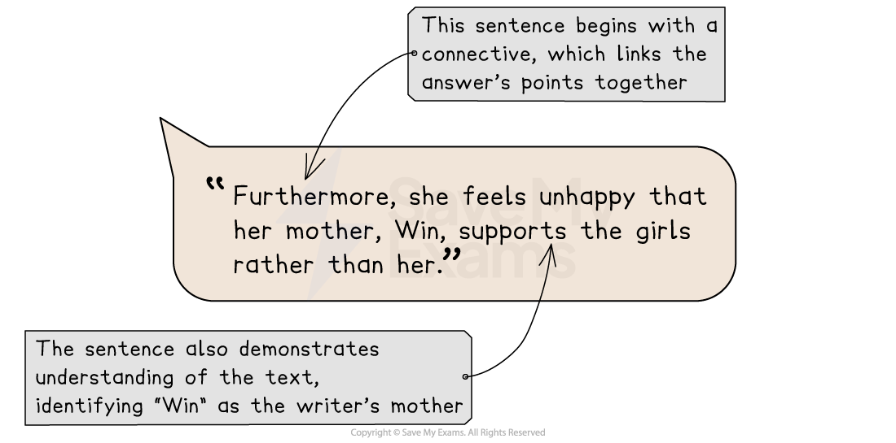

# Question 2 Skills: How to summarise

Question 2 on Paper 1 of your International GCSE tests you on your ability to **understand** and **use explicit and implicit information** in a text, and to summarise that information in your own words.

The sections below will explain what summarising is and how to summarise information successfully:

- **What is summarising?**
- **How to summarise in the exam**
- **Summarising in continuous form**

## What is summarising?

> **Spec point** — `spcpt_dByvxt5nYw3Wyyh7`

## What is summarising?

Summarising is an important literacy skill, useful not just for your International GCSE in English Language. When you summarise, you are **expressing** the **most important facts or ideas** from a text in shortened form, using **your own words**. A summary should effectively explain all of the important information in a text in a clear and concise way, taking only the information that is directly relevant and ignoring less important details.

The key elements of a summary are:

- **Objectivity**: a summary sticks to the facts and is unbiased
- **Concision**: a summary should condense the important information, leaving out unnecessary detail
- **Structure**: a summary should be well-organised, preferably in chronological order, so that it is as clear as possible
- **Accurate**: the information provided in a summary needs to be correct and reliable

The summary you have to produce in your exam for Question 2 needs to **get across the information** the examiner requires in a **clear and accurate way**. This means that you need to distinguish between the important information and the irrelevant information in the text.

However, while summarising as a skill normally allows direct repetition of the words in a text, for this task in the exam you are asked to **write in your own words as far as possible**. In this way, this task is actually a **combination** of **summarising** and ***paraphrasing***, which means rearranging a text and putting it into your own words.

## How to summarise in the exam

> **Spec point** — `spcpt_HPkDNBghyzThKcRV`

## How to summarise in the exam

To complete this task effectively in the exam, it is essential that you understand exactly what you are being asked to summarise. For example:

| **Exam question** | **What you need to do** |
|---|---|
| *In your own words, explain the writer’s thoughts and feelings.* | Here, you are being asked to summarise:  - What the writer is thinking and what the writer is feeling - You may have to **infer** some of this information, based on what you read; to read between the lines |

Once you have identified what you have to summarise, you should **read** the **specified lines of the text carefully **and **highlight** the **information that is directly relevant**.

| **Text** | **Important information (relevant to the focus of the question)** |
|---|---|
| The knowledge that my mother was on the side of the girls I saw sneering and shaking their little heads was deflating. I no longer believe that it was an innocent remark. I think Win did want to knock me off my pedestal. Win’s praise was never, ever unqualified. She could always see my insecurities and find little ways to prick at them, make them flare. It was almost an instinct for her.  It became obvious that my brother, David, was not as temperamentally suited to school as I was. Win even told me, very solemnly, that it was a great shame I was the one who shone, because doing well at school was so much more important for a boy. I remember the moment so well. I was utterly speechless. The observation seemed so cruelly unfair. To me and to all girls. | *The writer’s thoughts and feelings:*  - The writer feels that the girls at school look down on her - She feels unhappy that her mother, Win, supports her classmates rather than her - She thinks that her mother deliberately wants her to feel deflated - She feels that her mother can never just praise or congratulate her - She thinks that her mother knows her insecurities and tries to make them worse - She feels astonished at her mother’s attitude towards her and her brother - She feels so taken aback by her mother’s opinions that she cannot respond - She feels her mother’s point of view is hurtful and unjust, not just to her, but to all girls |

## Summarising in continuous form

> **Spec point** — `spcpt_cTxtf6gZcZqpff9K`

## Summarising in continuous form

Normally, when you summarise from a text, you can choose the most appropriate format in which to present your information, such as a list or in bullet points. However, in the exam, you are asked to **use your own words** and you are expected to **write in full and complete sentences. **

A good way to do this is to make sure you use the words “think” or “feel” in each of your points. For example:

*How to summarise 1*

It is also useful to make good use of connectives in order to link your points, to give a sense of overall ***coherence*** to your answer. For example:

*How to summarise 2*

> **Exam Hint**
> Ensure that you cover all of the important points, and avoid any unnecessary information, such as analysing the writer’s use of language or structure. This won’t gain you any marks.

A full model answer to Question 2 can be found in [Question 2: Model Answer](https://www.savemyexams.com/igcse/english-language/edexcel/a/16/paper-1-non-fiction-texts-and-transactional-writing/revision-notes/paper-1-non-fiction/paper-1-section-a-reading/question-2-model-answer/).
