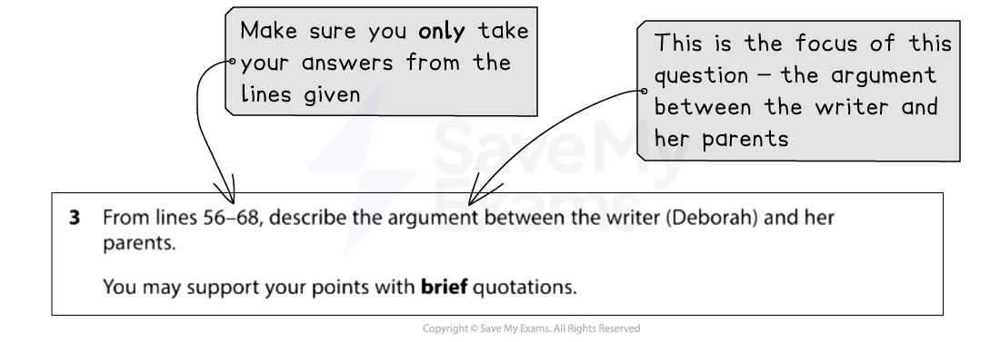
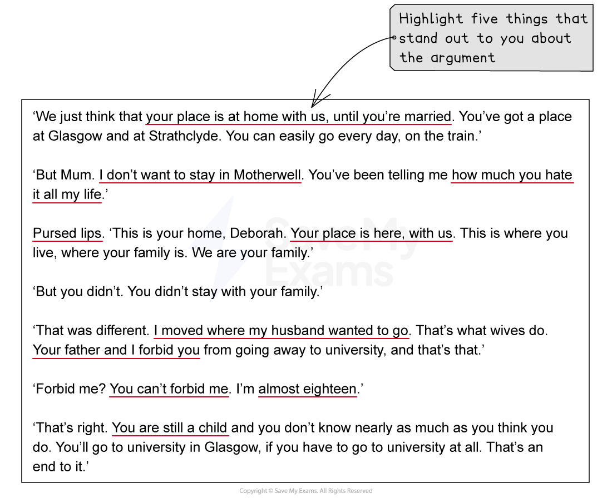

# Question 3: Model Answer

Question 3 is a **short-answer question** that is worth **5 marks**. It will again be based on Text One, the unseen extract, and tests **AO1**, your ability to select and interpret information, and present this information in your own words.

The following guide will demonstrate how to answer an example of Question 3. It includes:

- **Example question and text**
- **Question 3 model answer with annotations**
- **Embedding quotations**
- **Summary**

## Example question and text

> **Spec point** — `spcpt_YcBGrnQGVW2QGwRp`

## Example question and text

Remember, this question will direct you to certain lines of Text One. It is important that you **highlight the focus of the question **(what you will be looking for in the text).

For example:

*Question 3 example*

Once you have done this, **section off the lines of the text** and **highlight** anything that **directly answers the question**.

For example:

*Question 3 section of text*

## Question 3 model answer with annotations

> **Spec point** — `spcpt_cJ5xJPNZBSJr7wcm`

## Question 3 model answer with annotations

Based on the above question, the following model answer demonstrates how to write your answer in order to achieve the full 5 marks:

> **Worked Example**
> *The argument between the writer (Deborah) and her parents is about her going away to university. *Deborah's mother argues that Deborah's place "is at home with us" until she is married. Deborah does not understand this point of view as her mother has been telling her "how much you hate" Motherwell "all my life". Her mother's "pursed lips" suggest unhappiness, disapproval or even anger, and she tells Deborah that "your father and I forbid you" *from going away to university*. Deborah is defiant and argues back that they can't "forbid" her because she is "*almost eighteen*".

## Embedding quotations

> **Spec point** — `spcpt_CkW5WJdF9Xr7zhc9`

## Embedding quotations

Embedding quotes from the text means that **the quotation forms part of your sentence** and it is broken up into the most relevant words or phrases that help you answer the question. Quotes that are not embedded “stand out” from what you are writing and tend to be longer. This becomes an issue if the quotes you are using to support the points you are making in your answer are so long it is not clear which part of it you are using as evidence.

Embedding your quotes also adds maturity and sophistication to your responses, which is required for the highest grades.

Generally quotes that are not embedded are “tacked on” to the beginning or end of a sentence. They are introduced using phrases such as:

- This is shown by the quote…
- We see this when the writer says…
- In line 8 it says…
- or if you start your sentence with a direct quote from the text

In contrast, embedded quotes form part of your sentence:

- The writer uses the metaphor of the character’s eye as a “**laser**” which “**soon pin-pointed**”** **Sacha. This implies that her eyes are a weapon and that Sacha is the target to be locked in on
- The character is described as a “**big, ugly**” guy with a “**mean**” expression on his face. The use of the adjective “**mean**”** **suggests that this is someone you would not want to aggravate

**Embedding your quotations** helps you to **identify** the **specific language **the writer has used and comment on why the writer may have used it. This helps to get you marks!

## Summary

> **Spec point** — `spcpt_2Xq9TB5D6fr2339T`

## Summary

- Remember to r**ead the question carefully** and **highlight**:

  - The instructions (what you have got to do)
  - The focus of the question (what you are being asked to write about)
- This answer should be written in **paragraph form**, or in **five separate, complete sentences** - do not use bullet points or single words:

  - However, do not spend too long on this question or write too much
  - You can only gain 5 marks so use your time wisely
  - There will always be more than five possible points that could be made
- The best answers use a good balance of **short quotation** and **some interpretation**, paying attention to how many marks the question is worth
