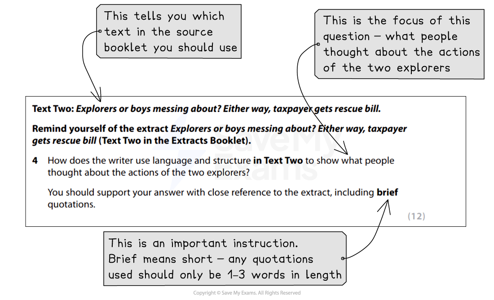
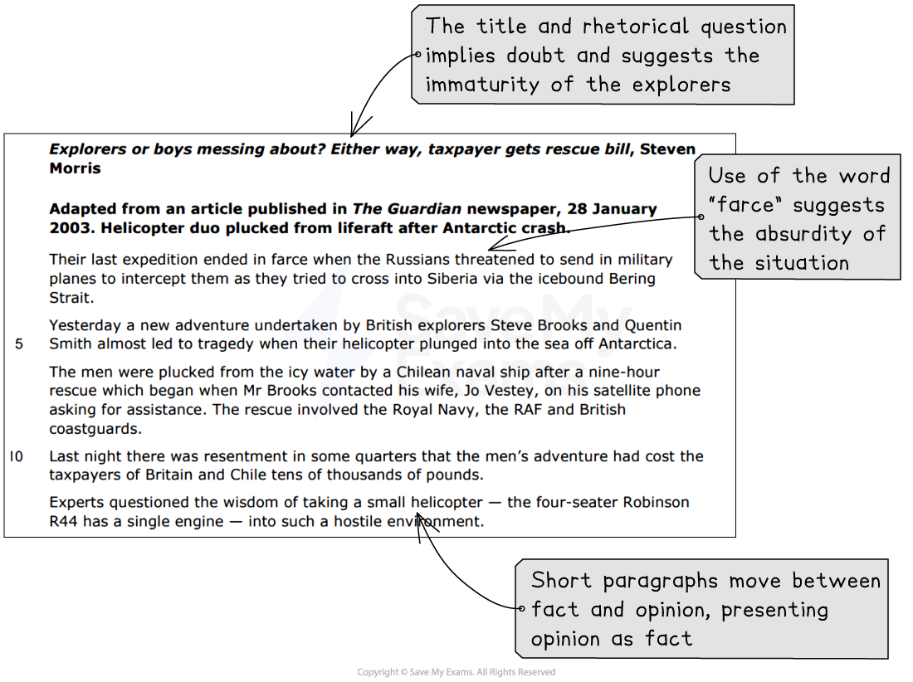

# Question 4: Model Answer

Question 4 is a **longer-answer question** that is worth **12 marks**. It will be based on Text Two, taken from the Pearson Edexcel International GCSE English Anthology, and tests **AO2**, your ability to analyse a writer’s language and structure.

The following guide will demonstrate how to answer Question 4. It includes:

- **Example question and text**
- **Question 4 model answer with annotations**
- **Summary**

## Example question and text

> **Spec point** — `spcpt_3XxGBpYFT59FFbHv`

## Example question and text

Remember, even though you will have studied whichever extract is chosen for this question, it is still important that you **highlight the focus of the question** (what you will be looking for in the text).

For example (taken from the [June 2019 exam paper](https://www.savemyexams.com/igcse/english-language/edexcel/past-papers/paper/ppr_z9qWxZzDbJ6qRRNs/?pdf=https%3A%2F%2Fcdn.savemyexams.com%2Fuploads%2F2022%2F02%2F4ea1-june-2019-paper-1-qp-edexcel-igcse-english-language-a.pdf)):

*Question 4 example*

Once you have done this, **re-read the text**, **highlighting** and **annotating** anything that might help you answer the question.

For example:

*Question 4 text with annotations*

## Question 4 model answer with annotations

> **Spec point** — `spcpt_j5rPdf8f5TMwdjWD`

## Question 4 model answer with annotations

Based on the above question, the following model answer demonstrates how to write your answer in order to achieve the full 12 marks:

> **Worked Example**
> *The writer uses language and structure to show that people thought the actions of the two explorers were foolish and irresponsible. *The writer establishes doubt over the respectability of the men's actions immediately through the use of the rhetorical "Explorers or boys messing about?" in the title. *The use of the phrase "boys messing about" also suggests the immaturity of the explorers, which is an implication repeated throughout the text*. This establishes the writer's point of view that the two men probably behaved irresponsibly. This is reinforced by the use of language such as "farce", suggesting the absurdity of the situation.
> 
> The writer alternates between factual short paragraphs and opinion, which in itself is presented as fact through the use of “experts” and spokespeople. *This again presents the writer as biased towards the idea of this adventure being a waste of time and money.* Again, this is reinforced by including the information that the rescue cost “tens of thousands of pounds”, suggesting disapproval of the explorers’ selfish attitude, especially as it is *“highly unlikely”* that the cost would be recouped.
> 
> Furthermore, the writer continues to use language that implies a childhood adventure gone wrong by describing their helicopter as “trusty” and one of the men’s wives describing them as “boys messing about with a helicopter”, which in itself indicates a lack of pride or patience for her husband’s exploits. The writer then goes on to include detailed facts about the rescue, *including the fact that HMS Endurance was involved*, to convey the severity of the situation and contrast this with the men’s immature attitudes. 
> 
> This contrast is reinforced by the use of experts to question the men’s competence. One Antarctic explorer thinks that it was “nothing short of a miracle” that the men had survived, and Gunter Endres’ criticism of their choice of helicopter is backed up with his credentials. In contrast, the writer makes clear that one of the men only “claims” to have been flying since the age of five, casting doubt upon this assertion. To cement his criticism of the pair, the writer uses another example of a failed expedition, as this is “not the first time” the two men have found themselves in difficult situations.
> 
> Finally, the writer concludes the passage with the patronising comment that the men will probably have “their bottoms kicked and be sent home” to circle back to the idea of them being immature children playing a game, *reinforcing the overall negative view of the actions of the two explorers.*

## Summary

> **Spec point** — `spcpt_NZ9gSdZMHq35mP6n`

## Summary

- Remember to **read the question carefully** and **highlight**:

  - The instructions (what you have to do)
  - The focus of the question (what you are being asked to write about)
- **Highlight **and **annotate the text **in the margins
- Select evidence that you are able to explore and comment upon:

  - Do not just “feature spot”
- If there is more than one piece of evidence you can use to support a point you make, then use it:

  - Do not fall into the trap of “PEE” paragraphs, providing only one quotation as your evidence
- Use connectives to structure your response
- Ensure you use evidence from the **whole of the extract**: start, middle and end
