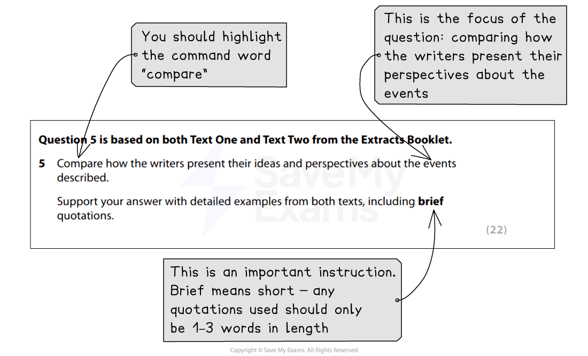
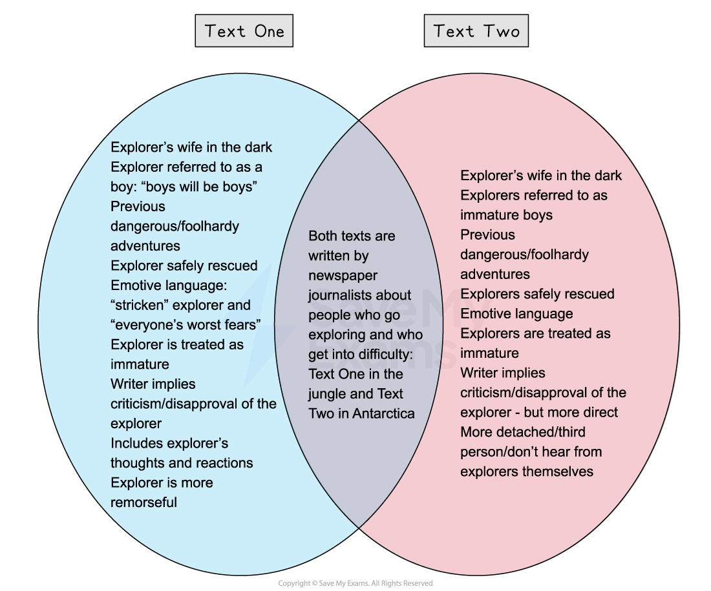

# Question 5: Model Answer

Question 5 is a **long-answer questio**n that is worth **22 marks**. It will be based on both sources and tests AO3, your ability to compare texts.

The following guide will demonstrate how to answer Question 5. It includes:

- **Example question and text**
- **Question 5 model answer with annotations**
- **Summary**

## Example question and text

> **Spec point** — `spcpt_sqYRTDyT3KZpyHwB`

## Example question and text

Remember, even though you will read both texts by the time you reach Question 5, it is still important that you **highlight the focus of the question** (what you are asked to compare).

For example (taken from the [June 2019 exam paper](https://www.savemyexams.com/igcse/english-language/edexcel/past-papers/paper/ppr_z9qWxZzDbJ6qRRNs/?pdf=https%3A%2F%2Fcdn.savemyexams.com%2Fuploads%2F2022%2F02%2F4ea1-june-2019-paper-1-qp-edexcel-igcse-english-language-a.pdf)):

*Question 5 example*

Once you have done this, re-scan each text and create a plan of ideas and perspectives you can compare.

For example:

*Question 5 plan*

## Question 5 model answer with annotations

> **Spec point** — `spcpt_NdHf8GqQ6rY5d3gR`

## Question 5 model answer with annotations

Based on the above question, the following model answer demonstrates how to write your answer in order to achieve the full 22 marks:

> **Worked Example**
> *Both of these texts are written by newspaper journalists and are about people who go exploring and get into difficulty*: Text One in the jungle and Text Two in Antarctica. In both texts, the writers are implicitly critical of how unprepared the explorers were and the effort required to rescue them safely.
> 
> *In both texts, the foolishness of the explorers is reflected in the fact that their wives were unaware of certain aspects of their expeditions. *In Text One, Lenka was concerned by Benedict’s lack of contact, as she began to get “desperately worried”, and was unaware that he did not have a satellite phone until she was informed by Steven Ballantyne of this, which made her “cross”. In Text Two, Mr Brooks’ wife “claimed she did not know what the pair were up to”, but in contrast to Text One, she did not seem to be overly concerned for the explorers. Her reaction to their rescue suggested that she thought of them as boys messing around, and that they would probably “have their bottoms kicked” and be sent home. In both articles, the explorers have to rely on their wives to get them rescued, as in Text One Lenka contacts a TV producer to coordinate a search, and in Text Two Steve Brooks contacts his wife “asking for assistance”, implying that they could not really look after themselves.
> 
> In addition, both articles imply a level of immaturity in the explorers’ actions. In Text One, it is Benedict himself who, right at the end of the article, says “boys will always be boys”. The writer of the article was part of the team sent to rescue him, and patronises him by telling him that his “wife has sent us to collect you”. The title of Text Two immediately implies the explorers’ immaturity by asking if they are “Explorers or boys messing about?”, and even Mr Brooks’ wife describes them as “*boys messing about with a helicopter*”.
> 
> *Furthermore, both journalists emphasise that both rescue missions involved considerable co-ordination*, with several different parties intervening and putting themselves at risk in order to help them. In order to rescue Benedict in Text One, two members of the Hewa tribe undertook a two-day journey to send a message to say that they had found him, plus it took the involvement of the TV location producer contacted by Lenka, the Daily Mail and the helicopter pilot who had to airlift him out of war-torn and remote area of the jungle. In Text Two, the writer of the article emphasises the fact that the Royal Navy, the RAF and British coastguards were all involved in the rescue, costing British and Chilean taxpayers “tens of thousands of pounds”.
> 
> *Both texts also hint at the writers’ disapproval for the explorers’ lack of sense and consideration, although the writer of Text Two is more explicit in his criticism.* Even though Benedict seems to be remorseful of his actions and what he puts his wife through, the writer points out that he set off with “no satellite phone, no GPS device and no companion”, and places himself and the Daily Mail as Benedict’s saviour, otherwise he “might still be there now”. Benedict is grateful for the efforts made to rescue him, but does not rule out another adventure, although the inclusion of the final word “alone” suggests that he is indeed alone in thinking this.
> 
> *The writer of Text Two uses experts and factual detail, such as costs, to highlight that the expedition was a “farce” and that it was “nothing short of a miracle” that they had survived. *The wisdom of the pair’s latest adventure is also questioned by Gunter Endres, editor of Jane’s Helicopter Markets and Systems, and the writer uses a spokesperson from the Ministry of Defence to highlight that it was unlikely that any of the money spent to rescue the men would be recovered. There is also no suggestion of remorse from the explorers in Text Two.
> 
> Finally, the fact that both articles also mention previous expeditions further questions the sense of the explorers involved and their apparent lack of care and consideration for how their actions affect those around them. So while Text One is a more personal account, written by a journalist directly involved in the rescue, and Text Two is more detached and written entirely in the third person as a report, the perspective of both of the writers appears to be that the actions of these men were ill-considered and dangerous, not only to them but also to those involved in getting them out of trouble.

## Summary

> **Spec point** — `spcpt_jDYqXVBwDVZKJKQg`

## Summary

- Remember to **read the question carefully** and **highlight**:

  - The instructions (what you have to do)
  - The focus of the question (what specifically you are being asked to compare)
- Make a **brief plan **before you start to write
- **Select evidence** that you are able to **explore and comment upon**:

  - Do not just “feature spot”
- If there is more than one piece of evidence you can use to support a point you make per text, then use all of the evidence
- **Use connectives** to structure your response
- Ensure you use **evidence** from **both of the texts**, and consider both **language and structural features**
