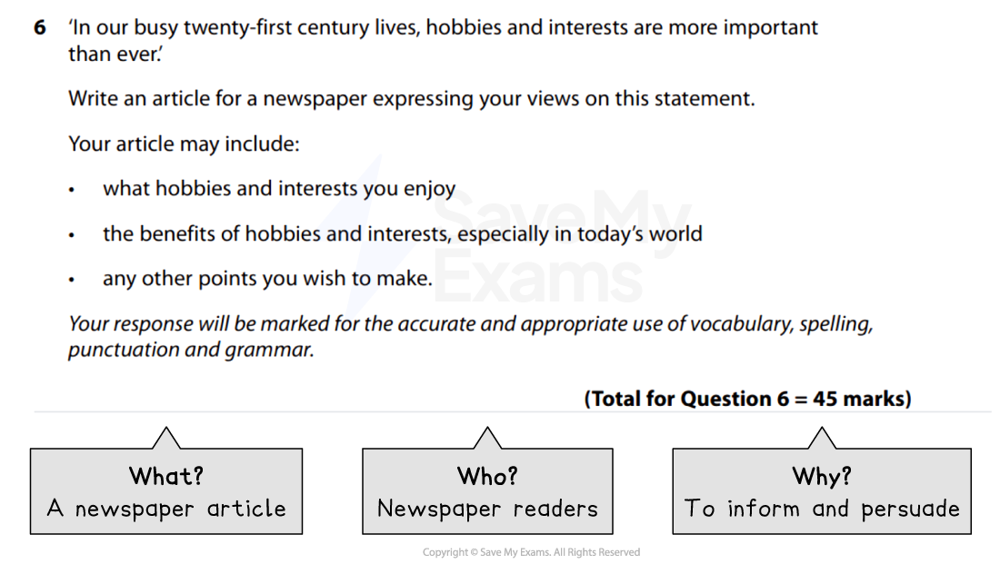
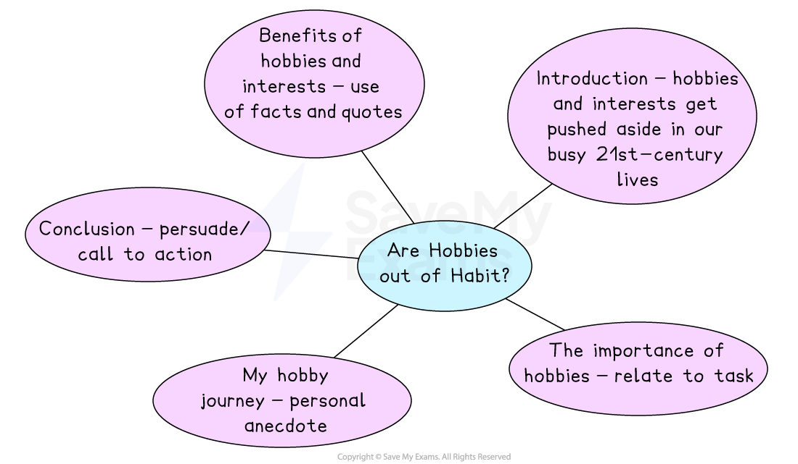

# Article Model Answer

Remember, in Section B you will be given a **choice of two questions**, and each question will give you the option of writing in one of the following forms (genres):

- A letter
- A leaflet
- A review
- A speech
- A guide
- An article

You only need to complete **one task** from the choice of two. Remember to put a cross in the box to indicate whether you have chosen Question 6 or Question 7 in your answer booklet. As you can’t predict which of the six genres will come up in the exam, it’s important that you prepare for all of them.

The following guide will demonstrate how to answer a Section B task in the format of an** article**. The task itself is taken from a past exam paper. It includes:

- **Question breakdown**
- **Planning your response**
- **Article model answer with annotations**

## Question breakdown

> **Spec point** — `spcpt_rxr5T33sDqMxPP8r`

## Question breakdown

The first thing you should do is to read the task carefully and identify the format, audience and purpose of the task. This is sometimes referred to as a **GAP analysis **or the “**3 Ws**”:

| **G** | **A** | **P** |
|---|---|---|
| **Genre **(format) | **Audience** | **Purpose** |
| **What** am I writing? | **Who** am I writing for? | **Why** am I writing? |

For example:

*Section B article example*

For this task, the focus is on **communicating ideas** about the importance of hobbies and interests in readers’ busy lives. You could choose which type of newspaper you are writing for, such as a national Sunday broadsheet, or even a school or college newspaper, and use this to focus on your intended audience.

You should use some stylistic conventions of an article, such as a heading, sub-headings or occasional bullet points, but you should **not** include features of layout such as columns or pictures. There should be **clear organisation and structure **with an introduction, development of points and a conclusion.

## Planning your response

> **Spec point** — `spcpt_xQRK5B2Fwwr3SbRk`

## Planning your response

You should spend **5 minutes** writing a brief plan before you start writing your response.

For example:

*Article plan*

## Article model answer with annotations

> **Spec point** — `spcpt_c8yWYTD8zdKPbw76`

## Article model answer with annotations

Remember, this task is worth **45 marks** (up 20 27 marks for AO4, and up to 18 marks for AO5). Your answer might not always satisfy every one of the assessment criteria for a particular level, but examiners apply a best-fit approach to determine the mark which corresponds most closely to the overall quality of the response.

To get the highest mark, you are aiming to meet the Level 5 marking criteria:

| **AO4** | 23-27 marks | - Communication is perceptive, mature and sophisticated - The response is sharply focused on the purpose of the task and the expectations/requirements of the intended reader - There is sophisticated use of form, tone and register |
|---|---|---|
| **AO5** | 16-18 marks | - The response manipulates complex ideas, using a range of structural and grammatical features to support overall coherence and cohesion - The response uses extensive vocabulary strategically, with only occasional spelling errors which do not detract from overall meaning - The response is punctuated with accuracy to aid emphasis and meaning, using a range of sentence structures accurately and selectively to achieve particular effects |

The following model answer is an example of a top-mark response to the above task:

> **Worked Example**
> ***Are Hobbies out of Habit?***
> 
> How often have you heard yourself say "I haven't got time"? This seems to be the mantra for 21st century living. Life is crazy: jobs, children, other family members, friendships, socialising, exercising, trying to find some "me" time - it's a wonder *we fit it all in!* Increasingly, having a specific hobby or interest seems to get pushed further down our list of priorities, but as life gets more stressful, *maybe it's time we got back into the habit of having a hobby.*
> 
> ***The importance of hobbies ***
> 
> Having a hobby or interest seemed to be commonplace for earlier generations. Crafting, sports, cooking or baking, or being outdoors and spending quality time doing these things was a part of life, but the pressures and the busy nature of modern life seem to have taken over. In addition, our increasingly technologically advanced word means that we have instant access to a wealth of information and entertainment literally at our fingertips. However, I'm not sure I would count TikTok as a *hobby!* Every age has its pressures, but having a specific hobby or interest is as important now as it has ever been, in terms of our mental and physical health and emotional well-being.
> 
> ***My hobby journey ***
> 
> After a particularly lazy January sat on the sofa doing nothing in particular, I decided to embark on my own journey of getting back into the habit of having a hobby. I used to be a keen tennis player when I was younger, and there was a tennis club close to my home which I had resolutely ignored for the past few years. But, for research purposes, I decided to become a member and joined a Tuesday night "Rusty Racket" group. My apologies at the start of my first session were endless: "I haven't played for ages", "my serve is terrible" and "good luck to whoever is partnering me!" But everyone was friendly, welcoming and, crucially, not that competitive. After a few warm-up serves, I was happily dancing around the court, swining my racket left, right and centre like I was on Centre Court at Wimbledon. It was a clear evening, and it felt good to be out in the fresh air to brush away any stresses of the day. *I now make sure I prioritise that time and can now say that tennis is my hobby.*
> 
> **Benefits of hobbies**
> 
> Taking up a sport seems the obvious choice, and there is no doubt that being outside is beneficial to your health, but this does not mean you need to go out and join the first running club you see. Just making time for regular walks in nature can help decrease anxiety levels and feelings of stress. Regular access to green spaces has been linked to lower instances of depression and improved concentration and attention. The charity Mind says that "being outside in natural light can be helpful if you experience seasonal affective disorder (SAD)". Fishing, hiling, mountain biking, geo-caching, orienteering or even rambling can all become something to be passionate about. *If you are lucky enough to live near the coast, open water swimming and paddleboarding are increasingly popular, and will definitely wake you up!*
> 
> Less active hobbies are just as beneficial. Brain-training activities, such as Sudoku, word-searches and crosswords, can all help keep our minds active, and crafting is both a way of keeping your fingers moving and possibly saving money. Lots of people have turned their hobbies into their careers, possibly due to the popularity of shows such as *The Great British Bake Off* and The Great British Sewing Bee. Anything creative can also help to reduce stress, and several studies have shown that hobbies such as art, writing and music can even prevent stress in the first place. Hobbies can also help people socialise, bringing like-minded individuals together, which can have a further positive impact on our mental well-being. But above all, having a hobby or interest helps to reduce screen time and is, well, fun!
> 
> So whether it's gardening, sewing, go-karting or ice-skating, finding a hobby or interest that you find fun, relaxing and rewarding can have real physical and mental benefits for you and for your loved ones. *So maybe it's time to dust off your own rusty racket and take the plunge!* The good thing about the internet is that it has never been easier to find a club or a hobby to try, *so why not give one a go today?*
