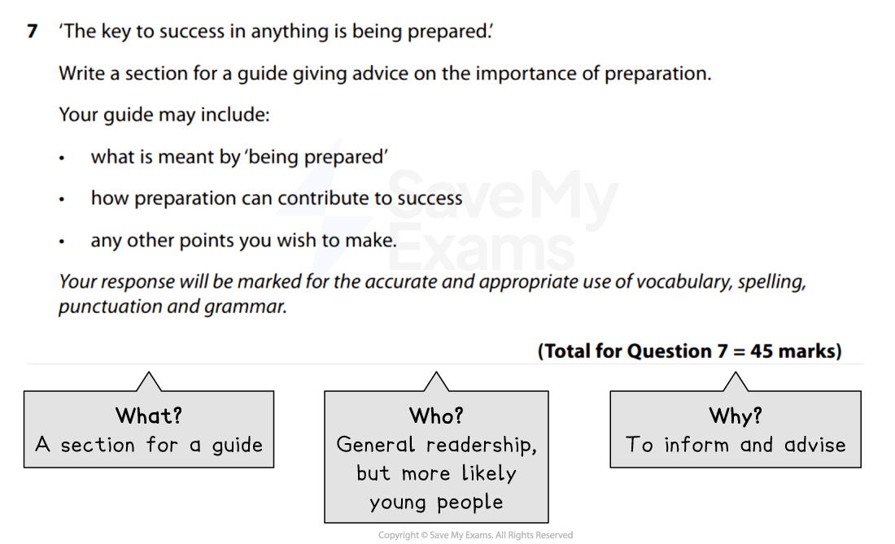
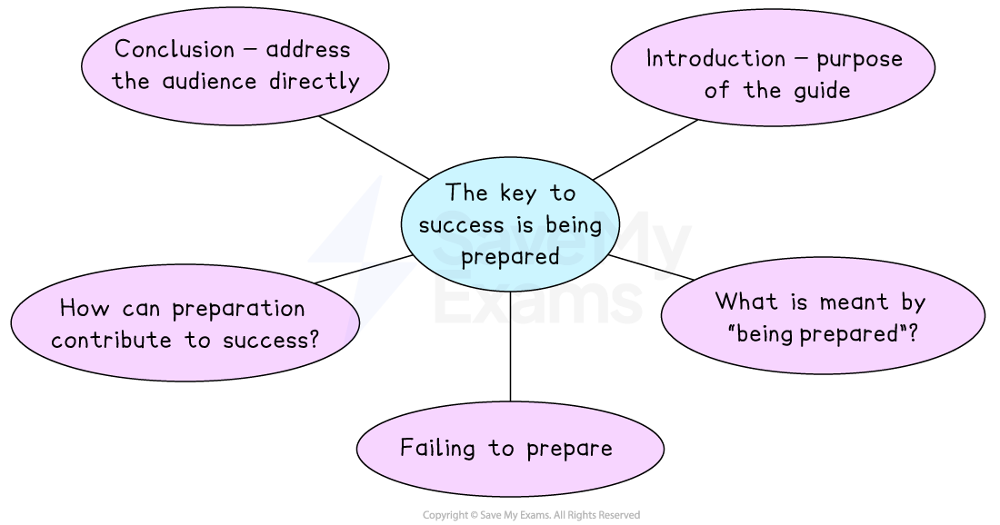

# Guide Model Answer

Remember, in Section B you will be given a **choice of two questions**, and each question will give you the option of writing in one of the following forms (genres):

- A letter
- A leaflet
- A review
- A speech
- A guide
- An article

You only complete** one task** from the choice of two. Remember to put a cross in the box to indicate whether you have chosen Question 6 or Question 7 in your answer booklet. You will need to prepare for all of the genres of writing because you won’t know which two will come up in the exam.

The following guide will demonstrate how to answer a Section B task in the format of a** guide**. The task itself is taken from a past exam paper. It includes:

- **Question breakdown**
- **Planning your response**
- **Guide model answer with annotations**

## Question breakdown

> **Spec point** — `spcpt_2BqZtjrQnfwnDkt6`

## Question breakdown

The first thing you should do is to read the task carefully and identify the format, audience and purpose of the task. This is sometimes referred to as a **GAP analysis** or the “**3 Ws**”:

| **G** | **A** | **P** |
|---|---|---|
| **Genre **(format) | **Audience** | **Purpose** |
| **What** am I writing? | **Who** am I writing for? | **Why** am I writing? |

For example:

*Section B guide example*

For this task, the focus is on the importance of preparation. No specific intended audience is given, but it is better to write about something you have some experience of, so it would be reasonable to infer that the intended audience is young people, or school or college students.

If the task does not specify the intended audience, it is important for you to decide who your audience is going to be in your planning stage, as this leads to a more focused response with clear attempts to engage and influence the reader.

You should use some **stylistic conventions of a guide**, such as a heading, sub-headings or occasional bullet points, and there should be **clear organisation** and structure with an i**ntroduction, development of points and a conclusion**.

## Planning your response

> **Spec point** — `spcpt_sXDr2CJQJnD89xDZ`

## Planning your response

You should spend **5 minutes** writing a brief plan before you start writing your response.

For example:

*Guide plan*

## Guide model answer with annotations

> **Spec point** — `spcpt_vVSJkrmKtbk74Yy3`

## Guide model answer with annotations

Remember, this task is worth **45 marks** (up to 27 marks for AO4 and up to 18 marks for AO5).

Your answer might not always satisfy every one of the assessment criteria for a particular level, but examiners apply a best-fit approach to determine the mark which corresponds most closely to the overall quality of the response.

To get the highest mark, you are aiming to meet the Level 5 marking criteria:

| **AO4** | 23-27 marks | - Communication is perceptive, mature and sophisticated - The response is sharply focused on the purpose of the task and the expectations/requirements of the intended reader - There is sophisticated use of form, tone and register |
|---|---|---|
| **AO5** | 16-18 marks | - The response manipulates complex ideas, using a range of structural and grammatical features to support overall coherence and cohesion - The response uses extensive vocabulary strategically, with only occasional spelling errors which do not detract from overall meaning - The response is punctuated with accuracy to aid emphasis and meaning, using a range of sentence structures accurately and selectively to achieve particular effects |

The following model answer is an example of a top-mark response to the above task:

> **Worked Example**
> ***The key to success is being prepared***
> 
> Sitting an exam or test, have you ever thought when turning over the first page: if only I’d revised more! I have. And I didn’t like it. I’d had the time, but I wasn’t organised. I always thought I had more time. I thought I could put it off until tomorrow. As a result, I didn’t get the outcome I wanted.* But I learnt from that experience and did not make the same mistake again.* I now know that the key to success in anything is being prepared, whether that be tests, exams, sporting events, interviews, or even your first date! As Benjamin Franklin famously said: “*By failing to prepare, you are preparing to fail*.” So, following my failure, the following guide is designed to give you some advice on how to prepare to succeed. 
> 
> ***What is meant by “being prepared”? ***
> 
> Being prepared means getting organised. Whatever you need to be prepared for, it is vital to leave yourself ample time to sort everything out. Nobody enjoys rushing out of the door at the last minute, so whether it’s sorting out your college bag the night before, getting out your clothes and ironing them ready for your job interview the following day, or creating a revision timetable and sticking to it, anything you can do to minimise last-minute panic contributes to success. This includes mental preparation. We all have situations which we do not really enjoy, such as going to the dentist or doing homework. However, having the right mental attitude can help enormously in making these tasks less daunting. Staying positive and not putting things off will save time, energy and anxiety. Some other tips for being prepared include:
> 
> - *Do your research in advance*
> - Practise, practise, practise
> - Make to-do lists, and tick off tasks as you complete them
> - Make use of organisational apps, such as Tiimo
> - Use diaries or daily planners to keep yourself organised
> - Set reminders
> 
> **How can preparation contribute to success?**
> 
> Being prepared means being proactive and taking steps to ensure you are ready for whatever comes your way. Being prepared for opportunities as they arise can lead to bigger and more exciting opportunities in the future. When you are prepared, your self-confidence increases, and you are more able to act quickly and decisively when an opportunity presents itself. *Preparation *also allows you to relax and thrive, and can save time and money. It can help you accomplish more and prevents you from becoming overwhelmed and anxious. It can have an enormous positive effect on your mental health and well-being. And when good things start happening, we get into a more positive mindset overall, attracting more good fortune. That doesn’t mean there won’t be set backs, but you can even be prepared for these by practising a resilient and growth mindset.
> 
> **Failing to prepare**
> 
> An intelligent plan is the first step to success. Even if what you have to prepare for is boring, getting it out of the way means freeing yourself up for better things later. Imagine you are offered tickets to your dream concert at the last minute, but you have put off preparing for a *really important test the following day? *Yes, you might decide to still go to the concert, but you would enjoy it a lot more had you also prepared for the test in advance. Using a couple of hours each week to focus on the boring stuff will set you up for success in the week ahead, and then even if something unexpected happens, you have the capacity to deal with it.
> 
> *So, give yourself the upper hand. Continue reading for specific advice about preparing for different situations, such as interviews, as here too preparation will be the key to success.*
