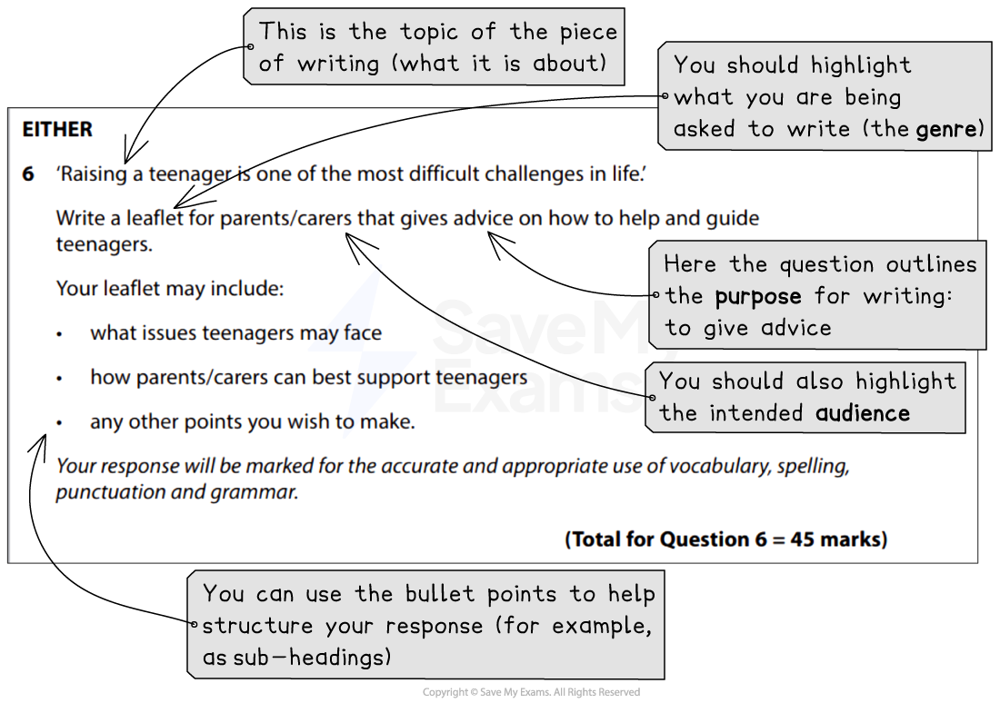

# How to answer Paper 1 Section B (Writing)

## How to answer Section B (writing)

> **Spec point** — `spcpt_Mpp5scGnz8DskV94`

## How to answer Section B (writing)

**Section B** of Paper 1 consists of **Questions 6 and 7**. However, you are required to complete only **one writing task** from the choice of two. You must indicate in your answer booklet whether you are completing Question 6 or Question 7 by marking an X in the appropriate box.

The writing task carries half of the total marks available for this paper, so it is vital that you allow **sufficient time** to **plan** and **organise** your response. There are two assessment objectives for writing:

- **AO4:** Communicate effectively and imaginatively, adapting form, tone and register of writing for specific purposes and audiences (27 marks)
- **AO5:** Write clearly, using a range of vocabulary and sentence structures, with appropriate paragraphing and accurate spelling, grammar and punctuation (18 marks)

The following guide includes:

- **Breaking down the question**
- **Steps to success**
- **Exam tips**

## Breaking down the question

> **Spec point** — `spcpt_YkDddYzRM79XWvny`

## Breaking down the question

The writing task is called “transactional” writing. This means **non-fiction writing** that intends to **communicate information** between individuals or groups, in different forms and for different purposes. You will be given a choice of two non-fiction writing tasks, such as writing an **article, letter or speech**, and you are required to **adapt your language, tone and structure **to suit the **intended form, audience and purpose**.

To get the highest marks, you are expected to:

- **Communicate** with subtlety, maturity and insightfulness
- Keep your writing **sharply focused** on the **purpose of the task** and the **intended audience**
- Use a **high level of sophistication** in your writing
- Skillfully **manipulate complex ideas**
- Use an **extensive range of vocabulary**
- **Punctuate your writing deliberately** for emphasis
- Use a **range of sentence structures accurately** in order to achieve particular effects

Before deciding which question you are going to answer, you should read each task carefully and highlight:

- **What** you are being asked to write (the genre)
- **Who** you are being asked to write for (the audience)
- **Why** you are being asked to write (the purpose)

You will also be given some bullet points which are designed to help you structure your response. For example:

*Paper 1 Question 6 breakdown*

As this task is worth **45 marks**, it is advisable to allocate **45 minutes** to it.

## Steps to success

> **Spec point** — `spcpt_QJVDjrH9K4mbBR2B`

## Steps to success

Following these steps will give you a strategy for answering this question effectively:

1. **Read both tasks** and **highlight**:

  1. **What** you are being asked to write (the genre)
  2. **Who** you are being asked to write for (the audience)
  3. **Why** you are being asked to write (the purpose)
  4. The **subject or topic** of the piece of writing
2. Select whether you are going to answer Question 6 or Question 7
3. Spend **5 minutes** making a **brief plan**:

  1. Note down relevant information, such as the headings or sub-headings you are going to use
  2. Note down what your point or argument will be for each paragraph in your response
  3. You should aim to write 2–3 sides of A4 (in average-sized handwriting)
4. Write your response, using the **appropriate conventions of the genre**:

  1. This means, if you are writing a letter, make sure you start and end it appropriately
  2. Ensure you make one clear argument or point per paragraph - you cannot be awarded marks for making the same point twice
  3. Ensure each argument or point is well-developed
5. Make sure you leave 5 minutes at the end to **re-read your response** to check for sense and obvious errors

## Exam tips

> **Spec point** — `spcpt_mpvHbsdM6RFs7StY`

## Exam tips

- Use the **given form and audience** for the task to **inform your register** (choice of language) and **tone**
- Think carefully about how you can **engage your reader **right at the start and at the end of your writing:

  - This will help you to produce a structured and cohesive piece of writing
- Allow time to **proofread** in order to achieve the highest possible degree of accuracy
- Do not simply focus on using as many persuasive techniques as possible:

  - These should occur naturally as part of a well-constructed argument or piece of writing
- Be **specific** and offer **definite suggestions and advice**
- Do not spend too much time on layout:

  - For example, it is not necessary trying to write in columns for a leaflet
