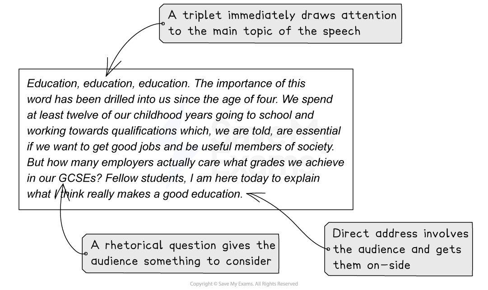

# How to Write a Speech

## How to write a speech

> **Spec point** — `spcpt_ZrC26vYpZWGyKqHV`

## How to write a speech

**Question 6 or 7** will ask you to **write for a specific purpose** and in a **specific format**. It is important to use the **correct conventions of the format** and directly **focus your writing to its purpose**, as the mark scheme rewards **adapting tone, style and register **for **different forms, purposes and audiences. **

This means:

- The **tone** (the sound of the writer’s “voice”) is appropriate and convincing
- The **register** (vocabulary and phrasing) is appropriately formal or informal, and suitable for the purpose
- The **style** of the writing (sentence structure and overall structure) is dynamic and effective

The following guide will detail how to structure your response in the style of a speech. It is divided into:

- **Key features of a speech**
- **Persuasive techniques**

## Key features of a speech

> **Spec point** — `spcpt_nd34yRg7qrSWf6cG`

## Key features of a speech

One of the formats you may be asked to write in for Section B is a speech. This may be a speech directed to your class or students in your school or college, or something more formal intended for broadcast. The language and tone of your speech will be determined by the task and subject, but the following are the basic features of a speech which you could include in your response:

| **Speech or talk** |
|---|
| In a speech or talk you should:  - **Address the audience directly** throughout - **Engage the audience** in your introduction:    - Outline the topic   - Use persuasive devices, such as rhetorical questions, to hook the audience and get them thinking - **Structure your speech logically**, building your arguments persuasively:    - Speeches or talks will use persuasive language features   - Use the acronym DAN FOREST PIE to remember these   - To offer a balanced view, include an objection to the argument in a separate paragraph - Include your audience using** inclusive pronouns** (“we”, “us”, “our”) - Finish by **circling back to your original argument**, calling your audience to action if appropriate |

You might wish to structure your speech in the following way:

1. Directly address the reader or audience:

  1. Introduce the topic and your point of view
  2. Use personal and inclusive pronouns to involve your audience, e.g., “you” or “we”
  3. Engage your audience using a rhetorical question
2. Your next paragraph should set out your argument
3. Provide an anecdote to offer an example which proves your argument:

  1. This builds rapport** **with your reader by engaging with them on a personal level
4. Further engage the reader on a personal level using a counter-argument
5. Offer more research or studies:

  1. This can be in the form of statistics, a witness statement, poll, or a “quotation from an expert”
6. End your speech with an emotive plea:

  1. Use emotive language to engage your reader
  2. Ending your response on a single sentence, perhaps using a triplet, is an effective conclusion

> **Exam Hint**
> Rhetorical questions are commonly used as a persuasive device, but avoid over-using any one technique, as this will make your writing sound much less sophisticated. Always consider the reason why you are using a technique and what the effect is that you want to achieve. Do not just use techniques for the sake of using them.

## Persuasive writing

> **Spec point** — `spcpt_Pf4yZbnkh4fyd8Vz`

## Persuasive writing

A speech is often more persuasive than other forms of writing. You are trying to **persuade your audience** that your point of view is valid, and sometimes encourage them to join you.

Here are some tips for how to make your speech persuasive:

- Write in the **first person** (write from your own perspective)
- Use **personal and inclusive pronouns**:

  - Using words such as “we” and “us” builds rapport between you and your audience and makes them feel involved
- Present your **opinions as facts**; as a truth that should not be challenged
- Be **passionate** but not aggressive:

  - Use emotive language and imperatives to call your audience to action
- **Decide on your position** and stick to it
- Make sure you do not sound like an advertisement

As an example, let’s consider the following introduction to a speech about GCSEs:

This example uses a number of persuasive devices, but in a sophisticated way in order to set out what the purpose of the speech is. It addresses the audience directly through the use of inclusive pronouns, but only uses one rhetorical question, which makes it more effective.

So remember, the basic features of a speech or talk that the examiner would expect to see are:

- A **clear introduction**:

  - This needs to be engaging and motivating
  - It should introduce what the speech is about, address the audience directly and use a persuasive device to hook the audience
- A **well structured argument**:

  - Paragraphs begin with topic sentences and are effectively linked
  - Objection to the argument is handled in a paragraph
- A dynamic and **memorable conclusion**

You can find a full worked example on our [Speech Model Answer](https://www.savemyexams.com/igcse/english-language/edexcel/a/16/paper-1-non-fiction-texts-and-transactional-writing/revision-notes/paper-1-non-fiction/paper-1-section-b-writing/speech-model-answer/) page.
