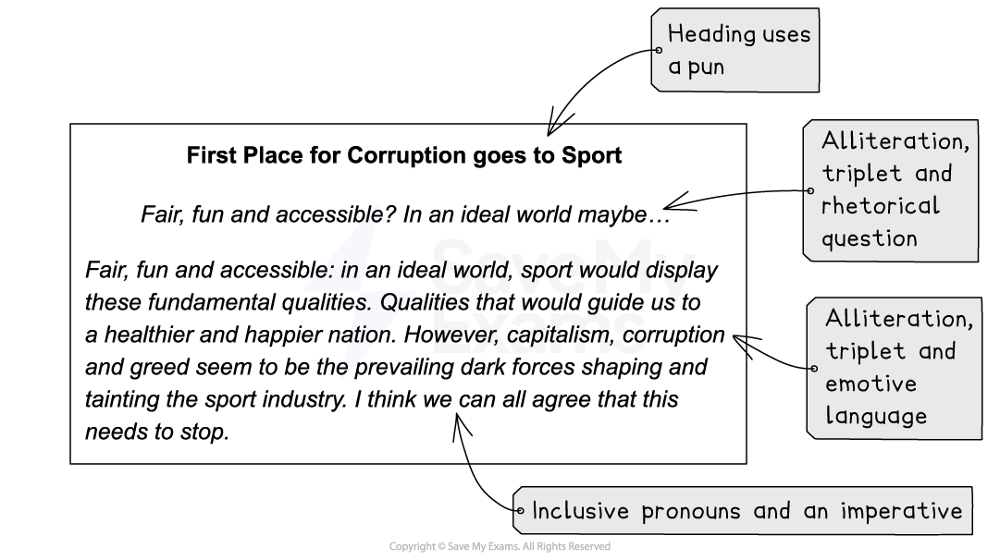

# How to Write an Article

## How to write an article

> **Spec point** — `spcpt_66WrsHFM8vGT7NF4`

## How to write an article

**Question 6 or 7** will ask you to **write for a specific purpose** and in a **specific format**. It is important to use the **correct conventions of the format** and directly **focus your writing to its purpose**, as the mark scheme rewards **adapting tone, style and register** for **different forms, purposes and audiences. **

This means:

- The **tone** (the sound of the writer’s “voice”) is appropriate and convincing
- The **register** (vocabulary and phrasing) is appropriately formal or informal, and suitable for the purpose
- The **style** of the writing (sentence structure and overall structure) is dynamic and effective

The following guide will detail how to structure your response in the style of an article. It is divided into:

- **Key features of an article**
- **Article structure**

## Key features of an article

> **Spec point** — `spcpt_xn5QxZ4H425TVRdy`

## Key features of an article

The language and tone of your article will be determined by the task and subject, but the purpose of an article could be to **inform, discuss, argue, guide or advise**. The following are the basic features of an article which you could include in your response. It is important to note that the Edexcel mark scheme indicates that you should **not **include layout features such as pictures or hyperlinks.

| **Magazine or newspaper article** |
|---|
| In an article you should:  - Use a **snappy heading**:    - Consider using alliteration, a rhetorical question or a pun (a play on words) for this   - Use capital letters for all but filler words in your heading   - For example: *“The Cruelty of Captivity”* - Include a **strapline** underneath the heading to summarise your point of view:    - For example: *“Why keeping animals in captivity has fallen out of favour”* - Use **sub-headings** to help structure your article (if appropriate) - **Address** your **audience directly**, with consideration to the fact that an article is intended to be read by a wide audience - Be light-hearted and entertaining, formal and serious, or provide advice and tips, depending on the task set - Use **topic sentences** to begin **each paragraph**, and then **develop that point **appropriately and in detail - Try not to include multiple different arguments in one paragraph - Avoid beginning your article with *“I’m writing this because...” *or *“In this article I shall be discussing…”* |

Because an article is intended for publication, it is important to use **Standard English **and to vary your sentence and paragraph lengths to keep your audience engaged. The heading, strapline and opening paragraph of an article can employ lots of persuasive devices to hook your reader and introduce your point of view. For example:

> **Exam Hint**
> Rhetorical questions are commonly used as headings, but they can be too simplistic or too general, so consider how you can make your headline sophisticated and specific. Choosing a simple statement can be very effective, using a play on words taken from the article topic.

## Article structure

> **Spec point** — `spcpt_VwBvcTYRz3t8zTX8`

## Article structure

As this is a longer writing question, and you should allocate **45 minutes **to complete it. Spend about **5 minutes** **planning** your answer, **35 minutes writing** and **5 minutes at the end to re-read** to check for any obvious errors.

To plan a range of points which will support your point of view, you can:

- **Mind-map** or write a **list of points and techniques to use**:

  - It can also be helpful to number your ideas to structure your answer in a specific order
  - The examiner is not grading you on how much you know about the given topic, as it is impossible to predict what subject matter will be on the paper. You are marked on your ability to construct a convincing argument
- Your article should be structured into **five or six paragraphs**:

  - Remember, each paragraph does not have to be the same length
  - Better answers vary the lengths of their paragraphs for effect
  - Develop separate ideas or points in each paragraph
  - But avoid repeating the same idea throughout your article

Below is an example of how you might structure your article:

1. Introduce the subject of the article and, if appropriate, your argument:

  1. You could consider engaging the reader through the use of inclusive pronouns, such as “we” or “us”
2. Use the bullet points given to you in the task to structure your article:

  1. You may wish to use these as sub-headings
3. Provide information, facts, background or context
4. Use specific examples or a personal anecdote (depending on the subject-matter)
5. Remember, not all tasks will require you to put forward an argument, but if it does, then use a counter-argument:

  1. This suggests that you understand your reader and have already considered their possible concerns
6. Do not forget to conclude your article strongly

Remember that to produce an effective response, you should aim to **develop your points carefully** in **each paragraph**, using language features and techniques to highlight ideas and emphasise your points.

You can find a full worked example in our** **[Article Model Answer](https://www.savemyexams.com/igcse/english-language/edexcel/a/16/paper-1-non-fiction-texts-and-transactional-writing/revision-notes/paper-1-non-fiction/paper-1-section-b-writing/letter-model-answer/) page.

> **Exam Hint**
> While writing in the correct form as instructed is important in this question, you only need to adhere to the basic conventions of an article. Drawing columns or spending too much time thinking up the perfect headline wastes valuable time and will not improve your mark. Remember, it is more important that you adapt your style, language and tone to suit the intended audience and purpose, and that you construct a well structured and coherent piece of writing, than waste time on the layout of your response.
