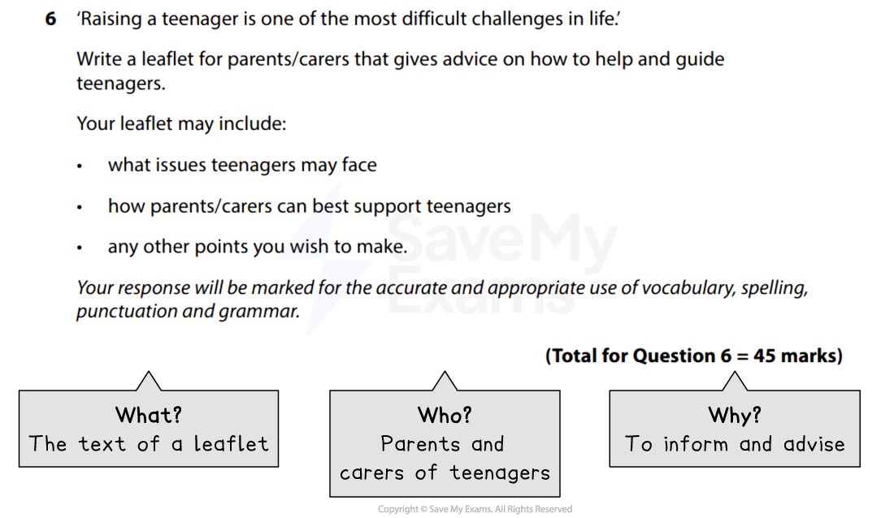
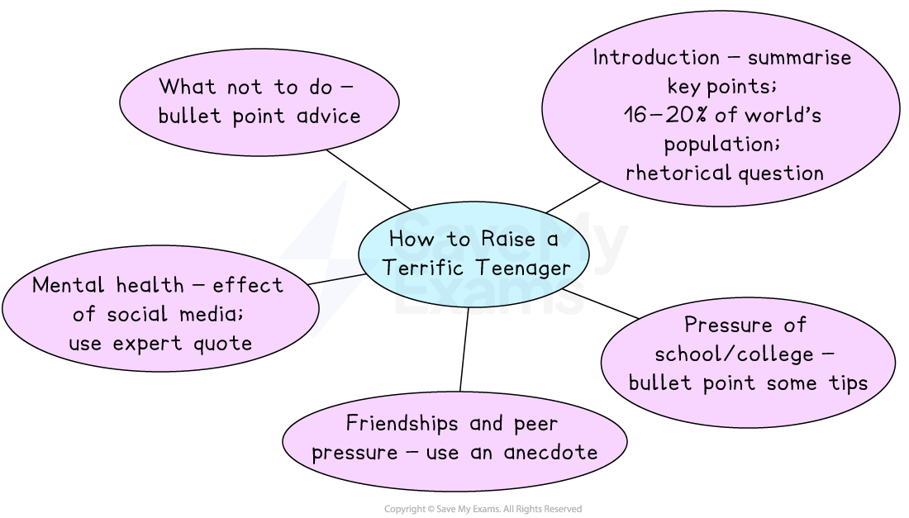

# Leaflet Model Answer

Remember, in Section B you will be given a choice of two questions, and each question will give you the option of writing in one of the following forms (genres):

- A letter
- A leaflet
- A review
- A speech
- A guide
- An article

You only need to complete** one task **from the choice of two. Remember to put a cross in the box to indicate whether you have chosen Question 6 or Question 7 in your answer booklet. Any two of the six genres could come up in the exam so it’s a good idea to be prepared for any of them.

The following guide will demonstrate how to answer a Section B task in the format of a** leaflet**. The task itself is taken from a past exam paper. It includes:

- **Question breakdown**
- **Planning your response**
- **Leaflet model answer with annotations**

## Question breakdown

> **Spec point** — `spcpt_pMdcK4zt6n8RD8Zh`

## Question breakdown

The first thing you should do is to read the task carefully and identify the format, audience and purpose of the task. This is sometimes referred to as a **GAP analysis** or the “**3 Ws**”:

| **G** | **A** | **P** |
|---|---|---|
| **Genre **(format) | **Audience** | **Purpose** |
| **What** am I writing? | **Who** am I writing for? | **Why** am I writing? |

For example:

*Section B leaflet example - GAP analysis*

For this task, the focus is on **communicating advice to parents and carers** about how to help and guide teenagers. However, the type of advice you give or what you choose to focus on can be up to you. You could write general advice about bringing up teenagers, or focus on a specific issue, such as mental health or exam stress. Generally, more focused responses gain higher marks.

Above all, there should be an attempt to **engage and influence the audience**, and you should use **some stylistic conventions of a leaflet** such as a heading, sub-headings and the occasional use of bullet points. There should be clear organisation and structure with an introduction, development of points and a conclusion.

## Planning your response

> **Spec point** — `spcpt_YzszTMzSNcYn7Mnb`

## Planning your response

You should spend **5 minutes writing a brief plan** before you start writing your response.

For example:

*Leaflet plan*

## Leaflet model answer with annotations

> **Spec point** — `spcpt_nKgssTvfcCXhRKT7`

## Leaflet model answer with annotations

Remember, this task is worth **45 marks** (up to 27 marks for AO4, and up to 18 marks for AO5). Your answer might not always satisfy every one of the assessment criteria for a particular level, but examiners apply a best-fit approach to determine the mark which corresponds most closely to the overall quality of the response.

To get the highest mark, you are aiming to meet the Level 5 marking criteria:

| **AO4** | 23-27 marks | - Communication is perceptive, mature and sophisticated - The response is sharply focused on the purpose of the task and the expectations/requirements of the intended reader - There is sophisticated use of form, tone and register |
|---|---|---|
| **AO5** | 16-18 marks | - The response manipulates complex ideas, using a range of structural and grammatical features to support overall coherence and cohesion - The response uses extensive vocabulary strategically, with only occasional spelling errors which do not detract from overall meaning - The response is punctuated with accuracy to aid emphasis and meaning, using a range of sentence structures accurately and selectively to achieve particular effects |

The following model answer is an example of a top-mark response to the above task:

> **Worked Example**
> ***How to Raise a Terrific Teenager***
> 
> *Raising a teenager to be a well-rounded, mature individual is viewed as one of the most difficult challenges in the life of a parent or carer.* Teenagers are often given a lot of negative press, from being moody, sleeping all the time to being susceptible to gangs, or worse. But there are more adolescents in the world today than ever before, making up *16–20% of the world’s population*. The period from age 13 to 20 is when young people experience significant growth and development. It is the time when they need the most encouragement and support, even though this can seem difficult, and parents/carers have a huge part to play in helping them navigate their physical, emotional and social changes. *So what are some of the main issues facing young people today?*
> 
> ***Pressure of school or college***
> 
> To coincide with physical changes, teenagers also face increased pressure at school or college, including extra homework and exam preparation. If you have a high-achieving teen, then they can feel immense pressure to live up to (often) their own expectations, as well as the expectations of their teachers and family. On the other hand, young people who are struggling academically can fall further behind and feel more isolated and different. *Therefore, what can you do to help?*
> 
> If your teenager is approaching their exams, help them manage their time and revision by working with them on a realistic study schedule, allowing time for breaks, rest and relaxation:
> 
> - *Short, focused revision sessions work best*
> - Make sure there is plenty of nutritious food in the house, including a variety of fruit to snack on
> - If your teenager is struggling at school, speak to the pastoral lead or, if you suspect that they may have learning difficulties, SENCO about what extra support could be put in place to assist them
> 
> **Friendships and peer pressure**
> 
> The teenage years can be a challenging time for friendships. *My own friendship group broke down when I was 14, and I was left feeling anxious and isolated*. My hormones were going wild and my skin was bad, making me feel even worse about myself. I felt under pressure to wear clothes I wouldn’t normally wear, and to enhance my features with things like false eyelashes in an effort to fit in, even though I knew this went against my school’s rules. As a result, I got into trouble. It was a huge learning curve for me. The best thing my own mum did for me during this time was to make sure I had opportunities to talk. She also took me to the GP to get advice about my skin and helped me to develop a skin routine, promoting good habits that I continue to this day. Modelling positive behaviour and taking time to take your teenager’s concerns seriously is therefore extremely important.
> 
> **Mental health**
> 
> The negative effects of social media on impressionable young adults has been well-documented, and it is no secret that as many as 20% of young adults may experience a mental health problem in any given year. According to the World Health Organisation, depression, anxiety and behavioural disorders are among the leading causes of illness among adolescents. Young people with mental health conditions are particularly vulnerable to “*social exclusion, discrimination, stigma and educational difficulties*”. Multiple factors affect mental health, including *media influence and societal expectations*, but the quality of a teenager’s home life is key to building successful relationships and positive mental wellbeing. Identifying if your teenager is experiencing any difficulties with their mental or emotional wellbeing is therefore a crucial first step, along with *seeking help from services* that promote resilience, supportive social environments and social networks.
> 
> ***What not to do!***
> 
> All of the above may seem like an incredibly high mountain to climb, but there are some important reminders in the above information about what to do and, crucially, what not to do! Firstly, trying to control everything about your teenager’s life may cause further stress and tension. The internet and social media are here to stay, so it is vital that you educate yourselves on what is out there and how it is used. There is little point trying to ban technology when it is already out there and being used on a daily basis. In addition, shouting and reacting angrily can lead your young person to withdraw further and be even more reluctant to engage with you. *So here are some final tips on how to raise a terrific teenager*:
> 
> - *Help your teen help others*
> - Be there
> - Model positive behaviours
> - Learn to listen
> - Do not judge
> - Have family meals
> - Set boundaries and stick to them
> - Talk to them!
> - Allow them to have their own space and privacy
> 
> If you’re concerned about the physical or mental health of your child or young person, it may be a *good idea to speak to a GP or contact a children and young people’s mental health service.*
