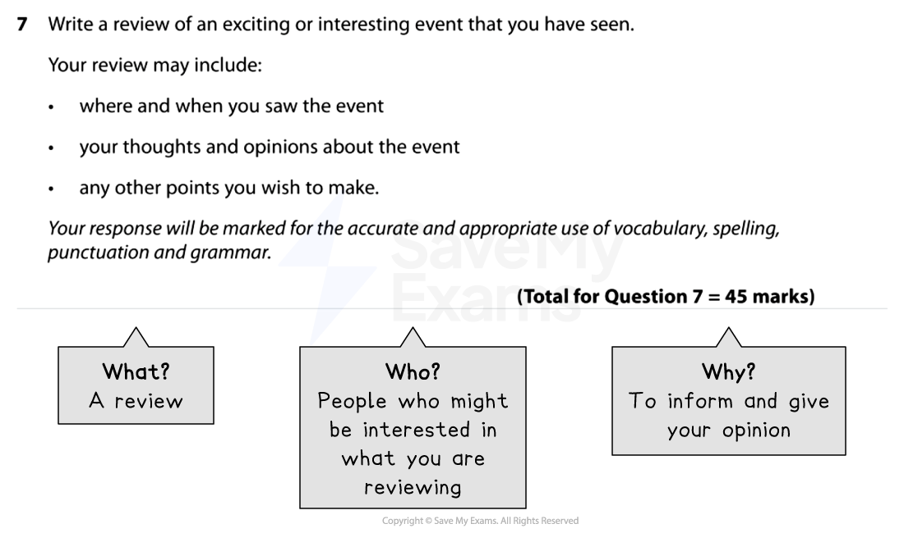
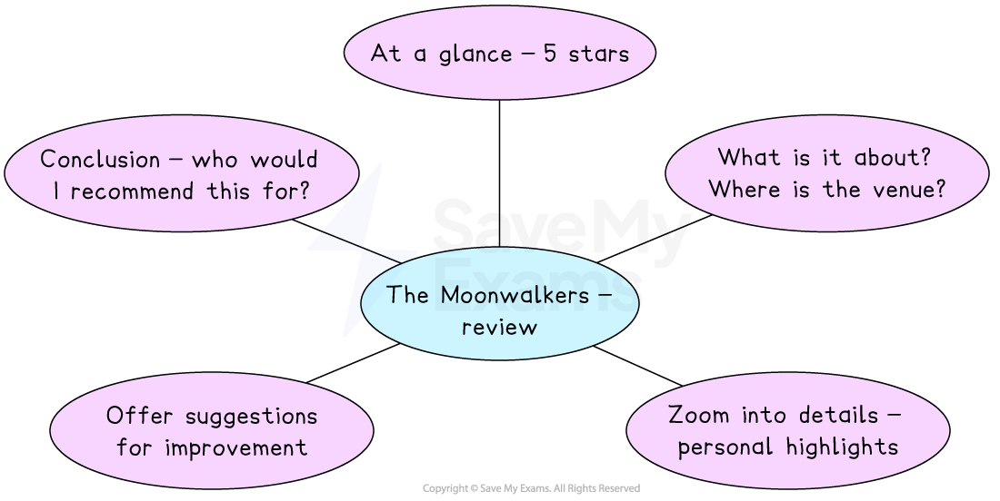

# Review Model Answer

Remember, in Section B you will be given a **choice of two questions**, and each question will give you the option of writing in one of the following forms (genres):

- A letter
- A leaflet
- A review
- A speech
- A guide
- An article

You only need to complete** one task** from the choice of two. Remember to put a cross in the box to indicate whether you have chosen Question 6 or Question 7 in your answer booklet. You won’t know which one of the six genres will feature on the exam so it’s important to prepare for any of them coming up.

The following guide will demonstrate how to answer a Section B task in the format of a** review**. The task itself is taken from a past exam paper. It includes:

- **Question breakdown**
- **Planning your response**
- **Review model answer with annotations**

## Question breakdown

> **Spec point** — `spcpt_JTbF6fNWMTRBf4sr`

## Question breakdown

The first thing you should do is to read the task carefully and identify the format, audience and purpose of the task. This is sometimes referred to as a **GAP analysis** or the “**3 Ws**”:

| **G** | **A** | **P** |
|---|---|---|
| **Genre **(format) | **Audience** | **Purpose** |
| **What** am I writing? | **Who** am I writing for? | **Why** am I writing? |

For example:

*Section B review example*

For this task, the focus is on **describing an exciting or interesting event** and providing **opinions and judgements** about it. A range of approaches could therefore be used, and as no specific intended audience is given, it is better to write about something you have some experience of.

If the task does not specify the intended audience, it is important for you to decide who your audience is going to be in your planning stage, as this leads to a more focused response with clear attempts to engage and influence the reader.

## Planning  your response

> **Spec point** — `spcpt_fh8KHwbwnxtj87hs`

## Planning your response

You should spend **5 minutes** writing a brief plan before you start writing your response.

For example:

*Review plan*

## Review model answer with annotations

> **Spec point** — `spcpt_nm3fzCxFWFW6zHgV`

## Review model answer with annotations

Remember, this task is worth **45 marks** (up to 27 marks for AO4 and up to 18 marks for AO5).

Your answer might not always satisfy every one of the assessment criteria for a particular level, but examiners apply a best-fit approach to determine the mark which corresponds most closely to the overall quality of the response.

To get the highest mark, you are aiming to meet the Level 5 marking criteria:

| **AO4** | 23-27 marks | - Communication is perceptive, mature and sophisticated - The response is sharply focused on the purpose of the task and the expectations/requirements of the intended reader - There is sophisticated use of form, tone and register |
|---|---|---|
| **AO5** | 16-18 marks | - The response manipulates complex ideas, using a range of structural and grammatical features to support overall coherence and cohesion - The response uses extensive vocabulary strategically, with only occasional spelling errors which do not detract from overall meaning - The response is punctuated with accuracy to aid emphasis and meaning, using a range of sentence structures accurately and selectively to achieve particular effects |

The following model answer is an example of a top-mark response to the above task:

> **Worked Example**
> ***The Moonwalkers by Tom Hanks***
> 
> ***At a glance: 5 stars***
> 
> “*The moon has always been our constant companion, right?*” The unmistakable voice of Tom Hanks at the start of The Moonwalkers experience at London’s Lightroom fills the space and reassures the audience that they are in safe hands. He continues to reel us in by reminding us that only 12 people in the history of humankind have ever walked on the moon, and we settle in for a 50-minute production that immerses the audience into an all-encompassing and magnificent experience.
> 
> *It is difficult to properly define what The Moonwalkers actually is. *It is part film, part show, part immersive experience. It is housed in a large, single space, with images, films and animations projected in front of, at the side of and behind us, as well as on the floor. As we file in with anticipation, everyone immediately gravitates towards the tiered bench seating, sitting nervously, unsure of what to expect. A staff member invites us to walk around more than once, reiterating that the experience is better if we move. Maybe it’s our typical British reserve, but everyone is reluctant, preferring to sit. A countdown is projected onto the screen and the show begins. We are treated to Hanks’ personal fascination with space travel, as he famously played astronaut Jim Lovell in the film Apollo 13.
> 
> Hanks co-wrote The Moonwalkers and the show looks both backwards at the first moon landing, and forwards to the future of moon exploration with the Artemis programme. The sheer size of the images being projected, along with impressive surround sound, make the experience truly mesmerising, and the narrative combines huge impact pieces with more personal sound-bites from the astronauts themselves. One highlight for me was the footage of the tense few seconds before Apollo 11 actually touched down on the moon’s surface, along with Neil Armstrong’s famous first step on alien soil. Having been born long after the first moon landing, the experience was so all-encompassing it genuinely felt as though* I was watching it live*, for the first time.
> 
> As well as being spectacular, the experience also showcased lighter moments, such as astronauts having fun in the moon’s reduced gravity, *bouncing around like children on a space-hopper*. The braver audience members stood and moved around as suggested, as did I, and it was true - it really did enhance the experience. However, given that the number of people standing and moving were in the minority, this part of the experience could have been further encouraged via the narration, maybe with Hanks himself directing the audience. Given he was involved in how the experience was staged at the venue, *this could have been the chance to really connect with the audience and make them feel as though they were thoroughly involved. *
> 
> *Ultimately, however, the experience left me with a sense of wonder and beauty, and an understanding of humankind’s desire to explore beyond our planet.* It was a thrilling experience that involved high-quality visual and audio innovations, which more than justified the ticket price. It was interesting to note that there were several children in the audience, who were just as mesmerised as the adults; the show’s relatively short length no doubt contributed to keeping their attention. I did feel, however, that the venue itself did not quite match the magic of the experience itself, especially as it so obviously appeals to all ages. The coffee shop in which the audience was invited to wait was hardly family-friendly, and before the show we stood for a while in a queue formation in the rather small and very expensive merchandise shop. I felt this was missing a trick, as was the lack of any visual build-up as we were led through an industrial corridor to the room itself. That being said, however, it was a fantastic production and overall there was very little not to marvel at; it really was an out-of-this-world experience.
