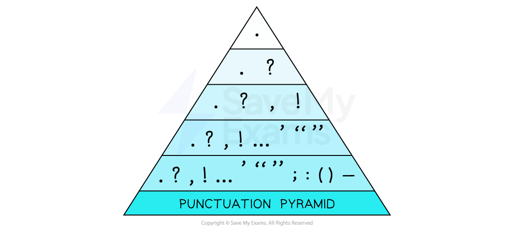

# Section B Skills: SPaG

The writing task in Section B awards up to **18 marks **for **AO5**, which tests your ability to **write clearly**, using a **range of vocabulary and sentence structures**, with **appropriate paragraphing** and **accurate spelling, grammar and punctuation**

One of the key things the examiners are looking for is a **range of different sentence forms** in your writing, which will naturally lead to a greater range of punctuation which the examiners can reward. However, **getting the basics right **and consistency are key. Leaving **five minutes** to **proofread your work** when you have finished writing is therefore really important, as it is easy to make silly mistakes under the pressure of an exam.

The following guide contains sections on:

- **Sentence demarcation**
- **Range of punctuation**
- **Range of sentence forms**
- **Standard English and secure grammar**
- **Accurate spelling and ambitious vocabulary**

## Sentence demarcation

> **Spec point** — `spcpt_Q4XGs5VGRsdBQBdp`

## Sentence demarcation

**Sentence demarcation** means that you have **started your sentences** with a **capital letter **and **ended them correctly**, using either a full-stop, question mark or exclamation mark. This sounds simple enough, but comma-splicing and run-on sentences are some of the most common errors made in terms of technical accuracy in the exam, so it is important to review that you know exactly when a sentence finishes and how to indicate that it has finished.

Sentences end with three types of punctuation:

- A full stop (for a statement)
- A question mark (for a direct question)
- An exclamation mark (to indicate surprise, shock, anger or happiness)

All sentences must begin with a capital letter.

Have a look at the example below. Sentence demarcation is absent, so consider how much harder it is to make sense of what has been written:

| Whether or not you think smartphones are a good thing, the fact of life in today’s society is that the mobile phone is no longer just a phone in fact they are our lives we network, socialise, gossip and get information from them, we have our bus passes, train tickets, bank cards, timetables and reminders on them we can even do our college work on them what we use them for is constantly changing and expanding. |
|---|

Now compare the example above with the example below, which uses the correct sentence demarcations:

| Whether or not you think smartphones are a good thing, the fact of life in today’s society is that the mobile phone is no longer just a phone**. I**n fact, they are our lives**. W**e network, socialise, gossip and get information from them**. W**e have our bus passes, train tickets, bank cards, timetables and reminders on them**. W**e can even do our college work on them**. W**hat we use them for is constantly changing and expanding. |
|---|

**Ellipsis** can be used to replace the end of a sentence to show something left unsaid. You do not need to add another full stop after the use of ellipsis.

The more sophisticated and complex your sentences, the more important accurate sentence demarcation is. Varying the length of your sentences will create a more dynamic rhythm to your writing.

> **Exam Hint**
> Section B requires you to use accurate sentence demarcation and grammar first of all, so ensure you are careful to use basic end-of-sentence punctuation correctly. A common error is the use of commas instead of full-stops. This is called comma-splicing and should be avoided. A comma represents a pause within a sentence, or a separation between two parts of a sentence, not a break at the end of a sentence.

## Range of punctuation

> **Spec point** — `spcpt_NNgnb9hcrPpZ4mKh`

## Range of punctuation

For the highest marks, you need to use a **wide range of punctuation accurately** and **purposefully** to achieve specific effects. This means that you make conscious choices about the type of punctuation you are using in your writing, and why you are using it. However, it is worth remembering that using apostrophes, semi-colons and colons accurately just a few times is preferable to using them indiscriminately and incorrectly.

The bottom tier of the following punctuation pyramid below shows the range of punctuation you should be aiming to use:

Students often find it difficult to know when to use colons and semi-colons correctly, so we have included a brief explanation of both below:

### Colons

Colons can introduce lists, quotes or long explanations. They can be used in an article, for example, to introduce a list of tips if you are giving advice. They can also be used before a direct quote (one you may have made up from an “expert”).

For example:

**The media officer for London Zoo advised: “We take the protection and welfare of our animals extremely seriously. Any reported concerns regarding the health of our animals would be acted upon immediately.”**

### Semi-colons

Semi-colons can be used to connect two related sentences instead of a full stop or a conjunction. They are therefore a good way of adding variety to your writing.

For example:

**Most celebrities in today’s culture do very little except promote themselves tirelessly; they do no actual work and rely on social media to do the work for them.**

They can also be used instead of commas when separating items in a very long or wordy list.

## Range of sentence forms

> **Spec point** — `spcpt_SGDR9HfT8FWZfBvY`

## Range of sentence forms

Here, the mark scheme states “for effect”, which means that you have to deliberately consider how your sentence structure and form create a tone of voice. For example, short sentences can indicate tension or urgency, especially if they are written in the imperative form. Long, complex sentences can sound quite formal, but too many of them can be monotonous and difficult to read.

Some of the ways you can vary your sentences include:

| **Type of sentence** | **Explanation** |
|---|---|
| **Sentence openers** | This means varying how you start your sentences, avoiding starting each one with personal pronouns (“I”) or with the same word |
| Instead, you could start your sentences with:  - An adverb, e.g., “Suddenly”, “Quietly” - A preposition, e.g., “In the distance”, “Over the hill” - A verb, e.g., “Having had many years of experience in this field, I…” - A double adjective, e.g., “Strong and powerful,...” - A connective, e.g., “Furthermore”, “Additionally” |   |
| **Sentence length** | Try to vary the length of your sentences, as too many long sentences can overshadow your arguments, whereas too many short sentences sounds simple or makes your arguments stunted |
| In general, if your paragraph consists of only one or two long sentences, you need to revisit it to consider how easy it is for your reader to identify your main points and the purpose of the paragraph |   |
| Alternating between sentence lengths allows writers to use sentences strategically, emphasising important points through short sentences and providing detail with longer ones |   |
| For example:  **The oil company reported that their profits had risen by more than 10% over the period of half a year. This information shocked the public. How, in a period of financial difficulty for the entire nation, could a single company justify raising prices and lining their pockets while ordinary people suffered?** |   |
| **Sentence type** | There are four main types of sentences: |
| **Simple**: a simple sentence is a single clause with no conjunction or dependent clause |   |
| **Compound**: a compound sentence is two independent clauses joined by a conjunction (“and”, “because”, “but”, “so”) |   |
| **Complex**: a complex sentence contains one main clause and at least one dependent clause (which relies on the main clause for meaning) |   |
| **Compound-complex**: a compound-complex sentence contains multiple independent clauses and at least one dependent clause |   |
| Understanding sentence type will help you avoid repetition and monotony in your writing |   |

## Standard English and secure grammar

> **Spec point** — `spcpt_d2YtWY3477SKN38H`

## Standard English and secure grammar

Standard English is accepted as the “correct” form of English, used in formal writing. It follows grammatical rules such as subject-verb agreement and the correct use of verb tenses. Non-standard English often contains slang and is used in more informal situations. This does not mean that you cannot use colloquial language in your writing, especially in an article or speech, but this will be determined by the task and topic.

It is worth noting that mistakes with sentence agreement (subject-verb agreement) and the inconsistent use of tense are frequently flagged by examiners as being an issue in exams. Therefore, it is important that you:

- Use plurals correctly
- Maintain a consistent use of tense

  - If you are writing in the past tense, ensure that this is consistent throughout your writing
  - If you do change from past to present tense, it should be done purposefully and for effect
- Ensure you are using apostrophes correctly, especially to show possession

## Accurate spelling and ambitious vocabulary

> **Spec point** — `spcpt_G6ycGD4mhSHc4VD7`

## Accurate spelling and ambitious vocabulary

You are rewarded for the **use of ambitious vocabulary**. However, your use of ambitious vocabulary should be **appropriate** and **precise**; do not use a more sophisticated word just because you think it “sounds” better if you are not 100 percent sure of its meaning.

You are also awarded for your ability to spell complex words correctly. This should not dissuade you from attempting to use more sophisticated vocabulary even if you are unsure of the spelling, as you will still be rewarded for attempting them.

> **Exam Hint**
> Remember, Section B rewards you for using punctuation and grammar deliberately for effect. The best answers use a variety of sentence structures and technical accuracy features, which have been skilfully used to construct a tone of voice relevant to the task.
