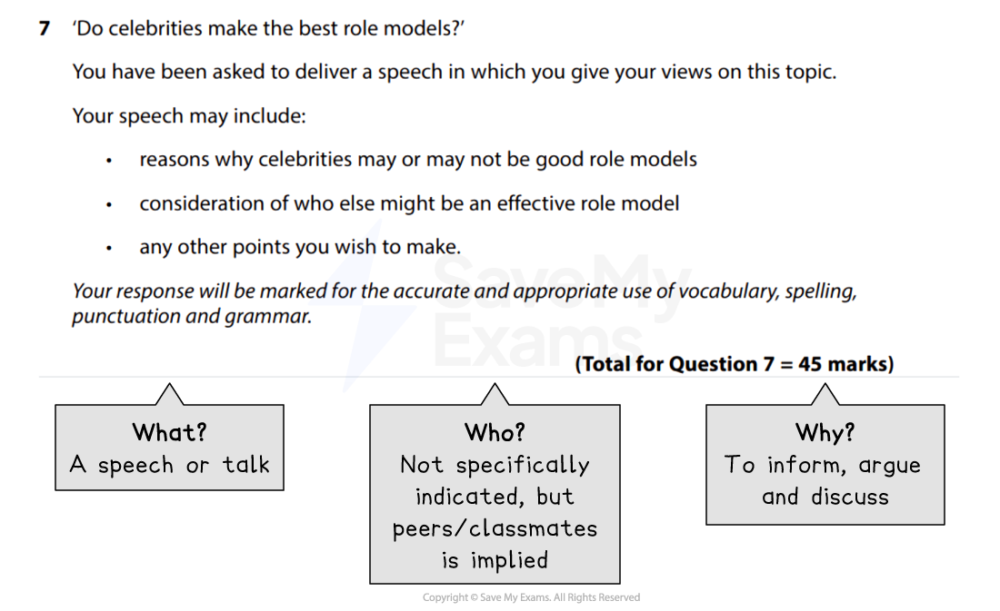
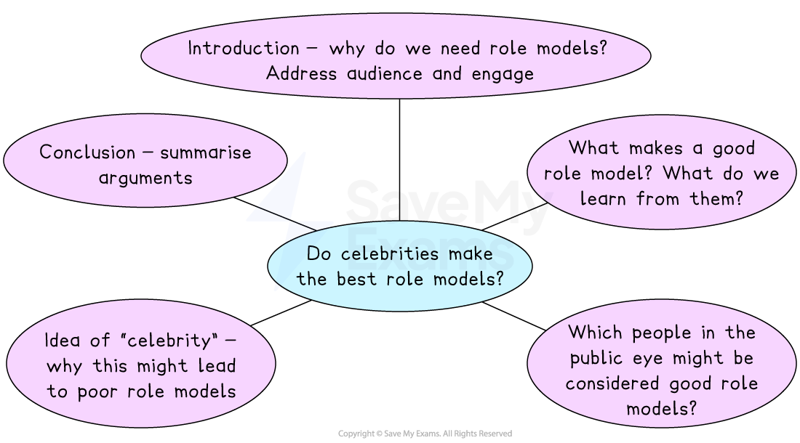

# Speech Model Answer

Remember, in Section B you will be given a **choice of two questions**, and each question will give you the option of writing in one of the following forms (genres):

- A letter
- A leaflet
- A review
- A speech
- A guide
- An article

You only complete **one task** from the choice of two. Remember to put a cross in the box to indicate whether you have chosen Question 6 or Question 7 in your answer booklet. You won’t know in advance which genres will come up in the exam so it’s best to prepare for all of them.

The following guide will demonstrate how to answer a Section B task in the format of a** speech**. The task itself is taken from a past exam paper. It includes:

- **Question breakdown**
- **Planning your response**
- **Speech model answer with annotations**

## Question breakdown

> **Spec point** — `spcpt_Qyx3MpypBDrW56jT`

## Question breakdown

The first thing you should do is to read the task carefully and identify the format, audience and purpose of the task. This is sometimes referred to as a** GAP analysis** or the “**3 Ws**”:

| **G** | **A** | **P** |
|---|---|---|
| **Genre **(format) | **Audience** | **Purpose** |
| **What** am I writing? | **Who** am I writing for? | **Why** am I writing? |

For example:

*Section B speech example*

For this task, the focus is on **communicating your point of view **about the ideas of celebrities and role models. The intended audience is not specified in the question, but given it is better to write about something you are familiar with, it would be sensible to infer that this is a speech to your peers or classmates. The response should be set out effectively as a speech, maintaining a **clear argument throughout** and including **persuasive devices**.

## Planning your response

> **Spec point** — `spcpt_jXR4sVg8KWXZYqMN`

## Planning your response

You should spend 5 minutes writing a brief plan before you start writing your response.

For example:

*Speech plan*

## Speech model answer with annotations

> **Spec point** — `spcpt_H79ztJpxxh32bhdV`

## Speech model answer with annotations

Remember, this task is worth **45 marks **(up to 27 marks for AO4, and up to 18 marks for AO5). Your answer might not always satisfy every one of the assessment criteria for a particular level, but examiners apply a best-fit approach to determine the mark which corresponds most closely to the overall quality of the response.

To get the highest mark, you are aiming to meet the Level 5 marking criteria:

| **AO4** | 23-27 marks | - Communication is perceptive, mature and sophisticated - The response is sharply focused on the purpose of the task and the expectations/requirements of the intended reader - There is sophisticated use of form, tone and register |
|---|---|---|
| **AO5** | 16-18 marks | - The response manipulates complex ideas, using a range of structural and grammatical features to support overall coherence and cohesion - The response uses extensive vocabulary strategically, with only occasional spelling errors which do not detract from overall meaning - The response is punctuated with accuracy to aid emphasis and meaning, using a range of sentence structures accurately and selectively to achieve particular effects |

The following model answer is an example of a top-mark response to the above task:

> **Worked Example**
> *As we grow and mature, we all have people we look up to.* From an early age, this would be your parents, grandparents or main care-givers. But as we get older, we start to become more aware of people in the public eye that we might like or start to admire. We may look at these people and think that we want to grow up to be just like them. However, not many of us actually “know” famous people well; we might think we do, due to how many of them we can access via the internet, television and social media platforms, but can we truly count someone we do not really know on a personal level as a role model? *Fellow students*, I am here today to *discuss the idea of role models and question whether celebrities should be counted as such. *
> 
> People we look up to can shape our behaviour and how we see ourselves. We learn about how to present ourselves and how to conduct ourselves in the world via these people. If you grew up in a household in which bad language is used as the norm, then it is highly likely that you will routinely use bad language as well. We learn right from wrong, morals, ethics and what we should stand for from these people; even, for many of us, which football team we should *support! *A good role model then, in my opinion, should be someone who exemplifies the characteristics we would expect to see in other people: respect for themselves and others, manners, a good moral code, resilience, determination, creativity - basically, what we might consider to be a good person. We learn how to behave in different situations, how to respond appropriately and how to communicate well in a variety of circumstances.
> 
> *Taking what I’ve said into consideration*, there are many people currently in the public eye, or who might be considered famous, who would therefore be considered good role models for young people. Take Greta Thunberg, for example. She is a young activist who stands up for what she believes is right, and has learnt how to communicate effectively on a world stage so that people actually listen. Sir David Attenborough is respected globally, not only for his television programmes, but for his work on managing climate change and conservation. And there are many sports personalities who embody resilience and determination, such as Ellie Simmonds, the paralympic British swimmer, or *Marcus Rashford*. These people use their status and influence to try to make positive change in the world. This is highly commendable, and all of these examples embody the characteristics that we should all try to emulate as much as possible.
> 
> *However*, the idea of “celebrity”, I believe, is different to people who are famous for their work. The rapid rise of social media and reality TV culture has generated a group of people who consider themselves celebrities due to their appearance and the amount of “likes” they receive. Those who are famous for nothing in particular may well be good people, but their public persona is all about image, and how they present that image, which may well be manipulated through *photoshopping, photo filters or cosmetic surgery*. This can contribute to young people developing anxiety, or body dysmorphia, as we may feel we fall short of the “ideal” image presented to us, whether real or not. In addition, the increased popularity of those who hold controversial views, such as Andrew Tate, demonstrates how the label of celebrity can be achieved through ways that would not be considered praiseworthy. I cannot see, and I am sure that you will agree, how these types of celebrities could be considered actual role models, given that we are only presented with a version of themselves that they want us to see.
> 
> *Therefore, as most celebrities are not known to us personally, maybe we should return to the idea that the best role models are found closer to home, through family members, teachers, coaches or mentors*. We can learn from their actual experience and actions, rather than placing all of the emphasis on how things appear to be. Personally, *my own role model is my gran*, who has overcome so many challenges in her life with resilience, positivity and good humour. If I turn out to be half the person she is, I will feel as though I have done well. So, let me ask you, who is the person whose actions and approach to life most resonate with who you would like to be? For me, celebrities do not make the best role models, but there are lots of people close to us who do.
