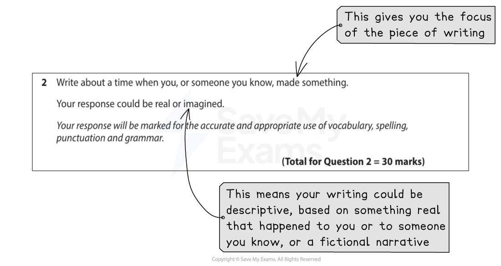

# How to Answer Paper 2 Section B (Writing)

## How to Answer Paper 2 Section B (Writing)

> **Spec point** — `spcpt_DjNMr4m2zy78KdbV`

## How to Answer Paper 2 Section B (Writing)

Section B of Paper 2 consists of a choice of three questions and you are required to complete **one** of them. You must indicate in your answer booklet which question you are completing by marking an X in the appropriate box.

The writing task carries half of the total marks available for this paper, so it is vital that you allow sufficient time to plan and organise your response. There are two assessment objectives for writing:

- **AO4:** Communicate effectively and imaginatively, adapting form, tone and register of writing for specific purposes and audiences (18 marks)
- **AO5:** Write clearly, using a range of vocabulary and sentence structures, with appropriate paragraphing and accurate spelling, grammar and punctuation (12 marks)

The following guide includes:

- **Breaking down the question**
- **Steps to success**
- **Exam tips**

## Breaking down the question

> **Spec point** — `spcpt_W5JzTx7q4SVm5mK2`

## Breaking down the question

The writing task is called “**imaginative**” writing, meaning that you are required to write creatively and with ambition and flair. You will be given a choice of three tasks, which will to some extent be linked by theme to the reading extract. The format of the tasks is always the same:

- **Question 2:** “Write about a time when you, or someone you know...”
- **Question 3:** “Write a story with the title…”
- **Question 4:** “Look at the images provided. Write a story that begins/ends…”

Question 4 will give you two images upon which you may choose to base your story. This means you can use **one** of the images as a **prompt** for your writing (but you should avoid just “describing” the images).

To get the highest marks, you are expected to:

- Use appropriate techniques for creative writing
- Use a “voice” that attempts to make the piece interesting and/or believable for the audience
- Write in a register and style appropriate to the form
- Communicate with maturity and sophistication
- Use an extensive range of vocabulary
- Punctuate your writing deliberately for emphasis
- Use a range of sentence structures accurately in order to achieve particular effects

Before deciding which question you are going to answer, you should carefully read each task and consider the images provided. If you decide to answer Question 4, you should only choose **one** of the images as your prompt. For example:

*Question 2 example*

As this task is worth **30 marks**, it is advisable to allocate **45 minutes** to it.

## Steps to success

> **Spec point** — `spcpt_7wDWDxZXWn9Y2wCp`

## Steps to success

Following these steps will give you a strategy for answering this question effectively:

1. Read all of the tasks carefully:

  1. Highlight which one you have a strong idea for
2. Spend **five minutes planning** your writing:

  1. Plot out your story
  2. Plan your characters: who they are, what they represent and how you will convey this
  3. Decide on your narrative perspective — first or third person
  4. You should aim to write 2–3 sides of A4 (average-sized handwriting)
3. Write down some reminders of figurative language or literary techniques to include in order to add interest and detail to your writing
4. Tick off the elements of your plan as you write
5. Make sure you leave five minutes at the end to re-read your response to check for sense and obvious errors

## Exam tips

> **Spec point** — `spcpt_CdR5PMZFDcknYzYM`

## Exam tips

- Your writing should have **clear organisation and structure**, with an introduction, a clear progression of ideas and an ending
- When you are writing, always think about your reader: how do you want them to react at different parts of your writing? Then choose the best words, phrases or techniques available to you to achieve those effects
- Demonstrate your ability to **shape a narrative**, including moments of tension or drama
- Use **characterisation** to create believable protagonists and characters
- Do not just “tell” a series of events, or just describe one of the images
- Do not over-complicate your language unnecessarily:

  - Do not underestimate the power of simple words and sentences to create powerful effects
- **Engage your reader** with your introduction:

  - Start at your story’s main setting, not in the journey or build up
  - Ensure all of the words you choose contribute to the overall atmosphere and effect you want to create
- Do not confuse tenses in a paragraph:

  - If you use flashback, ensure you have written in the past tense
  - If you use present tense verbs for effect, then make sure you do this consistently
- Limit your use of dialogue, if using it at all:

  - Only use dialogue if it drives forward the plot and you are able to punctuate it correctly
- **Vary your sentence and paragraph lengths** to keep the style and tone dynamic
- As you begin to write, know where you will end. This will help you construct a cohesive and coherent piece of writing
- Take care throughout with accuracy
- Try to be **ambitious, creative and original**
- Always respond to the tasks set, not something that you have pre-prepared
