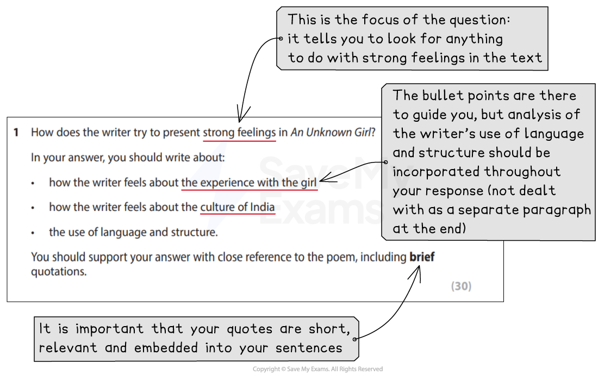

# How to Answer Question 1 (Poetry or Prose)

## How to Answer Question 1 (Poetry or Prose)

> **Spec point** — `spcpt_M68dWHyPWSy9shHG`

## How to Answer Question 1 (Poetry or Prose)

**Question 1** is the only reading question in Paper 2 and is worth **30 marks**. It is a **long answer question** related to **one** of the **fiction texts** (poetry or prose) contained in the Pearson Edexcel International GCSE English Anthology.

It tests **AO1**, which is your ability to read and understand texts as well as your ability to select and interpret the information, ideas and perspectives contained in a text. It also tests **AO2**, which is your ability to understand and analyse how writers use language and structure to achieve effects. You should support any points you make with close textual references and brief quotations from the text itself.

The number of marks available for each assessment objective is:

- **AO1** = 12 marks
- **AO2** = 18 marks

The following guide includes:

- **Breaking down the question**
- **Steps to success**
- **Exam tips**

## Breaking down the question

> **Spec point** — `spcpt_qWSKKS4BFQssmYYz`

## Breaking down the question

You should allow **45 minutes** for this question. You will be given **three bullet points** in this question that you should use as **guidance** as to what to include in your answer. It is therefore important that you **read the question carefully **and **highlight**:

- The focus of the question (what you are being asked to analyse)
- The focus of each bullet point

For example:

*How to answer Paper 2 Question 1*

## Steps to success

> **Spec point** — `spcpt_bnzMHWSw8XbdDswy`

## Steps to success

Following these steps will give you a strategy for answering this question effectively:

1. **Read the question** and **highlight**:

  1. The key instructions
  2. The focus of the question (what specifically you are being asked to look for in the text)
  3. The focus of each bullet point
2. **Re-scan** the **poem or text** given:

  1. You should know each text well enough for this to be a quick reminder
  2. Exam time is not time for a “first read”
3. **Annotate your thoughts** in the margins:

  1. This should not be just writing down the techniques the writer has used
  2. Instead, think about what is **shown **in the text about the focus of the question
4. **Start your answer** using the **wording of the question** and an **overall summary statement:**

  1. Make sure that this actually says something the examiner can award you a mark for
  2. For example, writing, “The writer presents strong feelings through the use of descriptive language” is not specific enough to obtain a mark
  3. Whereas, writing, “The writer presents strong feelings by starting the poem with sensory description of a traditional setting” would
5. Go into **detail:**

  1. Start each paragraph with a key point
  2. Then, use close textual reference and short quotations from the text as evidence for your point
6. **Sum up**:

  1. Finish your answer with a “So overall…” statement

## Exam tips

> **Spec point** — `spcpt_rBchNkGdsRGRJCK9`

## Exam tips

To obtain the highest level in this question (Level 5: 25–30 marks), you should:

- Demonstrate that you **know** and **understand** the **poem or text**
- **Select ideas**, **textual references** and **quotes **that are **directly relevant** to the **focus of the question** (rather than just writing everything you know about the text)
- Avoid “feature spotting”, which means simply pointing out the techniques a writer has used without exploring why they have used them
- Your **supporting quotations** should be **brief** and **embedded **into your sentences:

  - This means not “introducing” your quotations separately, using statements such as “This is shown by the quote…” or just putting a quote on a separate line
- Instead, the quotation forms part of your sentence:

  - For example: “The writer describes time passing ‘relentlessly’, suggesting she feels…”

- **Integrate** the **bullet points** in the question in your answer:

  - Do not leave an analysis of language and structure as an “add on” at the end
- Avoid simply “re-telling” the poem or text:

  - You need to drill down into the poem or text to examine the more nuanced ideas explored by the writer
- Ensure you **cover the whole of the poem or text**
