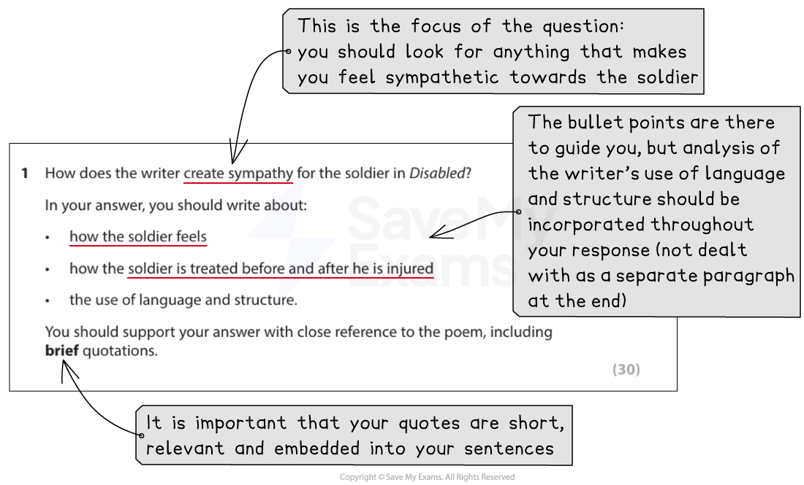
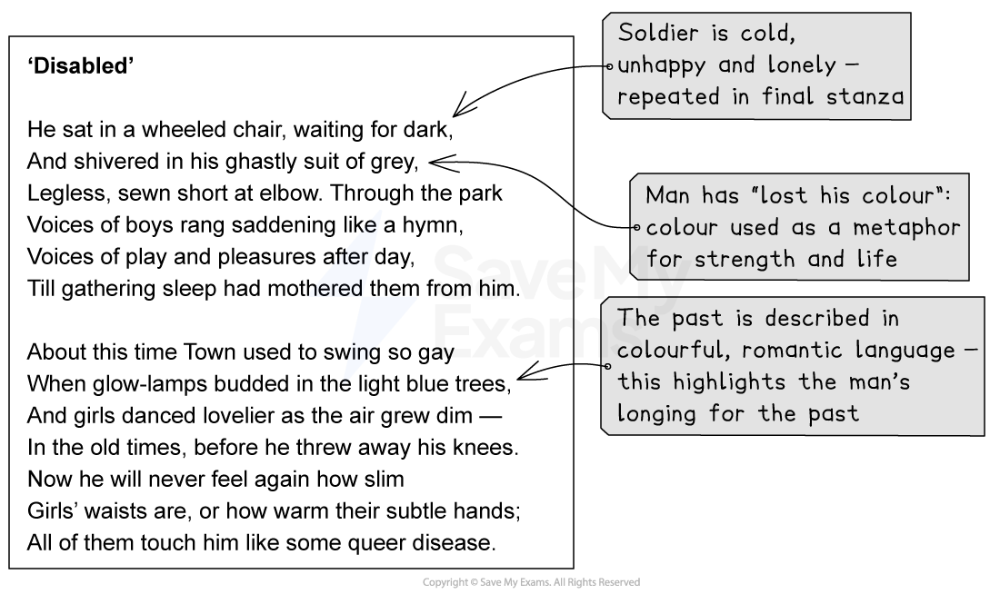
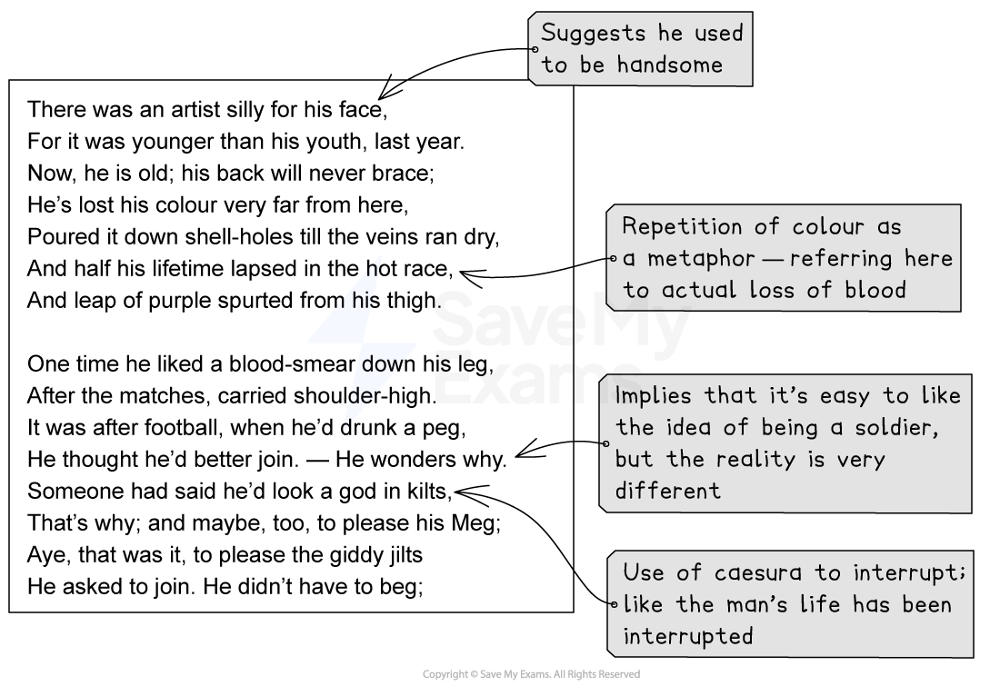
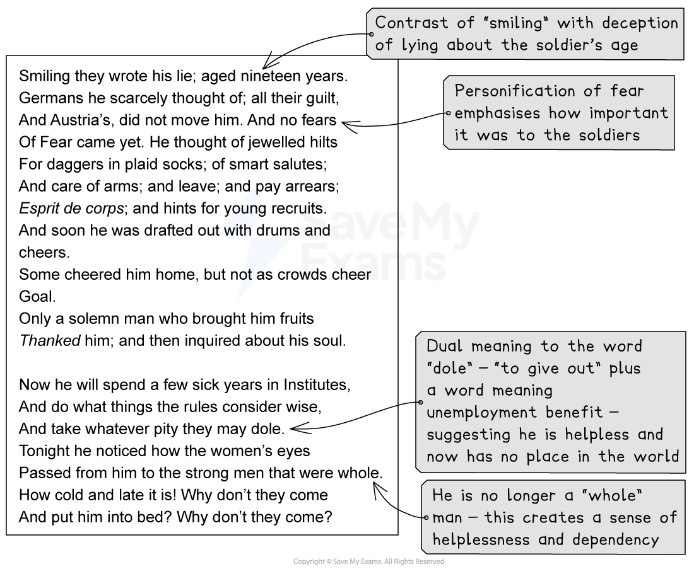

# Question 1: Model Answer

## Question 1: Model Answer

> **Spec point** — `spcpt_XmySqg844VR3cJ9K`

## Question 1: Model Answer

For Question 1, you will be given one of the ten texts from the Pearson Edexcel International GCSE English Anthology printed on the exam paper (or in a source booklet) and one question to answer about it. You will need to demonstrate your understanding of and engagement with the themes and ideas in the poem or text, as relevant to the focus of the question.

The following guide will demonstrate how to answer a Question 1 task. The question itself is taken from a past exam paper. It includes:

- **Question breakdown**
- **Planning your response**
- **Question 1 model answer with annotations**

## Question breakdown

> **Spec point** — `spcpt_377kn3pQYvwRMwmz`

## Question breakdown

The following example question is taken from the [January 2022 exam paper](https://www.savemyexams.com/igcse/english-language/edexcel/past-papers/paper/ppr_M8pS5Fjr29TRDJX3/?pdf=https%3A%2F%2Fcdn.savemyexams.com%2Fuploads%2F2023%2F01%2F4ea1-02-que-20220119.pdf), and is about the poem ‘Disabled’ by Wilfred Owen. This is an example of how you should approach Question 1 and your response, regardless of the text you are given in the exam.

You should begin by reading the question carefully:

*Question 1 example*

You should then re-read the text carefully with the specific focus of the question in mind.

## Planning your response

> **Spec point** — `spcpt_zmVN6n2fnwjdYVXR`

## Planning your response

It is important not just to write down everything you have learnt about the poem or prose text in your response, or just describe what is happening. When you go back to re-read the text in the exam, you should annotate in the margins anything directly relevant to the focus of the question and the bullet points.

For example:

*'Disabled' with annotations part 1*

*'Disabled' with annotations part 2*

*'Disabled' with annotations part 3*

Use these annotations to create the points you are going to make in your answer.

## Question 1 model answer with annotations

> **Spec point** — `spcpt_259ZFHnscKGMbffH`

## Question 1 model answer with annotations

Based on the above question, the following model answer demonstrates how to write your response in order to achieve the full 30 marks:

> **Worked Example**
> *The writer creates sympathy for the soldier in ‘Disabled’ by contrasting the soldier’s current helpless and dependent situation with his youth, when he was full of life and vitality. *The poet therefore creates a melancholic and wistful tone, with elements of irony and bitterness in the passive report of the soldier’s thoughts and feelings.
> 
> The poem opens by giving the reader a sense of how cold, unhappy and lonely the soldier is, sitting in his “wheeled chair” as he “shivered”, waiting for darkness. *The cyclical structure of the poem means Owen returns to the same idea at the end, with the soldier wondering how “cold and late it is”*. This suggests that the man is actually waiting not only for the night, but for death to relieve him of his suffering. The man is described as wearing a “ghastly suit of grey”, and colour *symbolism* is used throughout the poem as a metaphor for strength and life, with the “dark” equating to death. This man has lost his colour, and therefore has also lost his strength and passion for life.
> 
> *In the second stanza, Owen contrasts the soldier’s present with his past,* described using bright, colourful and romantic language, highlighting the soldier’s longing for these times. Owen uses a lexical field of light and warmth, with “glow-lamps”, “light blue trees” and the warmth of girls’ “subtle hands”. The fact that he will no longer feel “*how slim girls’ waists are*” and that they only touch him now like “some queer disease” suggests that the soldier feels a yearning for the light and warmth brought about by physical touch and affection. However, because he took his legs for granted and “threw away his knees” he will no longer experience these pleasures. The suggestion that the soldier is someone at fault for his situation, potentially tempering the amount of sympathy the reader might feel, is addressed later on in the poem when the poet reveals that the men in charge of enlisting knew that he was underage, but “smiling they wrote his lie”.
> 
> The tone of nostalgia for the past continues into the third stanza when there was an artist “silly for his face”, suggesting that he used to be handsome. The use of colour symbolism is repeated as we are told that he “lost his colour” on the battle-field, both physically with the loss of blood, and metaphorically with the loss of his brightness, his soul. The “leap of purple” which signifies the soldier’s loss of blood and loss of vitality contrasts with the “blood smear down his leg” which he received while playing football. This implies that the man found it easy to like the idea of being a soldier, but the reality was very different. The use of the dash in the fourth stanza as a caesura interrupts the line just as the man's life has been interrupted by his injuries. The reflective “he wonders why” suggests that he originally thought that signing up to the army would be a good thing. *We can therefore feel sympathy towards the soldier for being put into a situation he was clearly not prepared for.*
> 
> The idea of being sold a lie is continued in the fifth stanza, since when he signed up he had “no fears of Fear”, thinking instead of the “jewelled hilts” and “smart salutes” he thinks his time in the army will involve. The personification of “Fear” highlights how central fear will become in army life, contrasting sharply with all of the positive propaganda of being a soldier. The irony that “some cheered him home” but not as “crowds cheer Goal” hints that ordinary people had little awareness of the reality of war, *feeling that celebrating a goal in a game of football was more significant than the sacrifices soldiers were making.*
> 
> *The final stanza circles back to the man in hospital*, and the poet uses the third person and passive voice to describe the nameless soldier, further suggesting that he has ceased being a whole and complete person.  He has gone from being a brave soldier to someone helpless and completely dependent on others, with the use of the word “*dole*” suggesting that he is now nothing more than a drain on society, given its negative associations with unemployment benefits. He notices how the women’s eyes pass over him now to the “strong men that were whole”, suggesting that he no longer feels like a whole man either physically or spiritually. His final questions contrast with the strength of his youth, and imply that he is bitter and just wants his life to be over. *The soldier seems to represent the horrible reality of war: the fact that he is now isolated in an institution, shivering in a wheelchair raises questions about how those who make sacrifices in war for their country are treated when they return. *
