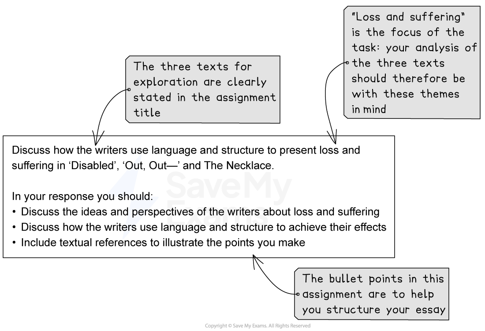

# Assignment A: Model Answer

## Assignment A: Model Answer

> **Spec point** — `spcpt_SR8jm5Fv4VjKWNBg`

## Assignment A: Model Answer

Your assignment title for Assignment A must allow you to explore both AO1 and AO2, be based on three texts from Part 2 of the Pearson Edexcel International GCSE English Anthology and include one poem and one prose text.

Your assignment wording can either be set by you or your teacher(s), but it should ask you to discuss, explore, examine or consider how the writers present something to you. This allows you to explore the methods the writers have used.

The following guide includes:

- **Assignment A example**
- **Assignment A model answer**

## Assignment A example

> **Spec point** — `spcpt_3Zd3hx7zRV9xt4mn`

## Assignment A example

*Assignment A title example*

## Assignment A model answer

> **Spec point** — `spcpt_7Z2BxJf9F7xSKQz3`

## Assignment A model answer

> **Worked Example**
> Loss and suffering are explored in ‘Disabled’, ‘Out, Out —’ and *The Necklace* through grief for what is taken away, whether that is physical ability, human life, or the imagined life a character believes she deserved. Across the texts, the writers use contrast, symbolism, and structural turning points to show how loss reshapes identity and exposes harsh truths about society.
> 
> In Owen’s ‘Disabled’, the poet creates sympathy for the soldier by sharply contrasting his current helpless dependence with his earlier youth and vitality. The poem opens with the soldier in a “wheeled chair” who “shivered” as he waited for “dark”. The physical chill suggests bodily fragility, but “dark” also works metaphorically, implying he waits for death or oblivion to end his suffering. The man wears a “ghastly suit of grey”, and the pallor of “grey” symbolises a drained life. Owen’s colour imagery becomes a motif for loss of energy and passion, implying that war has stripped him of more than his limbs, it has stripped him of identity.
> 
> This drained present is set against a past described with warmth and sensory richness. Owen uses a lexical field of light and colour in memories of “glow-lamps” and “light blue trees”, coupled with the tactile image of girls’ “subtle hands”, to show how the soldier yearns for intimacy and human contact. The contrast makes his current treatment more bitter. Girls now touch him “like some queer disease”, a simile that suggests social repulsion and emotional isolation. It implies he is no longer seen as a person but as something contaminated, creating suffering through humiliation as well as physical loss.
> 
> Owen’s exposure of propaganda is reinforced through the soldier’s naïve motivations for enlisting. He imagines “jewelled hilts” and “smart salutes”, a romanticised, decorative view of war. The alliteration of “smart salutes” mimics the crispness of military ceremony, showing how surface glamour seduced him. The line “he wonders why” signals reflective disillusionment, while the caesura in that stanza interrupts the flow, mirroring how injury has interrupted his life.
> 
> An alternative interpretation sharpens the poem’s social criticism. The “solemn man who brought him fruits / Thanked him” could be read as a representative of the church or respectable society. “Solemn” hints at religious gravity, yet the gratitude feels performative rather than compassionate. The man’s “thanks” may be superficial, a hollow ritual that offers the soldier no real comfort. If so, Owen is attacking institutions that sanctify sacrifice without caring for the human cost. The soldier is praised as a symbol, not loved as a person, deepening the sense of abandonment.
> 
> Maupassant presents loss and suffering through the physical loss of the necklace and the moral loss of self that follows. Mathilde is described as “unhappy all the time” because her vanity convinces her she was meant for “a life of refinement and luxury”. The emotive absoluteness of “all the time” suggests chronic dissatisfaction, and her fantasies of “great drawing-rooms dressed with old silk” are so vivid they become a psychological substitute for reality. Her suffering, then, comes from longing for what she does not possess. Maupassant uses contrast between her modest home and her luxuriant dreams to expose her loss as self-inflicted. Women “of her station” accept their lives, so Mathilde’s pain seems rooted in pride rather than genuine deprivation.
> 
> The story’s structural turning point is the short sentence “they had lost all hope”. Its blunt finality mirrors the sudden collapse of their world. The necklace’s loss causes financial ruin and a decade of exhausting labour, compacted into the single paragraph, “they lived like this for ten years”. This structural compression makes suffering feel relentless and unbroken. By the end, Madame Loisel is “no longer recognisable”, while Madame Forestier is unchanged. Maupassant thereby shows loss not just of money, but of youth, beauty, and identity itself, and suggests that appearances can be disastrously deceptive.
> 
> In ‘Out, Out —’, Frost explores loss and suffering through the fragility of life and the indifference of the world that survives it. The opening situates the poem in an idyllic setting, “sweet-scented stuff” and “five mountain ranges”, but this pastoral calm is undercut by the violent sound imagery of the saw which “snarled and rattled”. The animalistic verb “snarled” personifies the saw as predatory, implying that danger is not just accidental but almost wilfully hostile. The harsh consonants mimic the saw’s noise, so the poem’s soundscape creates tension before the tragedy occurs.
> 
> Frost’s syntax mirrors the instability of life. He uses long sentences with heavy enjambment, pulling the reader forward as if events are unstoppable. When the accident happens, the pace tightens. The boy’s suffering is conveyed through physical and emotional panic as he holds up his hand “as if to keep / The life from spilling”. The metaphor of “life” as a liquid suggests an innocence in his understanding of the body, and the visceral verb “spilling” makes loss feel immediate and irreversible. His cry, “Don’t let him cut my hand off”, is childlike and desperate. The repetition of “hand” emphasises how central the loss is to his identity and future. Even the title’s repetition “Out, Out” foreshadows the extinguishing of life in an instant, echoing Macbeth’s speech and linking the boy’s death to a bleak view of human brevity.
> 
> Structurally, Frost denies the reader emotional closure. The phrase “Little - less - nothing” reduces death to a faint fading rather than a dramatic moment, and the broken punctuation fragments the line, echoing the boy’s slipping consciousness. The final statement, “And they, since they / Were not the one dead, turned to their affairs”, is chilling in its plainness. The detached pronoun “they” erases individuality, and the matter of fact clause “turned to their affairs” suggests that routine swallows tragedy. An alternative interpretation is that Frost is not cruelly dismissing the boy, but critiquing a social system in which working lives, especially children’s, are replaceable. The emotional flatness becomes an accusation: suffering is made ordinary by economic necessity.
> 
> Across the three texts, loss and suffering operate as forces that strip away illusions. Owen exposes the betrayal of a young soldier by propaganda and hollow social gratitude. Maupassant shows how obsessive longing for status can create a life of delayed, grinding suffering. Frost presents the shock of physical loss while simultaneously condemning the calm, continuing world that surrounds it. Together, the texts suggest that suffering is not only personal but shaped, and often intensified, by the societies in which it occurs.
