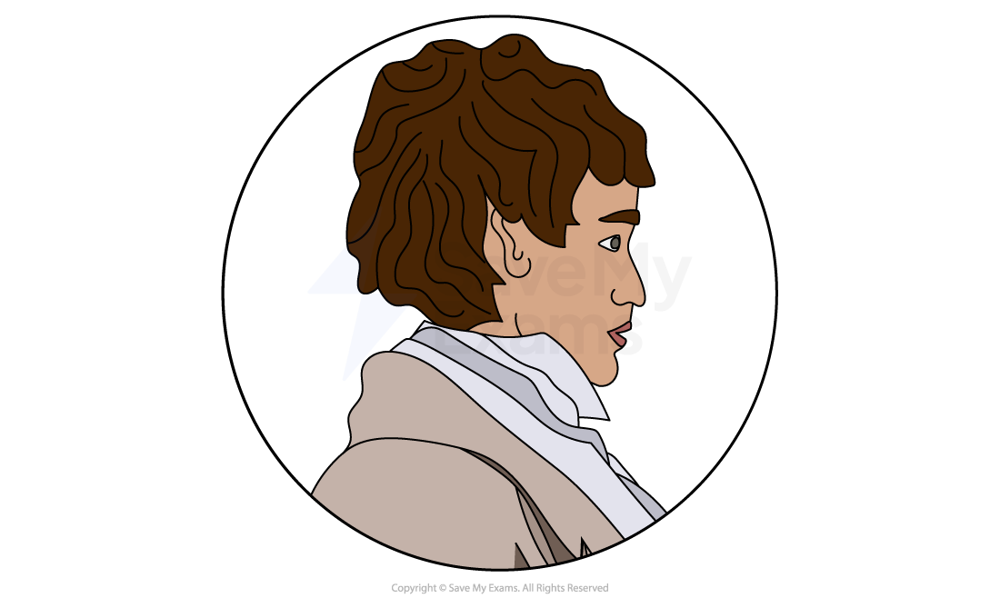
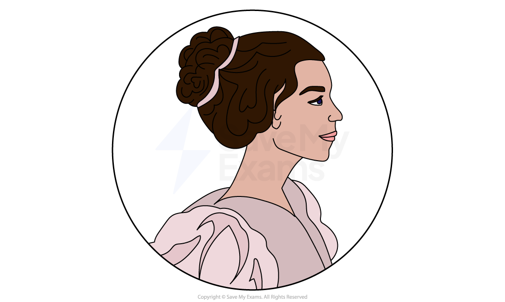
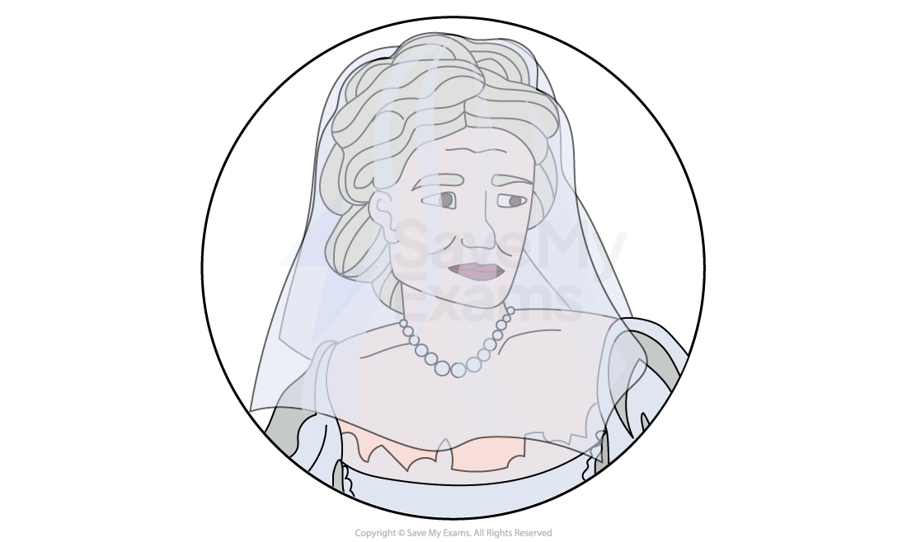
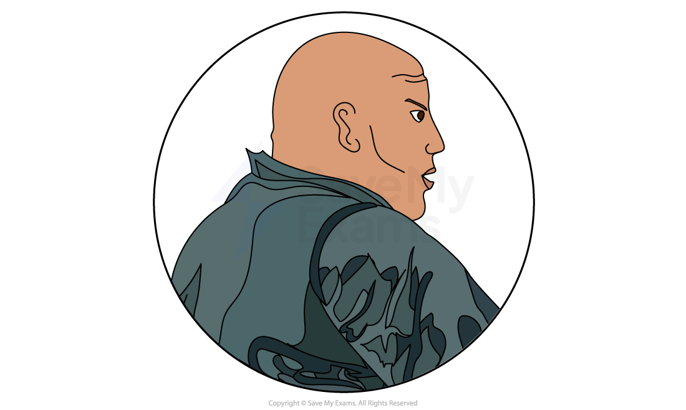
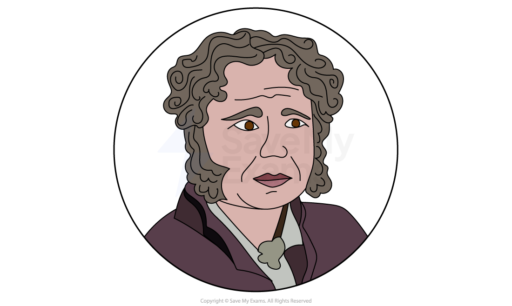
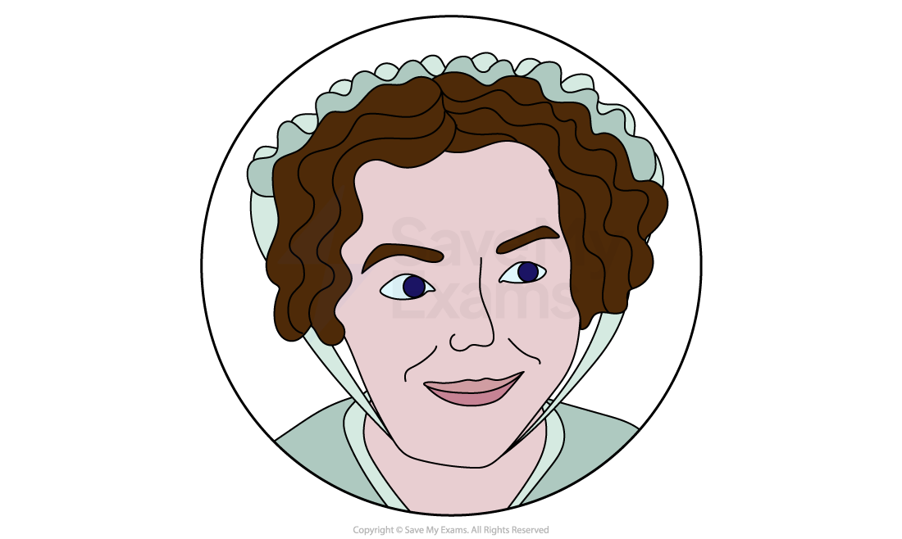
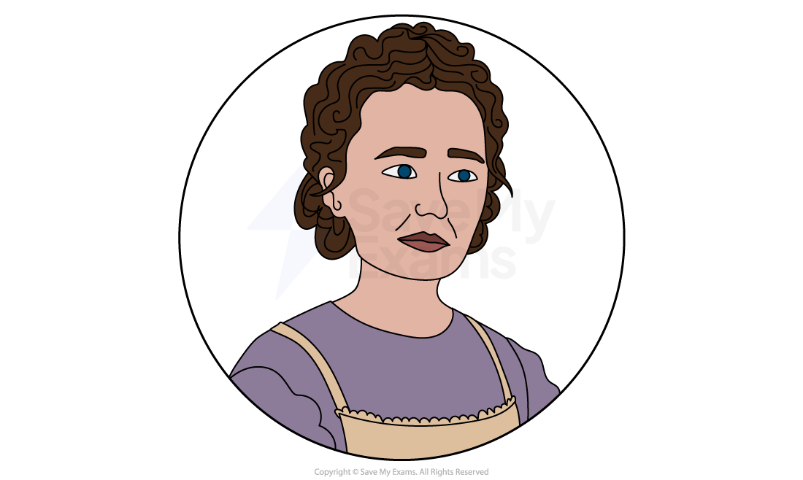
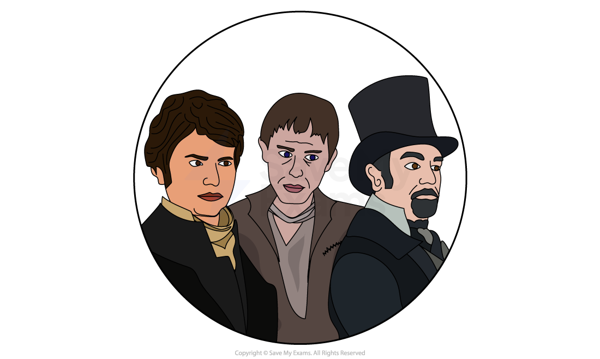
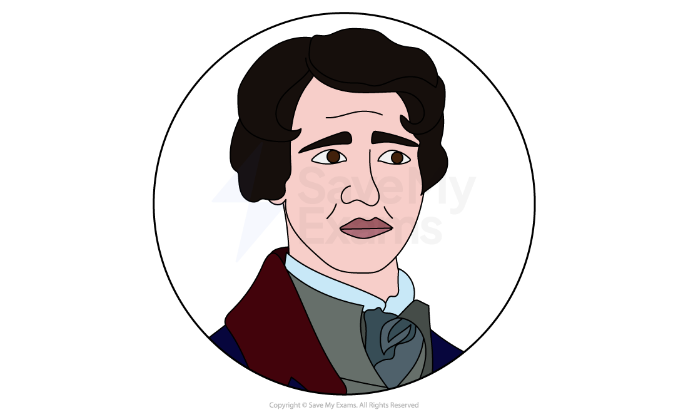

# Great Expectations: Characters

## Great Expectations: Characters

> **Spec point** — `spcpt_3qxYFz78dzsxHYT3`

## Characters

It is vital that you understand that characters are often used [symbolically](https://www.savemyexams.com/glossary/gcse/english-language/symbolism-definition/) to express ideas. Dickens uses all of his characters to [symbolise](https://www.savemyexams.com/glossary/gcse/english-language/symbol/) various ideas prevalent in his society, and the differences between characters reflect contemporary debates. Therefore, it is very useful not only to learn about each character individually, but how they compare and contrast to other characters in the novel.

It is important to consider the range of strategies used by Dickens to create and develop characters within Great Expectations. This includes:

- how characters are established
- how characters are presented:

  - physical appearance or suggestions about this
  - actions and motives for them
  - what they say and think
  - how they interact with others
  - what others say and think about them
- how far the characters conform to or subvert stereotypes
- their relationships between other characters

Below you will find character profiles of:

- **Pip**
- **Estella**
- **Miss Havisham**
- **Abel Magwitch**
- **Joe Gargery**
- **Mrs Joe Gargery**
- **Biddy**

Minor characters:

- **Compeyson**
- **Dogle Orlick**
- **Mr Jaggers**
- **Herbert Pocket**

> **Exam Hint**
> Examiners note that less effective answers work through the extract **literally** instead of interpreting. Here the strongest route is to read characters as opposites Dickens has arranged.
> 
> For example, you could write: “Dickens sets Joe’s kindness against Jaggers’ coldness, so Pip has to choose between two versions of what a man can be”. Explaining what a character is being asked to choose between is stronger than describing each figure separately.

## Great Expectations: Characters: Pip

> **Spec point** — `spcpt_8kM8sfnhSbVMfnG8`

## Pip

- Dickens establishes Pip's virtuous character in the opening chapters of the novel
- The difficult conditions of Pip's early upbringing greatly impact his kind and sensitive demeanour:

  - Pip is in a world dominated by adults, sustained only by Joe’s affection and a deep sense of outrage and injustice
  - He possesses a strong moral compass and is significantly impacted by his conscience
- Pip experiences intense fear and dread when first confronted by Magwitch on the marshes, which compels him to make a pact to steal food and a file:

  - This causes Pip to experience an intense internal moral conflict as he is torn between keeping his promise to Magwitch and betraying his beloved Joe
  - However, encountering the convict also prompts the emergence of his *innate* kindness and sympathy, which were perhaps suppressed due to the dominating presence of Mrs Joe
- His first visit to Satis House is a significant event in his moral and spiritual development, as it becomes the root of Pip’s dissatisfaction with his life:

  - As a result, Pip almost instantly begins to abandon his moral compass while also losing respect for his loving and innocent foster father, Joe
- In Pip's first meeting with Estella, his innocence is also shattered:

  - By agreeing with Estella's assessment of him, his conduct is one of passive acceptance: he not only denounces himself but also the environment that has moulded him into who he is
- His initial encounter with Estella and Miss Havisham leads him to confuse arrogance and meanness with superiority:

  - Along with Estella's beauty, this ignites an obsessive admiration that drives Pip's pursuit of social status instead of honesty and integrity
  - His aspiration to become an apprentice, which was previously cherished by both Pip and Joe, is now deemed unworthy
- Pip aspires intensely to adopt the manners and behaviour of a gentleman to prove himself worthy of Estella:

  - As Volume I comes to a close, Pip's aspiration to become a gentleman is fulfilled, which adds to the fairy-tale quality of the narrative
- In Volume II of the book, life as a gentleman leads Pip to live recklessly and extravagantly, resulting in debt, emotional distress, and a sense of aimlessness:

  - Further, Pip's lavish lifestyle negatively influences his close friend, Herbert Pocket, who had otherwise been a virtuous character
- Pip is aspirational and ambitious but also deluded:

  - He becomes obsessed with materialistic pursuits and the resulting desire for social recognition
  - He experiences a significant degree of discontent and dissatisfaction due to his infatuation with Estella
- By depicting Pip's severe misjudgements and conduct, Dickens conveys the moral failings of the upper-class society that Pip is now a part of
- By the end of the novel, he rediscovers his *innate* affectionate qualities that he possessed as a child
- Pip embraces Miss Havisham's world until Magwitch reveals the source of Pip’s wealth:

  - This revelation leads to a chain of events that shakes Pip's convictions
- Ultimately, Pip is only able to regain the moral values he held as a child once he realises that his elevated rank as a gentleman is based on the riches of a former convict:

  - This renders his social status untenable in the eyes of the upper class to which he had aspired
  - Initially repulsed by Magwitch, Pip eventually develops strong feelings of devotion towards him
- Pip's *innate* moral compass becomes his guiding force throughout Volume III:

  - He exhibits kindness towards Magwitch
  - He secretly helps advance Herbert's fortunes
  - He forgives Miss Havisham
  - He reconciles with Joe and Biddy
- His spiritual, emotional and intellectual development throughout the novel may be represented by his name which is [symbolic](https://www.savemyexams.com/glossary/gcse/english-language/symbol/) of a seed that grows and evolves:

  - Unlike many of the other characters in the novel, who largely remain unchanged, Pip has the unique ability to develop and mature throughout the narrative

## Great Expectations: Characters: Estella

> **Spec point** — `spcpt_mFrbZf2dvNMdFBCX`

## Estella

- Despite her parents being considered socially inferior, she has managed to reach the highest level of upper-class society
- Visiting Satis House and meeting Estella transforms Pip's perspective to one of unease and discontent:

  - She is condescending, cruel, proud and arrogant
- Throughout the majority of the novel, she under the control of Miss Havisham
- Her flawed emotional state is due to Miss Havisham's cruel experiment, which has resulted in Estella obediently following her lead

  - Her attitude towards her own fate and that of others is one of indifference
- Estella, like Magwitch, is present to Pip even when absent as she is forever in his thoughts:

  - In the novel, she disappears from Pip's life, for an unknown period of time
- Pip becomes her confidant and friend and wishes to shield him from the suffering she has planned for others
- Estella firmly believes that falling in love is an unattainable goal and therefore does not consider Pip:

  - She also continually advises him against pursuing her
- There is a tragic aspect to Estella as she is the victim of Miss Havisham's vengeful obsession:

  - Despite having taught her to be arrogant and disdainful, even Miss Havisham is eventually taken aback by her own creation and she *reproaches* Estella for her cold demeanour
- Despite her outwardly cold demeanour, Dickens makes her character sympathetic:

  - Similar to Pip she is the victim of another person’s scheme
- Although she eventually frees herself from Miss Havisham's control, it is only through her tragic marriage:

  - In her determination to marry someone as brutal as Drummle, she could be perceived as being somewhat self-destructive
- Estella's emotional coldness is evident, and she lacks compassion. However, Drummle’s ill-treatment of her makes her more sympathetic and humane
- Estella undergoes significant development due to her brutal marriage to Drummle, which forces her to mature beyond her former self:

  - As a result, she becomes aware of the worth of Pip's affection and can now be considered as a suitable companion for him
- It is through her own personal struggles and hardships that she experiences emotional and spiritual development:

  - She comes to appreciate the significance of emotions like love, forgiveness, and regret
- Her harsh experiences have had a profound effect on her, and by the end of the novel, she indicates her remorse for having rejected Pip's affections
- Her difficult experience exemplifies one of the sentimental themes in the novel:

  - How adults can cause harm to children by pursuing their own agenda without any consideration of the latter
- It is only after Havisham’s demise that Pip and Estella can reunite

## Great Expectations: Characters: Miss Havisham

> **Spec point** — `spcpt_yfzDbNkXdpPYdsx8`

## Miss Havisham

- Miss Havisham’s abandonment by Compeyson has affected her profoundly:

  - Her immense disappointment in love leads her to make the woeful mistake of attempting to harm everything around her
  - Yet despite her seemingly powerful ability to destroy, she ultimately suffers more from her actions than anyone else
- Havisham’s mind becomes consumed with retribution, with Estella used as the chosen weapon for her vindication:

  - She imparts to her protege a twisted set of values centred on cruelty and manipulation
- Her deranged mind skilfully distorts and controls details with precision:

  - She exploits Pip's lack of knowledge about the origin of his expectations
  - She also uses him as a target for Estella's unkind behaviour and to provoke her own avaricious relatives
- Pip perceives both Miss Havisham and Magwitch as if they were otherworldly beings, which is [alluded](https://www.savemyexams.com/glossary/gcse/english-language/allusion-definition/) to through their setting and appearance:

  - Magwitch in depicted in the churchyard; Miss Havisham is surrounded by her faded wedding attire
- Miss Havisham's decision to keep all of her clocks permanently stopped acts as a [metaphor](https://www.savemyexams.com/glossary/gcse/english-language/metaphor-definition/) for her inability to move beyond the past:

  - Her room is depicted as being frozen in time, mirroring Miss Havisham's inability to move forward in life and her rejection of reality
- Her injury elicits an insane and irrational response from her, though she is still somewhat portrayed as a sophisticated and astute woman:

  - She has an ability to discern the true intentions of those who flatter her
  - She shows kindness towards Pip and Joe
  - She generously supports Herbert financially
  - She excludes Pumblechook from her life
- In the novel Dickens gradually unveils the reason behind Miss Havisham's conduct, making her appear more pitiful
- Miss Havisham’s eventual redemption is illustrated through her remorse for her actions and her attempt to redress the balance of her wrongdoings
- When Pip confronts Havisham regarding the *magnitude*** **of her actions, she provides an explanation without attempting to justify her behaviour, before requesting forgiveness:

  - In the end, she is overwhelmed with anguish over the guilt that weighs heavily on her for the harm she caused to Estella and Pip
  - Havisham is able to perceive the adverse impact of her actions and realises Estella's sadness and Pip's shattered aspirations

## Great Expectations: Characters: Abel Magwitch

> **Spec point** — `spcpt_xQpBg67XgKTfKbnX`

## Abel Magwitch

- Magwitch is a criminal and an escaped convict and he is first portrayed as threatening, aggressive and violent:

  - He is first portrayed as savage-like and described as a “fearful man… with a great iron on his leg… no hat, and with broken shoes”
- Pip's first encounter with Magwitch highlights the brutality, violence and injustice of Pip’s environment:

  - Magwitch almost appears inseparable from the wild landscape from which he emerges
- He first appears to have a brutish appearance and although he possesses strength and the capacity for violence, he is not frequently aggressive
- Dickens seeks to change the reader’s initial negative perception of Magwitch by highlighting his pitiable condition and demonstrating his appreciation for Pip's assistance:

  - He fades away quickly from Pip's life but his memory continues to haunt Pip throughout the novel
- Despite being a generous man, Magwitch's belief in the unfairness of his mistreatment drives him to expose Compeyson's true nature:

  - Having realised how Compeyson has exploited him, Magwitch has a simple desire for vengeance
  - However, this does not appear to be self-centred, but rather driven by his need to hold the wrongdoer accountable
- Magwitch has lacked any advantages in life and has had his trust betrayed by others:

  - This is further revealed to the reader when Dickens gradually reveals the harsh circumstances of Magwitch’s life
  - Details about his life with Estella’s mother, and how he was tricked by Compeyson, elicits great empathy for him
- Despite his desire for vengeance against those who have wronged him, Magwitch sincerely desires to benefit the child who aided him on the marshes
- He becomes Pip’s benefactor which demonstrates that he is wishing to do good:

  - However, Magwitch is unable to comprehend the potential harm he may cause Pip by giving him his “great expectations”
- As the narrative draws to a close, his affection for Pip evolves and he appreciates Pip for who he is and his actions, rather than because he has transformed Pip into a gentleman
- Dickens uses his character to highlight how the legal system of the 19th century could exploit individuals from the lower social classes who lacked education

## Great Expectations: Characters: Joe Gargery

> **Spec point** — `spcpt_fK9rjXhmRgV5MxbT`

## Joe Gargery

- Joe is presented as a “mild, good-natured, sweet-tempered, easy-going, foolish dear fellow”:

  - He is described as having a kind heart and a gentle demeanour
- He is portrayed as a simple, honest and virtuous figure and his physical stature serves as a [metaphor](https://www.savemyexams.com/glossary/gcse/english-language/metaphor-definition/) for his moral character:

  - Joe embodies the quintessential aspects of gentleness, kindness and benevolence
- Joe demonstrates unwavering loyalty and commitment to Pip: “Ever the best of friends; an't us, Pip?”
- He is in sharp contrast to the other early influences on Pip, such as Mrs Joe and Uncle Pumblechook:

  - His humility, kindness and understanding serves as a moral benchmark for Pip during this time
- Though his voice is soft, it exudes a sense of grace and respect that surpasses the grandiose words of Wopsle or the boasting of Pumblechook:

  - He refuses to engage with those who are insincere. However, he is kind, charitable and has a forgiving nature
  - His simplicity and language provide some of the humour in the novel
- As a skilled blacksmith, he finds fulfilment in his role in society and takes pride in his craftsmanship and does not harbour ambitions for anything more:

  - From the outset, Dickens links with the fire and the forge
- At the outset of the novel, Joe is virtually illiterate and his background and lack of education means he lacks sophistication and social ease
- However, his lack of social skills is compensated for his immense moral qualities and he can be viewed as the moral benchmark against which all of the other characters are measured
- At the beginning of the novel, Pip and Joe are the helpless victims of Mrs Joe’s temper
- Although he is gentle and affectionate, Joe is also limited in his efforts to protect Pip from Mrs Joe’s rampages:

  - He could perhaps be seen to tolerate his wife for fear of repeating his father's mistake of mistreating his wife
  - However, Dickens lets the reader decide how serious this weakness to protect Pip is in Joe’s endearing character
- Joe develops throughout the narrative, growing into what Pip acknowledges as a “gentle Christian man” with a “great nature”

## Great Expectations: Characters: Mrs Joe Gargery

> **Spec point** — `spcpt_fNmnZNXRqdFcX6vS`

## Mrs Joe Gargery

- Pip's sister is described as physically unattractive: she was “not a good-looking woman” and has “a hard and heavy hand”
- Mrs Joe is portrayed as a controlling and domineering character who outwardly expresses dissatisfaction at her position in society
- She leads a busy life as a housewife, but her efforts seem primarily motivated by her own overinflated sense of importance, causing both Pip and Joe to suffer
- She exhibits a notoriously bad temper which she directs towards Pip and Joe, both physically and [metaphorically](https://www.savemyexams.com/glossary/gcse/english-language/metaphor-definition/)
- Mrs Joe's method of raising Pip largely with physical discipline is both brutal and cruel:

  - It is not conducive to the development of his mind and spirit and he becomes even more guilt-ridden and insecure as a result
- Her foul temper eventually leads to her untimely demise and her presence in the novel helps to unite Pip, Joe and Biddy

## Great Expectations: Characters: Biddy

> **Spec point** — `spcpt_DTMTKbtrDcBMfpzm`

## Biddy

- Throughout much of the novel, Biddy serves almost as a moral compass for Pip and she expresses her disapproval of Pip's flawed judgments
- She teaches Pip to read and becomes his confidante: “I shall always tell you everything”
- She conveys a wise perception and insight into Pip’s struggles as a character
- Biddy is a pragmatic character with clear sight, whereas Pip is a dreamer who is blind to certain realities
- Through hard work and determination, Biddy becomes an educated woman, a schoolmistress, a model housewife, and mother:

  - She is content with her modest ambitions and takes advantage of every opportunity to improve herself which are in contrast to Pip’s unrealistic aspirations
- Dickens uses Biddy as a point of contrast to Estella: “She was not beautiful - she was common and could not be like Estella - but she was pleasant and wholesome”
- She is a compassionate carer for Mrs Joe and her passing, although initially causing her to leave the forge, ultimately allows her to marry Joe

## Great Expectations: Characters: Minor characters

> **Spec point** — `spcpt_sH92zqxphTgd7ZJd`

## Minor characters

### Compeyson

- Compeyson is a shady and enigmatic character who is highly effective in his wrongdoings:

  - He inflicts harm on many of the characters in the novel, such as Miss Havisham, Arthur, Magwitch, Estella and Pip
  - Dickens also suggests that there are numerous other victims of his crimes as well
- As a character, Compeyson is continually fearful of Magwitch's potential revenge
- Similar to Magwitch, Compeyson's influence is felt throughout the story, although he only makes a couple of appearances: once on the marshes and once more when he drowns

### Dogle Orlick

- The character of Orlick is both simple and wicked, who uses his cunning to commit crimes
- Orlick is a cruel character though he only actually inflicts harm on Mrs Joe:

  - He attempts to murder Pip but doesn't succeed
  - His actions have the unintended consequence of indirectly bringing Joe and Biddy together
- He is allied with Compeyson and his robbery of Pumblechook's property results in his imprisonment

### Mr Jaggers

- Jaggers is presented as a highly skilled and efficient lawyer and is known for being both merciless and competent
- He is deeply involved in a world of secrecy, authority, and manipulation

  - He is often reticent to reveal any vulnerability, preferring instead to adopt a harsh and bullying legal manner
- However, he does eventually exhibit a more compassionate aspect of his character when his part in Estella’s adoption is revealed and when he indirectly helps Magwitch

### Herbert Pocket

- Herbert exudes a friendly and joyful disposition and has an honest and open manner
- He is an important link with Pip's and Miss Havisham's past
- He is fiercely loyal to Pip and saves him from Orlick's clutches and willingly participates in the attempt to rescue Magwitch
- He sympathises with Pip’s unhappy love affair with Estella:

  - His positive and happy relationship with Clara presents a sharp contrast to the negative feelings Pip experiences in his love towards Estella

#### Sources

Dickens, Charles. (2008). Great Expectations. Oxford.
