# Great Expectations: Key Text Quotations

## Great Expectations: Key Quotations

> **Spec point** — `spcpt_jRQMfVGHjqpNNDJB`

## Key Quotations

Remember the assessment objectives explicitly state that you should be able to “use textual references, *including *quotations”. This means summarising, paraphrasing, referencing single words and referencing plot events are all as valid as quotations in demonstrating that you understand the text. It is important that you remember that you can evidence your knowledge of the text in these two equally valid ways: both through references *to *it and direct quotations *from *it.

Overall, you should aim to secure a strong knowledge of the text, rather than rehearsed quotations, as this will enable you to respond to the question. It is the quality of your knowledge of the text which will enable you to select references effectively.

If you are going to revise quotations, the best way is to group them by character, or theme. Below you will find definitions and analysis of the best quotations, arranged by the following themes:

- **Guilt and shame**
- **Social class**
- **Ambition and self-improvement**
- **Integrity and reputation**

> **Exam Hint**
> Examiners expect at least two separate moments from the text and note that long quotations leave no room for analysis. Short phrases carry more weight in a novel this size.
> 
> For example, you could write: “Pip admits he ‘loved her against reason’, which shows he understands his feelings for Estella without being able to change them”. In a novel this long, a short phrase you can analyse beats a passage you can only quote.

## Great Expectations: Key quotations: Guilt and shame

> **Spec point** — `spcpt_smSbnyfbgyc4H4F9`

## Guilt and shame

Guilt is a significant theme in Great Expectations and plays a major part in Pip's life. Dickens places Pip in a world layered with guilt in Great Expectations to show the reader the effect that environment has on his development.

### Paired quotations

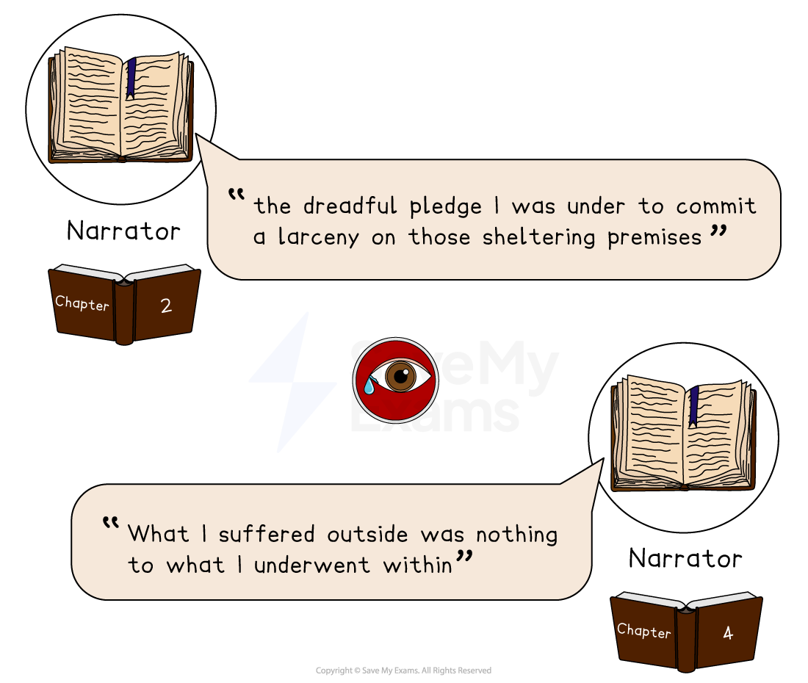

**“the dreadful pledge I was under to commit a larceny on those sheltering premises”**  - Pip the narrator, Chapter 2

**“What I suffered outside was nothing to what I underwent within”** -  Pip the narrator, Chapter 4

#### Meaning and context

- The first quote appears in Chapter 2 when Pip has been forced into stealing a file and food for the convict, Magwitch
- The second quote appears in Chapter 4 after this incident just as Pip and Joe are about to set off for a Christmas Day service at the church

#### Analysis

- Both quotes illustrate one of the major themes of the novel: guilt and shame
- Having been coerced into stealing food and a tool from Joe and his sister, Magwitch instils great fear within the young Pip
- As a result of this promise, Pip is plagued with an internal moral conflict, which serves as the driving force for the first five chapters of the novel
- In both of these quotes, Dickens portrays Pip as a principled and virtuous child, creating an inner conflict between his devotion to Joe and fulfilling his commitment to Magwitch
- In the second quote, Pip the narrator reflects on his younger self's inner turmoil and suffering and these feelings of guilt and shame continue to dominate Pip’s youth

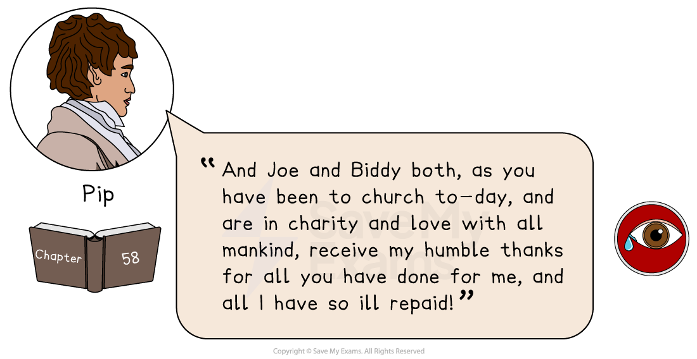

**“And Joe and Biddy both, as you have been to church to-day, and are in charity and love with all mankind, receive my humble thanks for all you have done for me, and all I have so ill repaid!”** – Pip, Chapter 58

#### Meaning and context

- This quote appears in Chapter 58 of the novel, when Pip has returned to England and visits Joe and Biddy

#### Analysis

- Pip's idealist tendencies have often caused him to view the world in a limited manner and his former inclination to oversimplify situations based on superficial values caused him to treat those who care about him poorly
- Ultimately, this quote expresses the depth of Pip's shame and regret over the way he mistreated Joe and Biddy, as he finally recognises the extent of his ingratitude towards them
- The quote demonstrates his humility and indicates his full redemption as a character

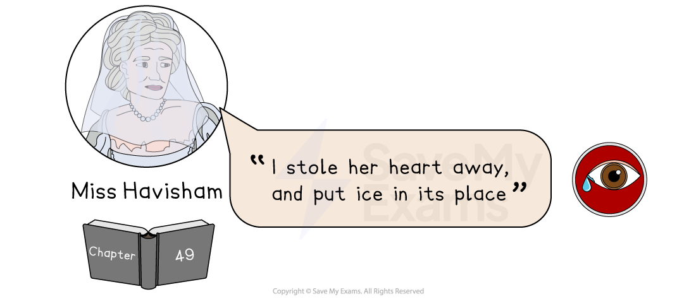

**“I stole her heart away and put ice in its place” **– Miss Havisham, Chapter 49

**“I stole her heart away and put ice in its place”** – Miss Havisham, Chapter 49

#### Meaning and context

- This quote appears towards the conclusion of the novel, when Miss Havisham is reflecting on her treatment of Estella

#### Analysis

- This quote reveals Miss Havisham’s remorse over the manner in which she has brought up her ward, Estella
- Having taught Estella to harbour resentment towards all men and break their hearts as a form of revenge for Havisham's own heartbreak, she eventually realises the harm she has caused
- The use of the word “heart” also links to how she acknowledges Pip's heart has also been damaged in the same way Miss Havisham’s has been
- By seeking personal revenge, Havisham ends up causing more pain and is left to ask for Pip's forgiveness

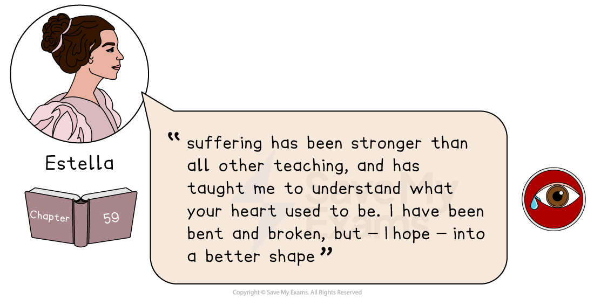

**“suffering has been stronger than all other teaching, and has taught me to understand what your heart used to be. I have been bent and broken, but - I hope - into a better shape” **– Estella, Chapter 59

#### Meaning and context

- This quote appears in the final chapter of the novel and is said by Estella to Pip

#### Analysis

- At the conclusion of the novel, Estella has developed into a mature woman, owing to the harsh conditions she faced in her marriage to Drummle
- Estella’s use of the verbs “bent” and “broken” signify how she had been moulded by Miss Havisham and shattered by Drummle
- Similar to Pip, her journey has been both *arduous* and difficult, though this quote also reveals that Estella is now perhaps able to appreciate the worth of Pip's affection

## Great Expectations: Key quotations: Ambition and self-improvement

> **Spec point** — `spcpt_NkBHycqygMKqmdjw`

## Ambition and self-improvement

The title of the novel chiefly centres around Pip’s yearning for self-improvement, as he harbours “great expectations” regarding his future, and maintains a conviction in the possibility of his own upward mobility.

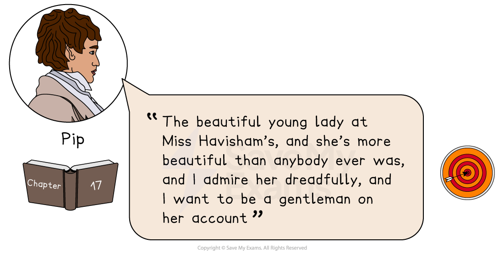

**“The beautiful young lady at Miss Havisham’s, and she’s more beautiful than anybody ever was, and I admire her dreadfully, and I want to be a gentleman on her account”** – Pip, Chapter 17

### Meaning and context

- This quote appears in Chapter 17 and it is Pip informing Biddy about his love for Estella

### Analysis

- One of Pip’s primary traits is his strong moral code but this quote also demonstrates another one: his romantic idealism
- As a character, he has deep aspirations to better himself and to advance his education and social standing in order to marry the beautiful Estella

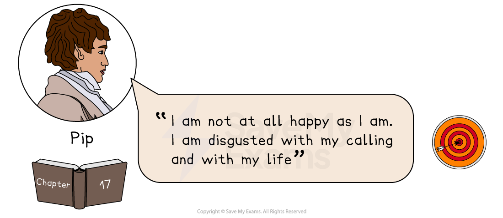

**“I am not at all happy as I am. I am disgusted with my calling and with my life”** – Pip, Chapter 17

### Meaning and context

- This quote appears in Chapter 17 and is said by Pip in a conversation with Biddy

### Analysis

- This quote reveals how Pip is consumed by a sense of self-pity regarding his life, and he is uncertain about his social standing and future prospects
- He confides in Biddy about his discontent and his desire to become a gentleman
- Dickens uses Biddy in this section of the novel to question whether this aspiration is solely to impress Estella, which reveals to the reader how much Pip longs to escape his bleak life on the marshes
- Although Biddy questions Pip's motives, he cannot accept her helpful advice and is too consumed with his own ambition

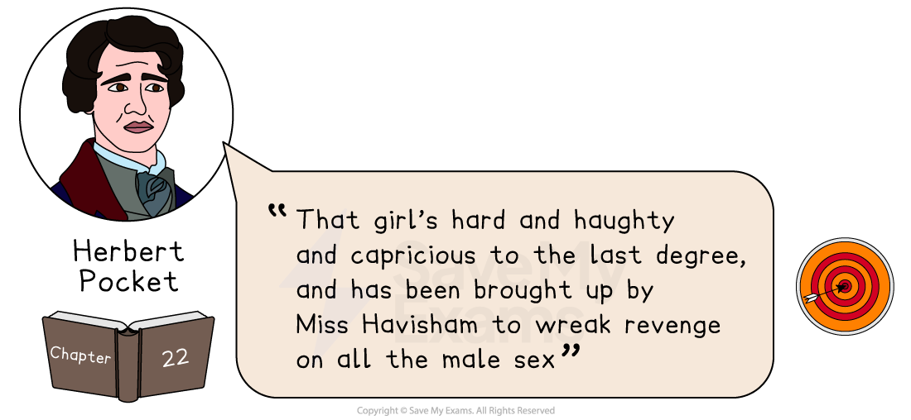

**“That girl’s hard and haughty and capricious to the last degree, and has been brought up by Miss Havisham to wreak revenge on all the male sex”** – Herbert, Chapter 22

### Meaning and context

- This quote appears in Chapter 22 and is said by Herbert in a conversation with Pip

### Analysis

- In this quote Herbert attempts to warn Pip about the dangers of pursuing Estella
- He deliberately uses the negative word “haughty” to [allude](https://www.savemyexams.com/glossary/gcse/english-language/allusion-definition/) to Estella’s arrogance and disdainfulness and the word “capricious” to highlight her unpredictability
- The quote reveals Miss Havisham’s own cruel ambitions for Estella which lead to devastating results

## Great Expectations: Key quotations: Social class

> **Spec point** — `spcpt_B54sDDRJXsMMHpxX`

## Social class

Dickens explores the class hierarchy of Victorian England throughout Great Expectations.  The exploration of social class is a central aspect of the novel, as it reinforces the overarching moral theme of the narrative.

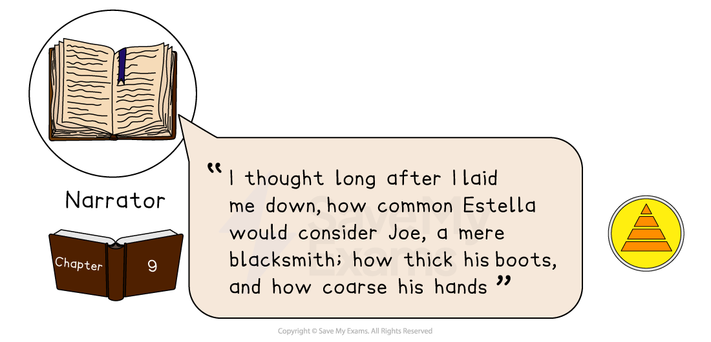

**“I thought long after I laid me down, how common Estella would consider Joe, a mere blacksmith: how thick his boots, and how coarse his hands”** – Pip the narrator, Chapter 9

### Meaning and context

- This quote appears in Chapter 9 and is said by Pip

### Analysis

- In this quote, Pip’s tendency of perceiving the world in terms of opposites becomes evident
- Joe's clothing, conduct and manner of speaking all conflict with the perceived elegance and refinement that he associates with Satis House
- The quote conveys how Pip begins to harshly judge others through Estella’s conceited lens rather than trusting his own

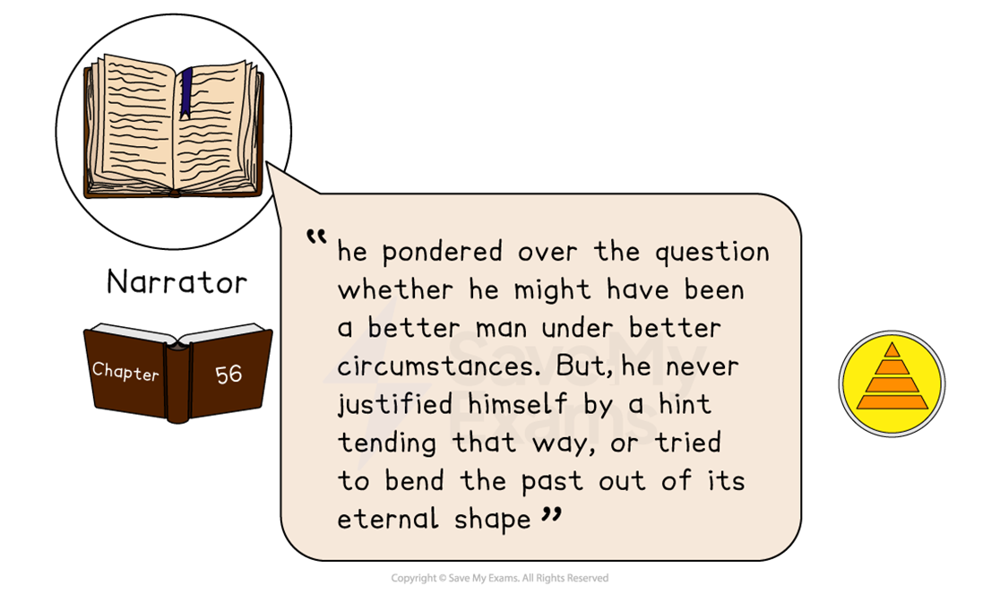

**“he pondered over the question whether he might have been a better man under better circumstances. But, he never justified himself by a hint tending that way, or tried to bend the past out of its eternal shape”** – Pip the narrator, Chapter 56

### Meaning and context

- This quote appears in Chapter 56 when Pip visits Magwitch in prison

### Analysis

- The character of Magwitch invokes a significant amount of empathy from the reader and his death can be seen to *solidify* his redemption
- His harsh and cruel background are in part the reason for his previous dissent into crime and this quote reminds the reader that he may well “have been a better man under better circumstances”
- Dickens presents Magwitch represents as a man who has faced cruel social injustices and the quote reveals that he fully accepts his past actions

## Great Expectations: Key quotations: Integrity and reputation

> **Spec point** — `spcpt_JnmgPhyPpGDKt8g8`

## Integrity and reputation

Throughout the novel, Pip undergoes a transformation from being solely focused on securing a reputation for himself to being a character possessing real integrity. Dickens examines the **correlation** between the seemingly reputable upper-class and the criminal underworld.

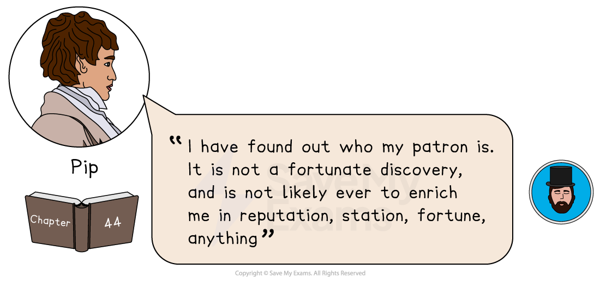

**“I have found out who my patron is. It is not a fortunate discovery, and is not likely ever to enrich me in reputation, station, fortune, anything”** – Pip, Chapter 44

### Meaning and context

- This quote is from Chapter 44 and is said by Pip to Miss Havisham at Satis House

### Analysis

- This quote indicates the devastation that Pip feels when he discovers that Magwitch is his benefactor
- This renders his social status *untenable* in the eyes of the upper class
- However, once he realises that his elevated rank as a gentleman is based on the riches of a former convict, Pip is able to finally regain the moral values he held as a child

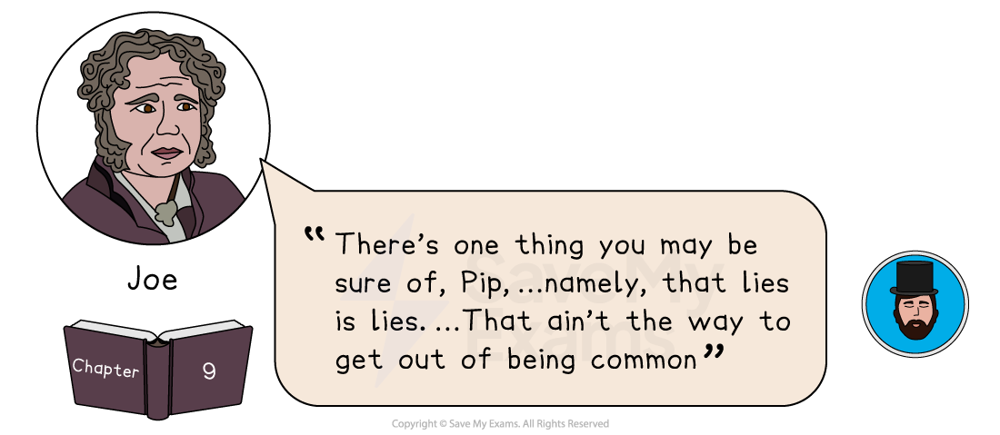

**“There’s one thing you may be sure of, Pip, …namely, that lies is lies. …That ain’t the way to get out of being common” **– Joe Gargery, Chapter 9

**“There’s one thing you may be sure of, Pip, …namely, that lies is lies, …That ain’t the way to get out of being common”** – Joe, Chapter 9

### Meaning and context

- This quote appears in Chapter 9 and is said by Joe to Pip, after Pip has confessed that he lied about what happened at Satis House

### Analysis

- This quote conveys Joe’s qualities as a simple, honest and virtuous character
- The quote illustrates how Joe becomes the moral benchmark for Pip and for all of the other characters in the novel

#### Sources

Dickens, Charles. (2008). Great Expectations. Oxford.
