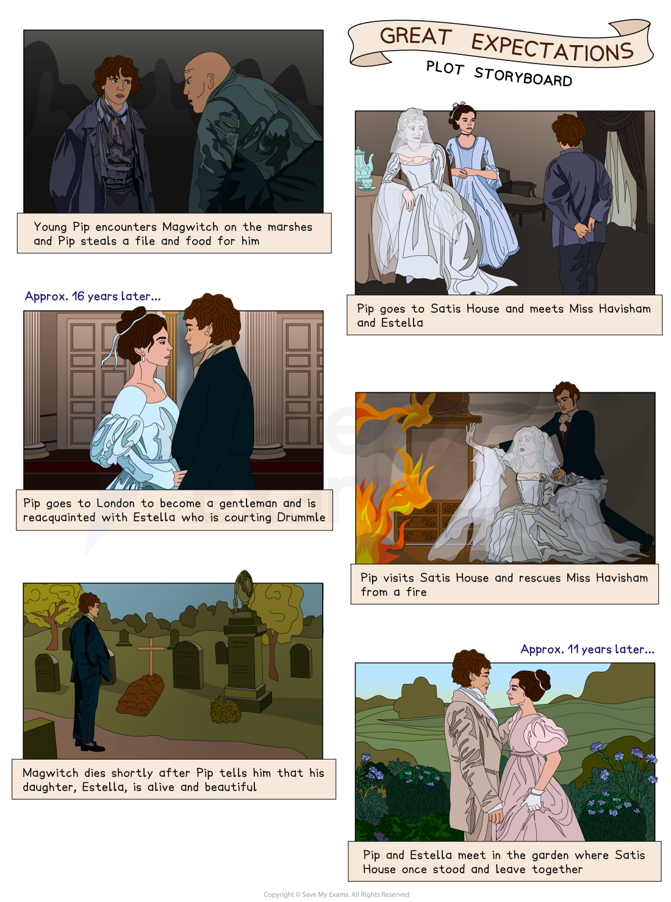

# Great Expectations: Plot Summary

## Great Expectations: Plot Summary

> **Spec point** — `spcpt_SJrWpBTYxtbFXJKQ`

## Plot Summary

One of the most vital and helpful things you can do in preparation for the exam is to ‘know’ the plot of Great Expectations thoroughly. Once you know the text well, you should be comfortable and familiar with key events that you can then link to larger ideas. Having an in-depth knowledge and understanding of the text will help you to gain confidence to find the most relevant references to support your response.

Below you will find:

- **a storyboard of the plot**
- **a general overview of the whole novel**
- **detailed summaries by chapter**

> **Exam Hint**
> Examiners note that answers do best when the plot is used to reach evidence rather than recounted, and this novel is long enough that **selection** matters more than coverage.
> 
> For example, you could write: “Dickens has Pip receive his fortune before he learns where it came from, so the reader watches him build a life on a mistake”. Explaining that a character builds a life on a mistake is a point about how Dickens has ordered the novel, not a retelling of it.

## Great Expectations: Plot summary: Plot storyboard

> **Spec point** — `spcpt_HRqgr7jwCwdCh4Nh`

## Great Expectations: Plot storyboard

*Great Expectations plot storyboard*

## Great Expectations: Plot summary: Overview of Great Expectations

> **Spec point** — `spcpt_gqMpFd84ds9s8W5B`

## Overview of Great Expectations

Pip Pirrip lives in the marshlands with his sister and his brother-in-law Joe Gargery, who works as a blacksmith in the village. During a visit to the graveyard where his parents and siblings are buried, Pip encounters a convict who has escaped from prison. He demands Pip to get a file and food and Pip reluctantly steals the items from Joe’s forge. Despite the eventual recapture of the convict, Pip remains haunted by both the convict and the role he played in deceiving Joe and his sister. As Pip grows older, he is invited by Miss Havisham to play with her adopted ward, Estella. Despite Estella treating Pip poorly, he falls in love with her due to her beauty and self-confidence. Although Pip had initially planned to become an apprentice in Joe's forge, after his acquaintance with Estella and the way she despises his lowly origins, he becomes ashamed of himself and aspires to become a gentleman.

Pip's sister, Mrs Joe, is viciously attacked and while Pip suspects a labourer, Orlick, of the crime, he has no evidence. In order to take care of Mrs Joe, Pip's former teacher, Biddy, moves into Joe's home. Fate takes an incredible turn when Mr Jaggers, a lawyer, informs Pip that he has 'great expectations' and must leave the marshes to embark on the life of a gentleman. Believing that the source of his wealth is Miss Havisham, Pip leaves Joe and Biddy and sets out for London.

Pip settles into lodgings in London with Herbert Pocket and under Herbert’s father's guidance, he gradually adopts the etiquette of a gentleman. However, Pip becomes overtly extravagant and snobbish and he becomes particularly embarrassed by a visit from Joe. Despite his enduring affection for Estella, he is distressed by Estella's growing closeness to a young aristocrat, Bentley Drummle. Shortly after turning twenty-three, Pip is visited by a man whom he recognises as the convict he helped when he was a young boy. The man, known as Magwitch, reveals that he has prospered since being transported to Australia and that he is Pip's secret benefactor.

Pip is shocked and ashamed to discover that his wealth originates from a transported convict rather than the refined Miss Havisham, a revelation that forces him to confront his prejudices and misplaced values. Furthermore, he learns that there was no plan for him to marry Estella and that she has instead married Drummle. Although Pip initially despises the convict's crude behaviour, he begins to empathise with Magwitch's unfortunate past, especially after realising how he was framed by another criminal named Compeyson. Pip therefore decides to prevent Magwitch from being punished for his return to England from Australia. With the aid of Herbert, Pip devises a plan to transport Magwitch via a rowboat down the River Thames and onto a vessel headed for Hamburg, in Germany. Lured to a remote house by a threatening letter, Pip is seized by Orlick, who intends to kill him. He is rescued just in time by Herbert and others, who track him down. Pip's efforts prove futile as the authorities apprehend Magwitch following a fight that results in the death of Compeyson. Subsequently, Magwitch tragically passes away in prison, deeply loved by the Pip who had once despised him.

Pip falls seriously ill and is nursed back to health by Joe. He returns to the marshes to ask for Joe’s forgiveness for his ingratitude and to propose to Biddy, only to discover that she is already married to Joe, who remarried after the death of Mrs Joe. Pip goes abroad to work for his friend Herbert for eleven years before returning to England to find Joe and Biddy with two young children. He visits Miss Havisham's old house and discovers that it has been destroyed. He finds Estella in the garden where Satis House once stood, and the two walk away together, suggesting a renewed understanding and the possibility of reconciliation.

## Great Expectations: Plot summary: Chapter-by-chapter plot summary

> **Spec point** — `spcpt_W2XQKJtJjMCJsJcr`

## Great Expectations: Chapter-by-chapter plot summary

### Volume I: Chapters 1-19

- Pip Pirrip, a young orphan living with his sister, Mrs Joe, and her husband, Joe Gargery, in Kent, encounters an escaped prisoner on Christmas Eve in 1812
- The prisoner demands that Pip bring him food and a file, threatening him with harm if he does not comply
- In an attempt to appease the convict, Pip steals a file from Joe's tools and food and brandy from his house, which he delivers to the convict
- Later on, Pip and Joe assist soldiers in capturing another escaped convict who is fighting with the unnamed convict Pip had encountered
- The latter confesses to stealing the food and file, *exonerating* Pip from any wrongdoing
- Several years later, a reclusive spinster named Miss Havisham enlists the help of Mr Pumblechook to find a young boy to pay her a visit
- After being chosen and visiting Miss Havisham's property, Pip becomes *enamoured* with her adopted daughter, Estella
- During one of his visits, Pip fights with another young boy, earning the admiration of Estella, who permits Pip to kiss her as a reward
- Pip continues to visit Miss Havisham regularly until he reaches an age where he must seek a trade
- During one of his visits, Miss Havisham gives Pip money to acquire a blacksmithing apprenticeship
- However, Dolge Orlick, Joe's assistant, harbours animosity** **towards Pip and despises Mrs Joe
- When Pip and Joe are away, Mrs Joe is viciously assaulted, causing her to become an invalid and unable to speak
- To assist with her care, Biddy, Pip’s former teacher, comes to live with them
- Four years after Pip began his apprenticeship, he is informed by Mr Jaggers, a lawyer, that he has an anonymous benefactor and that he is to become a gentleman
- Shortly before heading to London and presuming that Miss Havisham is responsible for the money, Pip pays her a visit

### Volume II: Chapters 20-39

- Jaggers accompanies Pip to London, where he meets Herbert Pocket
- Pip realises that Herbert is the same boy he had fought with at Satis House years ago
- During their time together, Herbert reveals to Pip the unfortunate events surrounding Miss Havisham's former fiance
- Joe comes to visit Pip and brings a message from Miss Havisham about Estella's upcoming visit
- Pip goes back to see Estella and receives encouragement from Miss Havisham, but grows uneasy upon seeing Orlick working for her
- Pip reveals to Herbert to having feelings for Estella, while Herbert is engaged to Clara
- Estella is sent to Richmond to enter society, while Pip and Herbert *accumulate*** **debts
- Pip returns to the marshes to attend Mrs Joe's funeral
- With the help of Wemmick, Pip plans to secure Herbert a position with Clarriker's, a shipping merchant’s
- During a visit to Satis House with Estella, a quarrel begins between Estella and Miss Havisham
- Pip is incensed when Drummle proposes a toast to Estella and later warns her about Drummle
- On Pip's 23rd birthday, he discovers that Abel Magwitch, a convict transported to New South Wales, Australia, is his benefactor and has amassed a fortune
- Though Magwitch has been ordered not to return to England on pain of death, he decided that he must visit Pip

### Volume III: Chapters 40-59

- Pip resolves not to use Magwitch’s wealth for himself but accepts Miss Havisham’s help to secure Herbert’s career and devises a plan with Herbert to help Magwitch flee the country
- During their time together, Magwitch tells Pip about his painful past and reveals that the escaped convict Pip once encountered was Compeyson, the fraudster who had left Miss Havisham
- Pip pays a visit to Estella at Satis House but is met with disappointment when she tells him about her plans to marry Drummle
- He leaves heartbroken and Wemmick warns him that Compeyson is looking for him
- Miss Havisham tells Pip how she raised Estella to be unfeeling and heartless, and gives Pip money to pay for Herbert's position at Clarriker's
- As Pip is about to leave, Miss Havisham's dress catches fire and Pip injures himself in an unsuccessful attempt to save her
- Realising that Estella is Magwitch’s daughter, Pip is discouraged by Jaggers from acting on his suspicions
- Pip is tricked by an anonymous letter into going near his old home, where he is seized by Orlick, though Herbert saves him
- Magwitch is picked up by a police boat carrying Compeyson, who offers to identify Magwitch but Magwitch seizes the opportunity and fights with him in the water
- Magwitch is seriously injured and is *apprehended*** **by the police, while Compeyson's dead body is later recovered
- Pip visits Magwitch, who is dying in the prison hospital, and reveals that his daughter Estella is alive
- Herbert offers Pip a work position abroad, but Pip falls ill and faces arrest for debt
- Joe nurses Pip back to health and pays off the debt
- Pip returns to the marshes to propose to Biddy, but finds she has married Joe
- Pip apologises to Joe and Biddy for his behaviour and leaves for Cairo, where he moves in with Herbert and Clara
- After working eleven years in Egypt, Pip returns to England and visits Joe, Biddy and their children
- He meets Estella, now widowed after the death of Drummle, in the ruins of Satis House who asks him to forgive her
- The two of them leave the garden together, hand in hand

#### Sources

Dickens, Charles. (2008). Great Expectations. Oxford.
