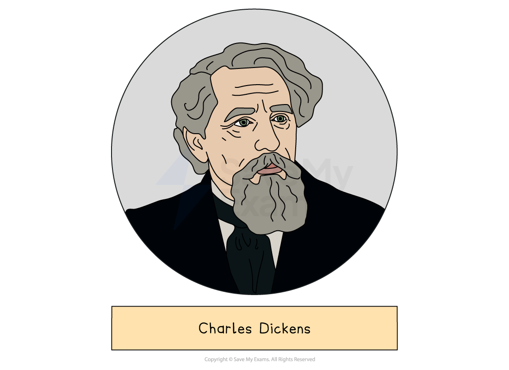
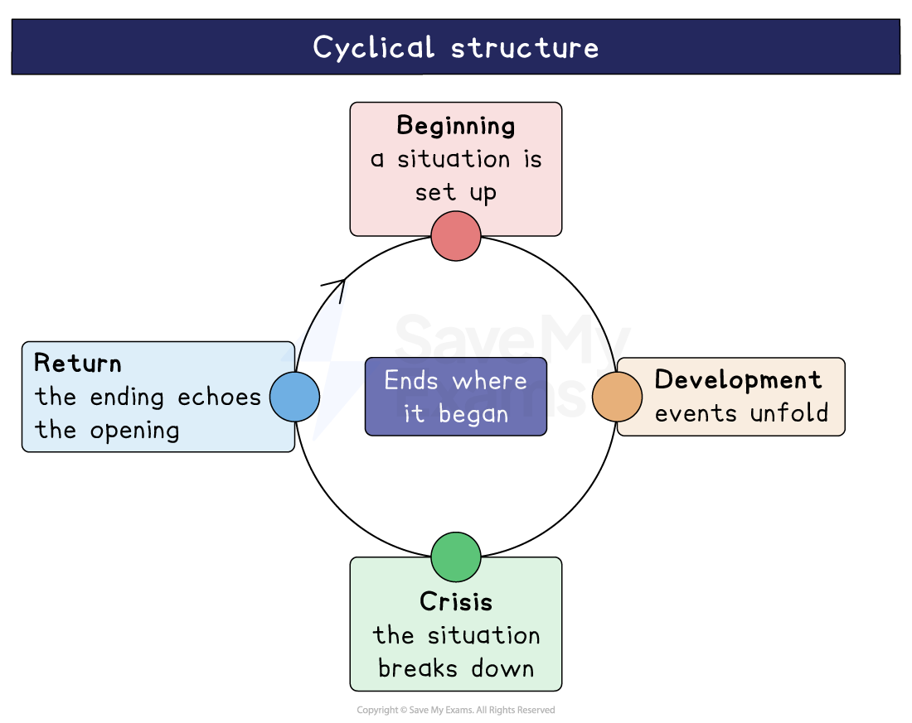

# Great Expectations: Writer's Methods and Techniques

## Great Expectations: Writer’s Methods and Techniques

> **Spec point** — `spcpt_g9Nw3ndgz3Br4BRy`

## Writer’s Methods and Techniques

‘Methods’ is an umbrella term for anything the writer does on purpose to create meaning. Using the writer’s name in your response will help you to think about the text as a conscious construct and will keep reminding you that Dickens purposely put the text together.

> **Exam Hint**
> Examiners warn against naming a technique and leaving it. The most rewarding method here is the **narration**, because an older Pip is judging his younger self throughout.
> 
> For example, you could write: “Dickens has the older Pip condemn his own ‘coarse and common’ thinking, so the reader hears the judgement before they see the change”. Saying what an older narrator’s judgement does to the reader is what turns naming into analysis.

## Great Expectations: Writer's methods and techniques: Form and structure

> **Spec point** — `spcpt_BN9JstNfb3jFh4Ps`

## Form and structure

- Great Expectations is a novel composed of 59 chapters
- It* *was first published in 1861, though the novel is set around 1810
- It is divided into three volumes of approximately equal length
- Each volume depicts the different stages in Pip’s development as a character:

  - In the first volume, the emphasis is on Pip’s childhood in the countryside of the marshes and his gradual rejection of this world
  - In the second volume, we witness Pip in the city of London and his growing dissatisfaction and disillusionment
  - In the third volume, Pip returns to the marshes, abandons his false expectations and begins to re-accept himself
- The novel was initially released in weekly instalments and as Dickens had to write a particular number of words for each instalment, it lacks the conventional structure of a novel:

  - As opposed to building up to a central [climax](https://www.savemyexams.com/glossary/gcse/english-language/climax-definition/), the plot has many mini-resolutions throughout the narrative
- The novel belongs to the genre of [Bildungsroman](https://www.savemyexams.com/glossary/gcse/english-literature/bildungsroman-definition/), which depicts the progression and maturation of the [protagonist](https://www.savemyexams.com/glossary/gcse/english-literature/protagonist-definition/) who develops both morally and psychologically
- Beneath the surface of 19th-century realism, the structure draws heavily on the conventional [motifs](https://www.savemyexams.com/glossary/gcse/english-literature/motif-definition/) of fairy tales, however Dickens does invert some of these for effect:

  - For example, traditionally the hero concludes his journey rich and successful, though here our hero, Pip, finishes up moderately well-off and the reader is unsure whether he gets to marry his princess (Estella)
  - Similarly, the ‘monster’ Pip meets in the churchyard (Magwitch) turns out to be an endearing character
- The narrative has a circular structure and begins and ends at Joe’s forge
- The opening chapter of the novel has little [exposition](https://www.savemyexams.com/glossary/gcse/english-language/exposition-definition/) and the reader is immediately introduced to the central themes, symbols and plot points that drive the protagonist's actions
- The book is imbued with Gothic elements that are especially prominent during moments of psychological change and turmoil in Pip’s character:

  - For example, the setting of the marsh country graveyard at dusk in Volume I and the character of Magwitch creates an eerie Gothic atmosphere that contrasts with Pip's comic reflections:
  
    - He deduces from the letters on his father's gravestone that his father was likely a “square, stout, dark man, with curly black hair”
  - Further, the description of Miss Havisham is equally haunting and both her and Magwitch, in these opening chapters, appear to resemble the dead
  - The combination of these eerie and humorous elements creates an overall mood of *grotesqueness*

## Great Expectations: Writer's methods and techniques: Parallelisms and repetitions

> **Spec point** — `spcpt_DJSWTtfHmpNKmCrw`

## Parallelisms and repetitions

- Dickens also uses [parallelism](https://www.savemyexams.com/glossary/gcse/english-language/parallelism/) and [repetition](https://www.savemyexams.com/glossary/gcse/english-language/repetition-definition/) of scenes and characters to depict Pip’s development as a character:

  - For example, the first six chapters of volume I parallels and contrasts with the first six chapters of volume III
  - In both of these sections Pip encounters Magwitch: firstly, as a terrified boy on the marshes; the other as a prosperous gentleman in London:
  
    - Dickens deliberately parallels these scenes to illustrate the differences in Pip’s situation and his attitude towards the convict when he meets Magwitch a second time
- In the final chapter of the novel, repetition is also used when Pip discovers Estella in the garden of Satis House which references Pip’s first meeting with Estella as a child:

  - Their reunion could be viewed as a powerful way of [symbolising](https://www.savemyexams.com/glossary/gcse/english-language/symbolism-definition/) their arrival at maturity and their final redemption
- The use of parallelism and repetition serve to create a haunting element which pervades most of the novel

## Great Expectations: Writer's methods and techniques: Narrative

> **Spec point** — `spcpt_MhkdxRGXpBJny4XK`

## Narrative

- The narrator is Mr Philip Pirrip, known throughout the novel as Pip, a moderately successful middle-aged businessman, who is recounting the events of his life many years after they have occurred
- The novel is written in the [first-person](https://www.savemyexams.com/glossary/gcse/english-language/first-person/) and Pip serves as the primary perspective through which the reader experiences the events of the novel:

  - As everything is depicted through his consciousness, the reader is limited by what Pip chooses to recount which adds a level of mystery to the plot
- By narrating in the first-person, Dickens is able to share Pip’s childhood perspective rather than his adult reactions:

  - He is also able to sustain an element of suspense by recounting the events in chronological order
- Dickens addresses the challenge of presenting Pip's limited viewpoint by having the grown-up narrator observe Pip with an objective lens, much like a [third-person](https://www.savemyexams.com/glossary/gcse/english-language/third-person/) narrator would:

  - Dickens ensures that the two Pips are distinguishable by giving the voice of the narrator a mature and insightful perspective but by also carefully portraying Pip's character's emotions and thoughts as they occur:
  
    - For example, when Pip is introduced as a child, the narrator playfully makes fun of his younger self while still allowing readers to see and experience the narrative through the child’s perspective
- As the narrator, Pip endeavours to remain objective when recollecting his past experiences and emotions though this is not always successful:

  - For example, he openly conveys his regrets and self-criticisms when reflecting on how he treated Joe
- While Pip's voice may be distinctive, his narrative voice enables other characters to express themselves in a manner that reveals their individual character traits
- Although Compeyson is the central villain of the novel, he is purposefully only revealed in glimpses, which adds to the mysteriousness of his character
- Throughout the novel, Dickens employs a reflective, regretful, comic and ironic tone:

  - Despite the comedic moments and humour which permeates the narrative, Pip's prevailing tone is somewhat melancholic and there is also a great deal of [pathos](https://www.savemyexams.com/glossary/gcse/english-literature/pathos-definition/):
  
    - For example, the death of Magwitch evokes great sadness and sympathy from the reader
- Dickens depicts a dramatic scene where the convict Magwitch emerges from the graves, and his encounter with Pip is mostly conveyed through dialogue and descriptions of character movement:

  - Through a combination of storytelling and dramatic presentation, Dickens [alludes](https://www.savemyexams.com/glossary/gcse/english-language/allusion-definition/) to the reader that Pip's imaginative mind occasionally blurs the lines between reality and imagination
- Dickens frequently employs [caricatures](https://www.savemyexams.com/glossary/gcse/english-language/caricature-definition/) in the novel to emphasise a moral point or theme that he wishes to communicate to the reader:

  - Such characters are often portrayed in a [satirical](https://www.savemyexams.com/glossary/gcse/english-language/satire/) and derisive manner in order to highlight their moral deficiencies, for example, Mrs Joe and Pumblechook:
  
    - As well as providing moral instruction, both of these characters also contribute to the comedic aspect of the narrative

## Great Expectations: Writer's methods and techniques: Imagery and symbolism

> **Spec point** — `spcpt_c4Nym3zpn2Ft9Q53`

## Imagery and symbolism

- The marsh is associated with crime and guilt and is [symbolic](https://www.savemyexams.com/glossary/gcse/english-language/symbol/) of the inescapability of the moral corruption that plagues Pip
- The first description of Miss Havisham is continually associated with [imagery](https://www.savemyexams.com/glossary/gcse/english-language/imagery-definition/) of decay and death:

  - Dickens uses this as a [metaphor](https://www.savemyexams.com/glossary/gcse/english-language/metaphor-definition/) for her life and the effect she has on others
  - Further, the imagery of a card game can be seen as a metaphor for Miss Havisham’s treatment of the lives of others and is used to highlight her emotional corruption
  - The abandoned brewery, decaying barrels, as well as the overgrown garden, all contribute to the sense of decay that Satis House symbolises
- The [symbolism](https://www.savemyexams.com/glossary/gcse/english-language/symbolism-definition/) of the fire and forge represent life-giving forces that are in sharp contrast to the defunct brewery and the sterility of Satis House:

  - In the end the fire destroys Satis House and ultimately leads to Miss Havisham's death
- The fire incident also serves to [symbolise](https://www.savemyexams.com/glossary/gcse/english-language/symbol/) the moral purification of Miss Havisham’s character:

  - It destroys her bridal dress which symbolises her imprisonment
  - The fire also represents a significant turning point for her as a character, for it enables her to request forgiveness from Pip

#### Sources

Dickens, Charles. (2008). Great Expectations. Oxford.
