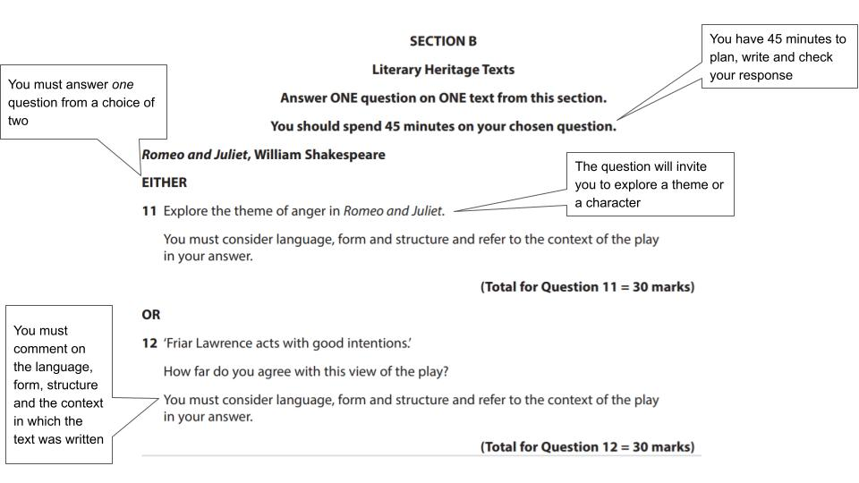

# How to Approach the Literary Heritage Question

## Literary Heritage: How to approach the Literary Heritage question

> **Spec point** — `spcpt_R2RPNBn9vGk7VjPr`

## How to Approach the Literary Heritage Question

In Component 2, Section B of your Edexcel IGCSE English Literature exam (4ET1/01), you will answer a 30-mark essay question analysing the ways in which writers use language, form and structure to create effects. You should also understand the relationship between your text and the context in which it was written.

You have a choice from six texts:

| Romeo and Juliet by William Shakespeare | Pride and Prejudice by Jane Austen |
|---|---|
| Macbeth by William Shakespeare | Great Expectations by Charles Dickens |
| The Merchant of Venice by William Shakespeare | The Scarlet Letter by Nathaniel Hawthorne |

You can approach the question in Section B with confidence by learning more about the exam question:

- **Section B: Literary Heritage question overview**
- **Understanding the exam question**
- **Understanding the Assessment Objectives**
- **Top grade tips for a Grade 9**

## Literary Heritage: Section B: Question overview

> **Spec point** — `spcpt_55PV9Bj97GtjBHgG`

## Section B: Literary Heritage question overview

In Section B you will answer one question from a choice of two on your chosen literary heritage text. Here is an overview:

| **Exam question** | Literary heritage question |
|---|---|
| **Time that you should spend on the question** | 45 minutes |
| **Number of marks** | 30 marks |
| **How much you should write** | Approx. 3-4 paragraphs |

This is an open-book examination. This means you are allowed to bring a clean and unannotated copy of the text into the examination.

## Literary Heritage: Understanding the exam question

> **Spec point** — `spcpt_TjZrHHgxgSwgBbny`

## Understanding the exam question

Below are some recent examples of exam questions from <u>[Edexcel IGCSE English Literature past papers (4ET1/01)](https://www.savemyexams.com/igcse/english-literature/edexcel/-/pages/past-papers/)</u>.

Look at the wording of the questions and the question structure and themes. Are there any exam questions that you might struggle to answer?

| **IGCSE Edexcel English Literature Literary Heritage questions June 2023** |   |   |   |   |   |
|---|---|---|---|---|---|
| **Romeo and Juliet** | **Macbeth** | **The Merchant of Venice** | **Pride and Prejudice** | **Great Expectations ** | **The Scarlet Letter** |
| Explore the theme of anger in Romeo and Juliet. | In what ways are the Witches important in Macbeth? | ‘Shylock lacks any power throughout the play.’ How far do you agree with this view? | Explore the theme of prejudice in the novel. | ‘Estella is presented as a victim in the novel.’ How far do you agree with this view? | Discuss the theme of female independence in The Scarlet Letter. |
| OR | OR | OR | OR | OR | OR |
| ‘Friar Lawrence acts with good intentions.’ How far do you agree with this view of the play? | Explore the theme of ambition in the play. | Explore the significance of marriage in The Merchant of Venice. | In what ways is Jane Bennet presented as a character who always sees the best in people in Pride and Prejudice? | Explore the theme of kindness in Great Expectations. | ‘Arthur Dimmesdale is presented as cowardly in the novel.’ How far do you agree with this view? |

When approaching Section B, it is important to consider the quotation that you may have been given at the beginning of the question. It should give you a starting point for your answer.

You can significantly improve your exam performance by paying close attention to the question and understanding it thoroughly. Underlining the key words of the question can also help.

*Section B Literary Heritage question breakdown*

## Literary Heritage: Understanding the assessment objectives

> **Spec point** — `spcpt_prDqYPJ5Vw54kv87`

## Understanding the Assessment Objectives

In Section B, there are three assessment objectives which are all equally weighted:

| ** **  **AO1** | Demonstrate a close knowledge and understanding of texts, maintaining a critical style and presenting an informed personal engagement |
|---|---|
| ** **  **AO2** | Analyse the language, form and structure used by a writer to create meanings and effects |
| **AO4** | Show understanding of the relationships between texts and the contexts in which they were written |

> **Exam Hint**
> If you are studying a Shakespeare play for Component 2, ensure you understand the differences between the terms **prose, verse and blank verse** in your response. These are not interchangeable concepts so it will help you to distinguish between these terms:
> 
> - **Prose** is unrhymed lines with no pattern or rhythm. For example, in Macbeth, Shakespeare choses to have Lady Macbeth speak in prose once she has become insane
> - Rhymed **verse** consists of sets of rhyming couplets: two successive lines that rhyme with each other at the end of the line. For example, in Macbeth, the witches speak in rhyming couplets
> - **Blank verse**, also known as unrhymed **iambic pentameter**, consists of unrhymed lines of ten syllables, in pairs of unstressed and stressed syllables. For example in Macbeth: “So foul and fair a day I have not seen”. It is the form used the most by Shakespeare

## Literary Heritage: Top tips for a grade 9

> **Spec point** — `spcpt_Rvyn52SYHcKkw6Ds`

## Top grade tips for a Grade 9

- Keep in mind the assessment objectives for each section:

  - For Section B this is AO1, AO2 and AO4
- A brief introduction and conclusion can help to ensure that your response is focused on the question:

  - Ensure you are answering the question, rather than what you think is being asked
- If there is a quotation in the question, you can use this as the starting point for your answer and ensure you refer to it in every paragraph
- If you are presented with a question which asks “How far do you agree … ” you are free to agree or disagree, wholly or in part, with the view presented
- Always try to offer a personal response to the question posed rather than simply repeating pre-prepared material:

  - You are required to show personal engagement for AO1 by offering your own individual thoughts on relevant ideas
- Carefully select quotations which fully support the point being made are key:

  - Precise quotations, such as a word or a phrase, are more likely to support your analysis
  - Finding examples from across the text can help you develop your ideas
- The most successful responses integrate references to context throughout:

  - Use context (AO4) to support and develop your points for AO1 and AO2

Find out more about how you can write a [Grade 9 Literary Heritage answer](https://www.savemyexams.com/igcse/english-literature/edexcel/16/revision-notes/literary-heritage/how-to-answer-the-literary-heritage-question/how-to-write-a-grade-9-literary-heritage-essay/).
