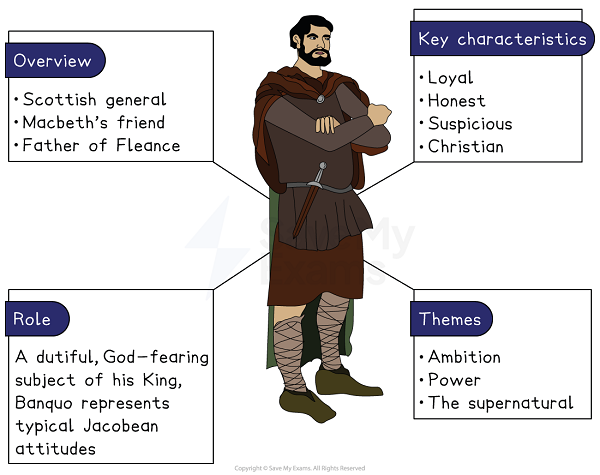
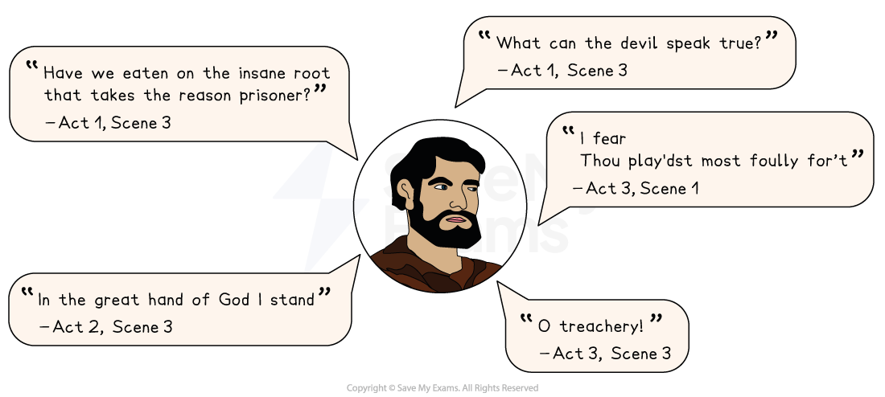

# Banquo Character Analysis

## Macbeth: Banquo Character Analysis: Banquo character summary

> **Spec point** — `spcpt_MkWNRznvYqs2VqJd`

## Banquo character analysis

Banquo represents loyalty, honesty and typical Christian values, all characteristics that Macbeth fails to display.

## Banquo character summary

*Banquo character summary*

## Macbeth: Banquo Character Analysis: Why is Banquo important?

> **Spec point** — `spcpt_6QFj5n9MMSnHYmt9`

## Why is Banquo important?

Shakespeare uses Banquo as a *foil*, to provide a contrast to the character of Macbeth. Banquo represents many things that Macbeth is not:

- **Trusting**: At the beginning of the play, he refers to Macbeth as “my noble partner”, although later he suspects that Macbeth may have become king through evil means
- **Dutiful**: He is always shown to be faithful towards his king and kingdom, and publicly criticises the “treasonous malice” of Duncan’s regicide
- **Sceptical**: Banquo distrusts the witches and their prophecies because, as a faithful Christian, he believes them to be evil

Later in the play, Banquo returns as a ghost. Banquo’s ghost is only visible to Macbeth and seems [symbolic](https://www.savemyexams.com/glossary/gcse/english-language/symbolism-definition/) of Macbeth’s guilt.

For more on how Shakespeare presents the character of Banquo, see our video below:

> **Exam Hint**
> Questions on less prominent characters are usually really questions about someone else, so the most useful thing to explain is what Banquo shows us about **Macbeth**. Examiners reward answers that treat a character as a **choice** the writer has made, rather than working through their scenes in order.
> 
> For example, you could write: “Banquo hears the same prophecy as Macbeth but does nothing about it, so Macbeth’s crimes look like his own decisions rather than fate”. Putting one character beside another is what lets you argue that a choice was made rather than forced.

## Macbeth: Banquo Character Analysis: Banquo's use of language

> **Spec point** — `spcpt_DrbVD8vjgvMzGZY8`

## Banquo’s use of language

Shakespeare uses a range of techniques to compare Banquo’s speech with other characters:

- **Straightforward language:** He speaks plainly throughout the play, unlike Macbeth and Lady Macbeth: he earnestly supports his king and the established order and calls on his Christian beliefs frequently to show his honesty and integrity
- <u>[Iambic pentameter](https://www.savemyexams.com/glossary/gcse/english-literature/iambic-pentameter-definition/)</u>**: **This shows he is a nobleman, while Macbeth’s speech is interspersed with [prose](https://www.savemyexams.com/glossary/gcse/english-language/prose-definition/) or [rhyming couplets](https://www.savemyexams.com/glossary/gcse/english-language/rhyming-couplet/) to show his relative lack of virtue and the increasing corruption of his noble nature
- <u>[Soliloquies](https://www.savemyexams.com/glossary/gcse/english-literature/soliloquy-definition/)</u>** and asides: **Shakespeare reveals his integrity and moral clarity through his speeches. They reflect his concern that Macbeth has been deceived by the witches’ prophecies and may have killed Duncan as a result

### Banquo key quotes

*Banquo key quotes*

## Macbeth: Banquo Character Analysis: Banquo character development

> **Spec point** — `spcpt_whR9CT9bHXQMNBqC`

## Banquo character development

| **Act 1, Scene 3** | **Act 2, Scene 1** | **Act 3, Scene 1** | **Act 3, Scene 3** |
|---|---|---|---|
| **Banquo questions the prophecies: **Although formidable allies on and off the battlefield, Macbeth and Banquo perceive the witches’ prophecies differently, with Banquo urging Macbeth to “reason”. | **Banquo’s declares his faith: **After Duncan’s murder, Banquo publicly declares his loyalty to Duncan and his faith in God (and God’s choice of king). | **Banquo reveals his suspicions: **In a [soliloquy](https://www.savemyexams.com/glossary/gcse/english-literature/soliloquy-definition/), Banquo shares his fears that Macbeth’s claim to the throne was achieved by “foul” means. | **Macbeth’s betrayal: **  Banquo’s noble and trusting nature means that he is still surprised by the treachery of Macbeth — who has planned to murder him and his son Fleance. |

For more on how Shakespeare presents the character of Banquo, check out our video:

## Macbeth: Banquo Character Analysis: Banquo character interpretation

> **Spec point** — `spcpt_MhN9tbZqRtPZX3dZ`

## Banquo character interpretation

### Flattering King James

William Shakespeare’s play Macbeth is loosely based on real events in Scotland in the early 11th century. James I — the king of Scotland and also the king of England at the time Macbeth was written and performed — believed himself to be the descendant of a historical figure called “Banquo”, and so Banquo’s [characterisation](https://www.savemyexams.com/glossary/gcse/english-literature/characterisation-definition/) can be seen as Shakespeare flattering his new royal sponsor.

### Embodying Jacobean values

Shakespeare’s portrayal of Banquo becomes all the more significant when we learn that — according to histories of early medieval Scotland — Banquo is named as one of the co-conspirators (with Macbeth) in King Duncan’s murder.

However, in Shakespeare’s version, Banquo shows restraint, and is noble, Christian and dutiful: all the qualities you would want for the forefather of a line of kings, a line that will culminate in James I himself.

#### Sources

Stanley Wells and Gary Taylor (eds), 2005, The Oxford Shakespeare: The Complete Works (Second Edition), Oxford University Press
