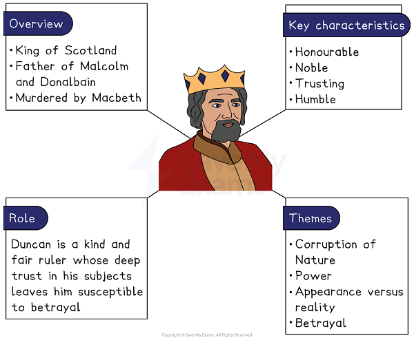
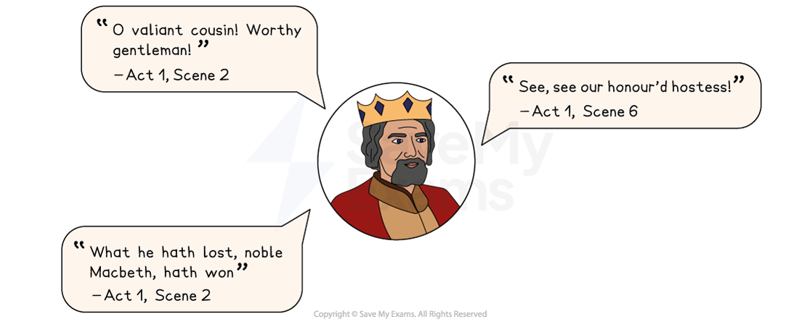

# Duncan Character Analysis

## Duncan character analysis

Duncan is the rightful King of Scotland, a noble and respected character who is murdered by Macbeth for his throne.

## Macbeth: Duncan Character Analysis: Duncan character summary

> **Spec point** — `spcpt_jms2m4Y68XCwZdpz`

## Duncan character summary

*Duncan character summary*

## Macbeth: Duncan Character Analysis: Why is Duncan important?

> **Spec point** — `spcpt_x8SHZqD2xt3yMgtJ`

## Why is Duncan important?

Although Duncan makes relatively few appearances in the play (he speaks only in Act 1 and is dead by the middle of Act 2) he remains “the gracious Duncan” to characters like Lennox, who want to justify rebellion against Macbeth.

Duncan is depicted as:

- **Honourable **and **noble**: Duncan exudes an aura of sanctity and honour as evident in lines such as “justice had, with valour armed / compelled these skipping kerns to trust their heels” and “signs of nobleness”. This reinforces the idea that any rebellion against him is an unholy act
- **Trusting**: Duncan’s misplaced trust in the former Thane of Cawdor and his subsequent disappointment presents him as a character who expects loyalty and support from his subjects. He ultimately makes an error in trusting both Thanes of Cawdor (who betray him), while his commendation of the Macbeths’ “pleasant” castle and of his “fair and noble” hostess make him appear somewhat naive
- **Humble:** despite his royal status, Duncan is gracious and humble as evident through his language and actions. He often expresses gratitude and admiration to other characters, for example, when he praises Banquo and Macbeth for their bravery on the battlefield
- A **rightful, legitimate king**: in contrast to Macbeth, Duncan is an image of legitimacy. His rule is founded on natural order and divine right which reinforces his role as a [symbol](https://www.savemyexams.com/glossary/gcse/english-language/symbol/) of moral governance

> **Exam Hint**
> Duncan is on stage briefly, so examiners reward answers that explain what his **presence** does rather than listing his actions. He matters most for the standard he sets that Macbeth then fails.
> 
> For example, you could write: “Shakespeare has Duncan speak warmly of loyalty just before he is killed, so his trust makes the murder feel worse to the audience”. Explaining what a short appearance leaves the audience feeling is stronger than listing what the character does in it.

## Macbeth: Duncan Character Analysis: Duncan's use of language

> **Spec point** — `spcpt_2F7w7VYytZ63fTtv`

## Duncan’s use of language

The language Shakespeare uses for Duncan — elevated [iambic pentameter](https://www.savemyexams.com/glossary/gcse/english-literature/iambic-pentameter-definition/) and poetic [imagery](https://www.savemyexams.com/glossary/gcse/english-language/imagery-definition/) — reflects his character as a benevolent and noble ruler.

- Iambic pentameter** **and **elevated diction: **Duncan speaks in iambic pentameter which gives his dialogue a formal and regal quality. In Shakespeare, this is typical of a noble or important character and conveys his high status. His language is marked by elevated and noble vocabulary which aligns him with the virtues of a rightful monarch
- **Superlatives **and **exclamatory phrases: **Duncan uses frequent expressions of praise and admiration which reflect his trusting nature. However, this also reveals his inability to perceive treachery around him, making his death more tragic. For example he uses superlatives and exclamatory phrases to convey his respect for Macbeth and Banquo: “O worthiest cousin!” and “Welcome hither”
- **Poetic imagery:** Duncan’s language often uses natural imagery and [figurative language](https://www.savemyexams.com/glossary/gcse/english-literature/figurative-language-definition/), such as “signs of nobleness, like stars, shall shine” which [symbolises](https://www.savemyexams.com/glossary/gcse/english-language/symbolism-definition/) his harmony with nature and the natural order, linking his character to a rightful and moral kingship
- [Dramatic irony](https://www.savemyexams.com/glossary/gcse/english-literature/dramatic-irony-definition/): while Duncan’s formality signifies his role as a regal figure in Scotland, it also reveals his vulnerability as his trust in others, particularly in Macbeth, leads to his downfall. His language betrays his naivety and illustrates how little control he has over the play’s unfolding ironies

### Duncan key quotes

*Duncan key quotes*

## Macbeth: Duncan Character Analysis: Duncan character development

> **Spec point** — `spcpt_dVnDwSJgS3Dkxk9q`

## Duncan character development

| **Act 1, Scene 2** | **Act 1, Scene 4** | **Act 1, Scene 6** | **Act 2, Scene 3** |
|---|---|---|---|
| **Duncan hears of Macbeth’s bravery:**  Duncan’s praise of Macbeth’s bravery establishes him as a generous and trusting king, who values loyalty and service.  His admiration for Macbeth reinforces Duncan’s position as a noble ruler, while also setting up the [dramatic irony](https://www.savemyexams.com/glossary/gcse/english-literature/dramatic-irony-definition/) of Macbeth’s eventual betrayal. | **Duncan names his heir:**  When he names his son Malcolm as his successor, Duncan  conveys his legitimate authority and moral leadership, while also [foreshadowing](https://www.savemyexams.com/glossary/gcse/english-language/foreshadowing-definition/) Macbeth’s disturbance of the natural order. | **Duncan’s arrival at Macbeth’s castle:**  Duncan’s gracious words and trust in his hosts highlight both his virtuousness but also his naivety. Dramatic irony is used to contrast Duncan’s unsuspecting nature with the murderous intentions of Macbeth and Lady Macbeth. | **Discovery of Duncan’s murder: **Although conducted offstage, Duncan’s murder symbolises the chaos and horror that will pervade the rest of the play, leading to Macbeth’s downfall and the restoration of the natural order. |

## Macbeth: Duncan Character Analysis: Duncan character interpretation

> **Spec point** — `spcpt_FszdVjSzgQXHqsc3`

## Duncan character interpretation

### The Divine Right of Kings

A contemporary audience would have been aware of the Divine Right theories of kingship, and so would associate assassination and treason to the destruction of God’s order. However, succession, legitimacy and Divine Right were also highly contentious concepts in Scotland and England during this era. Therefore, Duncan’s language of divine authority, like that used by James I, could be interpreted as masking a deep fear of rebellion.

### A vulnerable monarch

As a character, Duncan is usually portrayed as quite elderly. For example, Lady Macbeth states “Had he not resembled / My father as he slept, I had done’t”, and refers to him as “the old man” in her sleepwalking scene. As such, he represents old age, innocence and holiness and so the reaction of the audience to his “most sacrilegious murder” is therefore one of particular horror.

#### Sources

Stanley Wells and Gary Taylor (eds), 2005, The Oxford Shakespeare: The Complete Works (Second Edition), Oxford University Press
