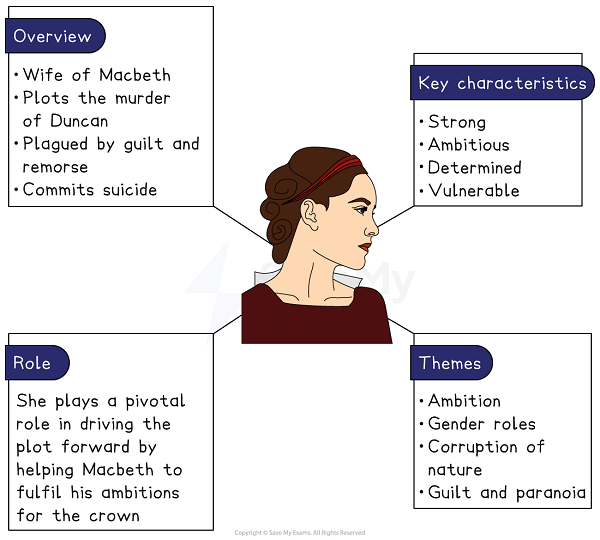

# Macbeth Key Character Profile: Lady Macbeth

## Macbeth Key Character Profile: Lady Macbeth

> **Spec point** — `spcpt_99YWqvHzzHFCKt57`

## Macbeth Key Character Profile: Lady Macbeth

*Lady Macbeth character summary*

Understanding Lady Macbeth and, crucially, what themes Shakespeare uses her character to explore is vital to understanding Macbeth as a play. Even in her absence from the stage she remains a crucial character to the plot of the play and influences how the other characters — particularly Macbeth — act.

In this detailed character profile you will find analysis of how Shakespeare uses the character of Lady Macbeth across his text to explore the following themes:

- **Ambition**
- **Jacobean gender roles**
- **Corruption of nature**

This page also includes advice on how to answer an exam question on Lady Macbeth.

> **Exam Hint**
> Examiners repeatedly ask for more **balance** in answers on Lady Macbeth, because responses that treat her as simply evil tend to miss what Shakespeare is doing — and any nuance you offer has to be rooted in what she actually says. Her language is heavily **metaphorical**, and it is often taken too literally.
> 
> For example, you could write: “When Lady Macbeth asks the spirits to ‘unsex me here’, she is not rejecting her womanhood so much as recognising that the power she wants is not available to a woman in her world”. Reading her images closely, rather than paraphrasing them, is what makes the difference here.

## Macbeth Key Character Profile: Lady Macbeth: How does Shakespeare present Lady Macbeth?

> **Spec point** — `spcpt_qbG7CHRqghJPvDWw`

## How does Shakespeare present Lady Macbeth?

The best way to understand characters in a Shakespeare play is to explore how they relate to the overarching themes of the play: ambition, gender and the corruption of nature.

### Lady Macbeth and ambition

- Both Lady Macbeth and Macbeth display the fatal flaw of ambition throughout the play:

  - The fatal flaw, or [hamartia](https://www.savemyexams.com/glossary/gcse/english-language/hamartia/), is a common feature of [tragedy](https://www.savemyexams.com/glossary/gcse/english-language/tragedy/)
  - Typically, in a tragedy, this fatal character flaw will result in a character's demise, or death
  - Shakespeare conforms to the conventions of tragedy by having both Macbeth and Lady Macbeth consumed by their hamartia and, ultimately, dying

- It could be argued that Lady Macbeth is even more ambitious than Macbeth:

  - This makes Macbeth a true *tragic hero*: unlike Lady Macbeth, he is at first presented as brave and loyal, and has redeeming qualities
  - It is just his ambition that is his downfall
  - Conversely, Lady Macbeth cannot truly be considered a *tragic hero* because she is not traditionally sympathetic and lacks the stature of a *tragic hero*
  - At the outset of the play, she has no doubts about the plan to murder King Duncan
  - Macbeth, on the other hand, wrestles with his conscience when weighing up whether to commit *regicide*** **and an audience might have more sympathy for Macbeth
- Lady Macbeth’s ambition has dire consequences for her state of mind

  - She is less *bullish* about the murder of Duncan
  - She has lost control of her speech
  - She has lost the ability to control Macbeth, or the people around her
  - She ultimately loses her mind and commits suicide
  - Later in the play (in Act 5, Scene 1), we see that her *resolve* and authority have disappeared
- Her [hubris](https://www.savemyexams.com/glossary/gcse/english-literature/hubris-definition/) (overconfidence) leads her to commit crimes that would have been considered truly shocking to a *Jacobean* audience:

  - This hubris comes with a fall, and she is consumed by guilt and fear of religious consequences

For more on how Shakespeare presents the character of Lady Macbeth, see our video below:

## Macbeth Key Character Profile: Lady Macbeth: Lady Macbeth and Macbeth's relationship: Exploring Jacobean gender roles

> **Spec point** — `spcpt_bFRGqDYJwGb8HTbr`

## Lady Macbeth and Macbeth’s relationship: exploring Jacobean gender roles

- Shakespeare explores ideas about gender roles through the character of Lady Macbeth

  - She is shown to *subvert* the typical characteristics of a woman in that era:
  
    - She is not *subservient* to her husband, or other men, but rather controlling and manipulative
    - She is not presented as loving, or nurturing, or compassionate: she feels no pangs of conscience when planning, or remorse immediately after, the murder of Duncan
  - Therefore, Shakespeare presents the audience with a woman who is thoroughly untypical of *Jacobean* *societal norms*
- It could also be argued that Shakespeare presents a *role reversal* in the traditional *Jacobean* relationship between a husband and a wife:

  - Typically, a man, and especially a husband, would have:
  
    - authority over his wife, but Lady Macbeth seems to have authority over both Macbeth, and even the castle, Dunsinane, that they live in (she calls them “my battlements”)
    - *agency* to act as he pleases, but Lady Macbeth influences, or even manipulates, his actions in the first two acts of the play
  - Interestingly, this *role reversal* incrementally switches back to *societal norms* over the course of the play:
  
    - As the play progresses, Lady Macbeth has less and less authority over her husband
    - Macbeth begins to keep secrets from Lady Macbeth (the assassinations, visiting the witches for a second time) and having increasing *agency*
    - By Act V, he assumes the typical, dominant role of a husband, and Lady Macbeth is reduced to a feeble, powerless wife
  - Shakespeare could be suggesting that because she is a woman, Lady Macbeth is less capable of handling the power that comes with being a king or queen
  - He could also be suggesting that women have less capacity to deal with guilt
  
    - She commits suicide while Macbeth fights bravely until the last
- A **modern audience**, with different attitudes about women's role in society, might respond differently to Lady Macbeth:

  - Her profound love for her husband leads her to evil deeds and she is motivated by her ambition for him, as his “dearest partner of greatness”
  - Rather than being an evil or demonised [caricature](https://www.savemyexams.com/glossary/gcse/english-language/caricature-definition/), the “fiend-like queen” Malcolm describes her as, she clearly has a strong, moral conscience:
  
    - She calls on evil spirits to “stop up… passage to remorse” so that she *can* put aside her moral or emotional feelings about committing *regicide*
    - Later in the play, she is overwhelmed by her feelings of remorse, while Macbeth goes on to commit further murders

## Macbeth Key Character Profile: Lady Macbeth: Lady Macbeth and the corruption of nature

> **Spec point** — `spcpt_8H3d6trFCtPpWKC4`

## Lady Macbeth and the corruption of nature

- Lady Macbeth may also been seen to represent the corruption of the proper, Christian order of things

  - She cannot maintain her authority over Macbeth
  - She cannot handle the consequences of *regicide*, and commits suicide as a result
  - Shakespeare may be presenting a moral message here to his *Jacobean* audience: disrupt the proper Christian order and prepare to face devastating consequences
  - The **Jacobeans** believed in the *Great Chain of Being*, which asserted a rightful *hierarchy* of all things in the universe, as set out by God
  - Kings were above men, and men were above women in this *hierarchy*
  - Because Lady Macbeth both plans to *usurp* the throne, and has the ability to control her husband, a man, she can be seen as disrupting this established order
  - For this she is punished
- Shakespeare could also be comparing Lady Macbeth — as a woman — to the evil influence of the witches:

  - The witches also seek continually to disrupt the natural order of things by manipulating the weather, and human beings
- She is ‘unnatural’, just like the witches are, because of her untypical attributes and dominance over Macbeth:

  - She also is childless, which would have marked her as an unnatural wife in the *Jacobean* era, having lost a child

## Macbeth Key Character Profile: Lady Macbeth: Lady Macbeth's use of language

> **Spec point** — `spcpt_ZkqMZBWfJvqg3RKt`

## Lady Macbeth’s use of language

The language Shakespeare uses for Lady Macbeth, from fiery [blank verse](https://www.savemyexams.com/glossary/gcse/english-literature/blank-verse-definition/) to disjointed [prose](https://www.savemyexams.com/glossary/gcse/english-language/prose-definition/) and spell-like soliloquies, reflects her complex and changing character:

- <u>[Iambic pentameter](https://www.savemyexams.com/glossary/gcse/english-literature/iambic-pentameter-definition/)</u>**:**

  - Lady Macbeth often speaks in iambic pentameter which gives her speech a formal and elevated tone, reflecting her high status early in the play

- *Prose*<u>**: **</u>** **

  - Later in the play, Shakespeare uses disjointed prose and [repetition](https://www.savemyexams.com/glossary/gcse/english-language/repetition-definition/) to reflect her mental decline as Lady Macbeth becomes increasingly isolated and overwhelmed by guilt and remorse for her crimes
  - Her incoherent, fragmented speech towards the end of the play dramatically presents her fall and reveals her vulnerability, evoking feelings of pity in other characters (the Doctor and Gentlewoman) and the audience
- <u>[Soliloquies](https://www.savemyexams.com/glossary/gcse/english-literature/soliloquy-definition/)</u>**: **

  - In her famous “unsex me” [soliloquy](https://www.savemyexams.com/glossary/gcse/english-literature/soliloquy-definition/) in Act 1, Scene 5, Shakespeare deliberately echoes the language of spells and witchcraft, with repeated references to “spirits”, to align her with the evil supernatural forces in the play
  - Her speech includes commanding imperatives such as “come” to reflect her power

For more on the development of Lady Macbeth’s character, see our video below:

## Macbeth Key Character Profile: Lady Macbeth: Answering a question on Lady Macbeth

> **Spec point** — `spcpt_pbB7PzdwYKp8pj7g`

## Answering a question on Lady Macbeth

In order to get top marks for your essay, it is very important that you know the format and requirements of the exam paper and the nature of the exam question. Start by:

- Revising the plot of the play and Lady Macbeth's most important scenes
- Revising some short key word quotations from different parts of the play:

  - This is challenging because the exam is “closed book”, meaning that you will not have access to a copy of the text

In the exam, always spend time planning your answer, as examiners repeatedly report that the highest marks are awarded to those students who have clearly set aside time to plan their essays. You can find an example essay plan below.

### Question

| Starting with this extract, how does Shakespeare present Lady Macbeth as a powerful woman?  Write about:  - how Shakespeare presents Lady Macbeth as a powerful woman in this extract - how Shakespeare presents Lady Macbeth as a powerful woman in the play as a whole |
|---|

### Extract

| **Act 1, Scene 7**  Lady Macbeth questions Macbeth’s unwillingness to follow through with their plan to murder King Duncan  **LADY MACBETH**  Was the hope drunk  Wherein you dress'd yourself? hath it slept since?  And wakes it now, to look so green and pale  At what it did so freely? From this time  Such I account thy love. Art thou afeard  To be the same in thine own act and valour  As thou art in desire? Wouldst thou have that  Which thou esteem'st the ornament of life,  And live a coward in thine own esteem,  Letting 'I dare not' wait upon 'I would,'  Like the poor cat i' the adage?  **MACBETH**  Prithee, peace:  I dare do all that may become a man;  Who dares do more is none.  **LADY MACBETH**  What beast was't, then,  That made you break this enterprise to me?  When you durst do it, then you were a man;  And, to be more than what you were, you would  Be so much more the man. |
|---|

### Lady Macbeth essay plan

| **Thesis statement:** While Shakespeare initially presents Lady Macbeth as a powerful woman with *agency* over her husband and influence over others, later in the play she is shown to have lost her authority and ability to command. Shakespeare is perhaps suggesting that it is unnatural for a woman to hold such power, and that her character falls prey to the consequences of assuming such an uncharacteristic role as a woman. |   |   |
|---|---|---|
| **Topic sentence** | **Evidence from extract** | **Evidence from elsewhere in play** |
| Initially, Lady Macbeth is presented as subverting gender expectations of a woman: she has power over both her husband and her household | “When you durst do it, then you were a man” – questioning Macbeth’s masculinity | “My battlements” – she believes the castle of Dunsinane is hers |
| Increasingly, however, Lady Macbeth loses hold on her power and is increasingly sidelined by her husband | Contrast the insults of “coward” and “green and pale” | Macbeth begins to keep secrets from her (assassinations); she is increasingly sidelined in terms of *agency* |
| Ultimately, Lady Macbeth is presented as a feeble, powerless wife, a complete reversal of her character in Act I | Contrast the interrogatives and [blank verse](https://www.savemyexams.com/glossary/gcse/english-literature/blank-verse-definition/) | **Prose** a reflection of the complete loss of control and power; death isn’t even on stage |
| **Shakespeare’s methods:** Commanding language; [characterisation](https://www.savemyexams.com/glossary/gcse/english-literature/characterisation-definition/) across whole play |   |   |
| **Contextual factors: ***Jacobean* expectations for women; *societal norms* |   |   |

## Macbeth Key Character Profile: Lady Macbeth: Lady Macbeth essay: Model paragraph

> **Spec point** — `spcpt_Z5Dt6NmWk9kRZwPD`

## Lady Macbeth essay: model paragraph

Below is a model paragraph:

> **Worked Example**
> Lady Macbeth is certainly presented as perhaps the most powerful of all Shakespeare’s characters in Act I of Macbeth. However, as the play progresses, Lady Macbeth loses hold on her power, and is progressively side-lined by her husband. In this scene, the final scene of Act I, she assumes a dominant and controlling position in her marriage: in a manner thoroughly atypical of a Jacobean woman, she has the power to hurl insults at her cowed husband. She calls him a “coward” and “pale and green”: these adjectives denoting sickness suggesting that he is both weak physically, but also mentally. Here, Shakespeare shows her influence over Macbeth as she convinces him to commit regicide, despite the fact that he has just stated adamantly “we will proceed no further in this business”. As the play progresses, in the banquet scene, Shakespeare presents a desperate Lady Macbeth attempting to calm a visibly agitated Macbeth, who is hallucinating and vociferously ranting at a ‘ghost’. Unlike earlier in the play, Lady Macbeth is unable to have Macbeth bend to her will. She still uses the same insulting language (“shame”) and imperative verbs but, this time, to little or no effect. Moreover. from the point of the murder of Duncan, Macbeth begins to keep secrets from Lady Macbeth (such as the plans for assassinating Banquo and Fleance), which shows not only his increased agency, but also that the power dynamic in the relationship changing: gradually, he is becoming more powerful as Lady Macbeth’s power decreases and her influence wanes. This could be Shakespeare criticising what he saw as unnatural power dynamics in their marriage. It could be argued that Shakespeare is presenting the gender roles in a relationship (so unusual at the play’s outset) increasingly conforming to societal expectations, since the magnitude of the crime they have committed — the mortal sin of regicide — is assumed to be too much for a woman to handle.

#### Sources

Stanley Wells and Gary Taylor (eds), 2005, The Oxford Shakespeare: The Complete Works (Second Edition), Oxford University Press
