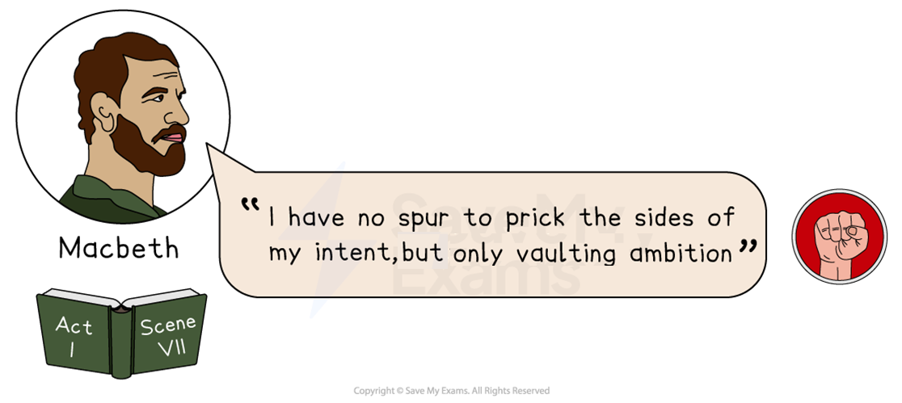
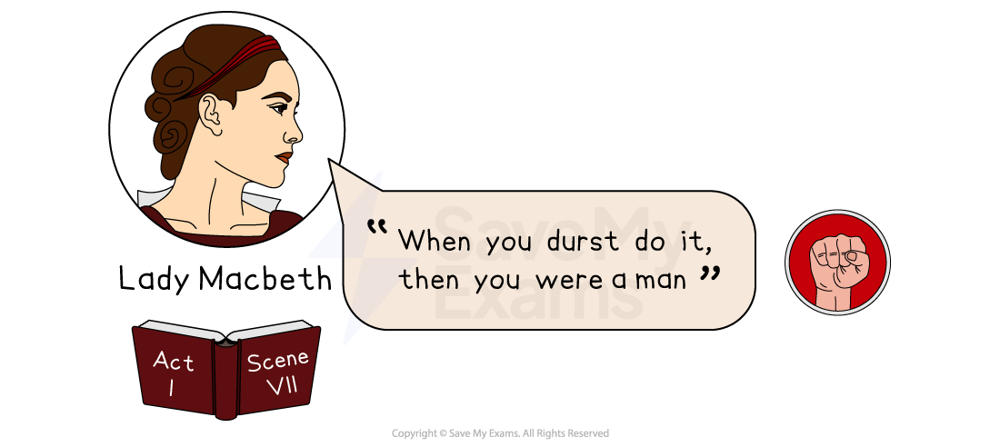
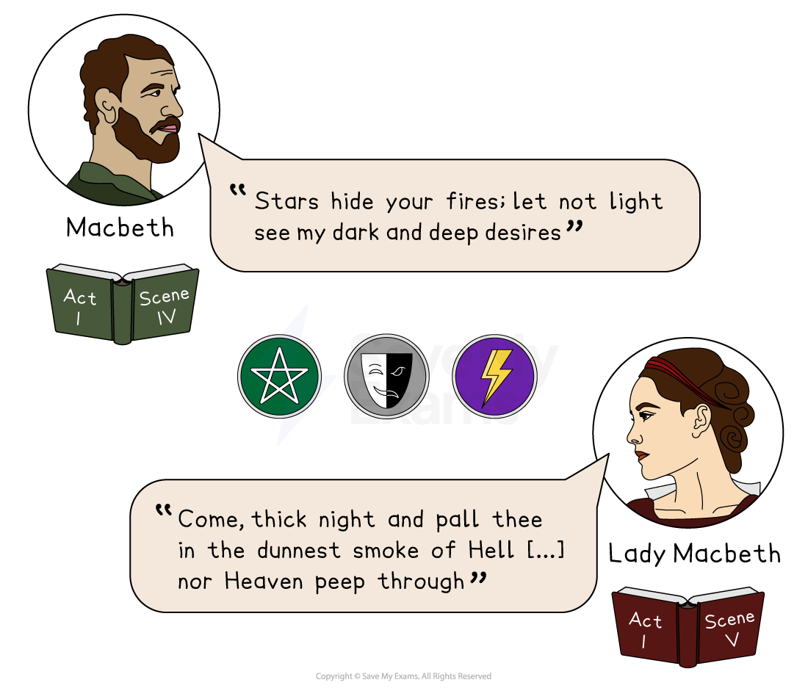
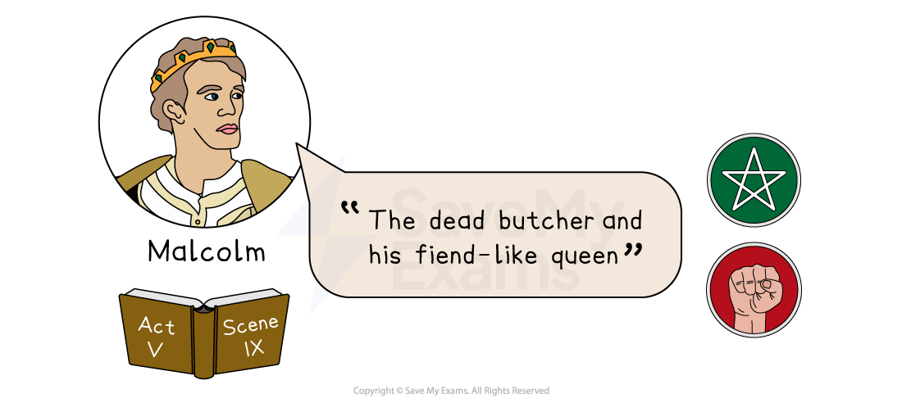
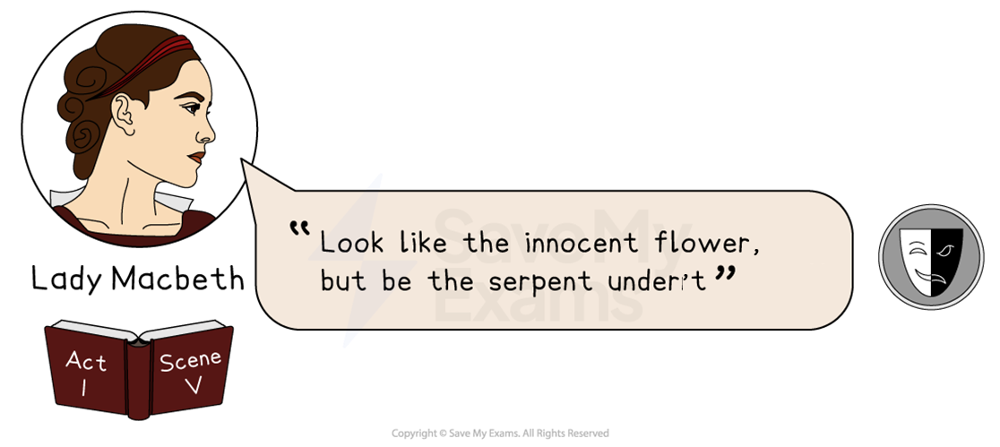
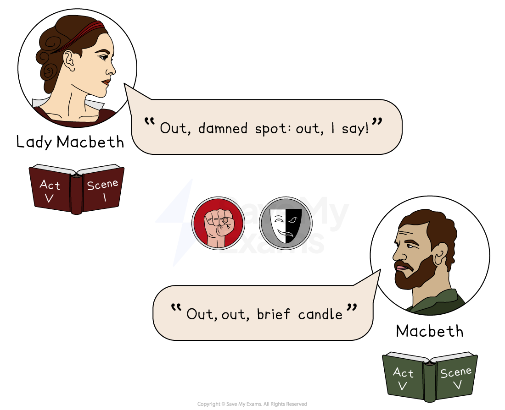
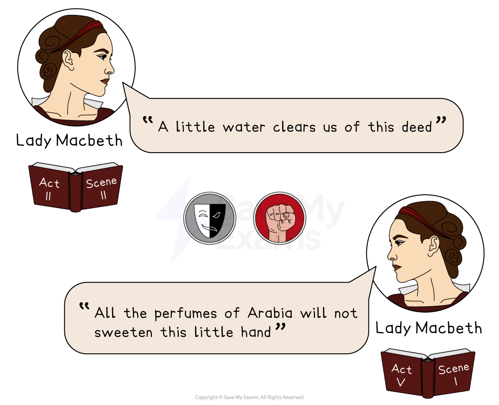
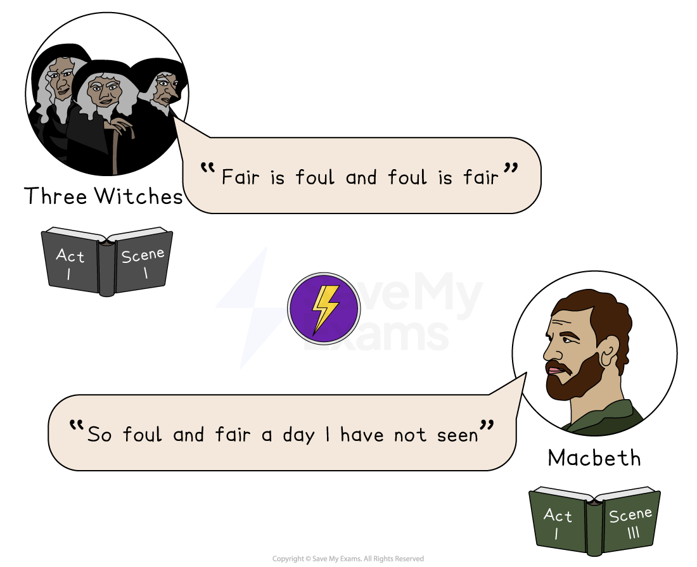
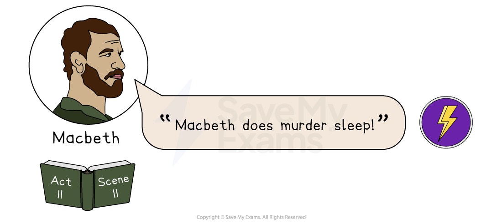

# Macbeth: Key Text Quotations

## Macbeth: Key quotations

> **Spec point** — `spcpt_74t6XJxCFD7dQR4F`

## Key Quotations

The best way to revise quotations is to group them by character or theme. Below you will find definitions and analysis of the best quotations, arranged by the following themes:

- **Ambition and power**
- **The supernatural**
- **Appearance versus reality**
- **Corruption of nature**

## Macbeth: Key quotations: Ambition and power

> **Spec point** — `spcpt_ZHXBvMPC8Zgjhdrk`

## Ambition and power

Principally, Macbeth is a play about **ambition and its consequences**. It can also be seen as a warning against those who seek to undermine or overthrow the rule of a rightful king.

*Act 1 Scene 7 quote*

**“I have no spur to prick the sides of my intent, but only vaulting ambition”** – Macbeth, Act 1, Scene 7

### Meaning and context

- Macbeth is saying that it is his own ambition that is his only motivation to murder King Duncan
- This [soliloquy](https://www.savemyexams.com/glossary/gcse/english-literature/soliloquy-definition/) comes as Macbeth is deciding whether to kill King Duncan or not

### Analysis

- Shakespeare has his [protagonist](https://www.savemyexams.com/glossary/gcse/english-literature/protagonist-definition/), Macbeth, clearly state his [hamartia](https://www.savemyexams.com/glossary/gcse/english-language/hamartia/) (“ambition”) to the audience
- It is implied that there is no other motivation for Macbeth (“no spur”)
- Shakespeare could be suggesting that Macbeth’s fatal flaw (“ambition”) overcomes all of his other, positive character traits
- Later in the same soliloquy, Macbeth says this ambition “o'erleaps itself” (trips itself up), suggesting Macbeth is aware on some level that he is doomed if he commits *regicide*

*Act 1 Scene 7 quote*

**“When you durst do it, then you were a man”** – Lady Macbeth, Act 1, Scene 7

### Meaning and context

- Lady Macbeth is suggesting that only if Macbeth commits the murder of King Duncan that he could be considered a real man
- This comes after Macbeth has expressed doubts about the plan to commit *regicide*

### Analysis

- Lady Macbeth is attacking Macbeth’s masculinity
- It would hurt Macbeth’s pride; in the *Jacobean* era, manliness would have been equated with strength, so here Lady Macbeth is calling Macbeth weak
- It is an example of *role reversal*: Lady Macbeth, unusually for a woman, is manipulating and dominating a man
- As a woman, Lady Macbeth’s power is in her skills of deception and manipulation

![Illustration of Macbeth with a speech bubble quoting Act V, Scene V: "Life [...] is a tale told by an idiot, full of sound and fury, signifying nothing".](../../../assets/7c37c5088386-33029-httpscdn-savemyexams-comuploads202305quota.png)

*Act 5 Scene 5 quote*

**“Life […] is a tale told by an idiot, full of sound and fury, signifying nothing”** – Macbeth, Act 5, Scene 5

### Meaning and context

- Macbeth is suggesting that although in life lots seem to happen, ultimately, it is meaningless and without purpose
- This powerful soliloquy comes after Macbeth is told of the death of Lady Macbeth

### Analysis

- This is an example of *nihilism*: a belief that life is pointless (“signifying nothing”)
- For a largely Christian *Jacobean* audience, this rejection of God’s plan and the suggestion of a rejection of Heaven and Hell, would have been shocking
- However, it is also a moment of [pathos](https://www.savemyexams.com/glossary/gcse/english-literature/pathos-definition/)**:** the audience, despite his *blasphemous* words, would still feel sympathy for a once noble general who has lost his wife
- It perhaps also represents a moment of *anagnorisis*: a tragic hero’s realisation that all his actions were for “nothing” and that he will be defeated

## Macbeth: Key quotations: The supernatural

> **Spec point** — `spcpt_62Q6VVT7kRFMGH4S`

## The Supernatural

The vast majority of people in *Jacobean* England were Christian and believed in the literal word of the Bible. Supernatural events or characters, therefore, would have been seen as evil and the work of the devil.

### Paired quotations

*Paired quotations from Act 1 Scene 4 and Act 1 Scene 5*

**“Stars hide your fires; let not light see my dark and deep desires”** – Macbeth, Act 1, Scene 4

**“Come, thick night and pall thee in the dunnest smoke of Hell […] nor Heaven peep through”** – Lady Macbeth, Act 1, Scene 5

#### Meaning and context

- Both Lady Macbeth and Macbeth are asking for their evil (“dark”, and in some editions, “black”) desires to be hidden from God
- Both quotations come as they are plotting the murder of King Duncan

#### Analysis

- Lady Macbeth and Macbeth are both on their own on stage when they speak these lines, suggesting that these [soliloquies](https://www.savemyexams.com/glossary/gcse/english-literature/soliloquy-definition/) reveal the characters’ true feelings
- The fact that Lady Macbeth echoes Macbeth’s words shows that they still have a close relationship based on shared ideas (unlike later in the play)
- The religious [symbolism](https://www.savemyexams.com/glossary/gcse/english-language/symbolism-definition/)  (“stars”, “light”, “Heaven”) suggests that both characters are aware of the significance and consequences (“Hell”) of committing *regicide*
- Both characters use *imperative verbs* (“hide”, “come”) to command the natural world (“stars”, “night”). This could be seen as *blasphemous* and an attempt to disrupt the Great Chain of Being or God’s plan

> **Exam Hint**
> Depending on the edition of Macbeth you are using, the word “dark” may be replaced with “black”. The examiner will not mind which one you use, as the meaning behind the quote is the same.

*Act 5 Scene 9 quote*

**“The dead butcher and his fiend-like queen”** – Malcolm, Act 5, Scene 9

#### Meaning and context

- Malcolm is describing the now-dead Macbeth and Lady Macbeth
- This comes as part of the final soliloquy of the play after Macduff has killed Macbeth and Malcolm is restored to the throne

#### Analysis

- A “butcher” is someone who kills without feeling or remorse. Shakespeare is suggesting that, because of his ambition, Macbeth turned from noble general to common murderer
- Malcolm doesn’t refer to either character by name: this omission shows their immediate fall in status
- Lady Macbeth is described as a “fiend”: a demon. She is being compared to the evil forces present in the play — the witches — who aim to bring chaos to the kingdom of Scotland

**“Fair is foul, and foul is fair”** – The witches, Act 1, Scene I

**“So foul and fair a day I have not seen**” – Macbeth, Act 1, Scene 3

#### Meaning and context

- At the beginning of the play, Shakespeare introduces the supernatural setting and the “weird sisters” as a *malevolent* force

#### Analysis

- Shakespeare establishes the disruption of the natural order and the corruption of nature through the use of paradoxical language and** **[parallelism](https://www.savemyexams.com/glossary/gcse/english-language/parallelism/)
- The use of rhyming language conveys the impression of evil spellcasting, adding to the supernatural atmosphere

> **blockquote**
> **“A dagger of the mind”** – Macbeth, Act 2, Scene 1

#### Meaning and context

- Shakespeare reveals the danger of the supernatural elements in the play through the corrupt transformation of the [protagonist](https://www.savemyexams.com/glossary/gcse/english-literature/protagonist-definition/):

  - His vision of an imaginary dagger leads him to commit *regicide* and kill King Duncan

#### Analysis

- Shakespeare's use of metaphorical language shows Macbeth's awareness of the *malevolent* effect of the vision
- The vision acts as a *catalyst*  for his murderous actions, showing impact of the supernatural on Macbeth

> **blockquote**
> **“Never shake thy gory locks at me”** – Macbeth, Act 3, Scene 4

#### Meaning and context

- Macbeth sees a vision of the assassinated Banquo at the feast, a sign of his guilt

#### Analysis

- As the play progresses, Shakespeare presents the moral and psychological decline of Macbeth through his use of supernatural visions and auditory hallucinations
- The use of [assonance](https://www.savemyexams.com/glossary/gcse/english-literature/assonance-definition/) and *monosyllabic* words heightens the sense of his abject terror at seeing the ghost

> **blockquote**
> **“By the pricking of my thumbs, something wicked this way comes”** – The witches (Second Witch), Act 4, Scene 1

#### Meaning and context

- The witches’ observation about Macbeth’s wickedness signposts his descent into evil for the audience

#### Analysis

- The [rhyming couplets](https://www.savemyexams.com/glossary/gcse/english-language/rhyming-couplet/) and use of *trochaic tetrameter* for the witches' speech suggests their supernatural difference
- The use of assonance and superstitious references in this [couplet](https://www.savemyexams.com/glossary/gcse/english-literature/couplet-definition/) also reinforces their supernatural wickedness

## Macbeth: Key quotations: Appearance versus reality

> **Spec point** — `spcpt_xPqcfjP8YTBsMWFS`

## Appearance versus reality

Shakespeare plays with the concept of perception throughout Macbeth: are we seeing what’s really there? And are characters who they seem to be?

![Illustration of Lady Macbeth with quote, "Come you spirits [...] Unsex me here," from Act I, Scene V. Includes drama mask and pentagram symbols.](../../../assets/02a5cf761dbe-21503-quotation-panel-6.png)

*Act 1 Scene 5 quote*

**“Come, you spirits […] Unsex me here”** – Lady Macbeth, Act 1, Scene 5

### Meaning and context

- Lady Macbeth is calling on evil spirits to take away her feminine traits
- This is part of a long [soliloquy](https://www.savemyexams.com/glossary/gcse/english-literature/soliloquy-definition/) after Macbeth has written her a letter outlining the witches’ prophecies

### Analysis

- Shakespeare has Lady Macbeth use *imperative verbs* (“Come”; “unsex”) when commanding evil spirits:

  - This shows her power at this point in the play (or at least the power she believes she commands)
  - The fact that she is commanding evil spirits shows her [hubris](https://www.savemyexams.com/glossary/gcse/english-literature/hubris-definition/): it is arrogant for humans to believe they can control evil forces
- She wants to remove her feminine traits (being *nurturing*, *dutiful*, powerless) and become “unsexed”:

  - She wants to *subvert* the characteristics of a typical woman
  - Shakespeare could be suggesting that only by adopting male characteristics can women gain power
  - This would have been seen as disturbing to a *Jacobean* audience and very unnatural, perhaps akin to the actions of a witch

*Act 1 Scene 5 quote*

**“Look like the innocent flower, but be the serpent under't” **– Lady Macbeth, Act 1, Scene 5

### Meaning and context

- Lady Macbeth is suggesting that Macbeth hide his true, *treasonous*** **self from King Duncan
- This comes as the couple are first plotting the murder of Duncan

### Analysis

- This quotation is reflective of Lady Macbeth’s *duplicitous* nature
- Her use of the *imperative verb* “look” also shows her power over Macbeth
- She has no trouble acting like an “innocent flower” in the very next scene when greeting King Duncan
- The “serpent” has religious [connotations](https://www.savemyexams.com/glossary/gcse/english-language/connotation-definition/): it is a reference from the Christian Bible to the snake (a representation of the Devil), who tempts Eve in the Garden of Eden:

  - Lady Macbeth is also a woman who is tempted by evil and, in turn, tempts a man (Macbeth)
  - In the Bible, this temptation causes the fall of man. In Macbeth, it causes the downfall of Lady Macbeth and her husband
  - This could be Shakespeare suggesting that committing *blasphemous* acts will always lead to ruin

### Paired quotations

*Paired quotations from Act 5 Scene 1 and Act 5 Scene 5*

**“Out, damned spot: out, I say!”** – Lady Macbeth, Act 5, Scene 1

**“Out, out, brief candle”** – Macbeth, Act 5, Scene 5

#### Meaning and context

- Lady Macbeth is desperately pleading for the hallucination of blood on her hands to disappear
- It comes as she is losing her mind and just before her suicide
- Macbeth is commenting on the brief nature of life
- It is part of a long soliloquy after he is told about the death of Lady Macbeth

#### Analysis

- Lady Macbeth’s desperation is apparent in her ramblings: to show this, Shakespeare:

  - uses lots of punctuation to reflect her disjointed mind
  - uses [repetition](https://www.savemyexams.com/glossary/gcse/english-language/repetition-definition/) (“out”) to show her increasing desperation

- The use of *imperative verbs* (“out”) is ironic: whereas earlier in the play she used commanding language with evil spirits, she has now completely lost power. Commands have turned into pleas of desperation
- Macbeth echoes the language of Lady Macbeth (“Out, out”)
- However, unlike other times when Macbeth echoes the language of Lady Macbeth or the witches, this quotation doesn’t imply he is being led by them
- Lady Macbeth’s desperation has turned into a reflection of Macbeth:

  - It is a realisation that what he — and Lady Macbeth — have done was worthless
  - It creates a sense of [pathos](https://www.savemyexams.com/glossary/gcse/english-literature/pathos-definition/) for the audience
  - Macbeth using Lady Macbeth’s words brings the couple closer again

### Paired quotations

*Paired quotations from Act 2 Scene 2 and Act 5 Scene 1*

**“A little water clears us of this deed” **– Lady Macbeth, Act 2, Scene 2

**“All the perfumes of Arabia will not sweeten this little hand”** – Lady Macbeth, Act 5, Scene 1

#### Meaning and context

- Lady Macbeth at first suggests that it won’t take much for their consciences to be cleared after Duncan’s murder; later, she realises that nothing could remove the feelings of guilt
- These quotations come before the murder of King Duncan, and then after Lady Macbeth has lost her mind, right before her suicide

#### Analysis

- Lady Macbeth displays hubris when she confidently asserts that she and her husband will not be troubled by feelings of guilt or remorse
- Her confidence contrasts with Macbeth’s belief that all the water in “Neptune’s ocean” couldn’t wash the blood (symbolising guilt) from his hand
- “Hands” here represent responsibility
- It is ironic that later in the play, Lady Macbeth sees blood on her hands (guilt and responsibility for the murder of Duncan)
- However, it also becomes clear that her original confidence was misplaced: her “little hand” is dirtied by blood, and seemingly nothing (even “all the perfumes of Arabia”) can cleanse it of her guilt and responsibility
- Shakespeare could be suggesting that once Lady Macbeth accepted responsibility for the murder, the guilt was overwhelming

## Macbeth: Key quotations: Corruption of nature

> **Spec point** — `spcpt_7cNk7FDXPGSqjv7d`

## Corruption of nature

*Jacobean* audiences believed in a set structure in the world: the world according to God’s plan. Any disruption to the world was, therefore, disruption to God’s ordained order.

### Paired quotations

*Paired quotations from Act 1 Scene 1 and Act 1 Scene 3*

**“Fair is foul, and foul is fair”** – Three Witches, Act 1, Scene 1

**“So foul and fair a day I have not seen”** – Macbeth, Act 1, Scene 3

#### Meaning and context

- The witches are warning the audience that what may be seen as good might well be bad, and vice versa
- It comes from the very first scene of the play
- Macbeth is commenting on the very strange weather that comes after his victory in battle
- His lines come just before his first encounter with the witches

#### Analysis

- The witches are presenting the audience with a [paradox](https://www.savemyexams.com/glossary/gcse/english-language/paradox-definition/)**:** a contradictory statement that suggests that the play will involve the themes of deception and appearance versus reality
- It is also a suggestion from Shakespeare of the disruption and chaos to come, of a kingdom turned upside down
- The paradox suggests that the words of the witches might be in the form of riddles: confusing, or misleading, just as their prophecies are to Macbeth
- Macbeth, without having met the witches, echoes their language:

  - This suggests he is already being led by them, or under their spell
  - This suggests to the audience that perhaps his “fair” character will be corrupted and become most “foul”

*Act 2 Scene 2 quote*

**“Macbeth does murder sleep!”** – Macbeth, Act 2, Scene 2

#### Meaning and context

- Macbeth is quoting a voice he can hear that tells him that he has murdered sleep
- It comes immediately after the murder of King Duncan when Macbeth returns to Lady Macbeth

#### Analysis

- Macbeth returns from murdering Duncan in a panicked state and is hallucinating
- He hears a voice telling him he will no longer be able to sleep
- “Sleep” symbolises peace or calm, so this is a suggestion that Macbeth will no longer be at peace because he committed *regicide*
- Shakespeare could be suggesting that in the act of murdering a king, he has murdered his own chance at peace — and perhaps eternal peace: Heaven
- The voice he can hear might be interpreted as his own conscience

#### Sources

Stanley Wells and Gary Taylor (eds), 2005, The Oxford Shakespeare: The Complete Works (Second Edition), Oxford University Press
