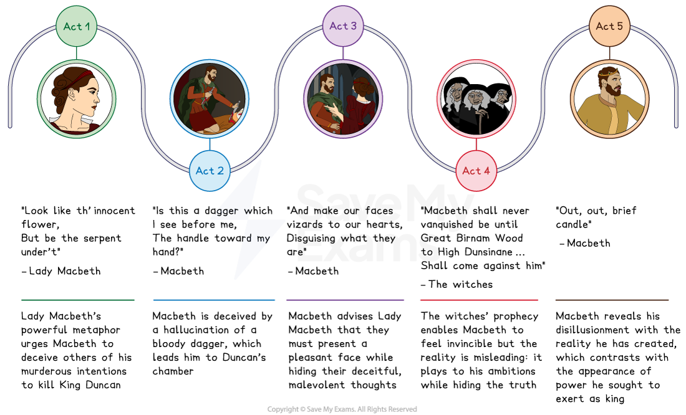
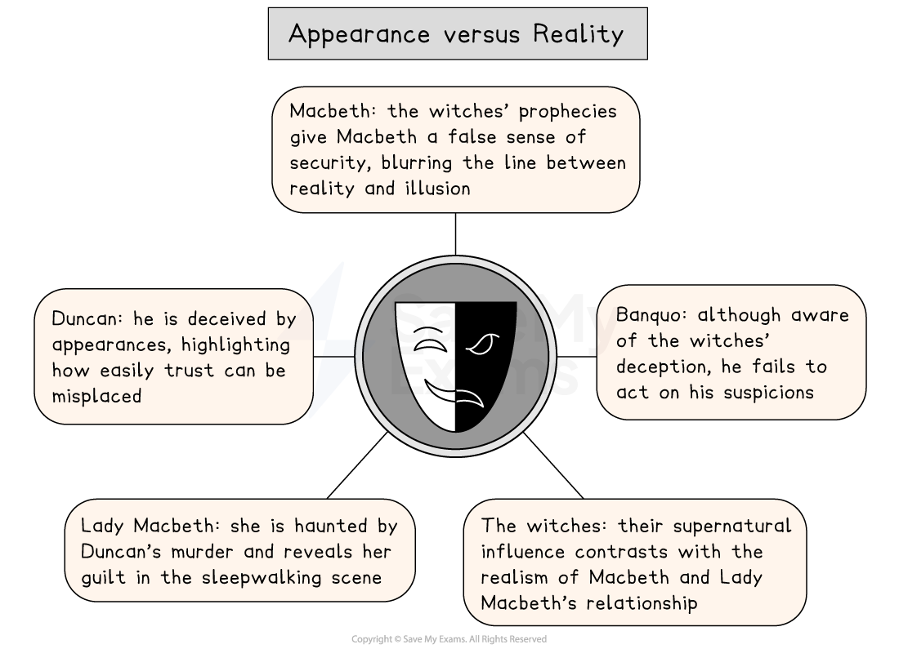

# Macbeth Key Theme: Appearance versus Reality

## Macbeth: Key Theme: Appearance versus reality: Appearance versus reality time line

> **Spec point** — `spcpt_MkttN23JQPwGDgNH`

## Appearance versus reality timeline

The theme of appearance versus reality in each act of Macbeth:

*Macbeth appearance versus reality timeline*

## Macbeth: Key Theme: Appearance versus reality: What are the elements of appearance versus reality in Macbeth?

> **Spec point** — `spcpt_rXNKfv3mZd4SPCh9`

## What are the elements of appearance versus reality in Macbeth?

- **The deceptive nature of the witches: **Shakespeare portrays the witches as purposefully ambiguous, leading Macbeth to misinterpret them:

  - “Fair is foul, and foul is fair” introduces the theme of deception from the very beginning of the play
- **The bloody dagger:** Macbeth’s guilt takes visual form when he hallucinates that a blood-covered dagger is leading him to murder his King and kinsman, Duncan: “Is this a dagger which I see before me?”:

  - His initial appearance of loyalty to King Duncan hides his true intentions and Macbeth’s betrayal creates an atmosphere of deception
- **Lady Macbeth’s strength**: Lady Macbeth is initially presented as dominant and strong but as the play progresses, she becomes fragile and haunted by guilt:

  - “Here’s the smell of the blood still”
- **Banquo’s ghost**: Macbeth behaves treacherously towards Banquo and after arranging his murder, he is consumed by guilt, [symbolised](https://www.savemyexams.com/glossary/gcse/english-language/symbolism-definition/) by the appearance of Banquo’s ghost at the banquet:

  - “Thou canst not say I did it. Never shake thy gory locks at me”

> **Exam Hint**
> This theme rewards close attention to **language** rather than plot, because the deception is built into how characters speak. Examiners warn that answers weaken when they only describe who lies to whom.
> 
> For example, you could write: “Lady Macbeth tells her husband to ‘look like the innocent flower, But be the serpent under’t’, which turns deception into something he has to perform”. Explaining what an image asks a character to do keeps the analysis close to the text.

## Macbeth: Key Theme: Appearance versus reality: The impact of appearance versus reality on characters

> **Spec point** — `spcpt_KhrVDMhFr36dDHP5`

## The impact of appearance versus reality on characters

Characters in Macbeth present themselves in ways which do not reflect their realities and there is a sharp contrast between superficial appearances and underlying truths.

*Appearance versus reality in Macbeth*

| **Character** | **Impact** |
|---|---|
| Macbeth | The witches’ deceptive prophecies results in Macbeth having a false sense of security:  - As the play progresses, he can no longer trust what is real or imagined |
| Lady Macbeth | Despite Lady Macbeth and Macbeth's attempts to hide their guilt, Lady Macbeth is haunted by the reality of Duncan’s murder in the sleepwalking scene:  - “Yet who would have thought the old man to have had so much blood in him?” |
| Banquo | Although Banquo is not entirely deceived by Macbeth, he does not act upon his suspicions in time to prevent his own death:  - However, unlike Macbeth, he is aware of the witches’ deceptive nature: “The instruments of darkness tell us truths, / Win us with honest trifles to betray’s / In deepest consequence” |
| Duncan | Duncan is deceived into trusting both Thanes of Cawdor (who betray him), demonstrating how appearance can be misleading:  - His commendation of the Macbeths’ “pleasant” castle and of his “fair and noble” hostess illustrate his inability to see the reality behind their facade |
| The witches | Structurally, the appearances of the witches are few, but the audience is constantly reminded of their prophecies, which shape the action of the play:  - The artificial nature of their scenes contrasts with the realism of the relationship between Macbeth and Lady Macbeth |

## Macbeth: Key Theme: Appearance versus reality: Why does Shakespeare use the theme of appearance versus reality in his play? 

> **Spec point** — `spcpt_c85pQqbS5xbKstzC`

## Why does Shakespeare use the theme of appearance versus reality in his play?

**1.  Setting and atmosphere **

- Establishes the theme of appearance versus reality as central to Macbeth and Lady Macbeth’s rise and fall:

  - From the very beginning, the audience is introduced to a world where nothing is as it seems

**2. Plot driver **

- Drives Macbeth’s moral downfall as he is deceived by the witches’ prophecies and believes he is invincible
- Creates the basis for key betrayals in the play, such as the deaths of Duncan and Banquo

**3. Audience appeal **

- Shakespeare’s Jacobean audience would have been interested in regicide and treason at the time of the Gunpowder Plot (1605)
- James I, Shakespeare’s *patron*, also feared betrayal and rebellion

**4. Dramatic device  **

- Heightens the importance of the appearance of the dagger and of Banquo’s ghost, blurring the line between what is real and what is not

## Macbeth: Key Theme: Appearance versus reality: Exam style questions on appearance versus reality

> **Spec point** — `spcpt_mkSDVsvx8mJC6jjf`

## Exam-style questions on the theme of appearance versus reality

Try planning a response to the following essay questions as part of your revision of the theme of appearance versus reality:

- Explore how the witches’ statement “Fair is foul, and foul is fair” sets the tone for the theme of appearance versus reality in Macbeth. (You could start with Act 1, Scene 3.)
- To what extent does Macbeth’s vision of the dagger and Banquo’s ghost represent his deteriorating grasp on reality? (You could start with Act 1, Scene 7.)

#### Sources

Stanley Wells and Gary Taylor (eds), 2005, The Oxford Shakespeare: The Complete Works (Second Edition), Oxford University Press
