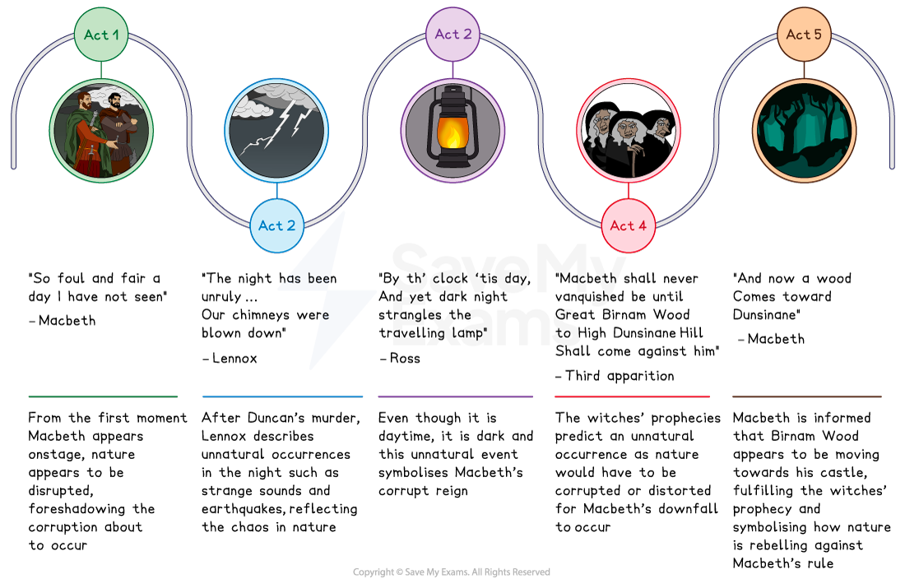
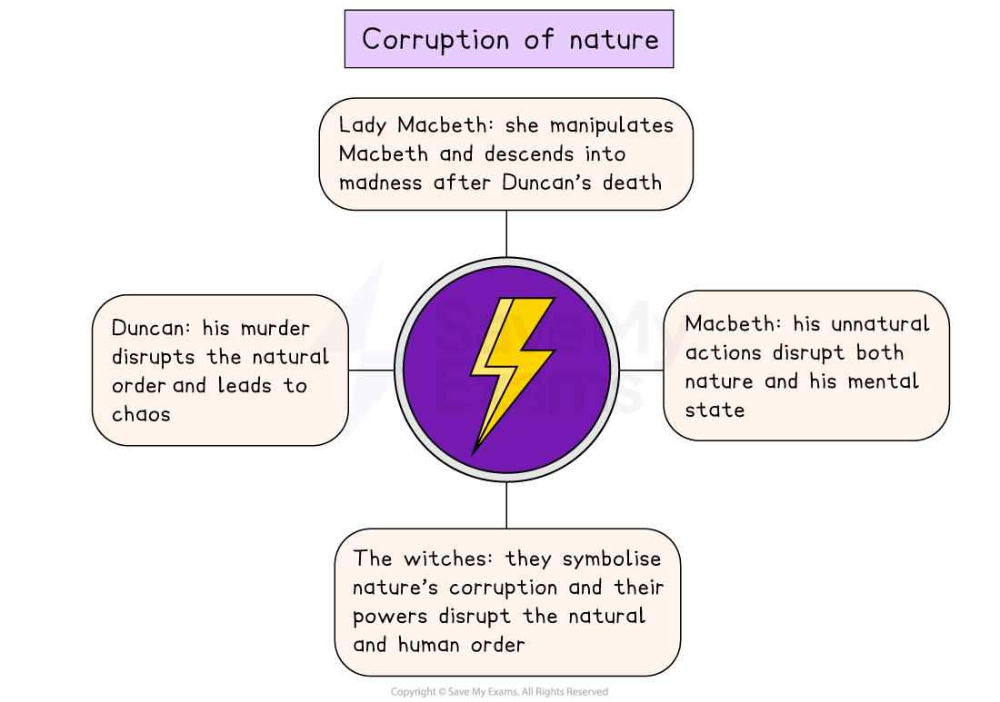

# Macbeth Key Theme: Corruption of Nature

## Macbeth: Key Theme: Corruption of nature: Corruption of nature mind map

> **Spec point** — `spcpt_WvhNNcvzy4TRDfFC`

## Corruption of nature timeline

The corruption of nature theme in each act of Macbeth:

*Macbeth corruption of nature timeline*

## Macbeth: Key Theme: Corruption of nature: Which elements link to the corruption of nature in Macbeth?

> **Spec point** — `spcpt_YmkmKFDWNQFCjMvS`

## Which elements link to the corruption of nature in Macbeth?

- **Descriptions of nature and the weather:** Shakespeare uses descriptions of the weather to [foreshadow](https://www.savemyexams.com/glossary/gcse/english-language/foreshadowing-definition/) the deaths to come:

  - For example, the witches meet in “thunder” and “lightning” and Macbeth pronounces the day as “foul”
- **Duncan’s murder:** Macbeth has consciously and deliberately acted against nature and as the play progresses, he continues to destabilise ordered patterns:

  - He acknowledges the dead Duncan is happier than he is and admits how “uneasy lies the head that wears a crown”
  - In contrast, Shakespeare presents Duncan’s character as aligned with nature through pleasant descriptions (which Macbeth destroys): “the air / nimbly and sweetly recommends itself / Unto our gentle senses”
- **Unnatural events after Duncan’s murder:** Duncan’s death occurs during a night Lennox describes as “unruly”, with “strange screams of death”:

  - This reflects the evil nature of Duncan’s death
- **Lady Macbeth’s unnatural role**: Lady Macbeth subverts the typical Jacobean gender roles, and demands the spirits to strip her of her femininity to achieve her ambition: “unsex me here”

> **Exam Hint**
> Examiners note that the strongest answers connect a theme to the way the play is built rather than collecting examples. Here the disorder begins in the witches’ language and spreads outwards.
> 
> For example, you could write: “The witches’ claim that ‘Fair is foul, and foul is fair’ describes the whole play, because after Duncan’s death nothing behaves as it should”. Showing an idea spread from one scene through the rest of the play is a point about **structure**.

## Macbeth: Key Theme: Corruption of nature: The impact of the corruption of nature on characters

> **Spec point** — `spcpt_2RpvwnRQz7ytZNYz`

## The impact of the corruption of nature on characters

*Corruption of nature in Macbeth*

| **Character** | **Impact** |
|---|---|
| Macbeth | - Macbeth’s unnatural actions lead to a disruption of both nature and his own mental state |
| Lady Macbeth | - Lady Macbeth’s close relationship with her husband and her knowledge of his ambitious nature enables her to manipulate him, by questioning his character:    - Her complicity in Duncan’s unnatural murder leads to her rapid descent into madness |
| Duncan | - Duncan’s murder is the primary event that corrupts nature in the play and his death throws the natural order into chaos:    - Duncan’s horses “contending ’gainst obedience” are [symbolic](https://www.savemyexams.com/glossary/gcse/english-language/symbolism-definition/) of the collapse of the country’s social hierarchy into “most admired disorder”, leading to civil war |
| The witches | - The witches are symbolic of nature’s corruption as they appear to have the power to predict the future, to defy the weather and have guiding spirits:    - Their ability to “untie the winds” and disrupt nature symbolises their corruption of both the human and natural order |

## Macbeth: Key Theme: Corruption of nature: Why does Shakespeare use the theme of the corruption of nature in his play?

> **Spec point** — `spcpt_sYxC6hKbTtWjbtPg`

## Why does Shakespeare use the theme of the corruption of nature in his play?

**1.  Setting and atmosphere **

- Establishes a disrupted natural order from the beginning of the play
- Creates an eerie and foreboding tone

**2. Plot driver **

- Drives Macbeth’s downfall as his actions continue to corrupt nature

**3. Audience appeal **

- Appeals to the audience’s interest as the play reflects the volatile nature of society during the Jacobean era and the social expectations that unlawfully killing another man would be justly punished
- Challenges ideas about the role of women as Lady Macbeth’s ambitious nature and controlling influence over Macbeth could be perceived as unnatural and unfeminine

**4. Dramatic device  **

- Heightens the tension by using unnatural occurrences to signify the fundamental evil of the characters’ actions

## Macbeth: Key Theme: Corruption of nature: Exam-style questions on the theme of corruption of nature

> **Spec point** — `spcpt_BFTq9pKDFwXWG8xp`

## Exam-style questions on the theme of corruption of nature

Try planning a response to the following essay questions as part of your revision of the theme of corruption of nature:

- Explore how the murder of Duncan disrupts the natural order and leads to Macbeth’s downfall. (You could start with Act 2, Scene 4.)
- How does Shakespeare use the theme of the corruption of nature to portray the character of Lady Macbeth? (You could start with Act 1, Scene 5.)

#### Sources

Stanley Wells and Gary Taylor (eds), 2005, The Oxford Shakespeare: The Complete Works (Second Edition), Oxford University Press
