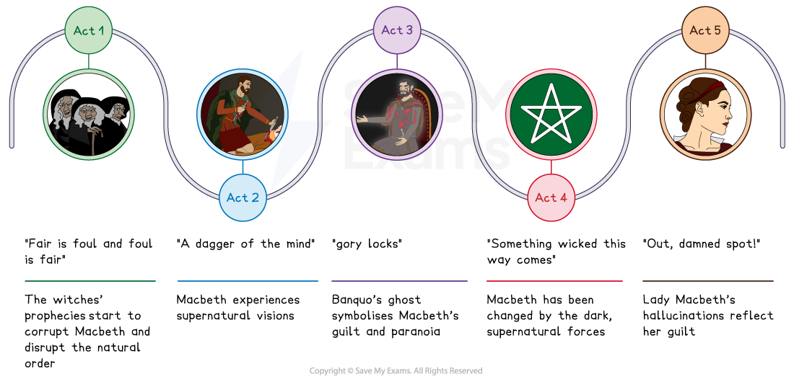
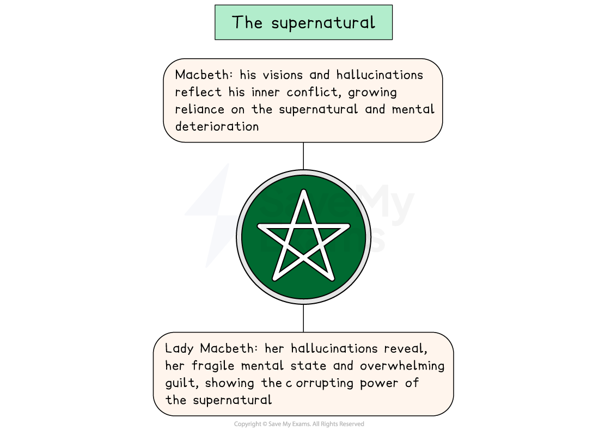

# Macbeth Key Theme: The Supernatural

## Macbeth: Key Theme: The supernatural: Supernatural mind map

> **Spec point** — `spcpt_dY4sC9NMrMRyfxXj`

## Supernatural timeline

The key supernatural elements in each act of Macbeth:

*Macbeth supernatural timeline*

## Macbeth: Key Theme: The supernatural: What are the supernatural elements in Macbeth?

> **Spec point** — `spcpt_MhGzrVYZMjJdnbvG`

## What are the supernatural elements in Macbeth?

The supernatural elements in the play include:

- **The three witches: **Shakespeare creates a supernatural atmosphere through** **their rituals and prophecies
- **Unnatural or supernatural events: **Shakespeare refers to storms, day darkening to night and animals behaving strangely (such as horses eating each other)
- **Apparitions:** The witches summon a severed head, a bloody child and a crowned child in Act 4, Scene 1
- **Visions** **and hallucinations: **Shakespeare** **uses a dagger, Banquo’s ghost and imaginary bloodstains to sustain the supernatural atmosphere and add to the horror throughout the play

> **Exam Hint**
> Examiners reward a second reading where the text genuinely supports one, but warn against forcing an opposite for its own sake. Here the alternative is real: the witches can be read as controlling Macbeth, or as telling him what he already wants.
> 
> For example, you could write: “The witches never tell Macbeth to kill anyone, so perhaps Shakespeare makes them a temptation rather than a cause”. Offering one reading you can support, and hedging it with **perhaps**, is stronger than claiming a line could equally mean the reverse.

## Macbeth: Key Theme: The supernatural: The impact of the supernatural on characters

> **Spec point** — `spcpt_bbxV5YcWHFFc2PDD`

## The impact of the supernatural on characters

Through his use of** ghostly visions** and** hallucinations**, Shakespeare shows his audience the lasting, transformative effect of the supernatural elements on his central [protagonists](https://www.savemyexams.com/glossary/gcse/english-literature/protagonist-definition/), Macbeth and Lady Macbeth.

These elements contribute to the dramatic tension and the atmosphere of evil and uncertainty in the play, but also [symbolise](https://www.savemyexams.com/glossary/gcse/english-language/symbolism-definition/) the characters’ guilt, fear and paranoid by representing the psychological effect of their murderous actions.

*The supernatural in Macbeth*

| **Character** | **Impact** |
|---|---|
| Macbeth | Macbeth experiences two **ghostly visions**, the** dagger** and the **ghost of Banquo**, as well as **auditory** **hallucinations **when he comments: “Methought I heard a voice cry, 'Sleep no more, / Macbeth does murder sleep’” (Act 2, Scene 2):  - Macbeth is initially sceptical but becomes increasingly reliant on supernatural guidance as the witches’ prophecies of power channel his ambition, giving him false confidence - The visions reflect his inner conflict, his guilt and his deteriorating mental state and drive his murderous actions |
| Lady Macbeth | Lady Macbeth also experiences **hallucinations** (spots of blood on her hands in Act 5, Scene 1):  - Her hallucinations reflect her fragile mental state and overwhelming sense of guilt - The hallucinations remind the audience of the corrupting power of the dark, supernatural forces in the play |

## Macbeth: Key Theme: The supernatural: Why does Shakespeare use the theme of the supernatural in his play?

> **Spec point** — `spcpt_MdVX5bT5N33mf8Xt`

## Why does Shakespeare use the theme of the supernatural in his play?

**1.  Setting and atmosphere **

- Creates the superstitious, medieval Scottish setting
- Establishes an ominous, foreboding atmosphere

**2. Plot driver **

- Influences Macbeth's actions through prophecies and visions
- Propels the narrative from the opening scene to the final act

**3. Audience appeal **

- Reflects the Jacobean audience's fear and fascination with witchcraft
- Aligns with his *patron* King James I's interest in the supernatural (author of Daemonologie)

**4. Dramatic device  **

- Shakespeare starts and ends the play with supernatural elements (opens with “weird sisters” and closes with the fulfilment of the witches’ prophecies)
- Adds dramatic tension and spectacle

## Macbeth: Key Theme: The supernatural: Exam-style questions on the theme of the supernatural

> **Spec point** — `spcpt_NKGCg5PBPqv6zvn5`

## Exam-style questions on the theme of the supernatural

Try planning a response to the following essay questions as part of your revision of the supernatural theme:

- Explore how Shakespeare presents the attitudes of Macbeth and Banquo towards the supernatural elements in the play. (You could start with Act 1, Scene 3.)
- How does Shakespeare present the supernatural elements as changing the character of Macbeth? (You could start with Act 2, Scene 1.)

#### Sources

Stanley Wells and Gary Taylor (eds), 2005, The Oxford Shakespeare: The Complete Works (Second Edition), Oxford University Press
