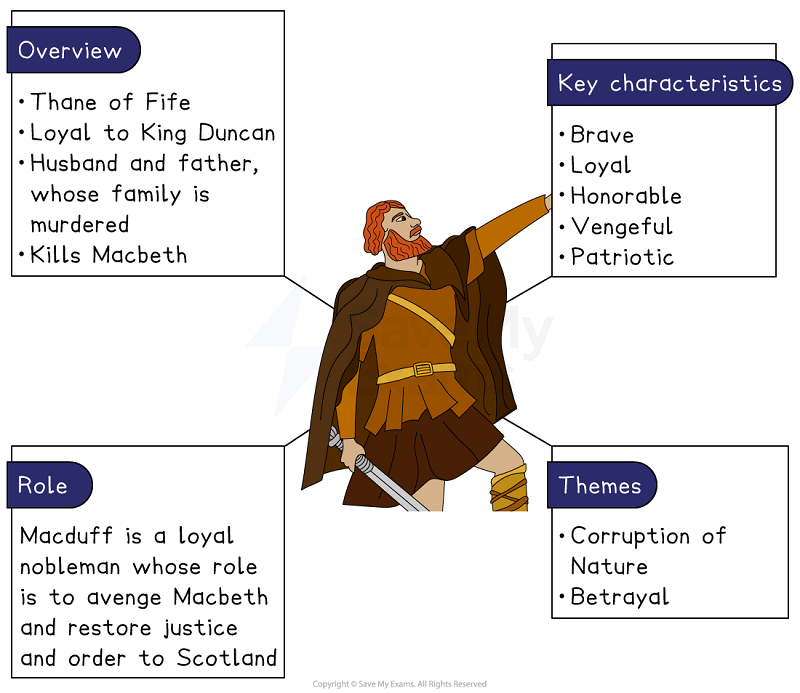
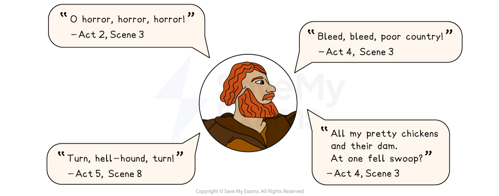

# Macduff Character Analysis

## Macduff character analysis

Macduff is presented as a moral and patriotic nobleman who kills Macbeth and rightfully restores order to Scotland.

## Macbeth: Macduff Character Analysis: Macduff character summary

> **Spec point** — `spcpt_8rHpG4MYXBPdqcNd`

## Macduff character summary

*Macduff character summary*

## Macbeth: Macduff Character Analysis: Why is Macduff important?

> **Spec point** — `spcpt_8bwNtGWCfdwbXwzw`

## Why is Macduff important?

Macduff is a [symbol](https://www.savemyexams.com/glossary/gcse/english-language/symbol/) of justice and retribution against Macbeth’s tyranny. Although he is a relatively minor character and appears sporadically throughout the play, he is a pivotal character in Act 4 and Act 5.

Macduff is depicted as:

- **Patriotic: **Macduff’s patriotism is revealed when he discovers Duncan’s body. He exclaims: “O* *horror, horror, horror!” revealing his deep loyalty and reverence to the King. His immediate mistrust and later refusal to attend Macbeth’s coronation signify his loyalty to Scotland’s rightful heir
- **Vengeful:** Macduff’s journey to England leaves his family unprotected and Macbeth’s fear of Macduff raising an army against him has the important effect of Macbeth having Macduff’s family killed: “His wife, his babes, and all unfortunate souls”. Macduff expresses his utter heartbreak at their murder: “All my pretty chickens and their dam / At one fell swoop?”* *Malcolm encourages him to seek revenge for the murders: “let grief / Convert to anger”. Macduff becomes more aggressive and determined to avenge their deaths
- **Brave**: At the end of the play, Macduff’s bravery and patriotism are evident when he challenges Macbeth, calling him a “hell-hound” and monster for his evil deeds. Despite the witches’ predictions that Macbeth will not be killed by a man born of a woman, Macbeth is reluctant to fight Macduff when challenged. Macbeth finally accepts his guilt and admits to Macduff that his “soul” is “too much charged with blood of thine already”
- **Symbol of justice:** Macduff represents justice. By *vanquishing*** **Macbeth, he reinstates the rightful order in Scotland by establishing Malcolm as king. The play concludes with the violent death of Macbeth, which fulfils the prophecy of the witches that Macbeth should “Beware Macduff”

For more on how Shakespeare presents the character of Macduff, see our video below:

> **Exam Hint**
> Examiners note that answers on Macduff improve when they treat him as a **counterweight** to Macbeth rather than as the man who ends the play. His grief is the clearest place to see the difference.
> 
> For example, you could write: “Shakespeare lets Macduff weep for his family before he fights, so his manhood is shown through feeling rather than through violence”. Showing how one man’s grief answers another man’s violence is stronger than calling Macduff the hero.

## Macbeth: Macduff Character Analysis: Macduff's use of language

> **Spec point** — `spcpt_VZ2FtF4G7rppDkSd`

## Macduff’s use of language

Macduff uses language that reflects his loyalty, patriotism and deep sense of justice, often revealed through his intense emotions and religious [allusions](https://www.savemyexams.com/glossary/gcse/english-language/allusion-definition/).

- **Emotive and exclamatory:** Macduff describes his family [metaphorically](https://www.savemyexams.com/glossary/gcse/english-language/metaphor-definition/) as “pretty chickens and their dam” to convey the love he has for his family and the *abject* sadness he feels after their murders. His emotive language and repeated use of interrogatives in Act 4 reflect the disbelief he feels: “My children too?” and “My wife killed too?”. Macduff’s language is highly emotive and he blames himself for the murders: “Sinful Macduff”, “struck for thee… Not for their own demerits, but for mine”
- **Religious and moralistic: **Macduff’s use of religious language reflects his deep belief in justice and the Divine Right of Kings, and conveys his moral righteousness. He refers to King Duncan’s death as a “most sacrilegious murder”. After discovering his family has been murdered, Macduff uses religious allusions and exclamatory phrases to reflect his deep shock: he refers to Macbeth as a “hell-kite!” and a “fiend of Scotland”

### Macduff key quotes

*Macduff key quotes*

## Macbeth: Macduff Character Analysis: Macduff character development

> **Spec point** — `spcpt_42Cm2wrrRj5kPFtX`

## Macduff character development

| **Act 2, Scene 3** | **Act 4, Scene 3** | **Act 5, Scene 8** |
|---|---|---|
| **Macduff discovers King Duncan’s murder:**  Macduff reveals his utter horror and despair upon discovering that King Duncan has been murdered. In this scene, Shakespeare establishes Macduff as a character of moral integrity and righteousness. | **Macduff reacts to the brutal murder of his family:**  Macduff is overcome with grief, revealing his highly emotional state. His initial tone of disbelief and sorrow quickly shifts to one of anger and aggression. He intensifies his vow to avenge his family and Scotland. | **Macduff confronts Macbeth:**  Macduff reveals he was “from his mother’s womb untimely ripped” which fulfils the witches’ prophecy. He restores order to Scotland by killing Macbeth and is portrayed as the patriotic hero of the play. |

For more on the development of Macduff's character, see our video below:

## Macbeth: Macduff Character Analysis: Macduff character interpretation

> **Spec point** — `spcpt_fQTxWNCNhdqkCF4n`

## Macduff character interpretation

### The Divine Right of Kings

Kingship and loyalty were important aspects of Jacobean life and the murder of a king was viewed as evil and against the belief in the Divine Right of Kings. Therefore a contemporary audience would have understood Macduff’s role in restoring God’s order through the rightful heir to the throne. Social expectations at the time would also have expected good to overcome evil and so Macbeth must be destroyed to *atone* for his crimes.

### Alternative presentation of gender roles

Macduff’s character challenges traditional representations of masculinity in the scenes where he conveys his overwhelming grief, compassion and vulnerability. This expression of his feelings would have been unconventional during Shakespeare’s era. Macduff’s emotional depth and sensitivity is [juxtaposed](https://www.savemyexams.com/glossary/gcse/english-language/juxtaposition-definition/) with Shakespeare’s presentation of masculinity though Macbeth, who is associated with brutality, ruthlessness and violence.

#### Sources

Stanley Wells and Gary Taylor (eds), 2005, The Oxford Shakespeare: The Complete Works (Second Edition), Oxford University Press
