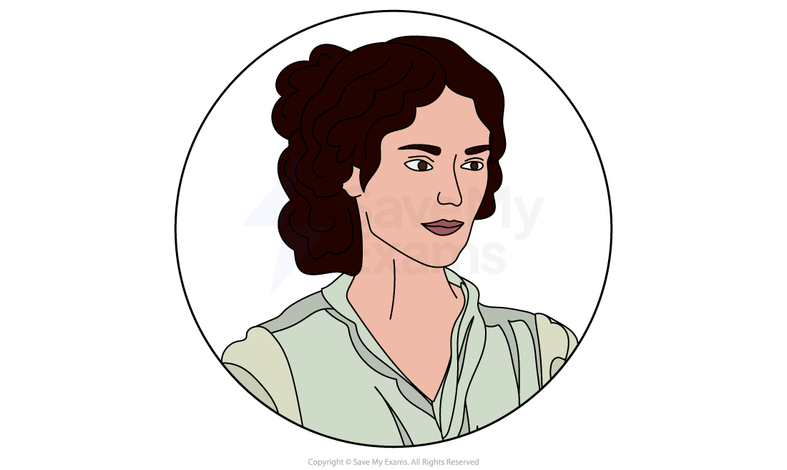
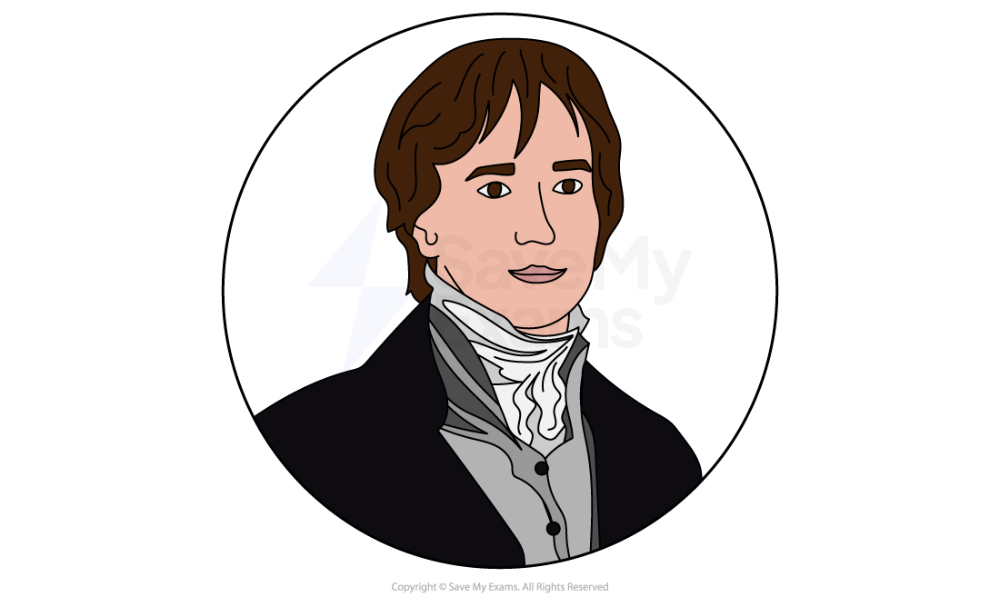
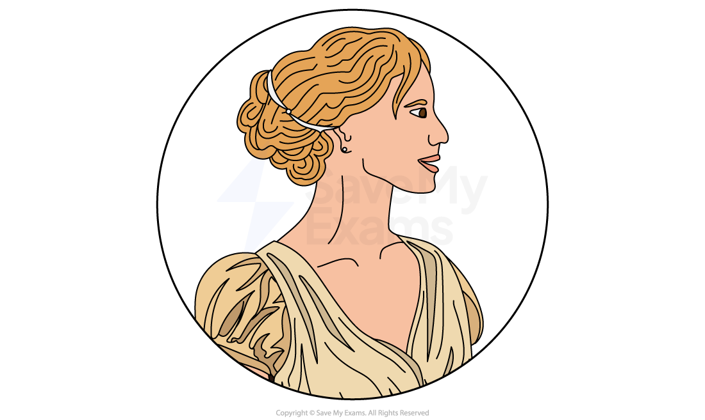
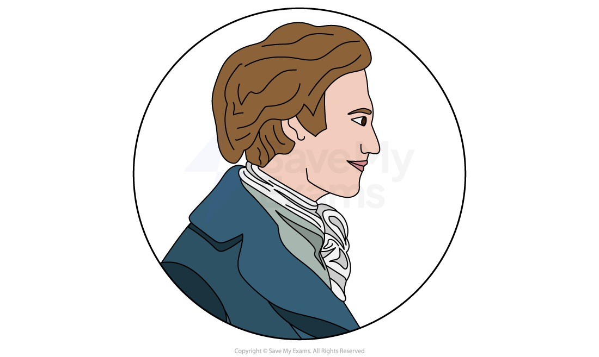
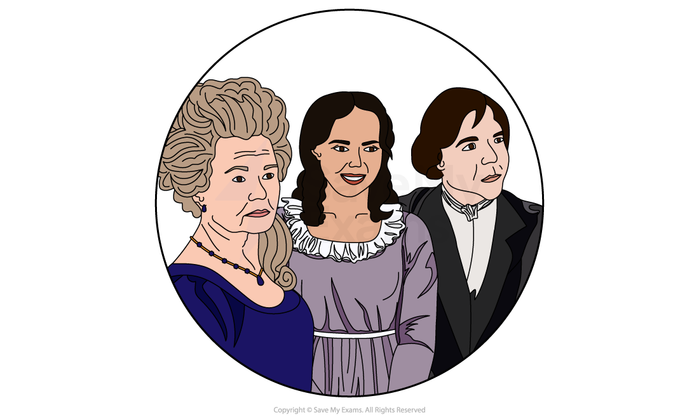

# Pride and Prejudice: Characters

## Pride and Prejudice: Characters

> **Spec point** — `spcpt_SRpFXXV86MSkHQ7c`

## Characters

It is important that you understand the characters in Jane Austen’s Pride and Prejudice as they may represent themes and ideas that were important at the time the novel was written. The story is narrated by a [third-person](https://www.savemyexams.com/glossary/gcse/english-language/third-person/) [omniscient narrator](https://www.savemyexams.com/glossary/gcse/english-language/omniscient-narrator/) and this allows the reader to gain an insight into the thoughts and feelings of the characters. Each character contributes to the novel’s exploration of themes and they can also be [symbolic](https://www.savemyexams.com/glossary/gcse/english-language/symbolism-definition/), representing certain ideas or ideals, so you should consider:

- how characters are established
- how characters are presented via:

  - actions and motives
  - what they say and think
  - how they interact with others
  - what others say and think about them
  - their physical appearance or description
- how far the characters conform to or subvert stereotypes
- the relationships between characters
- what they might represent or [symbolise](https://www.savemyexams.com/glossary/gcse/english-language/symbol/)

Below you will find detailed character profiles for the major characters in Pride and Prejudice, along with a summary of the other significant characters.

**Main characters**

- Elizabeth Bennet
- Mr Darcy
- Jane Bennet
- Mr Bingley

**Other characters**

- Lydia Bennet
- Mr Wickham
- Mr Collins
- Lady Catherine de Bourgh
- Mr Bennet
- Mrs Bennet

> **Exam Hint**
> Examiners report that answers welcomed the chance to **juxtapose** Darcy and Bingley, and that less successful ones were merely a summary of Darcy. Read characters against each other rather than in turn.
> 
> For example, you could write: “Austen has Bingley admire everyone at the ball while Darcy admires nobody, so their manners tell the reader how to judge them”. Explaining what two men’s manners tell the reader is worth far more than a summary of either.

## Pride and Prejudice: Characters: Elizabeth Bennet

> **Spec point** — `spcpt_ZC8qYhv2svbw42ky`

## Elizabeth Bennet

- Elizabeth is the [protagonist](https://www.savemyexams.com/glossary/gcse/english-literature/protagonist-definition/) of the novel and the second daughter of Mr and Mrs Bennet
- She is the most sensible and intelligent of the five sisters and she has a sharp mind:

  - She is an independent thinker and often challenges *societal norms* and expectations
- She is also quick-witted and humorous, especially in conversations with Mr Darcy:

  - Her clever and humorous remarks contribute to the novel’s humour and [irony](https://www.savemyexams.com/glossary/gcse/english-language/irony-definition/)
- Her character is presented as independent and *assertive*, often challenging *societal norms* and expectations:

  - Her refusal to conform to conventional roles from women sets her apart from other characters, including her sisters
  - Her character challenges traditional gender roles by asserting her independence, refusing to marry for convenience and valuing intellectual compatibility when considering a future partner
- Elizabeth possesses a strong sense of *morality* and is not easily swayed by societal pressures, valuing honesty and integrity in her relationships:

  - This is ironic as she begins to admire and sympathise with Mr Wickham and believes his story, despite his lies
  - Elizabeth, while intelligent, is quick to form opinions of people and this can sometimes lead her to form incorrect judgements
  - Her opinions of Mr Darcy and Mr Wickham change as the narrative progresses
- She is initially proud and is also prejudiced toward Mr Darcy due to his perceived arrogance and his disdainful behaviour towards her:

  - She feels he contributed to Mr Bingley’s decision to separate from Jane
- Austen uses Elizabeth’s character to critique society and question the expectations of women while also challenging the rigidity of class distinctions:

  - Through her marriage to Mr Darcy, Austen highlights the importance of love and affection in marriage, rather than convenience or social conformity
- Elizabeth, like Darcy, eventually overcomes her prejudices through self-reflection and a willingness to reassess her initial judgements:

  - Her changing perceptions contribute to the novel’s romantic plot and its resolution
- Elizabeth refuses to marry for convenience or because society expects her to:

  - This is clear when she refuses to marry Mr Collins, despite pressure from her mother
  - This shows a strong sense of *morality* and a refusal to let go of her principles
- She is loyal and family-oriented:

  - Her anger when Jane is heartbroken is evident and this influences her opinions of people and, to an extent, her actions
  - She is concerned about Lydia going to Brighton and the impact of her *elopement* on her family’s reputation

## Pride and Prejudice: Characters: Mr Darcy

> **Spec point** — `spcpt_tGHWhDgVdd3NWPgN`

## Mr Darcy

- Mr Darcy is a wealthy gentleman who is from an upper-class family
- He is initially seen as reserved, aloof and unapproachable which makes other characters initially dislike him:

  - His reserved** ***demeanour* creates an air of mystery and intrigue
  - His reluctance to socialise is misjudged as arrogance
  - This perception contributes to the negative opinions about him in Meryton society
- He snubs Elizabeth by refusing to dance with her:

  - This leads to the main conflict in the novel between Elizabeth and Mr Darcy
- Mr Darcy holds prejudiced views against the Bennet family due to their lower social status and lack of *refinement*:

  - His prejudice influences his initial interactions with Elizabeth and his *disdain* for their social standing and lack of connections affects how he expresses his initial marriage proposal to Elizabeth
- Throughout the novel, his character changes dramatically:

  - This is evident after Elizabeth rejects his marriage proposal and he recognises his flaws and tries to change
- Mr Darcy develops sincere and deep feelings for Elizabeth, despite his initial reservations:

  - His love for Elizabeth becomes a central focus in the novel’s romantic plot
- Mr Darcy takes selfless action by financially securing Lydia Bennet’s marriage to Wickham after their *elopement*:

  - His intervention demonstrates a sense of responsibility and genuine care for Elizabeth and reveals how profoundly his character has evolved
- His letter to Elizabeth reveals a desire to admit his mistakes and provide explanations for his actions:

  - His character contrasts Wickham’s as he displays genuine integrity whereas Wickham charms only to deceive
  - He represents genuine honour and character in contrast to Wickham’s mercenary values and superficiality
- Mr Darcy’s character evolution symbolises a shift in societal expectations and the possibility of change in attitudes toward social class and personal growth
- His love for Elizabeth *redeems* him, enabling him to overcome his prejudices

## Pride and Prejudice: Characters: Jane Bennet

> **Spec point** — `spcpt_DCjPv9TsVJBXHpCj`

## Jane Bennet

- Jane is the elder daughter of the Bennet family:

  - She is also reputed to be the most beautiful of the Bennet sisters, as well as the kindest and most sweet-natured
  - Her kindness and warmth make her loved by those around her
- Her character represents traditional feminine virtues of beauty, gentleness and *resilience*:

  - Her character *embodies* societal expectations for women in the early 19th century
- Her physical attributes and elegance contribute Mr Bingley’s initial attraction to her
- She is optimistic and positive but can be reserved in sharing her feelings:

  - Her inability to express her feelings openly creates a barrier in her relationship with Mr Bingley
- Her feelings for Bingley become a central aspect of the novel’s romantic plot
- Jane sees the best in others even when her sister, Elizabeth, is more critical:

  - She trusts others very quickly and this can sometimes result in her being disappointed and humiliated by people like Miss Bingley
  - Austen deliberately contrasts Jane’s personality with Elizabeth’s
- She adapts to her separation from Mr Bingley with grace and *resilience*:

  - Her calm *demeanour* contrasts with the more dramatic moments involving her sisters including Lydia’s *elopement* with Wickham

## Pride and Prejudice: Characters: Mr Bingley

> **Spec point** — `spcpt_Q5766zFRdNzxFchF`

## Mr Bingley

- Mr Bingley’s purchase of the Netherfield estate is the *catalyst* of the novel
- He is a wealthy and eligible bachelor, which attracts the attention of local society:

  - His wealth and status make him an ideal match for the Bennet sisters
- He is friendly and sociable and impresses everyone he meets
- He is good-natured and lacks the pride that Mr Darcy possesses:

  - His character is a contrast to the more reserved and proud nature of Darcy
- Mr Bingley falls in love with Jane quickly, which shows he is *impulsive* and romantic
- However, he is easily influenced by others, especially by his best friend Mr Darcy and his sisters:

  - This complicates his relationship with Jane and leads him to distance himself from her for a time
  - Darcy and his sister are the reason why he initially leaves Netherfield and stops pursuing Jane
- Despite being influenced by his loved ones, he ultimately makes a decisive choice and proposes to Jane:

  - His evolving relationship with Jane symbolises the changing nature of love and the importance of overcoming barriers for a genuine connection
  - His return to Netherfield and his proposal to Jane contribute to the resolution of the narrative
- Mr Bingley’s character highlights the influence of social class and societal expectations on romantic decisions:

  - His relationship with Jane encounters obstacles due to differences in social status

## Pride and Prejudice: Characters: Other Characters

> **Spec point** — `spcpt_F7ZQ6vFRGdsxxXDg`

## Other characters

### Lydia Bennet

- Lydia is the youngest Bennet sister
- She is flirtatious and *impulsive*:

  - As a character, she constantly craves attention and excitement
  - Her character contrasts with the more reserved behaviour that was expected of young ladies in the society depicted in the novel
- Lydia does not conform to the social expectations of behaviour for young women:

  - She does consider the consequences of her speech or behaviour
  - She pursues pleasure and excitement without regard for the potential consequences, as seen in her *elopement* with Wickham
- She is *fixated* with the military officers garrisoned in Meryton, which leads to her involvement with Mr Wickham:

  - This results in the dramatic [climax](https://www.savemyexams.com/glossary/gcse/english-language/climax-definition/) towards the end of the novel when Lydia elopes with Mr Wickham
- She is self-centred and prioritises her own desires over the reputation of her family:

  - Her *elopement* influences the events surrounding Jane and Elizabeth’s future, which creates narrative tension and complications that Austen has to resolve
- Lydia’s character serves as a warning of the risks and the consequences young ladies face if they behave the way she does:

  - As a result, she has the least successful marriage out of the sisters
- Her behaviour contrasts sharply with that of her sisters Elizabeth and Jane, who are more principled, sensible and mindful of societal expectations

### Mr Wickham

- Mr Wickham arrives in the village as part of the *militia*
- He is initially presented as charming, warm and likeable:

  - He is flirtatious and this creates an initial attraction between him and Elizabeth Bennet
- However, Austen reveals he is manipulative and self-interested, using his charms to deceive:

  - Wickham’s true character is gradually revealed to be less *virtuous* than initially presented
- He possesses the ability to craft convincing narratives that present him as a victim and others as villains:

  - He spreads lies about Mr Darcy to win the sympathy of people around him
  - However, he is proven to be unreliable and *deceptive* and his account of his dealings with Mr Darcy is proven to be untrue
- Wickham is driven by a desire for wealth and status:

  - This is evident when he begins to pay attention to Miss King, who inherited a large sum of money
  - He does not wish to improve his circumstances through honourable means and chooses to marry for money instead
- Ironically, he is forced to marry Lydia Bennet and does not end up as wealthy as he had hoped
- Wickham plays a significant role in the conflict of the story as he initially tries to elope with Mr Darcy’s sister but then succeeds in eloping with Lydia

### Mr Collins

- Mr Collins is a distant cousin of the Bennets and heir to Mr Bennet’s estate:

  - His character highlights the problematic nature of the *entail* system and the consequences of it for the Bennet family
- He provides comic relief in the novel as his manners and speech are deliberately exaggerated by Austen to make him an absurd [caricature](https://www.savemyexams.com/glossary/gcse/english-language/caricature-definition/)

  - He is oblivious to how his behaviour and self-importance are perceived by others
  - His lack of self-awareness contributes to the comedic elements surrounding his character
- He is excessively *deferential* and *subservient*, especially towards those he perceives as socially superior, such as his *patron* Lady Catherine de Bourgh:

  - He constantly boasts about his connections with Lady Catherine and his own clerical position, presenting himself as more important than he actually is
- Mr Collins is also *pompous* and self-important, believing his connections to the nobility are socially advantageous
- Mr Collins is motivated by a desire for social advancement and is eager to align himself with higher social classes:

  - His proposal to Elizabeth Bennet is driven more by societal expectations and Lady Catherine’s advice than genuine affection
- Mr Collins often misinterprets social cues and misunderstands the feelings of those around him:

  - His proposal to Elizabeth, despite her clear lack of regard for him, is a notable example of his lack of insight
- Austen uses Mr Collins as a source of humour in the novel, highlighting the absurdities of social conventions and the consequences of blindly adhering to societal expectations
- Mr Collins serves to illuminate the quality of Elizabeth’s character to the reader; her principles and integrity are contrasted with his *self-aggrandising* behaviour ** **

### Lady Catherine de Bourgh

- Lady Catherine de Bourgh is the aunt of Mr Darcy and Mr Collins’ *patron*
- She is from an upper-class, noble family and believes she is naturally superior:

  - She *embodies* the class prejudices of the time and believes in a rigid social *hierarchy*
- She is arrogant and *condescending*, especially to those who she feels are socially inferior
- She interferes in the lives of others and forces her strong opinions on others:

  - She tries to persuade Elizabeth to reject Mr Darcy’s proposal
- Her character lacks self-awareness and she genuinely seems to believe that her opinions and advice are always correct:

  - She has an exaggerated sense of** ***entitlement*** **and expects others to bow to her wishes and conform to her expectations
- She exhibits a *disdain* for individuals who do not meet her standards of *refinement*:

  - Lady Catherine dismisses the Bennet family due to their lack of wealth and connections
- Her character serves as a target of Austen’s [satire](https://www.savemyexams.com/glossary/gcse/english-language/satire/), highlighting the absurdities of aristocratic *entitlement*
- Lady Catherine adheres strictly to traditional gender roles and societal expectations, insisting on maintaining standards:

  - Her *demeanour* reflects the haughty attitude of the aristocracy

### Mr Bennet

- Mr Bennet is the *patriarch* of the Bennet household
- He is known for his sharp wit and sarcastic humour:

  - He often uses [irony](https://www.savemyexams.com/glossary/gcse/english-language/irony-definition/) to comment on society around him
- Mr Bennet is emotionally detached from his family, particularly his wife and younger daughters:

  - He shares a special bond with his second daughter Elizabeth, as he appreciates her intelligence and humour, often engaging in witty banter with her
- Mr Bennet neglects his role as a responsible father by failing to guide and assume his familial responsibilities
- Mr Bennet often seeks refuge in his library, using books as a means of escaping the realities of family life:

  - His preference for solitude reflects his desire to distance himself from domestic concerns
- Towards the end of the novel, Mr Bennet becomes more reflective and acknowledges the consequences of his earlier decisions:

  - He expresses regret about not guiding his daughters better, particularly in matters of marriage
- Mr Bennet’s calm and rational *demeanour* contrast sharply with the excitable and frivolous nature of his wife, Mrs Bennet:

  - Their differing personalities contribute to the overall humour and comic elements in the novel
- Mr Bennet’s marriage, marked by disappointment and detachment, reflects the consequences of marrying without a true understanding of one’s partner

### Mrs Bennet

- Mrs Bennet is married to Mr Bennet and has five daughters, including Jane, Elizabeth, Mary, Kitty and Lydia
- Mrs Bennet and her husband have contrasting personalities, which contributes to the dysfunction within the Bennet family
- She lacks *tact*** **and *refinement*, frequently embarrassing her daughters with her behaviour and outspokenness:

  - Elizabeth Bennet attempts to resist her mother’s influence and is often embarrassed by Mrs Bennet’s behaviour
- Her character is presented as highly materialistic, valuing wealth and social status over personal compatibility:

  - Her focus on securing wealthy husbands for her daughters reflects the societal pressures of that time
- Mrs Bennet’s main goal is to marry off her daughters to wealthy and eligible suitors:

  - Her obsession with this goal often leads to irrational behaviour and decisions. An example of this is when she makes Jane travel by horseback so she falls ill and stays at Mr Bingley’s house
- Austen presents Mrs Bennet as a caricature:

  - Her exaggerated reactions provide comic relief in the novel
- She reacts strongly to Lydia’s scandalous *elopement* with Mr Wickham, which highlights her fear of social disgrace:

  - However, she also quickly recovers from the scandal once Lydia is married and forgives the couple
  - This emphasises the superficial and materialistic nature of her character
- Mrs Bennet serves as a caricature of maternal concern and portrays the extremes of a mother’s anxiety

#### Sources

Austen, Jane. Pride and Prejudice. Penguin Classics.
