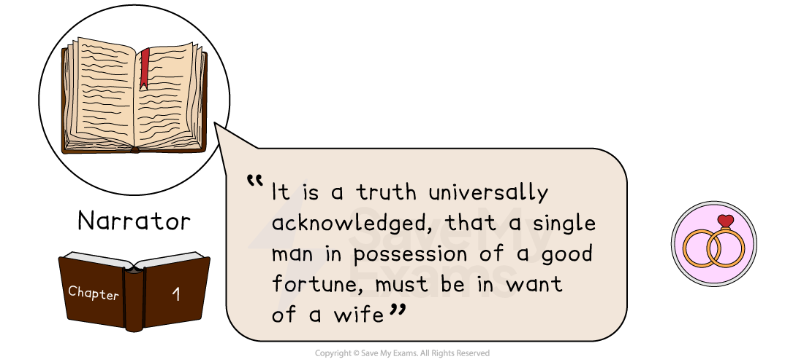
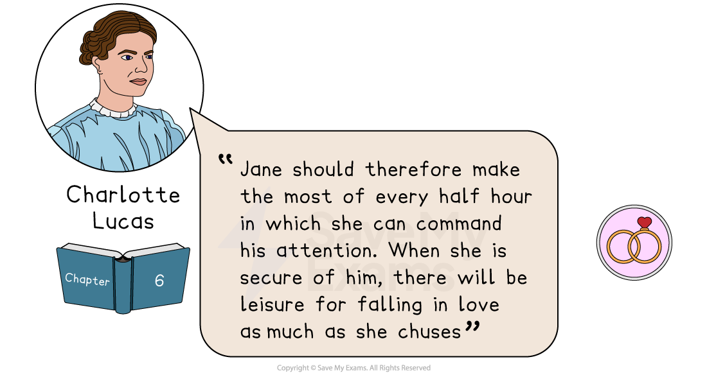
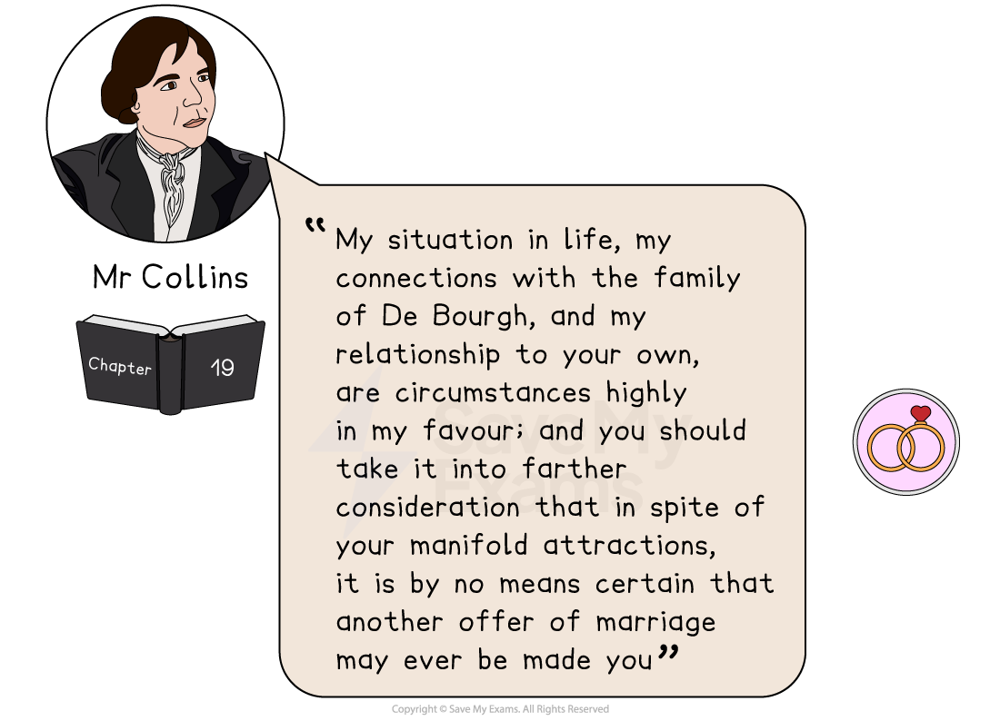
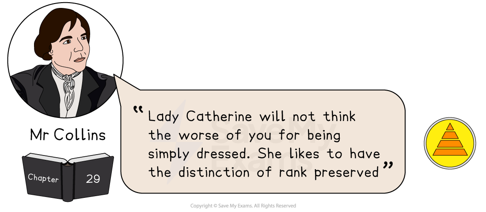
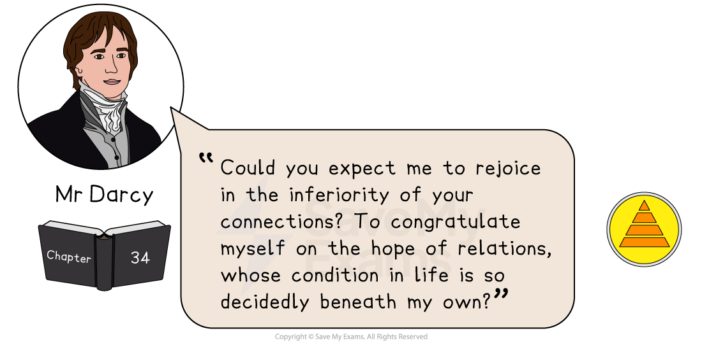
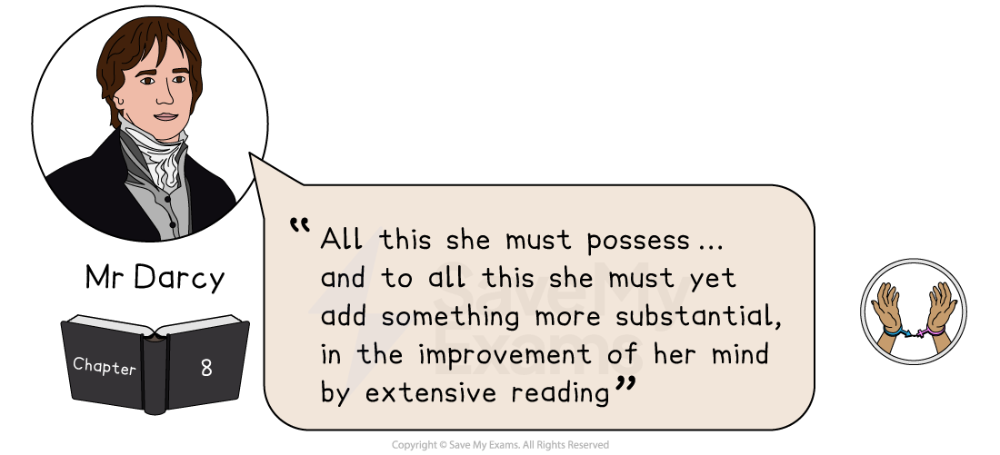
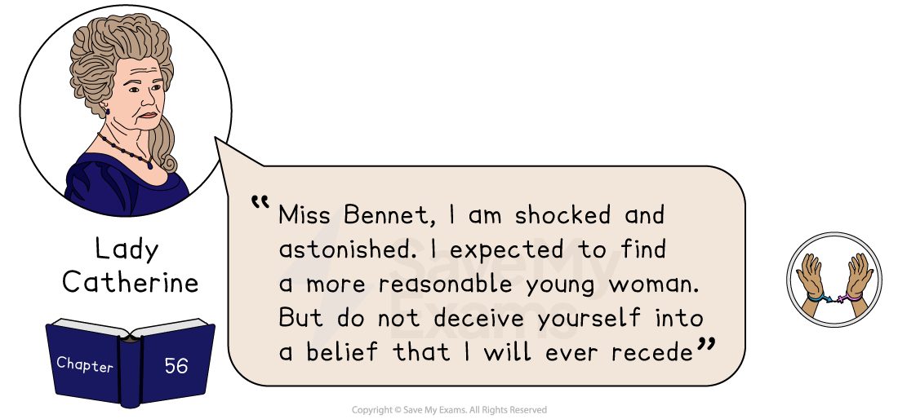

# Pride and Prejudice: Key Text Quotations

## Pride and Prejudice: Key quotations

> **Spec point** — `spcpt_kzzQymhYRhjQjyhj`

## Key quotations

One of the ways to demonstrate your knowledge and understanding of the text is through the effective use of quotations and references to the text. Summarising, paraphrasing, referencing single words and referring to plot events are as valid as using direct quotations.

It is the quality of your knowledge of the text that will enable you to select references effectively. If you are planning to revise quotations, the best way is to group them by character or theme.

Below you will find definitions and analysis of the best quotations, arranged by the following key themes:

- Love and marriage
- *Social class*
- Gender roles

> **Exam Hint**
> Examiners note that answers often overlook the most precise phrases in the extract, naming ‘stupid manner’ and ‘fastidious’ as chances that were missed. Learn short, exact phrases rather than long passages.
> 
> For example, you could write: “Bingley says he would not be so ‘fastidious’ as Darcy, which shows Austen using one word to separate the two men”. A single well-chosen word can carry a point that a long quotation would bury.

## Pride and Prejudice: Key quotations: Love and marriage

> **Spec point** — `spcpt_MdR3qDCPGXHkyS2d`

## Love and marriage

Love is an important theme in the novel and influences many of the decisions the characters make in the story.

**“It is a truth universally acknowledged, that a single man in possession of a good fortune, must be in want of a wife”** – Narrator, Chapter 1

### Meaning and context

- This is the celebrated first line of the novel
- It introduces the central theme of the novel, which is marriage

### Analysis

- The writer uses [satire](https://www.savemyexams.com/glossary/gcse/english-language/satire/)** **and [irony](https://www.savemyexams.com/glossary/gcse/english-language/irony-definition/) to highlight how the universal “truth” might more accurately represent the inherent materialism and underlying social pressures of her society than an absolute truth
- The phrase underlines the importance of socially advantageous marriages for both men and women:

  - The emphasis on “good fortune” as a motivation for marriage highlights the financial nature of marriages during that time
- The quote also introduces the key themes of the novel — marriage and wealth — which are central to the plot

**“Jane should therefore make the most of every half hour in which she can command his attention. When she is secure of him, there will be leisure for falling in love as much as she chuses”** – Charlotte Lucas, Chapter 6

### Meaning and context

- Charlotte and Elizabeth are discussing Jane and Mr Bingley’s relationship
- Charlotte believes that Jane must secure Mr Bingley’s attention and subsequently his affection, rather than being concerned with her own feelings of love

### Analysis

- The quote suggests a strategic and *calculated* approach to marriage, emphasising the importance of making the most of every opportunity to capture a man’s attention
- The use of the phrase “every half hour” suggests that women — in this case, Jane — have limited time to capture a man’s attention:

  - This adds a sense of urgency and turns a *courtship* into a tactical opportunity
  - Charlotte sees Mr Bingley’s time and attention as valuable resources that Jane should use to her advantage
- The phrase “secure of him” serves to underline the importance of marriage to women’s future security:

  - It reflects the pressure that women were under at that time and how a woman’s success and prosperity were intrinsically connected to her *marital* choices
- Charlotte’s advice highlights the tension between *realism* and *idealism*** **in the novel:

  - Charlotte reflects a pragmatic and practical view of marriage whereas Elizabeth represents a more idealistic and romantic perspective on marriage

**“My situation in life, my connections with the family of De Bourgh, and my relationship to your own, are circumstances highly in my favour; and you should take it into farther consideration that in spite of your manifold attractions, it is by no means certain that another offer of marriage may ever be made you”** – Mr Collins, Chapter 19

### Meaning and context

- Mr Collins has decided to propose to Elizabeth Bennet:

  - He feels that it is a suitable match as he is set to inherit Mr Bennet’s estate when he dies
- He also feels that he is a suitable match because Elizabeth’s prospects are narrow due to her lack of fortune and social connections

### Analysis

- Mr Collins begins by emphasising his own excellent situation and good connections:

  - The tone suggests his profound sense of self-importance and entitlement
  - He believes that his association with Lady Catherine de Bourgh makes him a desirable partner
- The quotation highlights how Mr Collins views the marriage as both advantageous and desirable to both:

  - The emphasis on “manifold attractions” is framed more as a matter of practicality than genuine romantic interest
- Mr Collins highlights how Elizabeth should be flattered by his proposal given that his situation in life is superior to hers
- His proposal carries an undertone of manipulation and an attempt to pressure Elizabeth into accepting the proposal:

  - Mr Collins uses the uncertainty of future marriage offers as a means of creating a sense of urgency
- This quote emphasises the expectations society had of women and how they should consider marriages based on practicality and future comfort rather than love:

  - It is a stark contrast with Elizabeth’s values as she values genuine affection and connection in a marriage
- It could be argued that Austen uses Mr Collins’ proposal to mock 19th-century ideas of marriage based on social and monetary advantage rather than emotional connection

## Pride and Prejudice: Key quotations: Social class

> **Spec point** — `spcpt_NCZCSKKQ7PSN8rsz`

## Social class

The theme of *social class* is significant in Pride and Prejudice as it dictates how characters behave and the decisions they make. The writer also criticises *social class* and highlights how it can be a barrier to ultimate happiness.

**“Lady Catherine will not think the worse of you for being simply dressed. She likes to have the distinction of rank preserved”** – Mr Collins, Chapter 29

### Meaning and context

- Elizabeth has gone to visit Charlotte in her *marital* home after her marriage to Mr Collins
- They have all been invited for dinner at the house of his patron, Lady Catherine de Bourgh
- Mr Collins is trying to assure Elizabeth that Lady Catherine will not disapprove of her being “simply dressed”

### Analysis

- This reflects Mr Collins’ inclination to defer to Lady Catherine’s preferences
- The quote suggests that Lady Catherine de Bourgh values distinctions in social rank and expects individuals to dress in a way that reflects their class and rank, reflecting its importance in early 19th-century society:

  - Lady Catherine’s preferences represent the societal norms that characters like Mr Collins feel compelled to reinforce
  - The quote also sets the stage for the conflict between Elizabeth and Lady Catherine later in the novel, where their contrasting views on social rank and expectations become more evident
- It is clear that while Lady Catherine accepts “simply dressed” people, she does not allow the lines to blur between each *social class*; her superiority of rank must be maintained

**“Could you expect me to rejoice in the inferiority of your connections? To congratulate myself on the hope of relations, whose condition in life is so decidedly beneath my own?”** – Mr Darcy, Chapter 34

### Meaning and context

- Mr Darcy has just proposed to Elizabeth and she has rejected his proposal
- This has led to a heated argument where Elizabeth accuses him of ruining her sister’s engagement with Mr Bingley and challenges him on his dealings with Mr Wickham
- Mr Darcy responds angrily to the accusations and highlights how, even though he is in love with her, he is unhappy about marrying her due to her lower status and relations

### Analysis

- Mr Darcy’s words express a clear class prejudice, as he refers to the “inferiority” of Elizabeth’s connections:

  - He reveals his beliefs in a rigid social structure and his sense of superiority based on his own social status and wealth
  - He displays a thinly veiled disgust of Elizabeth’s degrading social connections, which are “beneath” him
- The statement also reveals Mr Darcy’s arrogance and pride at this point in the novel
- Mr Darcy’s words provide insight into the prevailing social expectations that dictated suitable matches based on *social class* and connections:

  - This reflects the societal norms that the upper classes were expected to adhere to in matters of marriage
- This quote is ironic as Mr Darcy has fallen in love with Elizabeth, despite his disdain for Elizabeth’s connections
- While Mr Darcy’s statement appears proud, it also reveals a certain vulnerability in his character:

  - His reluctance to fully embrace a connection with Elizabeth highlights the internal conflict between societal expectations and personal feelings
- The quote highlights the differences in values between Elizabeth, who values personal character and integrity, and Mr Darcy, who places significant importance on social status

## Pride and Prejudice: Key quotations: Gender roles

> **Spec point** — `spcpt_H6bTNppM2THP2rSJ`

## Gender roles

In 19th-century England, there were strict gender roles that both males and females adhered to. The theme of gender roles is important in Pride and Prejudice as the novel explores the expectations and limits placed on women and their dependence on a good marriage for future security.

**“All this she must possess[…] and to all this she must yet add something more substantial, in the improvement of her mind by extensive reading”** – Mr Darcy, Chapter 8

### Meaning and context

- Elizabeth is staying at Netherfield to take care of her sister, Jane, who has been taken ill
- It is the evening and she is sitting with Mr Bingley, his family and Mr Darcy
- A conversation begins about accomplished women and Darcy feels that the phrase “accomplished” is over-used, leading to a heated debate with Elizabeth

### Analysis

- Mr Darcy lists qualities that he feels a woman must possess, indicating specific expectations for an ideal partner:

  - This reflects the societal norms of the time, where women were often judged based on a set of prescribed qualities
- Mr Darcy emphasises that a woman must possess “all this”, suggesting an emphasis on a woman having skills and abilities beyond appearance:

  - It reflects his desire for depth and substance in a partner
  - The quote reflects the societal expectations placed on women to possess a range of qualities, including physical attractiveness and intellectual strength
  - It also implies that a woman’s worth is measured by her ability to meet these expectations
- The quote contributes to the novel’s critique of gender roles by highlighting the wide-ranging expectations of women at that time

**“Miss Bennet, I am shocked and astonished. I expected to find a more reasonable young woman. But do not deceive yourself into a belief that I will ever recede”** – Lady Catherine de Bourgh, Chapter 56

### Meaning and context

- Lady Catherine unexpectedly visits Elizabeth’s home
- She has a heated discussion with Elizabeth where she attempts to make Elizabeth promise not to accept Darcy’s proposal
- Elizabeth claims that he has made no proposal but, if he does, she will do as she wishes, which angers Lady Catherine

### Analysis

- Lady Catherine expresses shock, astonishment and disapproval at Elizabeth’s independent thinking and attempts to coerce her:

  - Lady Catherine has specific expectations of Elizabeth; she must be *submissive*, accept the advice of her superiors and conform to social expectations
- Lady Catherine is attempting to assert her authority and superiority over Elizabeth:

  - However, Elizabeth is not intimidated by Lady Catherine, challenging any notion of her inherent superiority
- Elizabeth’s failure to meet Lady Catherine’s expectations challenges traditional gender roles and expectations
- Lady Catherine stating that she will never “*recede*” implies her refusal to back down, which reinforces the idea that she expects Elizabeth to listen to her

#### Sources

Austen, Jane. Pride and Prejudice. Penguin Classics.
