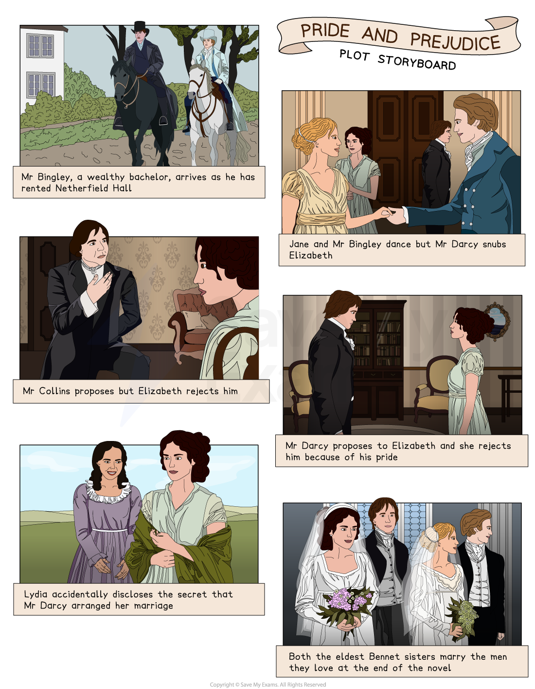

# Pride and Prejudice: Plot Summary

## Pride and Prejudice: Plot Summary

> **Spec point** — `spcpt_8BMyZp9qHqYy4Mkb`

## Plot Summary

One of the most important things you can do in preparation for the exam is to “know” the plot of Pride and Prejudice thoroughly. When you are familiar with all of the key events, you can then link them to larger ideas. Having an in-depth knowledge and understanding of the text will also help you to gain confidence in finding the most relevant references to support your response.

Below you will find:

- **a storyboard of the plot**
- **a general overview of the whole novel**
- **detailed summaries by chapter**

> **Exam Hint**
> Examiners note that answers do best when plot knowledge is used to find evidence rather than recounted. In this novel the useful thing to follow is how **first impressions** are corrected.
> 
> For example, you could write: “Austen has Elizabeth misjudge both Darcy and Wickham, so the plot works by correcting the reader as well as the heroine”. Writing about how a novel corrects its reader as well as its heroine is a point about **structure**.

## Pride and Prejudice: Plot summary: Plot storyboard

> **Spec point** — `spcpt_xR46qrK7qcwQZyjr`

## Pride and Prejudice: Plot storyboard

*Pride and Prejudice plot storyboard*

## Pride and Prejudice: Plot summary: Overview of Pride and Prejudice

> **Spec point** — `spcpt_jDZBq6qcqsPcqvFC`

## Overview of Pride and Prejudice

Published in 1813, but written earlier in 1796-7, Pride and Prejudice is a classic novel set in the fictional village of Meryton in early 19th-century England. The story follows the lives of the Bennet family and in particular Elizabeth, the second eldest daughter.

The novel opens with the news that Mr Bingley, a wealthy and eligible *bachelor***,** has rented a nearby estate called Netherfield Park. The Bennet family attend a ball where Jane (Elizabeth’s sister) and Mr Bingley are immediately drawn to each other and spend most of the evening dancing together. Mr Bingley’s close friend, Mr Darcy, appears distant and cold throughout the evening and refuses to dance with Elizabeth, publicly snubbing her. Mr Bingley makes a positive impact but Mr Darcy is seen as arrogant and proud, especially by Elizabeth.

However, after the ball, Mr Darcy begins to find himself increasingly attracted to Elizabeth Bennet, but her dislike for him increases. Meanwhile, Mr Bingley’s friendship with Jane continues to grow. Mr Collins, a distant cousin and *clergyman*, visits the Bennets. He will inherit Mr Bennet’s estate after he dies. Mr Collins proposes to Elizabeth but she refuses, which hurts his pride and angers Mrs Bennet. The Bennet sisters befriend *militia* officers who are stationed in a nearby town. Elizabeth meets one of the soldiers, Mr Wickham, who tells her that he grew up with Mr Darcy but he was cheated out of his rightful inheritance by him. This increases her dislike of Mr Darcy and she sympathises with the charming Mr Wickham.

Winter arrives and the Bingleys and Mr Darcy leave Netherfield to return to London, leaving Jane disappointed. Elizabeth is shocked to find out that her best friend, Charlotte, is engaged to Mr Collins. Charlotte marries Mr Collins and Elizabeth promises to visit them at their home. Jane goes to London, hoping to see Mr Bingley, but she is unsuccessful.

Elizabeth decides to visit Charlotte’s new home the following spring and meets Mr Collins’ patron, Lady Catherine de Bourgh. Lady Catherine is also Mr Darcy’s aunt. Mr Darcy and Elizabeth meet at Lady Catherine’s home. Mr Darcy visits the Collins’ home regularly. During one of these visits, he proposes to Elizabeth, which shocks her. However, she rejects him and Mr Darcy leaves upset but shortly after gives her a letter. In the letter, he clarifies the things Elizabeth accused him of relating to his treatment of Mr Wickham.

Shocked by what she has read, Elizabeth begins to reflect on her feelings for Mr Darcy as well as her feelings for the deceitful Mr Wickham. Despite Elizabeth’s reservations, Mr Bennet gives Lydia his permission to spend the summer with an acquaintance in Brighton where some of the *militia*, including Wickham, will be staying. Elizabeth goes travelling with her relatives, the Gardiners, and they stop near Pemberley, which belongs to Mr Darcy, and Elizabeth agrees to visit his estate. While she is there, Mr Darcy arrives and behaves with great charm and kindness towards her and the Gardiners.

Elizabeth then receives a letter with distressing news about her youngest sister Lydia, who has *eloped* with Mr Wickham and cannot be traced. Elizabeth and the Gardiners decide to leave to return home and Mr Darcy bids them farewell.

When they arrive home, Mr Bennet returns home unsuccessfully but a letter from Mr Gardiner shortly follows that says that he has found the missing couple and that Mr Wickham has agreed to marry Lydia, accepting a small annual income. Mr Bennet and the daughters believe that Mr Gardiner has generously paid off Mr Wickham but when Lydia and Mr Wickham arrive at Longbourn, the Bennets’ home, Elizabeth finds out that it was Mr Darcy who arranged the hasty marriage and begins to reflect on what she has lost in refusing to marry him.

Mr Wickham and Lydia leave Longbourn and Mr Bingley makes a surprise return to Netherfield, and visits the Bennets. He proposes to Jane and she accepts. One evening, Lady Catherine de Bourgh arrives unexpectedly, demanding that Elizabeth must promise never to accept a proposal to marry Mr Darcy. Elizabeth refuses. Lady Catherine leaves in anger. Shortly afterwards, Mr Darcy and Elizabeth walk together and he renews his proposal. Elizabeth happily accepts and both sisters marry at the end of the novel.

## Pride and Prejudice: Plot summary: Chapter-by-chapter plot summary

> **Spec point** — `spcpt_NdBMzwKgcV4vgXfT`

## Pride and Prejudice: Chapter-by-chapter plot summary

### Chapters one and two

- Mr and Mrs Bennet live near the village of Meryton at their estate, Longbourn, with their five unmarried daughters
- They hear news that a wealthy and eligible *bachelor* called Mr Bingley has rented nearby Netherfield Park
- Mrs Bennet is overjoyed and excited about the prospect of a potential match with Mr Bingley for one of their daughters

### Chapters 3–6

- Mr Bingley attends a ball with his guests, including Mr Darcy
- Jane and Mr Bingley are instantly attracted to one another and they dance together
- Mr Darcy refuses to dance with Elizabeth
- Everyone dislikes Mr Darcy, including Elizabeth
- Darcy becomes attracted to Elizabeth and begins to pay her attention, which surprises her, and he later tells Mr Bingley’s sister that he has begun to admire Elizabeth

### Chapters 7–10

- Jane receives a note inviting her to Netherfield Park and Mrs Bennet sends Jane on a horse rather than in a carriage, making her ill
- Jane is forced to remain at Netherfield and Elizabeth stays to care for her
- In the evenings, Mr Darcy’s admiration for Elizabeth increases
- Miss Bingley becomes jealous of Darcy’s admiration for Elizabeth and tries to impress him while also mocking the Bennet family

### Chapters 11–15

- The next morning, Elizabeth and Jane leave Netherfield and return home
- Mr Bennet receives a letter and informs his wife that his heir, Mr Collins, will be visiting
- Mr Collins indicates he plans to marry one of Mr Bennet’s daughters and is directed to Elizabeth
- The Bennet sisters, accompanied by Mr Collins, walk to Meryton where they meet Mr Wickham, a charming soldier
- Mr Darcy and Mr Bingley pass through the village and Elizabeth notices the cold civility between Mr Wickham and Mr Darcy

### Chapters 16–19

- At the Phillips’ dinner party, Wickham tells Elizabeth about his past and how Darcy robbed him of his rightful inheritance
- Elizabeth is charmed by Mr Wickham and initially inclined to believe his account, though Jane remains cautious
- The next day, Elizabeth talks to Jane about how she feels but Jane suggests that there might be a misunderstanding between Darcy and Wickham
- Mr Bingley sends an invitation to his ball and Elizabeth is disappointed when Mr Wickham does not attend
- Mr Collins and Mr Darcy both ask Elizabeth to dance and she accepts Darcy’s offer to question him on his relationship with Wickham
- Various members of the Bennet family, including Mrs Bennet and Mary, embarrass themselves at the ball
- The next day, Mr Collins proposes to Elizabeth but she refuses him

### Chapters 20–25

- Mrs Bennet is infuriated at Elizabeth’s refusal but Mr Bennet is pleased
- Mr Collins announces that he will be leaving Longbourn shortly
- Jane receives a letter from Caroline Bingley, informing her that they will be leaving Netherfield to spend the winter in London
- Caroline suggests that her brother Charles may marry Mr Darcy’s sister, which upsets Jane
- Elizabeth learns that Mr Collins has proposed to Charlotte and that she has accepted
- A second letter from Caroline Bingley arrives, stating that Mr Bingley will not return to Netherfield from London
- Elizabeth grows angry with Bingley and Darcy and is drawn to Wickham
- Mr and Mrs Gardiner, Mrs Bennet’s brother and sister-in-law, arrive for Christmas
- Mrs Gardiner invites Jane to stay with them in London to divert her from her heartache and Jane agrees

### Chapters 26–29

- In London, Jane has an unpleasant meeting with Miss Bingley, who confirms Bingley’s lack of interest in her
- Elizabeth notices that Wickham is paying more attention to Miss King, who has recently inherited a fortune, and distances herself from him as a result
- Elizabeth travels to Hunsford to visit Charlotte and Mr Collins, stopping first to stay with the Gardiners in London
- The Gardiners invite Elizabeth to travel with them to northern England in the summer and Elizabeth agrees
- Elizabeth arrives at Hunsford and is warmly welcomed by Charlotte
- Charlotte’s father and sister Maria are also visiting and they are all invited to dine at Rosings with Lady Catherine de Bourgh, Darcy’s aunt
- Lady Catherine criticises Elizabeth’s upbringing and education

### Chapter 30–33

- Charlotte’s father leaves Hunsford and Elizabeth and Charlotte spend the remainder of her visit attempting to avoid Mr Collins
- The group regularly dine with Lady Catherine at Rosings and news arrives that Mr Darcy and his cousin Colonel Fitzwilliam will be visiting
- Elizabeth finds the Colonel pleasant and Mr Darcy distant
- Darcy and the Colonel visit the Collins’ home over the next several days
- During a walk, Elizabeth meets the Colonel and he comments on how Darcy’s friendship with Bingley recently saved him from a bad engagement
- Elizabeth realises that Darcy is the reason for her sister’s pain and is distressed by this revelation
- She does not attend Lady Catherine’s for dinner that night

### Chapters 34–37

- Elizabeth is alone for the evening and Darcy enters, declares his love for her and proposes, which shocks Elizabeth
- He lists reasons why she is not a good choice for him, mentioning her lower social status and family reputation
- Elizabeth, insulted, refuses his proposal and forcefully explains the reasons for her refusal; Darcy leaves angrily
- The following morning, Darcy finds Elizabeth during her walk and hands her a letter
- In the letter, Darcy explains why he separated Bingley from Jane (he thought her indifferent to him) and outlines his history with Wickham and how he planned to elope with his 15-year-old sister
- Elizabeth believes Darcy’s revelations about Wickham

### Chapters 38–41

- Elizabeth and Maria return home and Jane joins them from London
- On their way home, Jane and Elizabeth meet Lydia and Kitty at an inn; they are upset about the *militia* leaving
- Lydia longs to spend the summer at Brighton where the *militia* will be stationed
- At home, Elizabeth tells Jane everything that happened (excluding the news about Bingley) and they decide to keep the information about Wickham private
- Lydia receives an invitation from an acquaintance to spend the summer in Brighton
- Elizabeth warns her father about the plan but Mr Bennet believes that she will be supervised
- Elizabeth meets Wickham a final time before he departs and she reveals that she knows the truth about him

### Chapters 42–45

- Elizabeth travels north with the Gardiners and they stop at Pemberley, Darcy’s magnificent estate
- Elizabeth agrees to a tour of his house, believing him to be away, but is surprised when he returns unexpectedly
- Darcy arrives and he is kind and welcoming
- The Gardiners are delighted by his manners and Elizabeth finds his changed behaviour remarkable
- Elizabeth meets Darcy’s sister, Georgiana, the next day
- Darcy invites Elizabeth and the Gardiners to dinner at Pemberley with the Bingleys
- Caroline Bingley tries to insult Elizabeth but Darcy comments on Elizabeth’s beauty

### Chapters 46–49

- Elizabeth receives letters from Jane informing her that Lydia has** ***eloped* with Wickham and that Mr Bennet cannot find the couple
- Elizabeth and the Gardiners prepare to return home upon learning of Lydia’s elopement; Mr Gardiner leaves to help with the search
- Elizabeth meets Darcy and shares the news; they blame themselves for not having exposed Wickham in the past
- Elizabeth and the Gardiners return home
- Mr Bennet returns home, unsuccessful in his search for the couple
- Mr Gardiner sends a letter indicating that Wickham and Lydia have been found and a marriage arranged, in return for a small income
- Mr Bennet agrees to the condition but fears that he will never be able to repay Mr Gardiner, who he thinks has bribed Wickham with a much larger sum

### Chapters 50–53

- Elizabeth’s feelings for Darcy have changed but she fears the impact of Lydia’s scandal on his feelings for her
- Lydia and her new husband, Wickham, arrive at the Bennet’s house and Elizabeth is disgusted by their behaviour
- Lydia boasts about her marriage and accidentally discloses that Darcy was involved in their wedding
- Elizabeth writes to Mrs Gardiner for confirmation of Lydia’s account and** **Mrs Gardiner reveals Darcy’s involvement in arranging Lydia and Wickham’s marriage and paying Wickham
- Lydia and Wickham leave for his new military posting and Bingley returns to Netherfield with Darcy

### Chapters 54–57

- Bingley visits the Bennets several times and when he proposes to Jane during one of his visits, she happily accepts
- Lady Catherine makes a surprising visit to Longbourn to speak privately with Elizabeth
- She wants Elizabeth to promise never to marry Darcy but Elizabeth refuses and Lady Catherine leaves, outraged
- Mr Bennet receives a letter from Mr Collins mentioning the *prospective* engagement, which he finds absurd

### Chapters 58–60

- Darcy and Bingley visit and Elizabeth and Darcy walk together; she thanks Darcy for his help in saving Lydia
- Darcy reveals he intervened in Lydia’s situation out of love for Elizabeth
- He proposes to her again; she gladly accepts his proposal

### Chapter 61

- In the final chapter, it is revealed that Jane and Bingley buy a home near Pemberley
- Jane and Elizabeth visit each other regularly and Elizabeth is close to Georgiana
- Kitty matures as she spends more time with her older two sisters
- Lydia and Wickham’s marriage is unsuccessful and they ask her family for money regularly

#### Sources

Austen, Jane. Pride and Prejudice. Penguin Classics.
