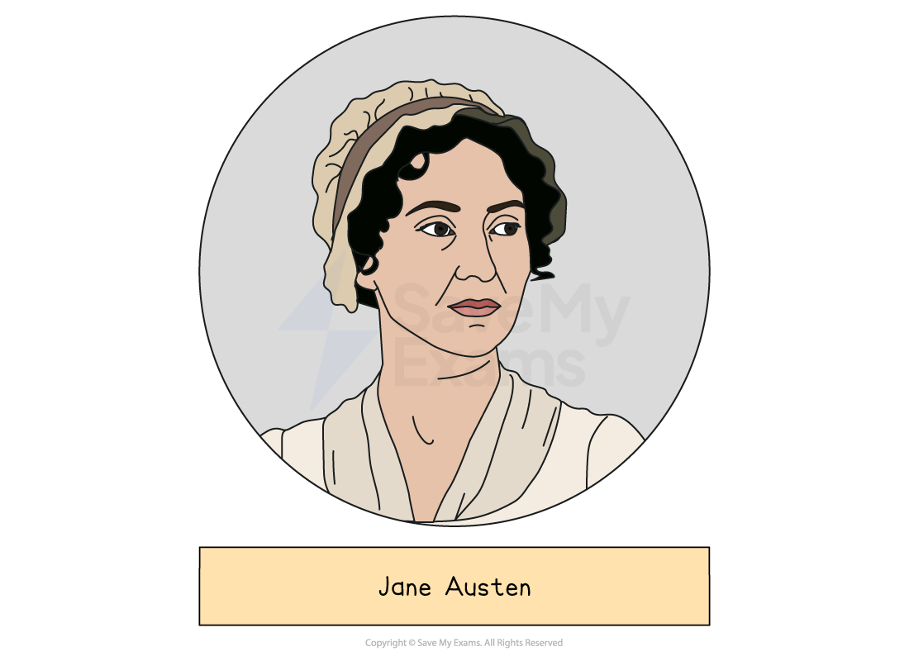
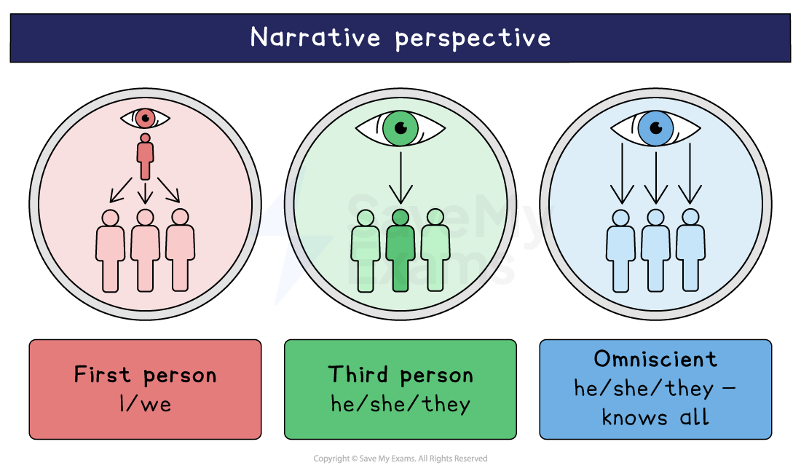

# Pride and Prejudice: Writer's Methods and Techniques

## Pride and Prejudice: Writer's methods and techniques

> **Spec point** — `spcpt_Kgq8zjjybjsVyxWz`

## Writer’s Methods and Techniques

‘Methods’ is an umbrella term for anything the writer does on purpose to create meaning. Using the writer’s name in your response will help you to think about the text as a conscious construct and will keep reminding you that Austen purposely put the novel together. Below you will find sections on:

- **Tone**
- **Third-person omniscient narrator**
- **Style**

> **Exam Hint**
> Examiners report that many answers missed the chance to analyse Austen’s language in detail. Her method is precision, so single words repay attention.
> 
> For example, you could write: “Austen has Darcy call Elizabeth merely ‘tolerable’, and one word is enough to establish his pride”. Showing how a single adjective does the work of a whole paragraph is exactly the close analysis examiners are asking for.

The best responses take a whole-text approach to studying Pride and Prejudice. By expanding your analysis beyond single plot events or analysis of specific words or phrases, you can demonstrate your understanding of the range of methods and techniques that Austen uses across her novel. Here are some insights into Austen’s style of writing:

- Tone
- [Third-person](https://www.savemyexams.com/glossary/gcse/english-language/third-person/) [omniscient narrator](https://www.savemyexams.com/glossary/gcse/english-language/omniscient-narrator/)
- Style

## Pride and Prejudice: Writer's methods and techniques: Tone

> **Spec point** — `spcpt_pzcSbs4F32gQqHVt`

## Tone

- The tone of Pride and Prejudice is generally [satirical](https://www.savemyexams.com/glossary/gcse/english-language/satire/) and** ***ironic*, which has a humorous effect:

  - Austen offers a critique of the social norms, *etiquette* and marriage expectations prevalent in the early 19th century
  - The novel serves as a social commentary on the rigid class structure, the *materialism* of society and the limitations placed on women
- The critical, satirical tone extends to social issues, implying that having wealth or social status doesn’t contribute to the integrity or intelligence of a person:

  - Austen created the character of Mr Collins to serve as a satirical commentary on social climbing and to highlight the *folly* of individuals in a society that prioritises social rank and wealth over genuine connections
  - Austen also uses the character of Mr Collins as a source of comic relief and his *obsequious*** **behaviour towards Lady Catherine contributes to the satirical tone of the novel
  - Through [satire](https://www.savemyexams.com/glossary/gcse/english-language/satire/) and humour, Austen serves to criticise 19th-century society’s emphasis on superficial qualities and the absurdity of certain social conventions
- The novel provides incisive social commentary on the restrictions placed on women during the early 19th century:

  - Marriage is presented as the sole opportunity for women to achieve financial security and happiness and this is evident from Mrs Bennet’s extreme reaction to Elizabeth’s refusal of Mr Collins’ proposal
  - Her [caricatured](https://www.savemyexams.com/glossary/gcse/english-language/caricature-definition/) behaviour, which is often hysterical and exaggerated, serves as a source of humour and satire; her sole obsession is the successful settlement of her daughters through marriage
- Austen creates comic caricatures to embody the** materialistic**,** ***self-aggrandising*** **values she wishes to **satirise**:

  - Mr Collins approaches marriage as a practical and societal obligation; Lady Catherine views marriage as a means of preserving social status; and Mrs Bennet is determined to secure her daughters’ futures, even if it is at the expense of their happiness
  - These [caricatures](https://www.savemyexams.com/glossary/gcse/english-language/caricature-definition/) reflect the prevailing attitudes during the Georgian and Regency period
  - Through their comically exaggerated behaviour and attitudes, Austen highlights the *superficiality* of social expectations of marriage

## Pride and Prejudice: Writer's methods and techniques: Third-person omniscient narrator

> **Spec point** — `spcpt_tJWgjXWRGmBk22YS`

## Third-person omniscient narrator

Writers use narrative perspective to shape the story, convey themes and engage readers. In Pride and Prejudice, Austen chooses a third-person, [omniscient](https://www.savemyexams.com/glossary/gcse/english-language/omniscient-narrator/) narrator to provide a detailed portrayal of characters and events in this *comedy of manners*. This type of narrator is external to the story, providing a broader perspective and reducing the influence of individual characters’ *biases*.

- The novel is narrated by a third-person omniscient narrator:

  - The narrator has access to the thoughts and feelings of characters and conveys these to the reader
- The narrator frequently adds commentary about characters, shaping the reader’s **perception**:

  - For example, both Lydia and Catherine (Kitty) Bennet are described as “ignorant, idle and vain”
- However, even though the narrator has access to every character’s internal thoughts and feelings, events are usually told from Elizabeth’s point of view:

  - The writer uses *free indirect discourse* as a narrative technique to present Elizabeth’s intimate thoughts or feelings
- By using third-person [narration](https://www.savemyexams.com/glossary/gcse/english-language/narrative/) and *free indirect discourse*, Austen reveals how characters, including Elizabeth, make assumptions and errors in judgement (such as her initial impressions of Darcy and Wickham)

  - The third-person narrator reminds readers that characters’ perceptions may not always be accurate
- Austen presents Elizabeth’s tendency to quickly form judgements and the narrative techniques mirror the major conflict she faces:

  - The narrative perspective plays a role in reflecting the development of Elizabeth’s character as she tries to overcome her own prejudices and learns to change her initial judgements

## Pride and Prejudice: Writer's methods and techniques: Style

> **Spec point** — `spcpt_hgBgtB3Tpm739BBH`

## Style

The style of Pride and Prejudice is significant to the novel’s success. Drawing on the realism of her setting, she uses this *comedy of manners* as a vehicle to critique and **satirise** the behaviour of her characters and their society.

- The overall style of Pride and Prejudice is *ironic* and witty:

  - The narrator frequently makes remarks that may convey one meaning but actually imply another
- The title of the novel itself is *ironic*:

  - Austen assigns these characteristics to both of the main characters, Elizabeth and Mr Darcy, and yet they are unaware of their flaws, their pride and prejudice
  - The title encourages readers to explore the *nuances* of these traits and the complexities of human nature
  - Mr Darcy and Elizabeth’s initial pride and prejudice create a plot dynamic that drives the narrative events forward from mutual mistrust to love
  - The development of their relationship is marked by the revelation of their true characters
  - Alongside the use of abstract nouns “pride” and “prejudice”, Austen explores abstract ideas such as judgement, civility and hope, often presenting them as universal values
- The famous verbal [irony](https://www.savemyexams.com/glossary/gcse/english-language/irony-definition/) of the opening line of the novel reveals Austen’s style: “It is a truth universally acknowledged, that a single man in possession of a good fortune, must be in want of a wife”:

  - The line appears to state a social truth, but in fact mocks the assumption that wealthy men must be eager to marry
- Elizabeth also uses verbal irony to mask her true feelings in certain situations, which is evident when she states that “Mr Darcy has no defect”; her remark is sarcastic
- The use of [dramatic irony](https://www.savemyexams.com/glossary/gcse/english-literature/dramatic-irony-definition/) also** **contributes to Austen’s humorous tone as readers are often aware of information that the characters are not:

  - Characters who lack self-awareness, like Mrs Bennet and Mr Collins, make statements *contradicting* the reality of the situation
  - For example, Mr Collins’ insincere flattery includes excessive compliments and** ***verbose* language, adding to the humorous effect as Elizabeth recoils from such behaviour
  - For example, readers may know about Mr Darcy’s growing affection for Elizabeth, even when she is unaware of it. An example of this is when he watches her play the piano and she thinks he is trying to intimidate her
- Austen also uses **situational irony**, which is evident at points in the novel:

  - When Mr Darcy begins to fall in love with Elizabeth when he previously declared that he was not interested in her
  - Lady Catherine assumes she can control the course of others’ lives but her attempts to influence Elizabeth’s decisions are ultimately unsuccessful
- Austen’s *ironic* style adds to the comic elements in the novel

#### Sources

Austen, Jane. Pride and Prejudice. Penguin Classics.
