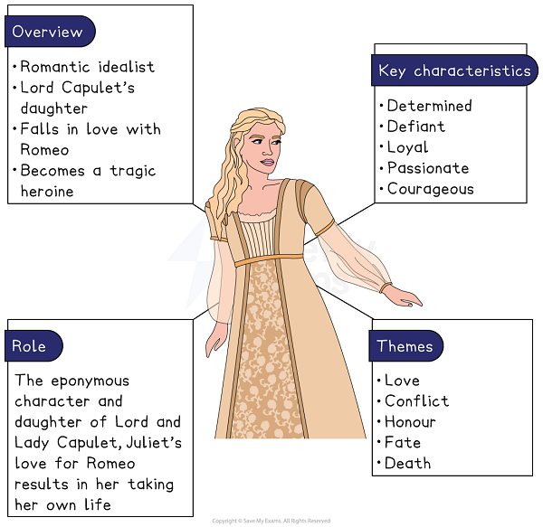
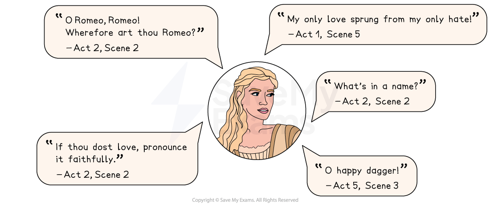

# Juliet Character Analysis

Juliet is a determined, cautious and defiant character whose deep love for Romeo makes her defy her family and societal expectations, which results in her tragic end.

## Romeo and Juliet: Juliet Character Analysis: Juliet character summary

> **Spec point** — `spcpt_BZVwZMhthJxq5jx6`

## Juliet character summary

*Juliet character summary*

## Romeo and Juliet: Juliet Character Analysis: Why is Juliet important?

> **Spec point** — `spcpt_XD4PYCrXxbFBNT8p`

## Why is Juliet important?

At different parts of the play, Juliet is depicted as:

- **Innocent **and **obedient**: at the outset of the play, Juliet is presented as a young girl who dutifully follows her parents’ wishes. She initially has little interest in love or marriage and responds to her mother’s suggestion of marrying Paris with politeness: “It is an honour that I dream not of”
- **Romantic **and **idealistic:** after meeting Romeo, Juliet transforms into a more romantic and idealistic character. Her love for Romeo is portrayed as sincere and intense, quickly overtaking her duty to her family
- **Impulsive **and **disobedient**: like Romeo, Juliet’s impulsive nature begins to emerge as her love for him deepens. On the balcony she urges Romeo to “Deny thy father and refuse thy name”. She becomes impetuous and decisive when she marries Romeo in secret without her parents’ permission and this disobedience marks a change in her character. Her impulsive decisions, such as drinking the sleeping potion to avoid marrying Paris, stem from her desperation to be with Romeo even at great personal cost

> **Exam Hint**
> Examiners praise answers that follow Juliet’s **evolving** relationship with Romeo by linking its start to its end. Her situation with her family is equally productive.
> 
> For example, you could write: “Juliet speaks in shared rhyme with Romeo when they meet and speaks alone by the end, so Shakespeare shows her losing everyone she can talk to”. Following the way a character’s speech changes is one of the strongest kinds of analysis you can offer.

## Romeo and Juliet: Juliet Character Analysis: Juliet's use of language

> **Spec point** — `spcpt_T95kwsM75G5kw6X5`

## Juliet’s use of language

The language Shakespeare uses for Juliet — elevated [iambic pentameter](https://www.savemyexams.com/glossary/gcse/english-literature/iambic-pentameter-definition/), rhyming verse and her use of *celestial* [imagery](https://www.savemyexams.com/glossary/gcse/english-language/imagery-definition/) — reflects her passionate and romantic nature.

- Iambic pentameter** **and [*rhymed verse*](https://www.savemyexams.com/glossary/gcse/english-language/rhyme/):** **Juliet often speaks in iambic pentameter which gives her dialogue a rhythmic and elevated tone. This formal style aligns with her status as a noble and romantic heroine. Juliet’s early language reflects her innocence and childish ways. Upon finding out about her possible betrothal, she is non-committal: “But no more deep will I endart mine eye / Than your consent gives strength to make it fly”. Her use of rhymed verse in scenes like the balcony scene convey her youthfulness and idealism, as well as her intense love for Romeo
- *Celestial*  imagery:** **Juliet’s language is often filled with romantic, *celestial* imagery which reflects the transformation she undergoes after falling in love with Romeo. Initially innocent and obedient, she later adopts a more passionate nature. For example, when she states: “When I shall die / Take him and cut him out in little stars” she is suggesting that his appearance and love is so radiant that it deserves to be immortalised in the heavens. Her use of *celestial* imagery reflects the intensity of her love and her idealisation of Romeo
- **Emotive**:** **as the play progresses, Juliet’s language, like Romeo’s, becomes more emotional and urgent, reflecting her growing desperation. Her soliloquies, particularly the one before she takes the sleeping potion, reveal her deep fear: “I have a faint cold fear thrills through my veins”

### Juliet key quotes

*Juliet key quotes*

## Romeo and Juliet: Juliet Character Analysis: Juliet character development

> **Spec point** — `spcpt_q2jm6KsRYNfrGBbG`

## Juliet character development

| **Act 1, Scene 3** | **Act 2, Scene 2** | **Act 3, Scene 2** | **Act 4, Scene 3** |
|---|---|---|---|
| **Juliet’s innocence:** In her first appearance, Juliet is introduced as an obedient girl unfamiliar with love and uninterested in marriage. This scene conveys Juliet’s innocence and her conformity to both family and societal expectations. | **The balcony scene: **Juliet reveals her love for Romeo but struggles between her love for him and her loyalty to her family. Her [soliloquy](https://www.savemyexams.com/glossary/gcse/english-literature/soliloquy-definition/), “O Romeo, Romeo! Wherefore art thou Romeo?” questions the significance of a name and conveys her idealistic beliefs about love. This scene signifies her growing independence. | **Juliet’s desperation:** Upon hearing of Tybalt’s death and Romeo’s banishment, Juliet becomes grief-stricken and increasingly desperate. This scene marks a turning point in Juliet’s character. | **Juliet’s fear:** Juliet delivers a soliloquy just before taking the sleeping potion. Her language becomes increasingly emotional and fragmented as she considers the horrific possibilities of the potion killing her or waking up in the tomb and going mad. |

## Romeo and Juliet: Juliet Character Analysis: Juliet character interpretation

> **Spec point** — `spcpt_wkSGypH9Gws4RRxj`

## Juliet character interpretation

### Juliet and the patriarchy

During Shakespeare’s era, society was predominantly patriarchal with women’s futures typically controlled by their fathers. Juliet is only 13 years old, but marriage at such a young age was not uncommon during the period in which the play is set. Marriage was considered a sacred union ordained by God and viewed as the foundation of society, with its breakdown seen as a danger to social order. Arranged marriages were common, especially among wealthy families where parents selected spouses for their children to secure social and  economic advantages. Daughters like Juliet were often used as a means to elevate family status and wives were expected to obey their husbands. Juliet’s refusal to marry Paris and her defiance of her father highlight the patriarchal structure of the Capulet family and the societal expectations of the time. Juliet’s defiance in refusing to marry Paris would have likely shocked a contemporary audience as her behaviour would have been seen as rebellious and disrespectful.

#### Sources

Stanley Wells and Gary Taylor (eds), 2005, The Oxford Shakespeare: The Complete Works (Second Edition), Oxford University Press
