# Romeo & Juliet: Key Text Quotations

## Romeo and Juliet: Key quotations

> **Spec point** — `spcpt_jq3tMHgz9K8tcC9w`

## Key Quotations

The best way to revise quotations is to group them by character, or theme. Below you will find definitions and analysis of the best quotations, arranged by the following themes:

- **Love**
- **Conflict**
- **Honour**
- **Fate**

## Romeo and Juliet: Key Quotations: Love

> **Spec point** — `spcpt_Nxf45sqBDxrDnSWx`

## Love

Romeo and Juliet is known for its theme of love. However, as the play’s ending suggests, it is a tragic tale of woe and conflict, a tale about a love that was forbidden because of a family grudge.

### Paired quotations

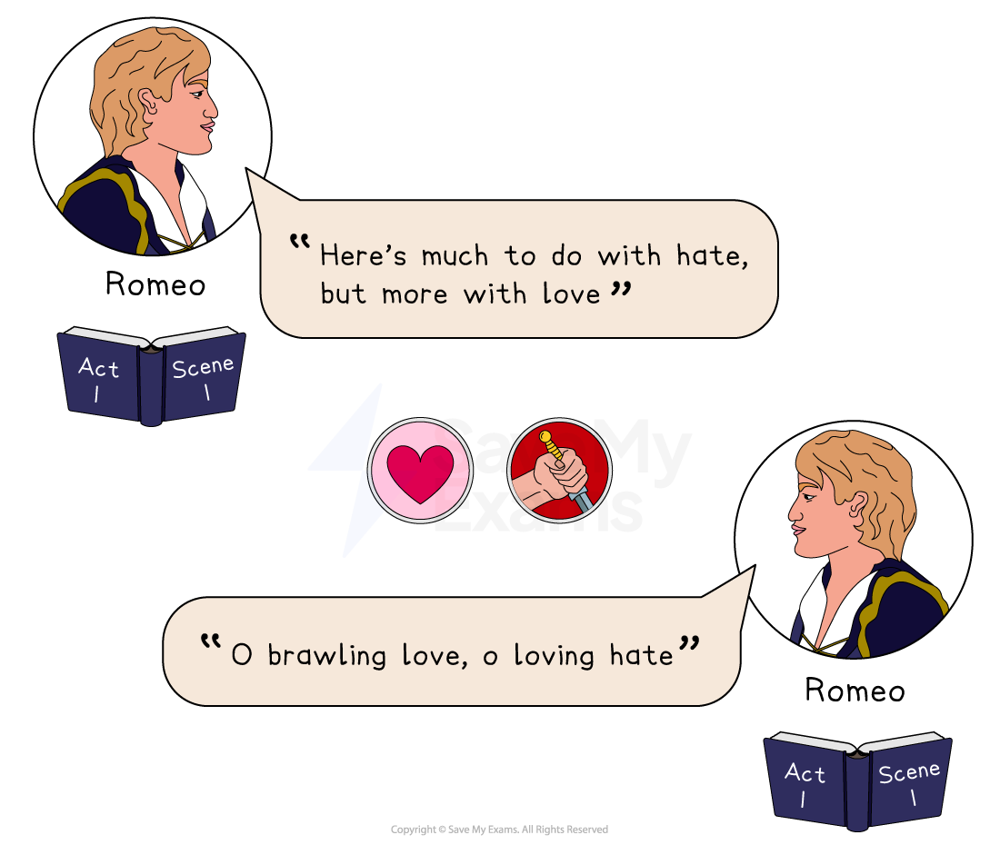

*Paired quotations from Act 1 Scene 1*

**“Here’s much to do with hate, but more with love” **– Romeo Montague, Act 1, Scene 1

**“O brawling love, o loving hate” **– Romeo Montague, Act 1, Scene 1

#### Meaning and context

- In the first scene when Benvolio informs Romeo there has been a fight, Romeo tells Benvolio he believes the *feud* is fuelled by hatred stemming from love
- Shortly after discussing the *feud*, Romeo confides in Benvolio about his deep thoughts that love is painful and difficult

#### Analysis

- Audiences are introduced to Romeo as a character who understands the connections between love and hate
- This scene, focusing on Romeo’s heartbreak, [juxtaposes](https://www.savemyexams.com/glossary/gcse/english-language/juxtaposition-definition/) the preceding fight scene, showing love and hate side by side
- Romeo uses an  [oxymoron](https://www.savemyexams.com/glossary/gcse/english-language/oxymoron-definition/)** **(“loving hate”) to show his contrasting feelings, beautifully describing his inner conflict and the strength of his feelings
- The parallels drawn by Romeo at the start of the play  [foreshadow](https://www.savemyexams.com/glossary/gcse/english-language/foreshadowing-definition/) the violence of the love between Romeo and Juliet

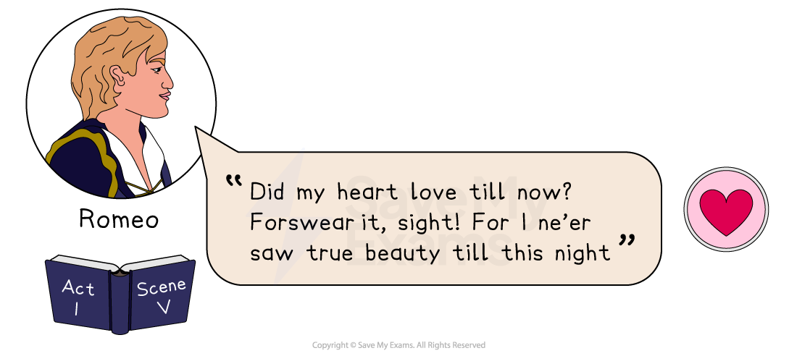

*Act 1 Scene 5 quote*

**“Did my heart love till now? Forswear it, sight! For I ne’er saw true beauty till this night” **– Romeo Montague, Act 1, Scene 5

#### Meaning and context

- When Romeo sees Juliet at the masked Capulet ball he believes her to be the most beautiful girl he has seen

- He suggests any previous love, such as his love for Rosaline which the audience has just seen him troubled over, was not true love

#### Analysis

- Here, Shakespeare shows Romeo as a character obsessed with *courtly love*
- Audiences have just seen Romeo profess a broken heart over Rosaline’s *unrequited love*** ** and will judge him for his change of heart
- Shakespeare presents Romeo’s *fatal flaw*, his fickle impulsiveness
- Friar Laurence and Juliet both criticise Romeo for his inconstant and rash actions which lead to his (and Juliet’s) downfall
- Shakespeare suggests that *courtly love* was superficial and fleeting
- Shakespeare comments here, and in much of his writing, on pure love being constant love

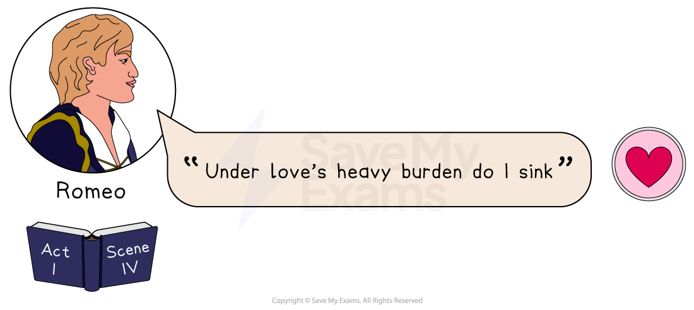

*Act 1 Scene 4 quote*

**“Under love’s heavy burden do I sink” **– Romeo Montague,** **Act 1, Scene 4

#### Meaning and context

- Romeo tells Mercutio he is unable to go to the Capulet Ball as he is heartbroken
- As seen earlier in the scene, Romeo believes love to be a heavy burden to carry

#### Analysis

- Romeo [alludes](https://www.savemyexams.com/glossary/gcse/english-language/allusion-definition/) to the dark moods the audience has seen he is prone to in Act 1, Scene 1
- Romeo uses [metaphor](https://www.savemyexams.com/glossary/gcse/english-language/metaphor-definition/)** **to show the pain associated with love: he likens his heartbreak to a pressure weighing him down
- Shakespeare shows Romeo as sensitive and prone to depression, subverting gender stereotypes and commenting on pressures for young men

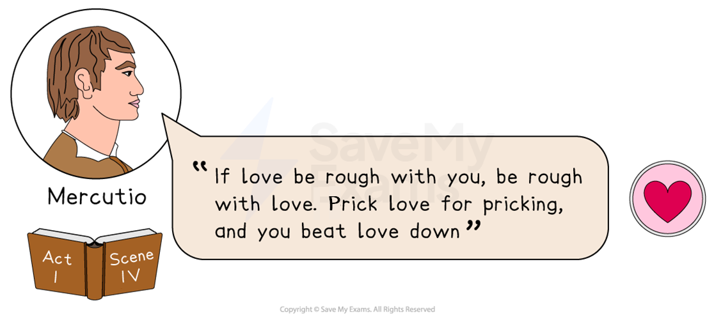

*Act 1 Scene 5 quote*

**“If love be rough with you, be rough with love. Prick love for pricking, and you beat love down” **– Mercutio, Act 1, Scene 5

#### Meaning and context

- Here, Mercutio is trying to lighten Romeo’s mood before the Capulet ball
- He advises Romeo to beat love’s pain by being casual with it, by fighting back

#### Analysis

- Here, Mercutio advises Romeo to be less sensitive about love, using the metaphor of a thorny rose
- Shakespeare uses Mercutio’s dialogue to provide comedic and light relief from the intensity of other scenes
- Shakespeare often uses [puns](https://www.savemyexams.com/glossary/gcse/english-literature/pun-definition/) in Mercutio's bawdy, humorous dialogue to play on the double meanings of words
- Here, Mercutio uses the double meaning of the word ‘prick’ to [connote](https://www.savemyexams.com/glossary/gcse/english-language/connotation-definition/) thorns and sex, suggesting Romeo uses sex to overcome painful love
- Later, Mercutio delivers a [soliloquy](https://www.savemyexams.com/glossary/gcse/english-literature/soliloquy-definition/)** **about Queen Mab; the speech suggests daydreams and fantasies about love are a waste of time
- Mercutio advises Romeo repeatedly to avoid dreams of idealised love
- Audiences see characters’ contrasting attitudes to love in this conversation between the love-sick Romeo and the flippant Mercutio

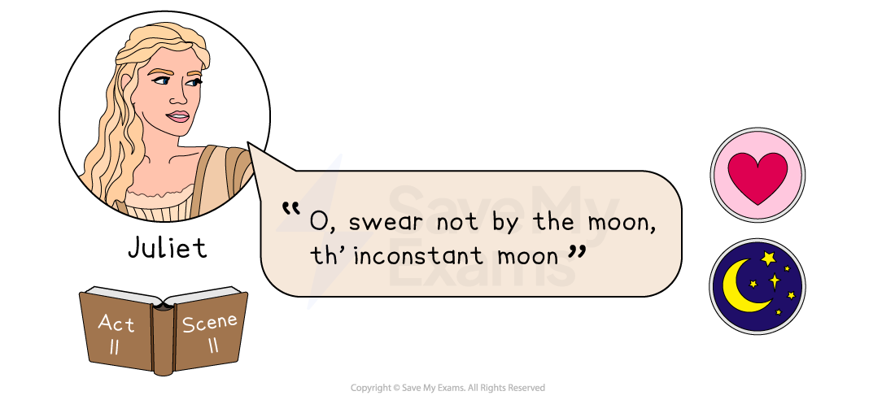

*Act 2 Scene 2 quote*

***“O, swear not by the moon, th’ inconstant moon” ****– Juliet Capulet, Act 2, Scene 2*

#### Meaning and context

- Juliet replies to Romeo’s sudden declarations of love in the Capulet garden, asking Romeo to be constant and committed to his love
- Juliet is connecting Romeo’s sudden promises to the changing moon

#### Analysis

- Shakespeare uses *celestial* [imagery](https://www.savemyexams.com/glossary/gcse/english-language/imagery-definition/) here and throughout the play when Juliet refers to Romeo
- Her request that Romeo swears his love by something more constant suggests the changing nature of the stars and planets
- Juliet is presented as rational and sensible, not leaving her *fate* to the stars and planets
- This imagery** **challenges *Elizabethan* audiences who regularly made decisions based on the stars and planets

> **Exam Hint**
> Examiners ask for **selective** use of quotations and warn that longer answers are often repetitive rather than better. They also expect you to refer to at least two separate moments in the play.
> 
> For example, you could learn “These violent delights have violent ends” and use it in an essay on warning, on the speed of the play, or on the ending. A line this short can be built into your own sentence, leaving you room for the explanation.

## Romeo and Juliet: Key Quotations: Conflict

> **Spec point** — `spcpt_HVxGGNvw9CNqw5cH`

## Conflict

The conflict within the play originates from an ancient grudge which neither family can remember. Shakespeare presents the discrimination the families show toward each other, hating without reason, as violent and tragic, punishing the town at the end of the play. It could be argued that Shakespeare mirrors this in the play, Romeo and Juliet. Written during Queen Elizabeth I’s Protestant reign, Shakespeare, who was a Catholic, can be seen to veil messages about conflict in a dramatic love story.

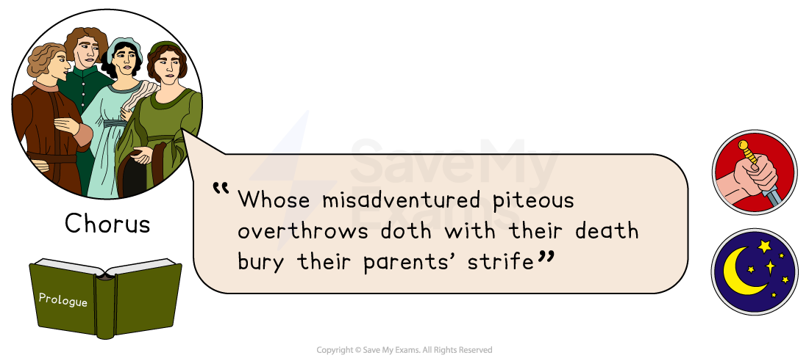

*Prologue quote*

**“Whose misadventured piteous overthrows doth with their death bury their parents' strife”** – The *chorus*, The *Prologue*

### Meaning and context

- The *chorus* delivers this line in the *Prologue*** **before the play begins
- The *chorus* tells audiences that Romeo and Juliet will rebel attempting to overthrow the authority and that their deaths will end their parents’ “strife” or war

### Analysis

- The *chorus* is a device used in Greek [tragedy](https://www.savemyexams.com/glossary/gcse/english-language/tragedy/), often to narrate key ideas to audiences
- A *Prologue* provides the audience with information about the play’s themes, here the themes are rebellion, death and war
- Here, the *chorus* tells the audience the outcome of events to build [dramatic irony](https://www.savemyexams.com/glossary/gcse/english-literature/dramatic-irony-definition/)** **and create tension
- **Dramatic irony** allows audiences to watch events unfold with the ending in mind
- This line, taken from the *Prologue*, warns audiences that the young lovers will defy the *status quo*
- The adjective describing this rebellion (“misadventured piteous”) suggests it will fail and the audience will feel pity for the young lovers
- It also lets the audience know, immediately, that their sacrifice will bury their parent’s *feud*. The use of the word “bury” also [foreshadows](https://www.savemyexams.com/glossary/gcse/english-language/foreshadowing-definition/) the deaths of Romeo and Juliet
- Shakespeare’s *Prologue* challenges audiences to consider the violence that comes from civil war and the sacrifices children may have to make for it

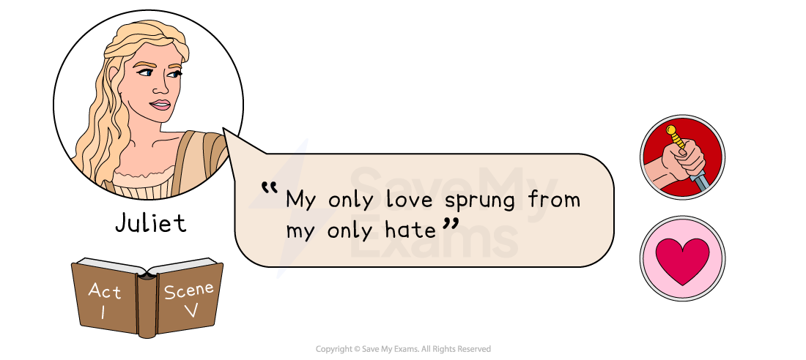

*Act 1 Scene 5 quote*

**“My only love sprung from my only hate” **– Juliet Capulet, Act 1, Scene 5

### Meaning and context

- Juliet speaks this line at the Capulet ball when she is told by her nurse that Romeo is a Montague and therefore her enemy
- She realises that she is bound by her family to hate the only person she loves

### Analysis

- Juliet’s [oxymoron](https://www.savemyexams.com/glossary/gcse/english-language/oxymoron-definition/), reflected in other lines that liken her marriage to a grave, suggests an awareness of the danger of loving her enemy
- Juliet’s dialogue presents the close relationship between love and hate, [foreshadowing](https://www.savemyexams.com/glossary/gcse/english-language/foreshadowing-definition/) the impact the *feud* will have on their future
- Audiences, aware of the tragedy to come, are challenged to watch how conflict affects love
- The verb “sprung” suggests her love originates from hate springing from family conflict
- The [repetition](https://www.savemyexams.com/glossary/gcse/english-language/repetition-definition/) of “only” emphasises the huge significance the *feud* has in her life
- In the midst of religious civil war in *Elizabethan* England, this line reflects the impact of division on innocent citizens, in particular, young people

### Paired quotations

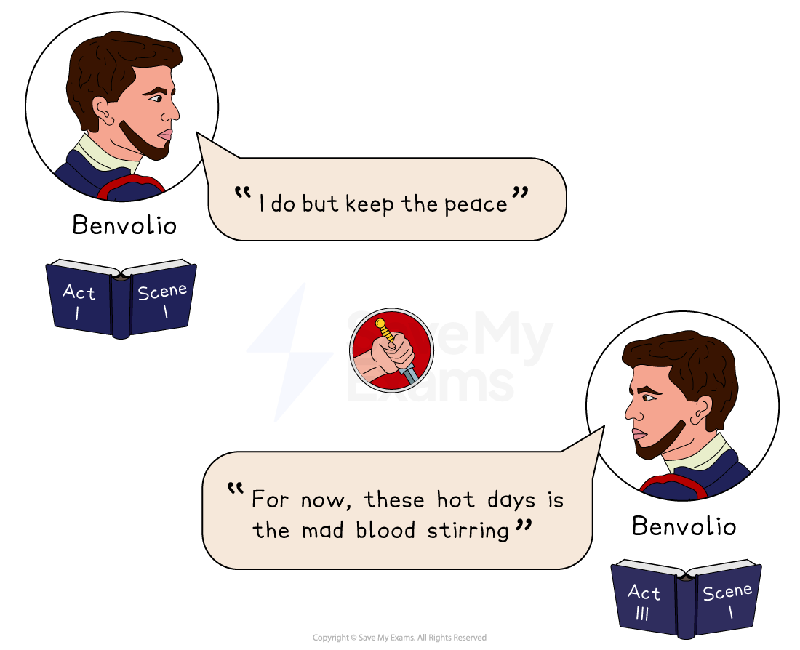

*Paired quotations from Act 1 Scene 1 and Act 3 Scene 1*

**“I do but keep the peace” **– Benvolio Montague, Act 1, Scene 1

**“For now, these hot days is the mad blood stirring” **– Benvolio Montague, Act 3, Scene 1

#### Meaning and context

- In Act 1, Scene 1, when a fight erupts between the Capulets and Montagues, Benvolio tells Tybalt he wants to keep the peace instead of fighting
- Benvolio again tries to keep the peace in Act 3, Scene 1 when he and Mercutio meet in a public place, warning Mercutio that if the Capulets see them there will be a fight

#### Analysis

- Audiences are introduced to Benvolio as a kind character who promotes peace
- This line has religious connotations, as Benvolio’s dialogue mimics Jesus Christ’s
- His dialogue is used to contrast Mercutio and Tybalt’s fiery nature
- Benvolio uses [metaphor](https://www.savemyexams.com/glossary/gcse/english-language/metaphor-definition/) to equate the temper of the Capulets to the hot day
- In a dramatic and climactic scene in the middle of the play, Benvolio’s dialogue acts as foreshadowing, preceding a fight

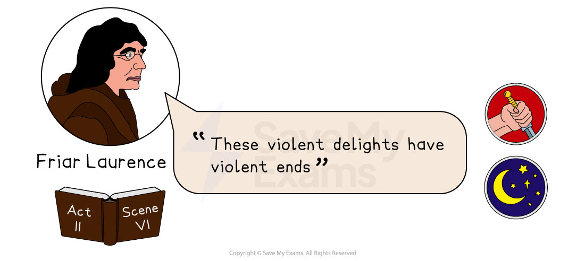

*Act 2 Scene 6 quote*

“**These violent delights have violent ends”** – Friar Laurence, Act 2, Scene 6

#### Meaning and context

- As the friar marries Romeo and Juliet he warns them that passion can be violent
- The secret and forbidden marriage is described here as having a tragic ending

#### Analysis

- The friar uses **oxymorons** here, and throughout the play, to show the relationship between opposites
- This line *alludes* to the opposing forces in all things: “violent” opposes the idea of “delight”
- The repetition of “violence” emphasises the tragic consequences of the *feud*
- The dark **imagery foreshadows** the marriage’s tragic outcome
- Shakespeare uses the friar’s character to present opposing forces in nature, a theme prevalent in the play

## Romeo and Juliet: Key Quotations: Honour

> **Spec point** — `spcpt_dkkqt4xhNvR9CnBm`

## Honour

Romeo and Juliet’s love is forbidden due to the “ancient grudge”, or *feud*, between the houses of Capulet and Montague. The lovers are bound to their family name and the hatred as a result of it. The play explores, as many of Shakespeare’s plays do, the challenges young people face when disagreeing with their families and the cultural values of the time.

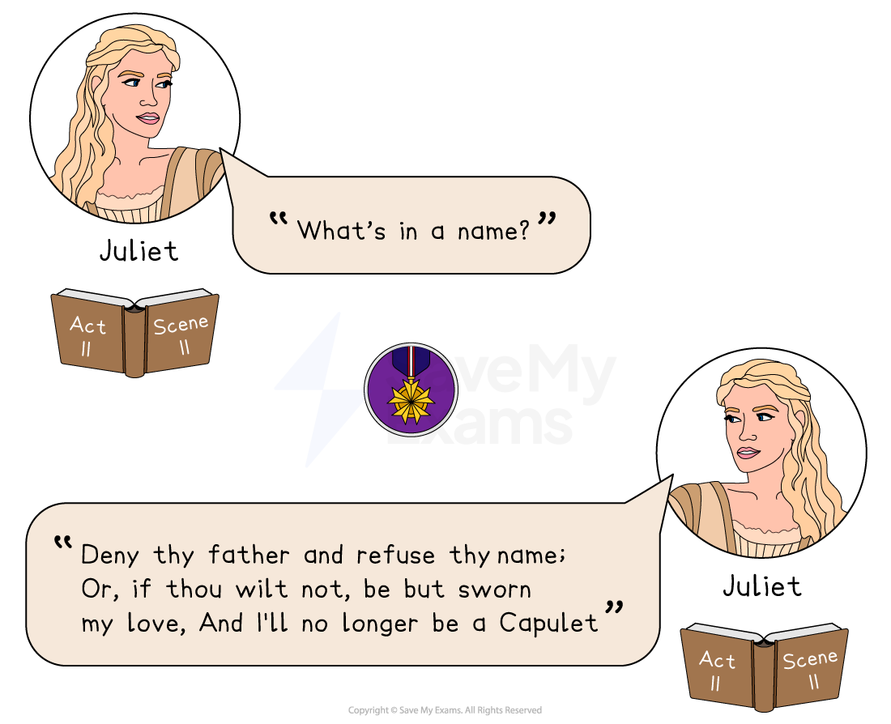

*Paired quotations from Act 2 Scene 2*

**“From ancient grudge break to new mutiny, Where civil blood makes civil hands unclean” **– The *chorus*, The *Prologue*

### Meaning and context

- The *chorus* tells the audience in the *Prologue*, before the play begins, that there will be conflict in the town
- The *chorus* also reveals that something the town is holding on to from the past will lead to the spilling of blood

### Analysis

- The *Prologue* is a [sonnet](https://www.savemyexams.com/glossary/gcse/english-language/sonnet/) which introduces the play’s theme of honour, subverting the tradition of sonnets as Italian poems about *courtly love*
- By using the form of a sonnet, traditionally a love poem, to introduce the feuding families Shakespeare shows a close connection between conflict, honour and love
- The “ancient grudge” remains unknown throughout the play, suggesting the families do not know the real reason for their *feud*
- This challenges** ***Elizabethan*** **perspectives on family honour, related to the religious battles at the time and the  *patriarchal* *hierarchy*
- Here, the contrast of “ancient” and “new” represents old and young, meaning the young will attempt a mutiny on the old
- The [metaphor](https://www.savemyexams.com/glossary/gcse/english-language/metaphor-definition/) “civil blood” refers to the violence between the town’s civilians
- The *ambiguous* meaning of “unclean” suggests to audiences that the violence is impure
- Shakespeare often uses the metaphor of blood on hands to [symbolise](https://www.savemyexams.com/glossary/gcse/english-language/symbolism-definition/) guilt

### Paired quotations

**“What’s in a name?**” – Juliet Capulet, Act 2, Scene 2

“**Deny thy father and refuse thy name; Or, if thou wilt not, be but sworn my love,**

**And I'll no longer be a Capulet**” – Juliet Capulet, Act 2, Scene 2

#### Meaning and context

- In Act 2, Scene 2, Juliet is alone on the balcony after the Capulet ball
- Later in the scene, Romeo appears from hiding and declares his love
- Juliet asks Romeo to turn his back on his family, and if he does not she will do it instead

#### Analysis

- Juliet’s [soliloquy](https://www.savemyexams.com/glossary/gcse/english-literature/soliloquy-definition/) is spoken alone, making this scene dramatic and highlighting its serious themes
- A soliloquy is used in drama to represent the character revealing their true feelings, adding authenticity to Juliet’s controversial dialogue
- Juliet’s [rhetorical question](https://www.savemyexams.com/glossary/gcse/english-language/rhetorical-definition/) in this soliloquy asks *Elizabethan* audiences to challenge values about family honour
- In the soliloquy, Juliet uses metaphorical language to consider the irrelevance of names in love
- Her use of** ***imperative verbs* (“deny” and “refuse”) suggests the strength of her feelings
- As** **Elizabethans held their family name in high esteem, here, Juliet is attempting to overthrow the *status quo*
- Shakespeare often presents characters in ways that *subvert* the stereotype
- Juliet, a young girl, delivers the most significant message in the play about hatred and discrimination
- Shakespeare shows the young couple finding it necessary to turn their backs on their families to be together, suggesting the impact of forced marriage and family *feud*

### Paired quotations

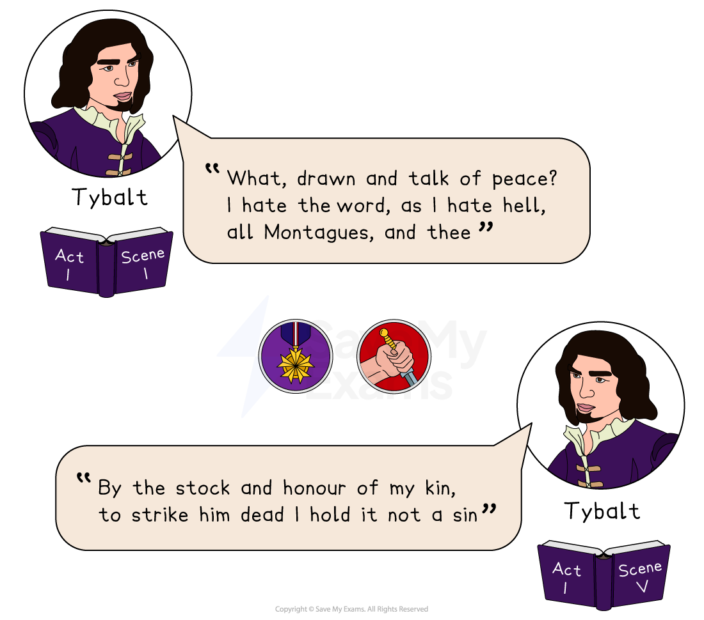

*Paired quotations from Act 1 Scene 1 and Act 1 Scene 5*

**“What, drawn and talk of peace? I hate the word, as I hate hell, all Montagues, and thee” **– Tybalt Capulet, Act 1, Scene 1

**“By the stock and honour of my kin, to strike him dead I hold it not a sin” **– Tybalt Capulet, Act 1, Scene 5` `

#### Meaning and context

- In the opening scene, Tybalt asks Benvolio why he would talk about peace instead of fighting for his family name
- Later, in Act 1, Scene 5, Tybalt is offended by Romeo’s attendance at the Capulet ball
- He asks his servant for a sword, claiming that murder is not a sin if you do it for family honour

#### Analysis

- The opening scene shows the constant threat of fighting between the two families
- Tybalt’s character is introduced as fiercely passionate about avenging his family's honour
- Tybalt’s dialogue is dramatic, using  rhetorical question to show his shock and offence at the suggestion of peace
- Shakespeare's use of a list of three emphasises his hatred, links religion to violence and stresses that these ideas are opposed to peace** **
- In Act 1, Scene 5, Tybalt [foreshadows](https://www.savemyexams.com/glossary/gcse/english-language/foreshadowing-definition/) further conflict by showing his bitterness towards Romeo, his enemy
- His [rhyming couplet](https://www.savemyexams.com/glossary/gcse/english-language/rhyming-couplet/) (“kin” / “sin”) stresses the connection between sin and family honour
- The verb “strike” suggests the violence inherent in Tybalt
- His dialogue is dramatic and intense, to represent the intensity of the hatred in the *feud*
- Tybalt’s dialogue is presented as bitter and angry, representing the strong feelings associated with honour

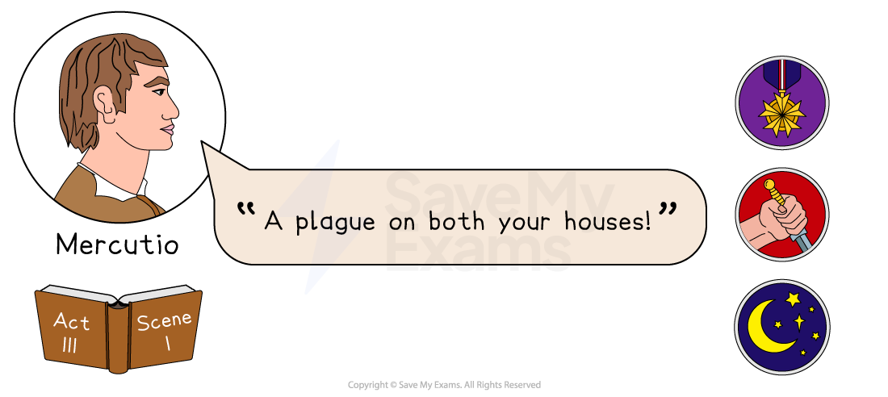

*Act 3 Scene 1 quote*

**“A plague on both your houses!” **– Mercutio, Act 3, Scene 1

#### Meaning and context

- In this climactic scene, Mercutio curses the Capulet and Montague families as he dies
- Despite being Romeo’s friend, Mercutio is not involved in the *feud* until this scene

#### Analysis

- Shakespeare’s climactic scene of a public fight between Romeo and Tybalt creates a plot twist for audiences
- Mercutio, neither a Montague nor a Capulet, is killed in the *feud*, alluding to the deaths of innocent bystanders in the name of family honour
- The plague Mercutio delivers could be a biblical reference, suggesting a holy punishment for the meaningless violence
- It could likely refer to the disruptions of *Elizabethan* life by contagious diseases, mentioned later in the play
- Mercutio’s curse comes true at the end of the play when a plague prevents the friar’s important message from getting to Romeo
- Mercutio’s curse comes from frustration at being killed by mistake, caught between Romeo and Tybalt
- Mercutio’s earlier flippant dialogue changes quickly to an ominous curse, suggestive of his name “Mercury” – both a mythical winged messenger and a quick-changing metal

## Romeo and Juliet: Key Quotations: Fate

> **Spec point** — `spcpt_BkC9JRJY2RXzqxqR`

## Fate

From the very beginning and throughout the play, Romeo and Juliet’s relationship is thwarted by pressures linked to cultural values and traditions, something that could be described as an “outside force”. However, Shakespeare presents these forces as fateful, showing Romeo and Juliet giving in to *fate* until it is too late, in a bid to challenge contemporary belief systems.

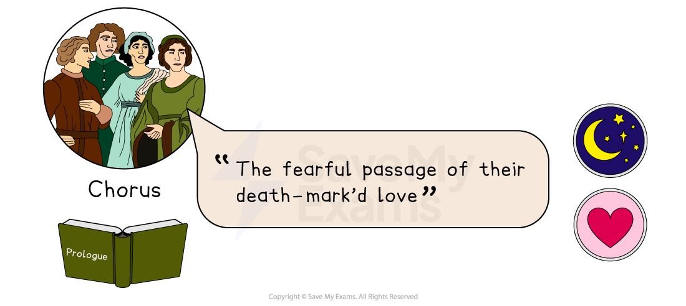

*Prologue quote*

**“The fearful passage of their death-mark’d love”** – The *chorus*, The *Prologue*

### Meaning and context

- In the *Prologue*, the *chorus* invites audiences to watch the “fearful passage” of the unfolding tragic love story
- The *chorus* refers to the “death-mark’d love” of Romeo and Juliet, suggesting the  *fate* of the “star-crossed lovers” is already marked, predetermined by the stars

### Analysis

- Shakespeare employs [dramatic irony](https://www.savemyexams.com/glossary/gcse/english-literature/dramatic-irony-definition/) by telling audiences the [protagonist](https://www.savemyexams.com/glossary/gcse/english-literature/protagonist-definition/)’ *fate*
- The adjectives “fearful” and “death-mark’d” connect the idea of destiny and fear
- By telling *Elizabethan*** **audiences that the [tragedy](https://www.savemyexams.com/glossary/gcse/english-language/tragedy/) is already predetermined, Shakespeare links *fate* to tragedy, challenging prevalent superstitious beliefs about *fate*

### Paired quotations

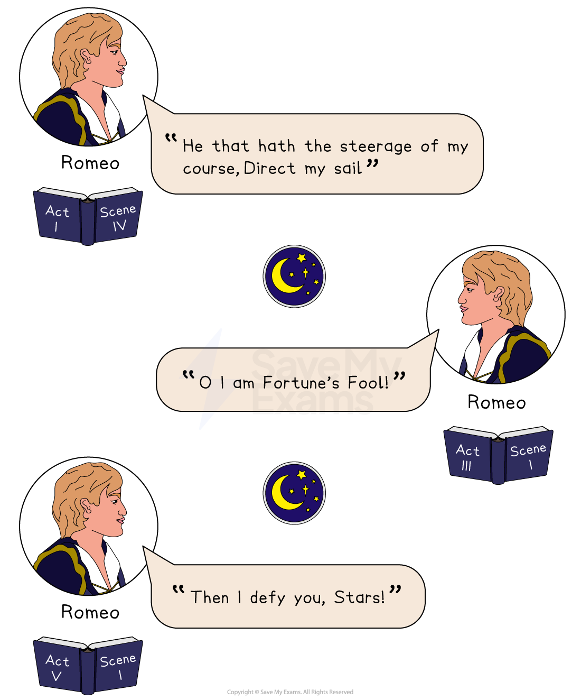

*Fate quotations from Acts 1, 3 and 5*

**“He that hath the steerage of my course, Direct my sail” **– Romeo Montague, Act 1, Scene 4

**“O I am Fortune’s Fool!” **– Romeo Montague, Act 3, Scene 1

**“Then I defy you, Stars!”** – Romeo Montague, Act 5, Scene 1

#### Meaning and context

- In Act I, Romeo’s fateful journey begins with a premonition of the consequences of his night at the Capulet Ball. Here, he addresses *fate*, asking whoever it is who decides his future to lead the way
- By Act III, Romeo has killed Tybalt and lost his friend, Mercutio, and acknowledges he has become a fool to *fate*/fortune
- By Act V, Romeo learns (mistakenly) that Juliet is dead and he turns against *fate*

#### Analysis

- At first, Shakespeare shows Romeo giving in to *fate*, a dominant ideology of the time
- Romeo’s *direct address*  speaks directly to *Fate*, [personifying](https://www.savemyexams.com/glossary/gcse/english-language/personification-definition/) it as if it is a person who decides his future
- Audiences have been shown Romeo as an impulsive and fickle boy as he begins his fateful journey, and here again as he ignores a premonition and leaves his future in the hands of *fate*
- The *imperative verbs*, “Direct”, suggests reckless confidence in his tone
- The [metaphor](https://www.savemyexams.com/glossary/gcse/english-language/metaphor-definition/) of being on a boat and allowing nature to direct his way symbolises a fatalistic attitude which audiences know will be punished
- In Act III, Romeo addresses *Fate* once again, after the deaths of Mercutio and Tybalt
- This time, he shouts his frustration at *Fate*’s decision to make him “Fortune’s Fool”, again implying he has little *autonomy* over his life
- The** **Elizabethans believed that the stars, planets and gods were powerful over human lives, and this line begins to question the influence of *fate* in the violence
- By Act V, Romeo turns his back on the decisions the stars and *fate* have made for him
- In grief, Romeo angrily addresses the stars and exclaims his defiance
- This line emphasises the desperation Romeo feels about his circumstances, and his decision to create some *autonomy* by returning to die with Juliet

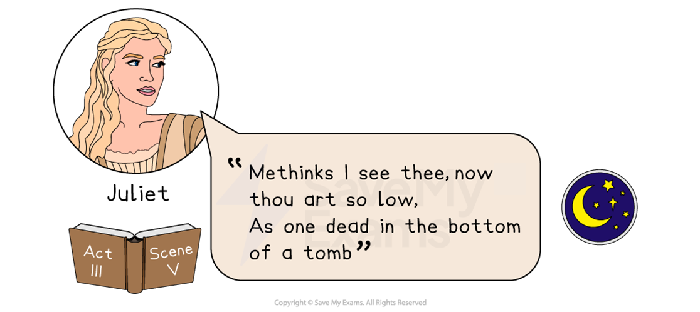

*Act 3 Scene 5 quote*

“**Methinks I see thee, now thou art so low **

**As one dead in the bottom of a tomb**” – Juliet Capulet, Act 3, Scene 5

#### Meaning and context

- In this scene, Juliet has a premonition about Romeo’s future
- She sees him dead, sunk low down at the bottom of a tomb

#### Analysis

- Here, Juliet  [foreshadows](https://www.savemyexams.com/glossary/gcse/english-language/foreshadowing-definition/)  the death of Romeo, suggesting his *fate* is sealed
- The explicit message is a stark message about Romeo’s dark future
- Juliet’s dialogue often refers to death. Earlier in Act II, she likens her marriage to a grave
- Juliet’s premonitions build tension through the dramatic irony created in the *Prologue*
- Shakespeare challenges the audience's perceptions about *fate* and free will by showing both Romeo and Juliet instinctively knowing their doomed future

#### Sources

Stanley Wells and Gary Taylor (eds), 2005, The Oxford Shakespeare: The Complete Works (Second Edition), Oxford University Press
