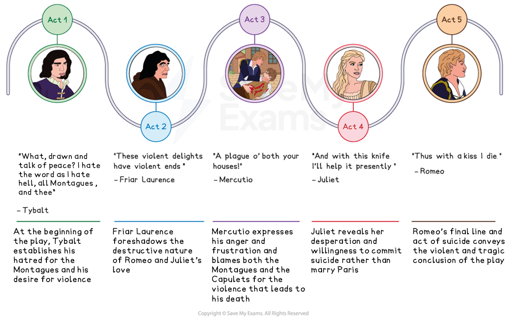
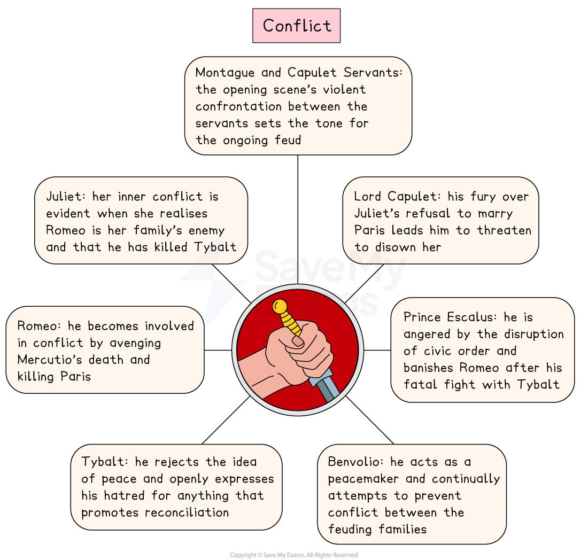

# Romeo & Juliet Key Theme: Conflict

## Romeo and Juliet: Key Theme: Conflict: Mind map

> **Spec point** — `spcpt_w6pYW5jYvPvNvbSv`

## Conflict timeline

The theme of conflict in each act of Romeo and Juliet:

*Romeo and Juliet conflict timeline*

## Romeo and Juliet: Key Theme: Conflict: What are the elements of conflict in Romeo and Juliet?

> **Spec point** — `spcpt_THYwcsP6fHGGd2pj`

## What are the elements of conflict in Romeo and Juliet?

The elements of conflict in the play include:

- **The feud between the Montagues and Capulets:** The Chorus introduces the central theme of conflict to the audience: “Two households, both alike in dignity… from ancient grudge”:

  - At the end of the play, both families agree to put an end to the feud and Capulet offers his hand to Montague
- **Tybalt’s aggression:** Juliet’s cousin is presented as ruthless and vengeful, especially when he learns of Romeo’s presence at the Capulet ball:

  - “I will withdraw, but this intrusion shall, / Now seeming sweet, convert to bitt'rest gall”
- **The deaths of Mercutio and Tybalt:** Tybalt’s killing of Mercutio acts as a catalyst for Romeo’s anger; he turns from peace because of Tybalt’s actions:

  - Mercutio’s final line in the play lays the blame for his death on the conflict between the families: “A plague o’ both your houses!”
- **The deaths of Paris, Romeo and Juliet:** Their deaths are a direct consequence of the conflict between the families

> **Exam Hint**
> Examiners warn against answers that list where fighting happens. It is better to show how the **feud** affects people who never chose it.
> 
> For example, you could write: “Mercutio dies cursing ‘both your houses’, which shows the feud killing someone who belonged to neither family”. Choosing a moment that **complicates** a theme is stronger than choosing the most obvious one.

## Romeo and Juliet: Key Theme: Conflict: The impact of conflict on characters

> **Spec point** — `spcpt_FtJzCqztxJrkqYXG`

## The impact of conflict on characters

The theme of conflict and violence is prevalent throughout the play and has an impact on all of the characters, founded on the long-running feud between the Capulets and the Montagues.

*Conflict in Romeo and Juliet*

| **Character** | **Impact** |
|---|---|
| Montague and Capulet servants | The opening scene is an angry, violent confrontation between the servants of the two households, clearly establishing the tone for the rest of the play. |
| Prince Escalus | Prince Escalus is enraged by the violation of the civic order as a result of the feud between the families; he banishes Romeo after his fight with Tybalt. |
| Benvolio | Benvolio is depicted as a peacemaker as he tries to prevent the violent conflict between the characters. |
| Tybalt | Tybalt declares he “hates the word” peace and detests the actions which bring about peace between the two families. |
| Romeo | Despite the Prince imposing the death penalty on anyone caught fighting, Romeo is prepared to risk his own life to avenge Mercutio’s death:  - Romeo is also responsible for the death of Paris |
| Juliet | Juliet’s inner conflict is shown when she discovers Romeo’s true identity: “That I must love a loathed enemy”:  - Her conflict is also evident when Romeo kills her cousin Tybalt |
| Lord Capulet | Juliet’s refusal to marry Paris results in conflict between Juliet and her father:  - He threatens to disown her: “Hang thee, young baggage, disobedient wretch!” |

## Romeo and Juliet: Key Theme: Conflict: Why does Shakespeare use the theme of conflict in his play?

> **Spec point** — `spcpt_4v3gcg7hVqmDVMNj`

## Why does Shakespeare use the theme of conflict in his play?

**1.  Setting and atmosphere **

- Establishes violence as a backdrop to the play from the very beginning
- Creates tension and hostility and highlights the danger surrounding Romeo and Juliet’s love

**2. Plot driver **

- Drives the tragic sequence of events as the feud between the Montagues and Capulets escalates, leading to tragic consequences

**3. Audience appeal **

- Shakespeare’s audience would have associated Italy with violence and conflict and a place where family honour often led to acts of revenge
- Reflects the fear of civil disobedience and warring families which were seen as a serious threat to the stability of society during the late Elizabethan era

**4. Dramatic device  **

- Heightens dramatic tension as violence erupts as a natural and inevitable consequence of the ongoing conflict

## Romeo and Juliet: Key Theme: Conflict: Exam-style questions on the theme of conflict

> **Spec point** — `spcpt_WWtQXvS72kCBqpCx`

## Exam-style questions on the theme of conflict

Try planning a response to the following essay questions as part of your revision of the theme of fate:

- Explore the significance of conflict in Romeo and Juliet. (You could start with Act 1 and the ancient feud between the Capulets and the Montagues.)
- How does Shakespeare present the impact of conflict on relationships in the play? (You could start with Act 1, Scene 5.)

#### Sources

Stanley Wells and Gary Taylor (eds), 2005, The Oxford Shakespeare: The Complete Works (Second Edition), Oxford University Press
