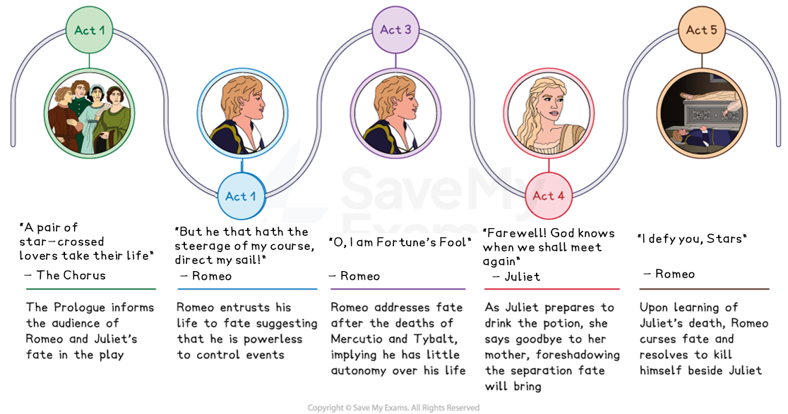
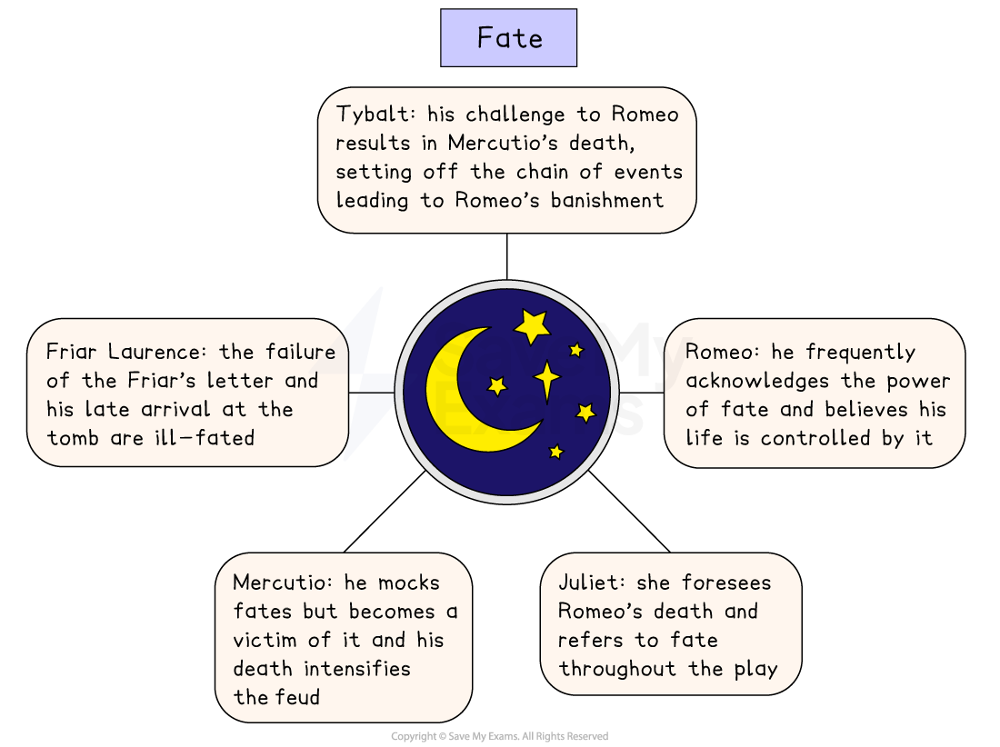

# Romeo & Juliet Key Theme: Fate

## Romeo and Juliet: Key Theme: Fate: timeline

> **Spec point** — `spcpt_H9hcNKr25mzkycMN`

## Fate timeline

The theme of fate in each act of Romeo and Juliet:

*Romeo and Juliet fate timeline*

## Romeo and Juliet: Key Theme: Fate: What are the elements of fate in Romeo and Juliet?

> **Spec point** — `spcpt_tZFxQxfFjNq2cVST`

## What are the elements of fate in Romeo and Juliet?

Shakespeare uses the theme of fate to reinforce the idea that the characters are powerless against the larger forces of destiny. The elements of fate in the play include:

- **The Prologue:** Shakespeare introduces the ill-fated relationship between Romeo and Juliet:

  - They are described as “a pair of star-crossed lovers” whose love is “death-marked”
  - The playwright ensures the audience is aware from the very beginning that their tragic end is inevitable and unavoidable
- **Romeo’s encounter with a Capulet servant:** As a consequence, Romeo attends the Capulet ball and meets Juliet:

  - Romeo claims it is his “fortune” to have read the invitation
- **Friar Laurence’s warning:** Romeo is advised that people’s impulsive actions often have very negative and destructive consequences:

  - It suggests Romeo's fate is already predetermined: “These violent delights have violent ends”
- **Premonitions and warnings:** Romeo and Juliet repeatedly see omens suggesting that the love between them is in opposition to their destiny:

  - “Methinks I see thee… / As one dead in the bottom of a tomb”
- **Mercutio’s death:** After being stabbed, Mercutio states “a plague o’ both your houses”:

  - His curse acts as a reminder that the [tragedy](https://www.savemyexams.com/glossary/gcse/english-language/tragedy/) is fated by other characters’ actions
- **The plague: **Fate intervenes as a plague prevents Friar John from delivering Friar Laurence’s letter to Romeo and as a result, Romeo buys the poison to kill himself:

  - Fate contributes to the tragic timing of Romeo’s suicide and Juliet’s awakening

> **Exam Hint**
> Examiners note that fate produced good essays, and that the best kept more than one reading open — whether the deaths are fated, or the result of decisions the characters make.
> 
> For example, you could write: “Romeo says ‘Then I defy you, stars’, which suggests he believes he is choosing, even though the audience has been told the ending”. Weighing two readings against each other is what shows **judgement**.

## Romeo and Juliet: Key Theme: Fate: The impact of fate on characters

> **Spec point** — `spcpt_dF8PYYB8yJSSpGB7`

## The impact of fate on characters

Fate is a powerful force in the play and its significance is evident from the Prologue’s opening words when the tragic outcome of the play’s events is established. There are many references to the universe and stars in the play and many characters are impacted by fate.

Fate contributes to the dramatic tension and the tragic tone of the play.

*Fate in Romeo and Juliet*

| **Character** | **Impact** |
|---|---|
| Romeo | Romeo repeatedly refers to fate throughout the play and is aware of the power fate holds over his life, saying he feels something is “hanging in the stars”:  - After killing Tybalt, Romeo acknowledges that fate has led him to disastrous consequences: “O, I am Fortune’s Fool!” |
| **Juliet** | Juliet also repeatedly refers to fate and [foreshadows](https://www.savemyexams.com/glossary/gcse/english-language/foreshadowing-definition/) Romeo's death: “… and, when I shall die, / Take him and cut him out in little stars”:  - Juliet is forced to turn to Friar Lawrence leading to the fateful plan |
| **Mercutio** | Mercutio mocks the idea of fate but becomes a victim of it, with his death escalating the feud even further:  - As Mercutio dies, he bitterly acknowledges his fate: “They have made worms’ meat of me” |
| **Tybalt** | Tybalt’s challenge of a duel with Romeo leads to Mercutio’s death which sets off a chain of events leading to Romeo’s banishment:  - “This day’s black fate on more days doth depend” |
| **Friar Laurence** | It is ill-fated that the Friar’s letter fails to get to Romeo and that the Friar fails to reach the tomb before the mistake is made and Romeo kills himself:  - “neglecting it [the letter] / May do much danger” |

## Romeo and Juliet: Key Theme: Fate: Why does Shakespeare use the theme of fate in his play?

> **Spec point** — `spcpt_X8J4nXGh6GpRGzDn`

## Why does Shakespeare use the theme of fate in his play?

**1.  Setting and atmosphere **

- Creates an element of inevitability
- Establishes a tragic tone

**2. Plot driver **

- Creates a cyclical structure from the opening scene to the final act
- Influences crucial plot points such as Romeo and Juliet's initial meeting and eventual deaths

**3. Audience appeal **

- Reflects the Elizabethan’s fascination with astrology and predestination
- Appeals to both Elizabethan and modern audiences through the universal theme of fate and love

**4. Dramatic device  **

- Creates [dramatic irony](https://www.savemyexams.com/glossary/gcse/english-literature/dramatic-irony-definition/) which means the audience is fully aware of the tragic ending
- Adds tension and suspense as the characters attempt to defy fate

## Romeo and Juliet: Key Theme: Fate: Exam-style questions on the theme of fate

> **Spec point** — `spcpt_ZJT85dNVN3mdWFGS`

## Exam-style questions on the theme of fate

Try planning a response to the following essay questions as part of your revision of the theme of fate:

- How does Shakespeare use the deaths of Romeo and Juliet to reinforce the inevitability of fate? (You could start with the Prologue.)
- Explore how fate manipulates time and events, leading to the tragic ending of the play. (You could start with Act 3, Scene 1.)

#### Sources

Stanley Wells and Gary Taylor (eds), 2005, The Oxford Shakespeare: The Complete Works (Second Edition), Oxford University Press
