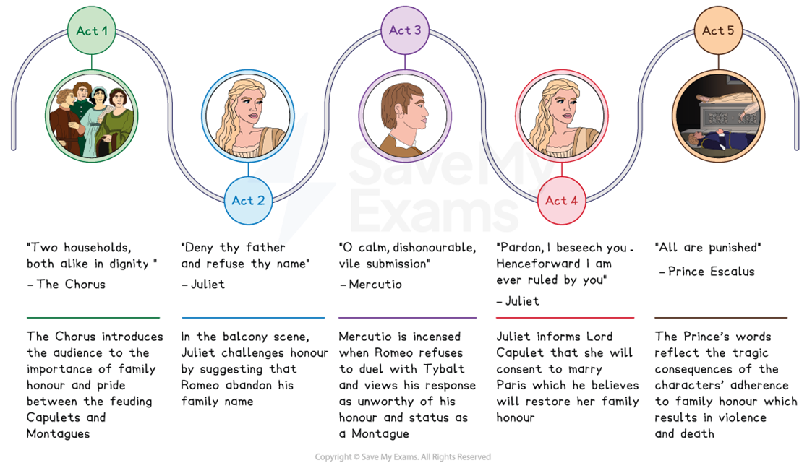
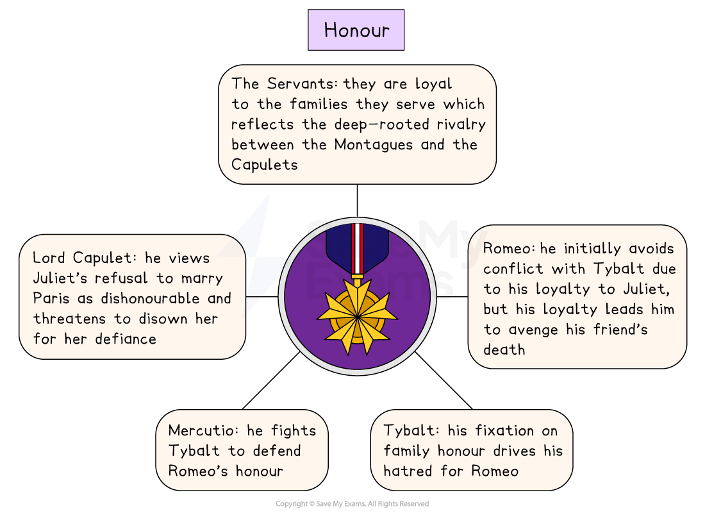

# Romeo & Juliet Key Theme: Honour

## Romeo and Juliet: Key Theme: Honour: Mind map

> **Spec point** — `spcpt_RHx9hvR7J5F6TXxf`

## Honour timeline

The theme of honour in each act of Romeo and Juliet:

*Romeo and Juliet honour timeline*

## Romeo and Juliet: Key Theme: Honour: What are the elements of honour in Romeo and Juliet?

> **Spec point** — `spcpt_hNvGyG3j7FWvsb4v`

## What are the elements of honour in Romeo and Juliet?

- **The Montague and Capulet feud:** The Capulets and Montagues both consider family honour an important part of life, as the regular brawls that disturb the public peace reflect
- **Tybalt’s obsession: **Tybalt does not recognise the act of murder as a crime if it is in defence of his family honour:

  - “Now, by the stock and honour of my kin, / To strike him dead I hold it not a sin”
- **Juliet’s defiance:** Lord Capulet arranges the marriage of Juliet to Paris, “this noble earl”, emphasising the importance of family reputation and honour as marriage to Paris would promote the family’s status in Verona:

  - Lord Capulet is infuriated by Juliet’s apparent lack of honour: “An you be not, hang, beg, starve, die in the streets”
- **Romeo’s rejection: **Shakespeare highlights the importance of love over family honour as Romeo is willing to give up his name for Juliet in order to be with her:

  - “I never will be Romeo”

> **Exam Hint**
> Honour rewards answers that explain what it **costs**, because in this play it is the reason characters cannot back down. Examiners reward interpretation over description here.
> 
> For example, you could write: “Romeo only fights Tybalt after Mercutio dies, so perhaps Shakespeare shows honour taking over at exactly the moment Romeo has most to lose”. A word like **perhaps** lets you put forward a reading without claiming more than the text proves.

## Romeo and Juliet: Key Theme: Honour: The impact of honour on characters

> **Spec point** — `spcpt_DBh3NzHkSTtnnscJ`

## The impact of honour on characters

Honour is a central theme in the play and the long-standing feud between the warring households strengthens their family loyalty and justifies much of the violence throughout the play. The emphasis on loyalty and honour to kin also creates a conflict for Romeo and Juliet, who rebel against their families.

*Honour in Romeo and Juliet*

| **Character** | **Impact** |
|---|---|
| Servants | The servants are loyal and dedicated to the honour of the families they serve:  - At the beginning of the play, the Capulets’ servants insult the Montagues’ servants: “A dog of the house of Montague moves me” |
| Juliet | To prove his commitment to her, Juliet demands Romeo prove his “bent of love be honourable”  and that “thy purpose marriage”:  - Juliet’s loyalty to Romeo is stronger than the loyalty she feels to her family |
| Romeo | Romeo does not engage in a duel with Tybalt at first because of his loyalty to Juliet, but his loyalty to Mercutio eventually drives him to kill Tybalt:  - The deaths of Romeo and Juliet at the end of the play are acts of loyalty to the love they hold for each other |
| Tybalt | Tybalt’s obsession with family honour and his desire to kill Romeo for attending the Capulet ball highlight the hatred between the Capulets and Montagues. |
| Mercutio | Duelling was an established way of restoring honour between two parties in disagreement and Mercutio steps in to fight Tybalt, when Romeo refuses, to protect Romeo’s honour:  - “pluck your sword” |
| Lord Capulet | Juliet’s refusal to marry Paris results in Lord Capulet’s threat to disown her as he perceives her act of defiance as a sign of dishonour:  - “Hang thee, young baggage, disobedient wretch!” |

## Romeo and Juliet: Key Theme: Honour: Why does Shakespeare use the theme of honour in his play?

> **Spec point** — `spcpt_xZRjyXPXhZsyprjB`

## Why does Shakespeare use the theme of honour in his play?

**1.  Setting and atmosphere **

- Shakespeare establishes honour as a central value which governs many characters’ lives
- Creates tension and violence as honour is tied to family pride and revenge

**2. Plot driver **

- Drives the conflict between the characters as the desire to defend family honour results in the death of Mercutio and Tybalt
- Influences the tragic deaths of Romeo and Juliet as their rejection of family honour leads to their demise

**3. Audience appeal **

- Appeals to Shakespeare’s audience as they would have associated Italy with powerful families and the obsession with status: a place where a strong sense of family honour could often lead to feuding and acts of revenge

**4. Dramatic device  **

- Heightens the dramatic tension as honour is a constant source of friction between the Montagues and the Capulets

## Romeo and Juliet: Key Theme: Honour: Exam-style questions on the theme of honour

> **Spec point** — `spcpt_tkPTCSvfMGxwMHrB`

## Exam-style questions on the theme of honour

Try planning a response to the following essay questions as part of your revision of the theme of honour:

- How does Shakespeare portray the conflict between honour and love in the play? (You could start with Act 3, Scene 1.)
- To what extent does honour dictate the action of the characters in the play? (You could start with Act 1, Scene 1.)

#### Sources

Stanley Wells and Gary Taylor (eds), 2005, The Oxford Shakespeare: The Complete Works (Second Edition), Oxford University Press
