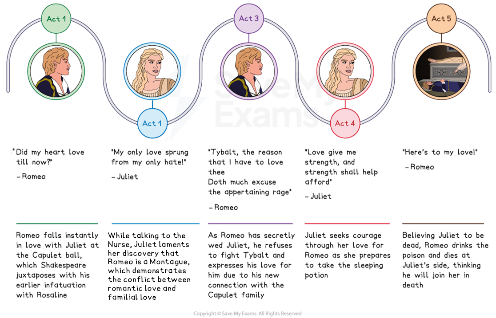
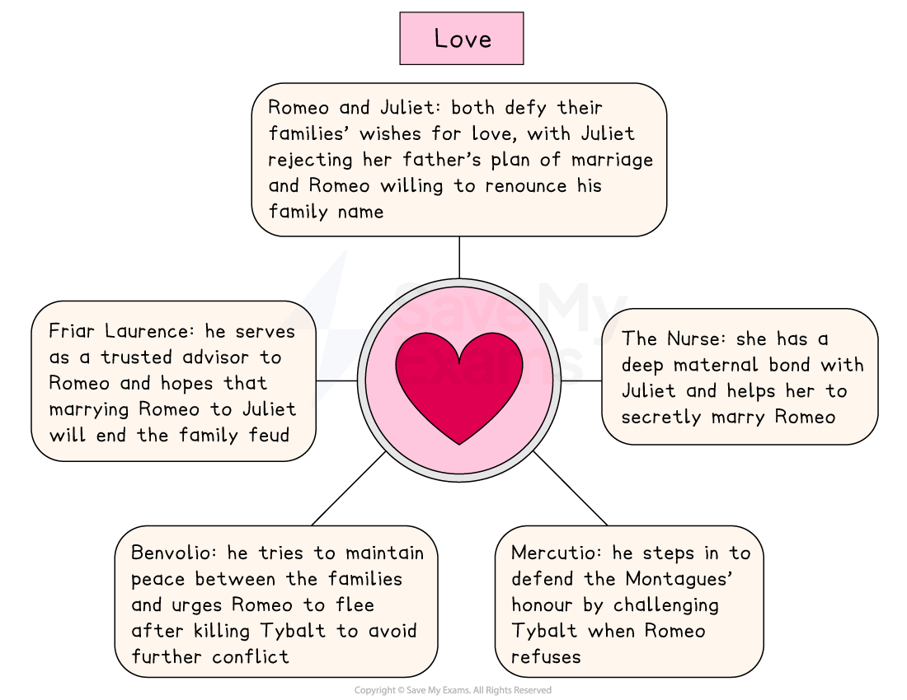

# Romeo & Juliet Key Theme: Love

## Romeo and Juliet: Key Theme: Love: Timeline

> **Spec point** — `spcpt_3TDgRVzKrVKfWGhh`

## Love timeline

The theme of love in each act of Romeo and Juliet:

*Romeo and Juliet love timeline*

## Romeo and Juliet: Key Theme: Love: What are the elements of love in Romeo and Juliet?

> **Spec point** — `spcpt_gk5RwQr65K4c99Nf`

## What are the elements of love in Romeo and Juliet?

Shakespeare portrays different types of love: romantic, familial and friendship. The elements of love in the play include:

- **Romantic love:** Romeo and Juliet fall in love at first sight and their love is presented as courtly and spiritual, reflecting Elizabethan conventions of romantic love, as well as passionate and sensual:

  - “Thus from my lips, by thine my sin is purged”
  - However, Juliet's directness in Act 2, Scene 2 can be seen as subverting courtly conventions: she is not passive but an equal participant in the flirting
- **Familial love: **Shakespeare initially presents the relationship between Juliet and her father as loving:

  - As the play progresses, Lord Capulet’s actions in forcing his daughter to marry Paris ultimately contribute to his daughter’s tragic demise
- **Friendship: **Benvolio, Mercutio and Friar Lawrence are loyal friends to Romeo and offer support in different ways:

  - Benvolio attempts to keep the peace, Mercutio defends Romeo’s honour and Friar Laurence devises a plan to help him

> **Exam Hint**
> Examiners note that the strongest answers on love treat it as **complicated** rather than simply celebrated, since the play sets it beside hatred from the first scene.
> 
> For example, you could write: “Juliet realises her ‘only love sprung from my only hate’, so Shakespeare makes love inseparable from the feud that will destroy it”. Choosing a quotation that contains **both** ideas at once can save you a whole paragraph.

## Romeo and Juliet: Key Theme: Love: The impact of love on characters

> **Spec point** — `spcpt_4MMYDnhGybCg8v4q`

## The impact of love on characters

The theme of love is a powerful force in the play. It strongly motivates both Romeo and Juliet after they meet and fall in love at first sight and drives them to suicide as they would rather die than live apart.

*Love in Romeo and Juliet*

| **Character** | **Impact** |
|---|---|
| Romeo and Juliet | - Romeo and Juliet risk the wrath of their parents to be together:    - Juliet goes against the wishes of her father, when he insists she should marry Paris and Romeo is prepared to break away from his family in order to be with Juliet: “Henceforth I never will be Romeo” |
| The Nurse | - The Nurse has a strong maternal relationship with Juliet, describing her as the “prettiest babe”:    - The Nurse wants Juliet to be happy and will do anything for her happiness, even collaborating in her marriage to Romeo: “There stays a husband to make you a wife” |
| Mercutio | - When Romeo refuses to fight Tybalt, Mercutio takes up the challenge instead, as he does not want to see the  Montagues’ honour jeopardised: “pluck your sword”:    - Following Mercutio’s death, Romeo shows his grief by challenging Tybalt |
| Benvolio | - Benvolio tries to stop the conflict between the Montagues and Capulets and to prevent Romeo from avenging Mercutio's death:    - After Romeo has killed Tybalt, Benvolio encourages Romeo to flee: “Romeo, away, be gone” |
| Friar Laurence | - Friar Laurence acts as a confidante to Romeo, advising him on his relationships with Rosaline and Juliet and how his actions should be: “wisely and slow”:    - He hopes that by marrying the young lovers, the feuding families will make peace: “To turn your households’ rancour to pure love” |

## Romeo and Juliet: Key Theme: Love: Why does Shakespeare use the theme of love in his play?

> **Spec point** — `spcpt_TwfkQyVZgt3Kbgcw`

## Why does Shakespeare use the theme of love in his play?

**1.  Setting and atmosphere **

- Shakespeare establishes love as the central theme of the [tragedy](https://www.savemyexams.com/glossary/gcse/english-language/tragedy/) and its driving force from the very beginning
- Creates an element of urgency and secrecy as Romeo and Juliet’s love must be hidden

**2. Plot driver **

- Drives the tragic sequence of events as the love between Romeo and Juliet is a catalyst to the dramatic action

**3. Audience appeal **

- Appeals to Shakespeare’s audience as romantic love was considered heroic at the time the play is set
- Reflects a universal theme of love which would resonate with both contemporary and modern audiences

**4. Dramatic device  **

- Heightens the dramatic tension by contrasting love with violence

## Romeo and Juliet: Key Theme: Love: Exam-style questions on the theme of love

> **Spec point** — `spcpt_Hv66WGx9YDdShNxF`

## Exam-style questions on the theme of love

Try planning a response to the following essay questions as part of your revision of the theme of love:

- How does Shakespeare portray the intensity of young love in the play? (You could start with Act 2, Scene 2.)

- “Romeo is never really in love in the play”. How far do you agree with this statement? (You could start with Act 1, Scene 1.)

#### Sources

Stanley Wells and Gary Taylor (eds), 2005, The Oxford Shakespeare: The Complete Works (Second Edition), Oxford University Press
