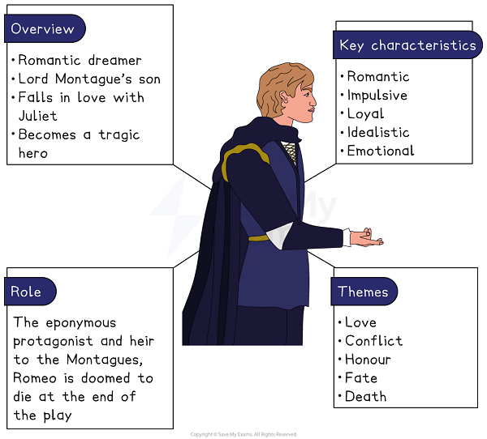
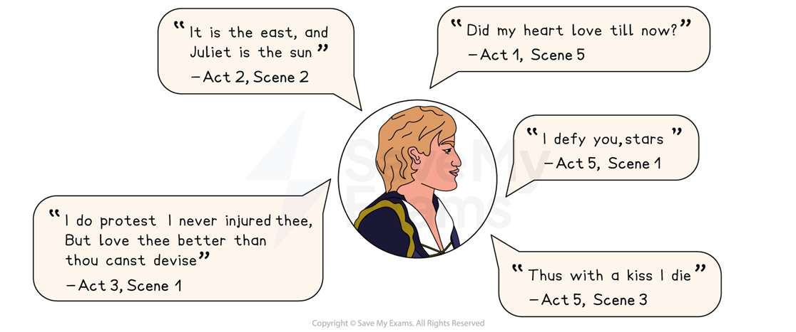

# Romeo Character Analysis

Romeo is a passionate, impulsive and idealistic young man whose intense love for Juliet drives him to make reckless decisions, ultimately leading to his tragic downfall.

## Romeo and Juliet: Romeo Character Analysis: Character summary

> **Spec point** — `spcpt_476dBCpBxCvwYtKT`

## Romeo character summary

*Romeo character summary*

## Romeo and Juliet: Romeo Character Analysis: Why is Romeo important?

> **Spec point** — `spcpt_dtVPnjqqHxRsd4Z5`

## Why is Romeo important?

At the beginning of the play and Romeo is depicted as:

- **Romantic** and **idealistic**: Romeo is introduced as a character deeply in love with the idea of love. Before meeting Juliet he is infatuated with Rosaline, describing his feelings with poetic language and exaggerated emotion. Benvolio describes him as foolishly wallowing in self-pity in a sycamore grove for his “love”, Rosaline: “She hath forsworn to love, and in that vow / Do I live dead, that live to tell it now”. He becomes infatuated with Juliet at first sight too, although his love for her is more intense and genuine. Romeo’s idealistic perspective is evident through his instant willingness to marry her, even though they belong to feuding families
- **Impulsive**: Romeo's impulsive nature is evident from his first appearance where he falls in love with Juliet. He is immediately captivated: “O, she doth teach the torches to burn bright!” His impulsive decision to marry Juliet without considering the long-term consequences demonstrates his tendency to act on emotions rather than logic

As the play unfolds, Romeo becomes increasingly involved in tragic circumstances and is portrayed as:

- **Reckless **and **emotional**: Romeo’s reckless behaviour intensifies as his love for Juliet deepens. His decision to kill Tybalt out of revenge is driven by emotion and marks his turning point in the play. His inability to temper his emotions (both love and anger) leads to his exile and downfall
- **Tragic hero**: Romeo’s idealistic view of love, impulsive choices and unwavering devotion to Juliet define him as a tragic hero. Romeo’s death by his own hand is both dramatic and romantic. He takes the apothecary’s poison and dies at Juliet’s side, believing that he is joining her in death

> **Exam Hint**
> Examiners note that answers improve when they follow Romeo’s **change** rather than treating him as constant. He begins in love with someone else, which is easy to leave out.
> 
> For example, you could write: “Romeo is already heartbroken over Rosaline when the play opens, so his love for Juliet has to prove itself different”. Starting from what a character was like before the play begins gives your argument somewhere to travel.

## Romeo and Juliet: Romeo Character Analysis: Romeo's use of language

> **Spec point** — `spcpt_t63PxsPxf3MmDcvj`

## Romeo’s use of language

The language Shakespeare uses for Romeo, from elevated [iambic pentameter](https://www.savemyexams.com/glossary/gcse/english-literature/iambic-pentameter-definition/) to rhyming verse and hyperbolic statements, reflect his impulsive and romantic nature.

- Iambic pentameter** **and [*rhymed verse*](https://www.savemyexams.com/glossary/gcse/english-language/rhyme/):** **Romeo frequently speaks in iambic pentameter giving his words a rhythmic and elevated quality that aligns with his role as a romantic, noble character. This formal style also conveys his youthful idealism and deep emotions, especially when expressing his love for Juliet
- [Hyperbole](https://www.savemyexams.com/glossary/gcse/english-language/hyperbole-definition/): Romeo frequently uses hyperbole to express the overwhelming nature of his love for Juliet. By exaggerating his feelings, he conveys a love which is all consuming. For instance he declares “Call me but love and I’ll be new baptised; / Henceforth I never will be Romeo”, suggesting that his identity, family ties and even his name are insignificant compared to his love for Juliet. His use of hyperbole also demonstrates his youthful impulsiveness.
- **Emotive: **as the play progresses, Romeo’s language becomes increasingly emotional and shifts towards more monosyllabic expressions, reflecting his growing sense of desperation. For example, Romeo’s initial reaction to Balthasar’s shocking news about Juliet’s death is one of disbelief, shown through his questioning “Is it e’en so?” His mood quickly shifts to anger as he exclaims “I defy you, stars” and his behaviour and language becomes increasingly erratic and emotional

### Romeo key quotes:

*Romeo key quotes*

## Romeo and Juliet: Romeo Character Analysis: Romeo character development

> **Spec point** — `spcpt_rnkwTJfNHzWKpkMt`

## Romeo character development

| **Act 1, Scene 1** | **Act 2, Scene 2** | **Act 3, Scene 1** | **Act 5, Scene 3** |
|---|---|---|---|
| **Romeo’s melancholy**: In his first appearance, Romeo laments his unrequited love for Rosaline. This scene introduces the audience to Romeo’s sensitive and passionate nature [foreshadowing](https://www.savemyexams.com/glossary/gcse/english-language/foreshadowing-definition/) the powerful emotions that will later define his relationship with Juliet. | **The balcony scene:** Romeo delivers a [soliloquy](https://www.savemyexams.com/glossary/gcse/english-literature/soliloquy-definition/) in which he remarks on Juliet’s beauty and declares his love for her. This is a pivotal moment, revealing Romeo’s impulsive and idealised view of love. | **Romeo’s rage: **After Mercutio’s death, Romeo is overcome with rage and grief leading him to seek revenge and kill Tybalt. This moment marks a turning point for Romeo and his actions in this scene [foreshadow](https://www.savemyexams.com/glossary/gcse/english-language/foreshadowing-definition/) the play’s tragic events. | **Romeo’s final soliloquy**: Believing Juliet to be dead, Romeo delivers a final soliloquy filled with despair as he prepares to take his own life. This scene demonstrates Romeo’s tragic flaw (his impulsive and emotionally driven decisions) which ultimately leads to his death. |

## Romeo and Juliet: Romeo Character Analysis: Romeo character interpretation

> **Spec point** — `spcpt_PxvcJspN59pZX8SG`

## Romeo character interpretation

### Love in Elizabethan Verona

At the time the play was first performed, Verona was reputedly famous for its ill-fated lovers. It was said to be the setting of a tale by Luigi da Porto which featured the young lovers Romeo Montecchi and Giulietta Cappelletti, which is believed to have inspired the story of Romeo and Juliet. This underscores the authenticity of the love between the two characters.

### Suicide and religion

During Shakespeare’s era, suicide was considered a grave sin by his predominantly Christian audience who believed it would result in eternal damnation. The audience were perhaps unlikely to have felt sympathy for Romeo’s and Juliet’s sinful acts, although society may have been more accepting of an honourable suicide. Alternatively, Romeo and Juliet's final act could be viewed as a powerful testament to the depth of their love and their thoughts of suicide are used to illustrate the desperation they feel in their separation.

### Astrology and fate

Romeo is aware of the power fate holds over his life: “O, I am fortune’s fool!” Astrology captivated Elizabethan audiences who widely believed that the stars and planets influenced emotions and destiny. During this period, people sought ways to understand and explain how much control they had over their own lives. Some of these ideas were rooted in the philosophy of the 6th-century Roman thinker Boethius who suggested that life is governed by both God and fortune.

#### Sources

Stanley Wells and Gary Taylor (eds), 2005, The Oxford Shakespeare: The Complete Works (Second Edition), Oxford University Press
