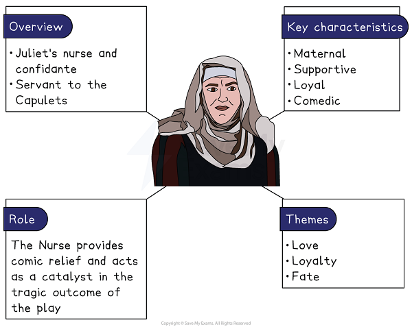
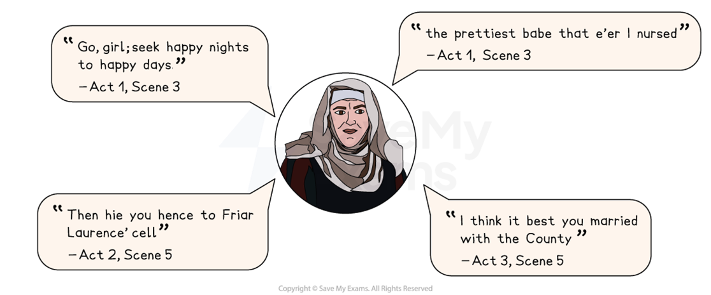

# The Nurse Character Analysis

The Nurse is a loyal, maternal character and is Juliet’s closest companion and confidante.

## Romeo and Juliet: The Nurse Character Analysis: Nurse character summary

> **Spec point** — `spcpt_QPQtbxGZz6sRWK8f`

## The Nurse character summary

*The Nurse character summary*

## Romeo and Juliet: The Nurse Character Analysis: Why is the Nurse important?

> **Spec point** — `spcpt_NKFpcK6NMJP9xJrD`

## Why is the Nurse important?

The Nurse is depicted as:

- **Maternal**: the Nurse has cared for Juliet her entire life (“Faith, I can tell her age unto an hour”) and therefore has a strong maternal relationship with Juliet. Their relationship is one based on love and trust. She is presented as being closer to Juliet than Juliet’s own mother, as Lady Capulet is unable to speak with her daughter without the Nurse’s presence: “Nurse, come back again”
- **Supportive **and *pragmatic*: the Nurse wants Juliet to be happy and collaborates with Romeo regarding their marriage, stating “there stays a husband to make you a wife”. Her attitude could be viewed as *pragmatic* when she encourages Juliet to marry Paris despite being already married: “I think you are happy in this second match”
- **Loyal**: the Nurse shows initial loyalty to Juliet, even over her master, Lord Capulet. When Lord Capulet threatens to disown Juliet, the Nurse directly apportions blame for the situation on Lord Capulet: “You are to blame, my lord, to rate her so”. However, she could also be interpreted as showing respect for the honour of the Capulet household when she later advises Juliet to marry Paris
- **Comedic**: the Nurse is a source of comedy in a number of different ways. Her teasing of Juliet and use of sexual innuendo lighten the tone of the play. Her *garrulous* character is also in direct contrast to that of Lady Capulet. She provides humour when she withholds information for as long as she can to tease Juliet: “Fie, how my bones ache. What a jaunce have I!”

> **Exam Hint**
> Examiners reward answers that explain what a secondary character does for the play rather than summarising their scenes. The Nurse matters most for what she makes possible and then takes away.
> 
> For example, you could write: “The Nurse helps Juliet marry Romeo and then advises her to marry Paris, so Juliet is left with nobody who will support her”. Explaining what a character makes possible, and then removes, lifts the point well above description.

## Romeo and Juliet: The Nurse Character Analysis: The Nurse's use of language

> **Spec point** — `spcpt_dJNgNYNb3cDr6FqB`

## The Nurse’s use of language

Shakespeare has the Nurse use exclamatory statements and sexual humour to both reflect her relatively low social status, but also to reflect her lively nature and closeness to Juliet.

- **Humour **and **bawdy language**: the Nurse engages in sexual and bawdy humour, using innuendo in her references to Juliet’s wedding night, such as “seek happy nights to happy days”, implying that Juliet will need to rest in time for her wedding night. This is [juxtaposed](https://www.savemyexams.com/glossary/gcse/english-language/juxtaposition-definition/) with the more serious and poetic language used by the other characters. This provides comic relief from the tragic elements of the play and also reflects her lower status
- **Superlatives** and **exclamatory language**: the Nurse regularly uses superlatives and exclamatory language to convey her emotions and reflect her lively personality. She initially describes Juliet as the “prettiest babe”

### The Nurse key quotes

*The Nurse key quotes*

## Romeo and Juliet: The Nurse Character Analysis: The Nurse character development

> **Spec point** — `spcpt_xSgjPrQjgvpcnry9`

## The Nurse character development

| **Act 1, Scene 3** | **Act 2, Scene 5** | **Act 3, Scene 2** | **Act 3, Scene 5** |
|---|---|---|---|
| **The Nurse’s introduction: **This scene introduces the Nurse as a maternal figure and establishes her supportive role in Juliet’s life. Juliet’s close relationship with the Nurse contrasts with the distant relationship she has with her mother. | **The Nurse as Juliet’s messenger: **The Nurse acts as a go-between for Juliet and Romeo and facilitates their secret marriage. This scene also establishes the Nurse as comic relief as she teases Juliet. | **The Nurse’s news of Tybalt’s death: **When the Nurse finds out about Romeo’s killing of Tybalt, she panics and wants to protect Juliet. The Nurse is depicted as supportive but she also begins to show a more practical and realistic view of Juliet’s situation. | **The Nurse advises Juliet to marry Paris:**  This scene marks a change in the relationship between the Nurse and Juliet as Juliet feels abandoned by the Nurse when she advises her to marry Paris. This leads her to seek counsel with Friar Laurence instead. |

## Romeo and Juliet: The Nurse Character Analysis: The Nurse character interpretation

> **Spec point** — `spcpt_fjNhbGkKH7sY6M2T`

## The Nurse character interpretation

### Motherhood

At the time the play was written, it was common for families of a high social class to employ a wet nurse who would raise their children from birth. The wet nurses’ own babies had often suffered or died. Both the Nurse and Lord Capulet speak of the loss of children early in the play: Capulet is left with only one child before Juliet’s death and the Nurse speaks of her own daughter, Susan, as “with God; She was too good for me”. Consequently, a wet nurse might often form a stronger bond with the child than its own parents. This can certainly be said of the Nurse and Juliet.

### Expectations of class

Elizabethans would have expected children to obey their parents and not court the views of servants such as a nurse. Servants would have been viewed as belonging to a lower class and therefore unfit to offer guidance on important familial matters such as marriage. The Nurse’s role in assisting and advising Juliet would have therefore been uncommon.

#### Sources

Stanley Wells and Gary Taylor (eds), 2005, The Oxford Shakespeare: The Complete Works (Second Edition), Oxford University Press
