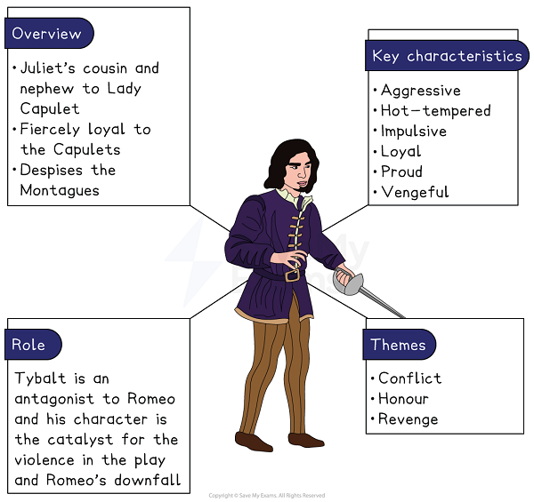
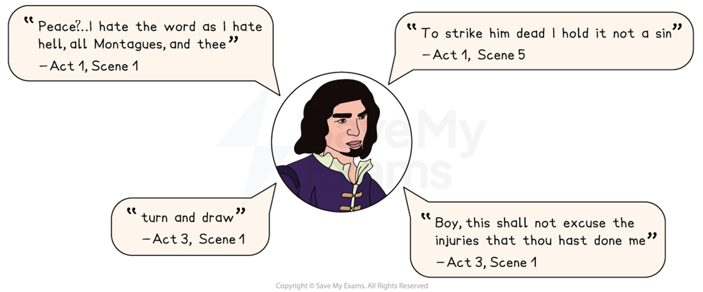

# Tybalt Character Analysis

Tybalt is an aggressive, hot-tempered character whose desire for revenge leads to his downfall.

## Romeo and Juliet: Tybalt Character Analysis: Tybalt character summary

> **Spec point** — `spcpt_ZPn5fwJyKv5dj2tj`

## Tybalt character summary

*Tybalt character summary*

## Romeo and Juliet: Tybalt Character Analysis: Why is Tybalt important?

> **Spec point** — `spcpt_9q6qNwRqcnxvnQZg`

## Why is Tybalt important?

Tybalt is depicted as:

- **Hot-tempered** and *impulsive*: although Tybalt initially shows respect to the Capulets through the use of titles “Gentlemen” and “sir”, he quickly becomes aggressive. He states pointedly that “you shall find me apt enough” when Mercutio confronts him:

  - This demonstrates his hot temper and extremely *impulsive* nature. Tybalt is largely driven by hate, and he derides peace: “I hate the word as I hate hell, all Montagues, and thee”
- **Loyal **and **proud**: Tybalt’s loyalty to his family is one of the reasons for his anger and when he learns of Romeo’s presence at the Capulets’ party, Lord Capulet tells him to leave Romeo alone:

  - Tybalt is initially loyal to Lord Capulet and obeys his orders, in honour of his position as head of the household, though later he attempts to avenge this perceived dishonour
- **Vengeful**: Tybalt is presented as ruthless and vengeful and as a Capulet he holds a deep hatred for the Montagues:

  - Mercutio’s death and Romeo’s shame in not responding to Tybalt’s insults escalate the violence and lead to Tybalt’s death
  - His violent confrontation with Romeo begins with insults: “Boy, this shall not excuse the injuries / That thou hast done me. Therefore turn and draw”

> **Exam Hint**
> Tybalt appears rarely, so examiners reward answers that explain his **effect** on the play rather than listing his fights. His death is the turning point everything else follows from.
> 
> For example, you could write: “Shakespeare kills Tybalt halfway through, so the rest of the play deals with the consequences of a single loss of temper”. Making a point about a character’s place in the **structure** is stronger than describing them as aggressive.

## Romeo and Juliet: Tybalt Character Analysis: Tybalt's use of language

> **Spec point** — `spcpt_rFx8FVyxmkVjdsky`

## Tybalt’s use of language

The language Shakespeare uses for Tybalt is [characterised](https://www.savemyexams.com/glossary/gcse/english-literature/characterisation-definition/) by menacing and violent vocabulary, as well as exclamatory language, to reflect his *impulsive* and aggressive nature.

- **Aggressive **and **violent diction: **Tybalt appears as the enemy to peace in the play, as evident through his encounter with the Montagues on the streets of Verona. At the Capulet ball, Tybalt’s anger and desire to fight with Romeo are quashed by Lord Capulet, but he states “I will withdraw, but this intrusion shall, / Now seeming sweet, convert to bitt'rest gall.” Speaking in [rhyming couplets](https://www.savemyexams.com/glossary/gcse/english-language/rhyming-couplet/), Tybalt’s language is menacing and threatening while his [metaphor](https://www.savemyexams.com/glossary/gcse/english-language/metaphor-definition/) about sweetness becoming bitterness is foreboding
- [Hyperbole](https://www.savemyexams.com/glossary/gcse/english-language/hyperbole-definition/)** **and **exclamatory language:** Tybalt’s language is frequently exaggerated which is used to convey his intense feelings of hatred and pride. For example, in his opening remarks of the play his fierce exclamation and [repetition](https://www.savemyexams.com/glossary/gcse/english-language/repetition-definition/) of the word “peace” indicate his loathing of it. His extreme statements reflect his tendency to resort to violent actions

### Tybalt key quotes

*Tybalt key quotes*

## Romeo and Juliet: Tybalt Character Analysis: Tybalt character development

> **Spec point** — `spcpt_hwFPqQ2qc4tdySgc`

## Tybalt character development

| **Act 1, Scene 1** | **Act 1, Scene 5** | **Act 3, Scene 1** |
|---|---|---|
| **The street brawl:**  In the first scene of the play, Tybalt is conveyed as an aggressive and hot-tempered character when he confronts the Capulets on the streets of Verona. This immediately links his character to the themes of violence and revenge, which [foreshadows](https://www.savemyexams.com/glossary/gcse/english-language/foreshadowing-definition/) the tragic events later in the play. | **The Capulet ball:**  When Romeo attends the Capulet ball, Tybalt believes that Romeo has dishonoured his family, despite Lord Capulet’s more conciliatory approach. This scene reveals his conviction that he does not recognise the act of murder as a crime if it is in defence of his family honour: “To strike him dead I hold it not a sin”. | **Tybalt’s death:**  Tybalt's violent death at Romeo's hands could be viewed as inevitable after Mercutio has been slain: “Either thou, or I, or both must go with him”. His death could be viewed as the event that brings about Juliet's greatest change. She becomes desperate and courageous as she considers suicide rather than marrying Paris. |

## Romeo and Juliet: Tybalt Character Analysis: Tybalt character interpretation

> **Spec point** — `spcpt_qS747zN2qmxzYYk2`

## Tybalt character interpretation

### Societal instability

Medieval Italy was well known for its vendettas and deadly feuds, providing an appropriate setting for the long-running feud between the Capulets and the Montagues. The negative impact of warring families and civil disobedience was a serious threat to the stability of society during the late Elizabethan era. The biting of the thumb was seen as an insult and a way of showing dishonour to others. “I will bite my thumb at them, which is disgrace to them if they bear it” is spoken by Sampson in Act 1 and leads to the street brawl between the Capulets and the Montagues.

### Honour and violence

Tybalt’s name itself is related to violence, as he is called “King of Cats”. At the time the play was first staged, animals were renowned for their fighting and aggression, thereby accurately reflecting Tybalt’s true nature. During the Elizabethan period, duelling was a common means of resolving disputes, especially concerning honour, and many gentlemen carried swords around with them in readiness. Although duelling was considered an honourable means of dealing with disputes, it was illegal. Tybalt is unforgiving in his fury at Romeo and demands that he duel with him: “Boy, this shall not excuse the injuries that thou hast done me. Therefore turn and draw”. Romeo refuses as he has just secretly married Juliet, leading to Mercutio drawing his sword to challenge Tybalt. In Tybalt’s confrontation with Mercutio, he is frustrated as his original intent was to recover his wounded honour in a duel with Romeo.

#### Sources

Stanley Wells and Gary Taylor (eds), 2005, The Oxford Shakespeare: The Complete Works (Second Edition), Oxford University Press
