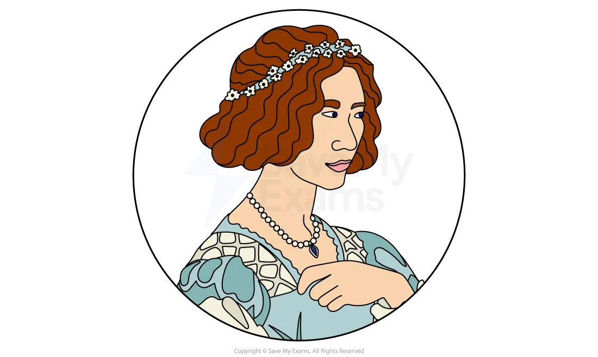
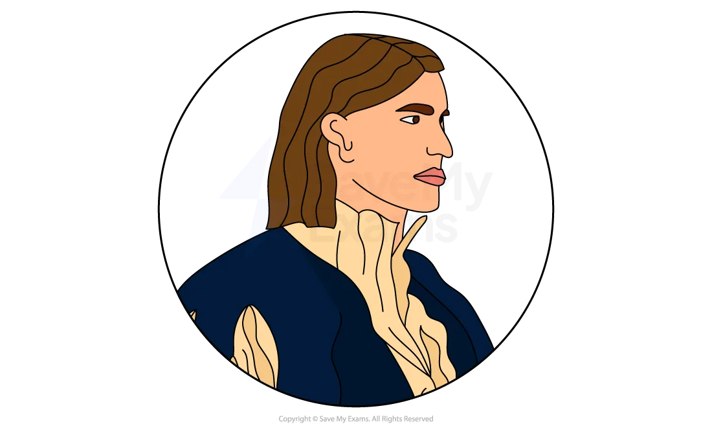

# The Merchant of Venice: Characters

## The Merchant of Venice: Characters

> **Spec point** — `spcpt_2tvDjnb4vjdp3gq3`

## Characters

It is vital that you understand that characters are often used [symbolically](https://www.savemyexams.com/glossary/gcse/english-language/symbolism-definition/) to express ideas. **Shakespeare uses all of his characters to **[symbolise](https://www.savemyexams.com/glossary/gcse/english-language/symbol/)** various ideas** prevalent in his society, and the differences between characters reflect contemporary debates. Therefore, it is very useful not only to learn about each character individually but how they compare and contrast to other characters in the play.

It is important to **consider the range of strategies used by Shakespeare to create and develop characters** within The Merchant of Venice*. *This includes:

- how characters are established
- how characters are presented:

  - physical appearance or suggestions about this
  - actions and motives for them
  - what they say and think
  - how they interact with others
  - what others say and think about them
- how far the characters conform to or subvert stereotypes

**Major characters**

- Shylock
- Portia
- Bassanio
- Antonio

**Minor characters**

- Jessica

> **Exam Hint**
> Examiners reward a second reading where the text supports it, and caution against manufacturing an opposite that leads nowhere. Shylock is a genuine case, because the play gives real evidence for villain and for victim.
> 
> For example, you could write: “Shylock asks ‘Hath not a Jew eyes?’, which invites sympathy from the same audience the play has encouraged to laugh at him”. Keeping two well-evidenced readings in play at once is what shows **judgement**.

## The Merchant of Venice: Characters: Shylock

> **Spec point** — `spcpt_x8yxpj4NWrBQ9srv`

## Shylock

*Shylock*

- The character of Shylock is open to a wide range of different interpretations by audiences
- As a character, Shylock first appears with Bassanio in Act 1, Scene 3 and departs alone in Act 4, Scene 1
- While Shakespeare does not give him a significant physical presence on stage, he is a pivotal figure in the play:

  - Shylock only appears in five scenes out of twenty, yet his character dominates much of the play’s plot
- Although he is only encountered in Venice, he impacts all the characters in both Venice and Belmont and motivates most of their actions
- As a character, Shylock is already depicted as *ostracised*** **from Venetian society before the play commences
- Shylock is not portrayed as a cruel master or father:

  - His servant Launcelot leaves not because of Shylock's harshness but because he is concerned about being tainted by being employed by a Jew
  - His strictness towards his daughter, Jessica, is due to his *aberration*** **of the *frivolity*** **of Venetian society, which he believes is wholly inappropriate for his daughter
- Many of Shylock's actions could be seen to be largely motivated by his miserliness and greed and his language primarily revolves around money
- Shylock is sharply contrasted with the play’s other characters and his *malice*** **is partly driven by their cruelty towards him:

  - As a character he is continually subjected to humiliation which evades some sympathy from the audience
  - Antonio's disdainful behaviour towards Shylock reveals a violent and cruel aspect of Antonio’s character
- Further, the audience cannot help but feel empathetic towards him when we learn Jessica has eloped and converted to Christianity, stolen his money and his precious ring
- He poses a significant threat to the romantic happiness of many of the other characters, but his frequent mentions of past mistreatment at the hands of Christians make him a more complex and sympathetic character
- Shylock's obsession is complex: on the one hand, he possesses an extreme fixation with profit, while on the other, he is a deeply devout follower of his religion
- After Act 3, Scene 3 of the play, it becomes challenging to empathise with Shylock as he is devoid of both compassion and balance:

  - His fixation on exacting a pound of flesh from Antonio can be viewed as an act of cruel vengeance
  - He insists on getting what he believes is rightfully his, without entertaining any form of opposition or reason
- It could possibly be viewed that the other characters misinterpret Shylock’s motives because they are oblivious of his true intentions:

  - They wrongly perceive that money is his only obsession, when in reality, his animosity towards Antonio and the other Christians far outweighs his financial aspirations
- As a result, he could be perceived as having lost touch with his own humanity which he outwardly professes to have
- Despite being spared from death, Shylock faces severe consequences, including losing his possessions, his daughter, profession and religion:

  - After losing his assets and being forced to convert to Christianity, Shylock declares himself as if dead:
  
    - He issues no further threats of retribution and quietly retreats, stating that he is “not well”
- Whilst Shylock is a complex character, he does not undergo any significant changes throughout the play:

  - His inflexibility and rigidity are some of his most notable traits and they persist until the end of the play

## The Merchant of Venice: Characters: Portia

> **Spec point** — `spcpt_zbMhDR8vqWZRb2Xs`

## Portia

*Portia*

- Portia is the romantic heroine of the play and she is first introduced in Act 1, Scene 2
- Shakespeare initially depicts her as a beautiful and dutiful daughter:

  - Her strict adherence to her father's will is significant as Shakespeare uses it to underscore her rule-abiding nature
  - This aspect of her character is significant and is further evidenced during the court scenes with Shylock
- Due to Portia's immense wealth, only suitors from the highest *echelons* of society are eligible to court her
- The casket test appears to be an impartial method of selecting among all of her international suitors:

  - It could be used to [symbolise](https://www.savemyexams.com/glossary/gcse/english-language/symbol/) the financial community of Venice, which is open to people of different nationalities and religious *affiliations*
- While Portia desires Bassanio as a husband, she does not appear to have a romantic disposition and approaches her marriage from a practical standpoint:

  - She confesses to him that though she is not in love with him, she is prepared to accept him as her husband
  - She is aware that Bassanio seeks her fortune as well as her beauty, though she is accepting of his superficial traits
- Although Bassanio has found a dependable wife, it appears she will continue to assert her superiority over him
- Despite her obedience to her father, Portia is also presented as independent and determined:

  - As soon as she discovers Antonio’s predicament, she instinctively acts in a generous and decisive manner
- As a character, Shakespeare enables her to transition easily between different identities and environments:

  - She resides in the luxury of Belmont as a wealthy heiress, but effortlessly shifts to her disguise as a man in the much harsher reality of the Venetian legal system
- She possesses a sharp sense of humour with an astute ability to make wise judgements
- In the courtroom, she displays a commanding presence, which contrasts with Shylock's rigidity:

  - Portia succeeds in defeating Shylock by imposing a stricter interpretation of the bond than Shylock originally intended

## The Merchant of Venice: Characters: Bassanio

> **Spec point** — `spcpt_x5h3gtBBrHS9RTs5`

## Bassanio

*Bassanio*

- Shakespeare uses the opening scene of the play to introduce the character of Bassanio and his pursuit of Portia:

  - It sets up the chief romantic storyline and also sets in motion the bond plot point
- Bassanio is a young “noble kinsman” of Antonio’s and serves as a kind of catalyst, provoking much of the play’s action
- He is first depicted as a good-natured, but irresponsible, young man who has incurred heavy debts by living beyond his financial means:

  - He exudes a suave demeanour and appears to be accustomed to getting his way
- Antonio and Bassanio have a strong bond and Antonio acts as a generous benefactor, advisor and confidante to his friend:

  - Antonio displays a tolerant attitude towards Bassanio's indulgence and willingly consents to lending him more money
- From Bassanio's speeches, the audience could interpret that he is financially reckless:

  - He is willing to further burden Antonio who has already been generous towards him
- Shakespeare uses Bassanio as a sharp contrast to Antonio:

  - Antonio is older and more generous, while Bassanio is younger and more carefree
  - Bassanio is concerned with love and romance, while Antonio is concerned with commerce and trade
- However, it becomes evident that he harbours genuine love and care for his friend when Antonio's misfortunes unfold:

  - Bassanio quickly returns to Venice to assist Antonio, highlighting his loyalty and devotion
- He is [characterised](https://www.savemyexams.com/glossary/gcse/english-literature/characterisation-definition/) as a gentle soul and his response to Antonio's letter and his subsequent trial are genuine and deeply felt:

  - Bassanio's faithfulness towards Antonio remains steadfast and he proposes to take care of Antonio’s debt
- At times, Shakespeare portrays Bassanio’s character as rather shallow and superficial:

  - To settle his debts, he aims to marry a wealthy heiress and decides upon Portia
- Bassanio also has an impulsive, generous and almost reckless nature and displays hints of immaturity
- However, he demonstrates his astuteness when choosing the correct casket in order to marry Portia:

  - He also possesses a keen intuition to mistrust Shylock due to his cautious remark: “I like not fair terms and a villain’s mind”
- By the end of the play, Bassanio has shown deep affection for both Antonio and Portia, but he still nonetheless derives satisfaction from the wealth he obtains from them both

## The Merchant of Venice: Characters: Antonio

> **Spec point** — `spcpt_SzjFSjwnqcYPTwc7`

## Antonio

*Antonio*

- Antonio is the character after whom the title of the play is named and he is the main driving force behind the key events
- Despite this, he is presented as quite a muted and passive character:

  - In contrast to characters such as Portia and Bassanio, who take an active role within the play, Antonio remains an observer and assumes a contemplative and resigned manner
- When Antonio is first introduced to the audience, he is in a *melancholic*** **state of which he cannot rid himself: “In sooth, I know not why I am so sad”
- A defining characteristic of Antonio is his faithful loyalty towards his companion Bassanio and he expresses his love for his friend with great *exuberance*
- Antonio exhibits traits of kindness, patience and selflessness and he displays a tolerant attitude towards Bassanio's indulgence:

  - Antonio’s reaction to Bassanio's plea for financial help is immediate, generous and unrestrained
- As the play progresses, Antonio transforms into a self-pitying character who lacks the strength to defend himself against execution:

  - He faces the trial with an attitude of acceptance and resignation
- At the beginning of the play, Antonio's cruel behaviour towards Shylock goes against his typical courteous demeanour:

  - He publicly expresses his antipathy towards Shylock, acknowledging that he has insulted him by calling him a disbeliever and even spitting on him
- His Christian benevolence is not directed at Shylock and he remains unapologetic for his poor treatment of him:

  - Antonio’s insulting behaviour is an example of the pervasive mistreatment of Shylock by the Christian characters in the play
- However, by the end of the play, Antonio does eventually show mercy to Shylock:

  - He sticks resolutely to his inner moral code of not gaining from the hardships of others and refuses to claim his share of Shylock's property

## The Merchant of Venice: Characters: Jessica

> **Spec point** — `spcpt_7PfBNwv4kfq6d5qY`

## Minor character: Jessica

*Jessica*

- Although Jessica is a minor character, her role in the play is pivotal
- Her decision to elope with Lorenzo and take her father's casket of gold ducats is the trigger for Shylock's desire for revenge against Antonio
- Additionally, Shakespeare uses Jessica's character as a contrast to Portia’s:

  - Portia's devoted loyalty to her father's will is contrasted with Jessica's neglect of her expected duties as a daughter
  - Jessica exhibits a severe attitude towards her father, taking his money, running away from home and even trading his cherished ring for a monkey
- Jessica does not express any significant dissatisfaction with her father, except for the monotony of their life together and his overt strictness
- However, Jessica decides to break free from her father and her Jewish background in order to wed Lorenzo and become a Christian:

  - Her elopement demonstrates her eagerness to disassociate herself from her Jewish background, perhaps due to the perceived negative perceptions attached to it
- Further, Jessica and Lorenzo’s elopement could appear to be somewhat ambiguous:

  - Her desire to elope and convert could be viewed as recklessly impulsive and bordering on selfishness
  - Jessica’s insistence on taking a large amount of Shylock’s treasure with them
- Although Shylock is not free of guilt, Shakespeare lets the audience decide as to whether his daughter's maltreatment is fully justified

#### Sources

Stanley Wells and Gary Taylor (eds), 2005, The Oxford Shakespeare: The Complete Works (Second Edition), Oxford University Press
