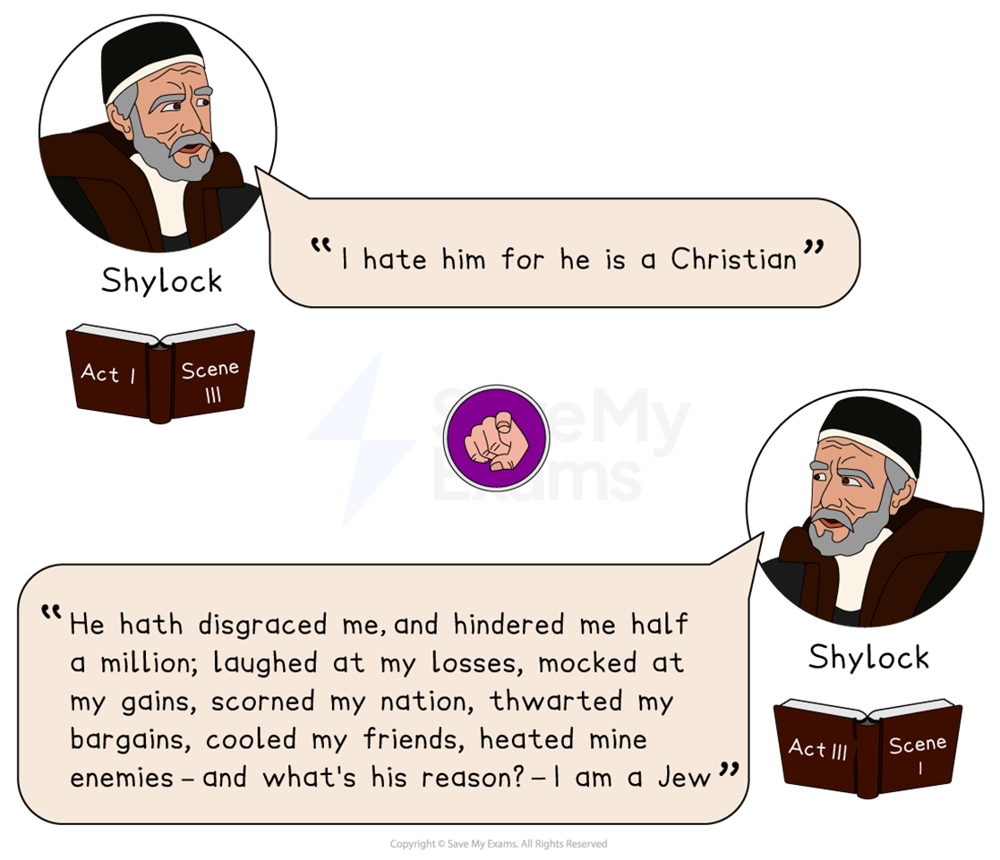
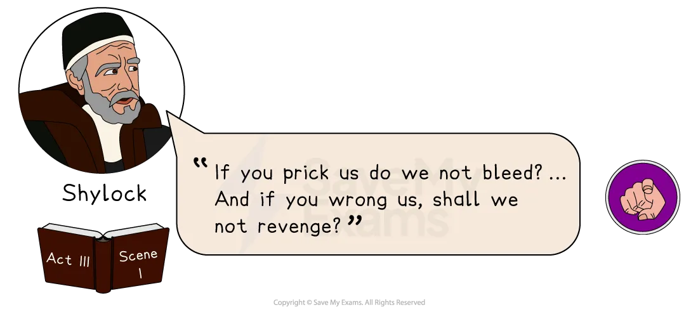
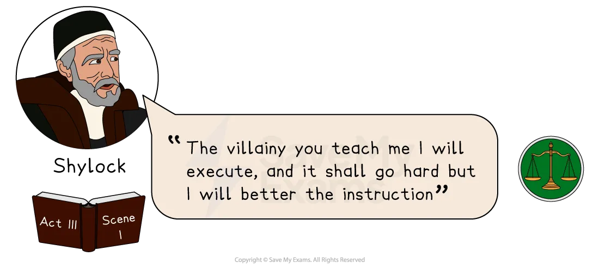
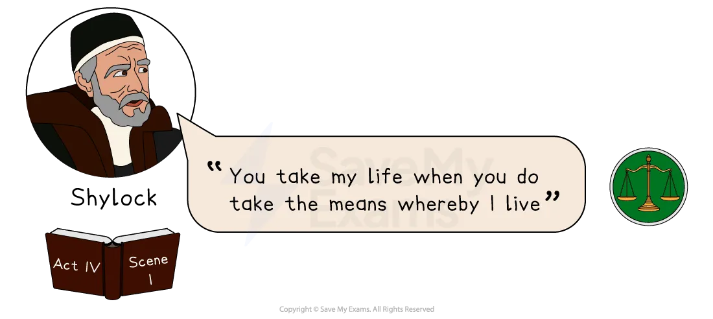
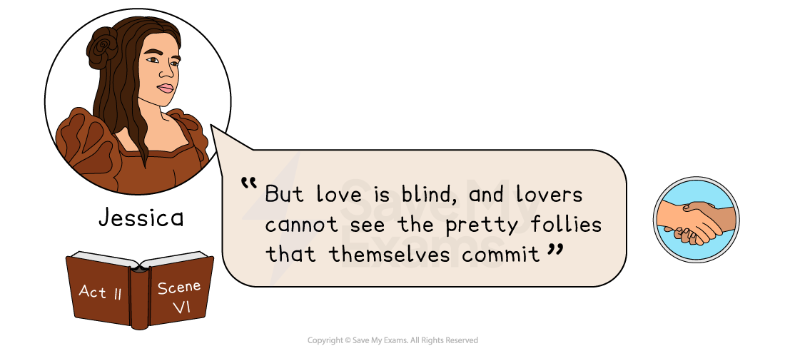
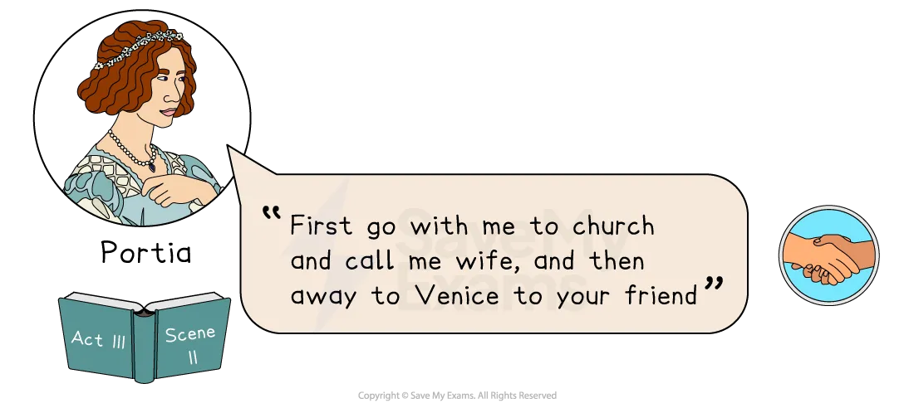
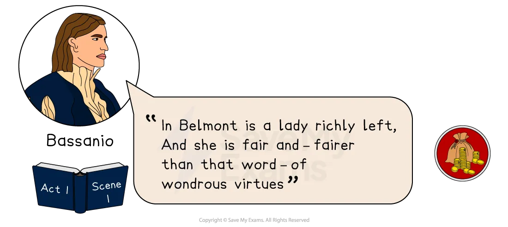

# The Merchant of Venice: Key Text Quotations

## The Merchant of Venice: Key Quotations

> **Spec point** — `spcpt_XpwNSgy4bgH9hjn3`

## Key Quotations

Remember the assessment objectives explicitly states that you should be able to “use textual references, *including *quotations”. This means summarising, paraphrasing, referencing single words and referencing plot events are all as valid as quotations in demonstrating that you understand the text. It is important to remember that you can evidence your knowledge of the text in these two equally valid ways: both through references *to *it and direct quotations *from *it.

Overall, you should aim to secure a strong knowledge of the text, rather than rehearsed quotations, as this will enable you to respond to the question. It is the quality of your knowledge of the text which will enable you to select references effectively.

If you are going to revise quotations, the best way is to group them by character, or theme. Below you will find definitions and analysis of the best quotations, arranged by the following themes:

- **Prejudice and intolerance**
- **Justice and mercy **
- **Love and friendship**
- **Wealth and power**

> **Exam Hint**
> Examiners ask for **selective**, accurate quotations and expect reference to at least two separate moments. A few short lines from this play will cover most questions.
> 
> For example, you could learn “The quality of mercy is not strained” and use it in an essay on justice, on Portia, or on what the court then fails to do. A line this short can be built into your own sentence, leaving room for the explanation.

## The Merchant of Venice: Key Quotations: Prejudice and intolerance

> **Spec point** — `spcpt_7hKqDpsPZXQTRkFP`

## Prejudice and intolerance

Prejudice is a prevalent theme in The Merchant of Venice. The majority of the Venetian characters exhibit strong prejudice and intolerance against Shylock in the play.

*Paired quotations from Act 1 Scene 3*

**“I hate him for he is a Christian”** – Shylock, Act 1, Scene 3

**“He hath disgraced me, and hindered me half a million; laughed at my losses, mocked at my gains, scorned my nation, thwarted my bargains, cooled my friends, heated mine enemies, and what’s his reason? — I am a Jew”** – Shylock, Act 3, Scene 1

### Meaning and context

- The first quote appears in Act 1, Scene 3 when the audience is first introduced to Shylock

### Analysis

- Here, Shakespeare demonstrates Shylock’s own prejudice against the Christian characters in the play, particularly Antonio
- As a character, Shylock is a deeply devout follower of his religion, yet this quote displays his prejudice and intolerance for other faiths
- However, in the second quote, Shakespeare appears to suggest that Shylock's anger stems from the maltreatment he has endured over time rather than being inherently tied to his Jewish identity
- As a character he is continually subjected to prejudice and humiliation

*Act 3 Scene 1 quote*

**“If you prick us do we not bleed? … And if you wrong us, shall we not revenge?”** – Shylock, Act 3, Scene 1

### Meaning and context

- This quote appears in Act III, when Shylock delivers a long [monologue](https://www.savemyexams.com/glossary/gcse/english-literature/monologue-definition/) which reveals much about his character

### Analysis

- During Shylock’s monologue, he presents his argument that Jews and Christians share a universal sense of humanity and a similar desire for retribution
- While the monologue concludes with Shylock defending his strong desire for revenge, it could be interpreted as a plea for equality
- During this speech, the audience is provided with a valuable insight into the character of Shylock and the motivations behind his actions, which unveils a more sophisticated and intricate [persona](https://www.savemyexams.com/glossary/gcse/english-literature/persona-definition/) of his character compared to the one that Shakespeare first portrays

## The Merchant of Venice: Key Quotations: Justice and mercy

> **Spec point** — `spcpt_tQcJcTcysBtpxcP6`

## Justice and mercy

In The Merchant of Venice, Shakespeare explores the theme of justice and mercy by using a range of literary techniques. Justice is demanded when a person senses injustice, while mercy refers to the act of granting forgiveness, which may not be easily bestowed.

*Act 3 Scene 1 quote*

**“The villainy you teach me I will execute, and it shall go hard but I will better the instruction”*** *– Shylock, Act 3, Scene 1

### Meaning and context

- This quote is spoken by Shylock when he is speaking to Salerio and Solanio who are taunting him

### Analysis

- This quote demonstrates Shylock’s fixation on his revenge with Antonio as he insists on getting what he believes is rightfully his, without entertaining any form of opposition or reason
- This quote also suggests that Shylock's behaviour towards Christians is learned from them: “the villainy you teach me”
- After this part in the play, it becomes challenging to empathise with Shylock as he is devoid of both compassion and balance

*Act 4 Scene 1 quote*

**“You take my life when you do take the means whereby I live”*** *– Shylock, Act 4, Scene 1

### Meaning and context

- This quote appears in Act IV and shows Shylock speaking to the court

### Analysis

- This quote reveals Shylock’s demise as a character for despite being spared from death, he faces severe consequences, including losing his possessions, profession and religion
- Upon leaving the court, he issues no further threats of retribution
- An audience may feel that Portia's punishment of Shylock is too severe — her strict interpretation of the law results in the complete destruction of his character

## The Merchant of Venice: Key Quotations: Love and friendship

> **Spec point** — `spcpt_FMtsqC3KzZtvHNsV`

## Love and friendship

The Merchant of Venice explores the theme of love and friendship between many of its characters. The chief romantic relationship in the play involves Bassanio and Portia, and other relationships are also explored through Jessica's elopement with Lorenzo, the wedding between Nerissa and Gratiano, and the bond of friendship between Antonio and Bassanio.

*Act 2 Scene 6 quote*

**“But love is blind, and lovers cannot see the pretty follies that themselves commit”*** *– Jessica, Act 2, Scene 6

### Meaning and context

- This quote appears in Act 2, Scene 6 and is spoken by Jessica

### Analysis

- This quote illustrates how Jessica is blinded by love in the play as she willingly gives up her life of riches to be with Lorenzo
- Jessica conveys the belief that love makes people oblivious to the flaws of their beloved and acknowledges that in the state of being in love, one may also believe they are perfect
- The quote underscores the themes of romance and wealth in the play and either one  can impair one's judgement

*Act 3 Scene 2 quote*

**“First go with me to church and call me wife, and then away to Venice to your friend” **– Portia, Act 3, Scene 2

### Meaning and context

- This quote appears in Act 3, Scene 1 after Bassanio has chosen the correct casket

### Analysis

- In this quote, Portia portrays her altruistic side as a character by encouraging Bassanio to wed her promptly, so that he can aid his acquaintance, Antonio
- Moreover, she pledges to provide Bassanio with any amount of gold necessary to settle Antonio's debts and save his life
- As a compassionate woman, Portia understands that Bassanio could never allow his friend to perish due to his financial obligations

## The Merchant of Venice: Key Quotations: Wealth and power

> **Spec point** — `spcpt_VCTtDQTv3H5tpQZC`

## Wealth and power

The Merchant of Venice highlights the complexities of wealth and power through several characters. Although Bassanio is portrayed as a noble character, his financial struggles are a significant obstacle which leads him to borrow from Antonio, while Shylock's vengeful actions enable him to profit by taking advantage of others.

*Act 1 Scene 1 quote*

**“I like not fair terms and a villain's mind”*** *– Bassanio, Act 1, Scene 3

### Meaning and context

- This quote appears in Act I of the play and is spoken by Bassanio concerning Shylock’s terms for the bond

### Analysis

- Although Bassanio, at times, could be viewed as quite an immature character, this quote reveals his shrewdness and good intuition when he mistrusts Shylock’s terms for the bond
- Whilst Antonio appears oblivious to the strangeness of Shylock’s terms and willingly accepts them, Bassanio’s caution in allowing Antonio to accept them demonstrates his ability to show wisdom and sound judgement

**“In Belmont is a lady richly left, And she is fair and — fairer than that word — of wondrous virtues”*** *– Bassanio, Act 1, Scene 1

### Meaning and context

- This quote appears in Act I and is Bassanio speaking to Antonio about Portia

### Analysis

- Though he acknowledges Portia's physical beauty and admirable qualities, this quote reveals Bassanio’s primary motivation for pursuing her, which is to lessen his financial woes and attain great wealth
- He mentions her vast riches first before her beauty and openly admits that they play a significant role in his decision
- This quote reveals how the desire for wealth and material possessions can influence one’s behaviour

#### Sources

Stanley Wells and Gary Taylor (eds), 2005, The Oxford Shakespeare: The Complete Works (Second Edition), Oxford University Press
