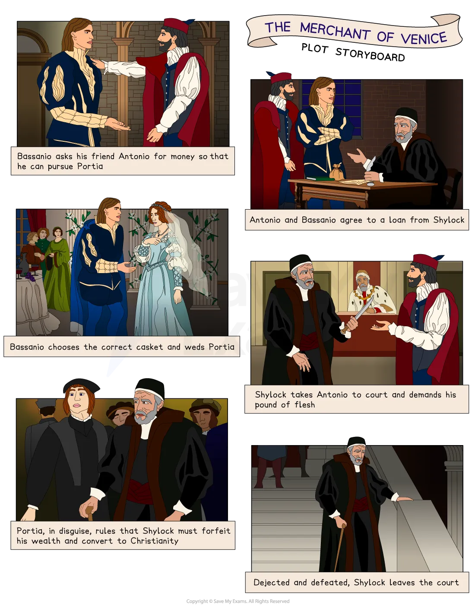

# The Merchant of Venice: Plot Summary

## The Merchant of Venice: Plot Summary

> **Spec point** — `spcpt_5NYbWD8RRjVZR4Cc`

## Plot Summary

One of the most vital and helpful things you can do in preparation for the exam is to ‘know’ the plot of The Merchant of Venice thoroughly. Once you know the text well, you should be comfortable and familiar with key events that you can then link to larger ideas. Having an in-depth knowledge and understanding of the play will help you to gain confidence to find the most relevant references to support your response.

> **Exam Hint**
> Examiners note that answers do best when the plot is used to reach evidence quickly rather than recounted. This play has **two plots** running together, and knowing how they meet is the most useful thing to understand.
> 
> For example, you could write: “Shakespeare has the bond and the caskets resolve in the same courtroom, so a story about marriage decides a story about money”. Explaining how two plots meet is a point about **structure**, and stronger than describing either one.

## The Merchant of Venice: Plot summary: Plot storyboard

> **Spec point** — `spcpt_K62przYdyn7nS7NZ`

## Plot storyboard

*The Merchant of Venice plot storyboard*

## The Merchant of Venice: Plot summary: Plot overview

> **Spec point** — `spcpt_nNhPzMQbTkCCNvp8`

## Plot overview

Bassanio is a noble Venetian who desires to court Portia, a wealthy and beautiful heiress from Belmont. However, he has squandered his money and requires 3,000 ducats to fund his efforts as a suitor. With no other viable alternatives, he turns to his wealthy merchant friend Antonio for assistance, who agrees to help despite his money being tied up in his ships out at sea. To secure the loan, Bassanio asks the Jewish moneylender Shylock to lend him the funds and Antonio agrees to be the guarantor for the debt. Initially, Shylock is hesitant to give the loan due to his previous mistreatment from Antonio. However, he agrees to lend the money on the condition that if Antonio fails to repay the loan on time, Shylock can take a pound of Antonio's flesh as repayment. Bassanio is hesitant about Antonio accepting these terms but Antonio signs the contract. Bassanio sets off for Belmont with his friend Gratiano.

While at Belmont, Bassanio learns about Antonio's inability to pay back the loan. Bassanio marries Portia and Nerissa, Portia’s maid, marries Gratiano. Portia provides funds to Bassanio and Gratiano, who journey to Venice in an attempt to save Antonio's life by settling his debt with Shylock.

Shylock takes Antonio to court. After Bassanio offers Shylock 6,000 ducats, Shylock refuses and demands his pound of flesh from Antonio. The Duke of Venice is unable to cancel the bond, so he refers the trial to a young judge, Balthazar, who is Portia in disguise. Portia urges Shylock to show mercy to Antonio. However, Shylock refuses and Portia demands that he may not remove any blood from Antonio's body. Defeated, Shylock reluctantly agrees to Bassanio's offer of money in exchange for the defaulted bond. Portia then denies his request, citing that he had already rejected it in court. She refers to a law according to which, as a Jew, Shylock has forfeited his property and now must give half to the government and half to Antonio, and his life is now solely at the mercy of the Duke.

The Duke shows mercy to Shylock and allows him to keep his life. Antonio agrees that he is willing to give up his right to half of Shylock's wealth. In return, Shylock is required to convert to Christianity and leave his entire estate to his daughter, Jessica, and her love, Lorenzo. Faced with the threat of death, Shylock ultimately agrees to the conditions. Bassanio offers a payment to Portia though she declines and requests his ring instead. Bassanio initially refuses to do so, but he finally relinquishes the ring; Nerissa requests the same from Gratiano who also surrenders his ring.

At Belmont, Portia and Nerissa teasingly berate Bassanio and Gratiano for giving away their rings before revealing that they were the disguised lawyer and clerk. Antonio’s wealth is restored. The play ends as the three couples prepare to celebrate their marriages.

## The Merchant of Venice: Plot summary: Act-by-act plot summary

> **Spec point** — `spcpt_P5wPdWyxfkpMjSVd`

## Act-by-act plot summary

### Act I

- Antonio, a merchant from Venice, is in a melancholic state and anxious about his ships that are currently at sea
- His friend, Bassanio, confesses to squandering the money he received from Antonio
- Bassanio has his heart set on winning the hand of Portia, a wealthy heiress from Belmont
- To fulfil his goal, he asks Antonio for a loan of 3,000 ducats
- Despite facing financial difficulties due to his ships being out at sea, Antonio agrees to help
- Antonio proposes using his name to secure a loan in Venice
- Portia is not allowed to choose her husband and has to abide by her father's wishes
- The suitor who chooses the correct casket out of the three will win the chance to marry her
- Shylock becomes aware of Bassanio's appeal and requests a conversation with Antonio
- Shylock suggests a unique loan arrangement whereby Antonio agrees to the bond of a pound of flesh in place of traditional interest

### Act II

- Bassanio is convinced to hire Launcelot, a servant of Shylock
- Shylock's daughter, Jessica, desires to leave home and become a Christian in order to marry Lorenzo, a friend of Antonio
- Launcelot delivers a letter to Lorenzo with plans for him and Jessica to run away that evening
- Jessica absconds with gold and jewels from Shylock
- The following day, Bassanio embarks on a journey to Belmont while Shylock expresses fury over his daughter's disappearance and the theft of his treasure
- In Belmont, the suitors of Portia, the Prince of Morocco and the Prince of Aragon, choose to open the golden and silver caskets, respectively
- Both make the mistake of selecting the incorrect casket and are unsuccessful
- Upon Aragon's departure, Portia receives word of Bassanio's arrival and rushes excitedly to greet him

### Act III

- Shylock becomes aware that his daughter, Jessica, is recklessly spending the money she took from him and begins to rant bitterly against all Christians
- He informs Antonio's acquaintances that if he does not receive the loan repayment on time, that he will enforce the original contract of one pound of flesh
- Bassanio, in Belmont, picks the lead casket and he wins the hand of Portia
- Gratiano, a friend of Bassanio, requests the hand of Nerissa, Portia's maid, in marriage
- Portia entrusts her ring to Bassanio, with the condition that he never gives it to another
- As Lorenzo and Jessica reach Belmont, news arrives that Antonio's ships have been lost at sea
- Knowing that Shylock is insisting on the fulfilment of his bond, Bassanio and Gratiano hastily depart to assist Antonio
- Portia and Nerissa also decide to help Antonio by disguising themselves as lawyers and going to Venice

### Act IV

- In a courtroom in Venice, Shylock insists on receiving his promised pound of flesh
- During a court session, the Duke consults with a lawyer named “Balthazar”, who is actually Portia in disguise, for legal guidance
- Portia pleads with Shylock to show kindness and compassion to Antonio
- Bassanio suggests using the money his wife possesses to pay the outstanding debt, which surpasses the required amount, but Shylock declines the offer
- Balthazar's explanation that the bond involved only flesh and not blood prevents Antonio’s death
- Shylock is unable to obtain the pound of flesh he desired
- As a consequence of endangering the life of a citizen of Venice, Shylock is required to surrender his assets
- Antonio declines his portion of compensation and instead requests that it be placed in a trust for Lorenzo and Jessica
- Additionally, he insists that Shylock convert to Christianity
- After being broken into submission, Shylock departs from the court
- Bassanio and Gratiano express their gratitude towards the lawyers, who request their rings as payment for their legal services
- Bassanio and Gratiano initially decline the request to hand over their rings, but they comply when Antonio intervenes

### Act V

- Portia and Nerissa return home at night to find Lorenzo and Jessica in Belmont
- When their husbands arrive, Portia and Nerissa chastise them for giving away their rings
- Eventually, they reveal themselves as the lawyers from the trial
- Antonio receives news that his ships have returned safely after all
- The play ends as the three couples prepare to celebrate their marriages

#### Sources

Stanley Wells and Gary Taylor (eds), 2005, The Oxford Shakespeare: The Complete Works (Second Edition), Oxford University Press
