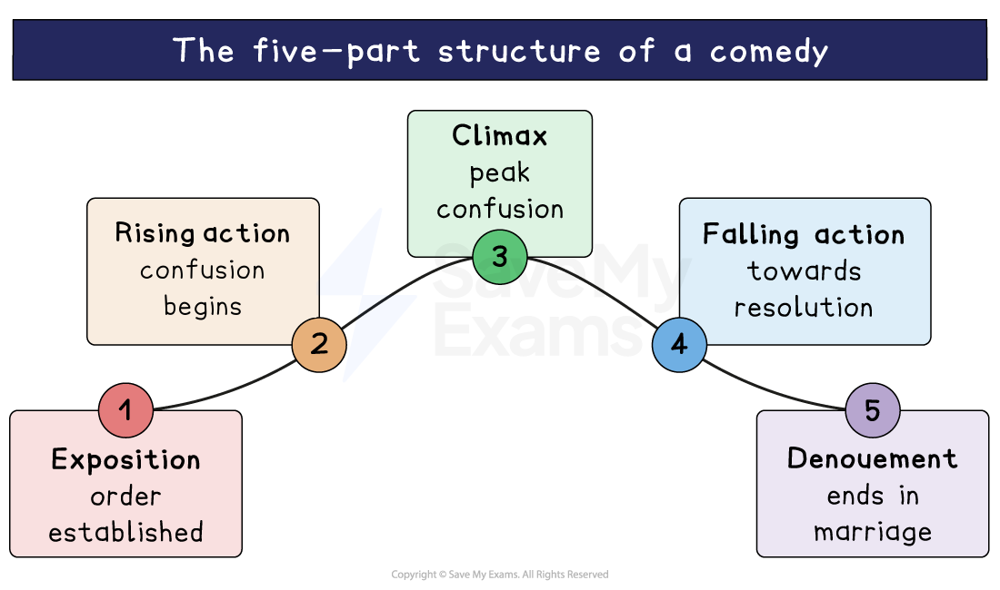

# The Merchant of Venice: Writer's Methods and Techniques

## The Merchant of Venice: Writer’s Methods and Techniques

> **Spec point** — `spcpt_kX3WBKfcBVgyY5CW`

## Writer’s Methods and Techniques

‘Methods’ is an umbrella term for anything the writer does on purpose to create meaning. Using the writer’s name in your response will help you to think about the text as a conscious construct and will keep reminding you that Shakespeare purposely put the text together.

The best responses at GCSE don’t limit their analysis to individual words and phrases. Examiners are really looking for analysis of Shakespeare’s overall aims, so try to take a “whole-text” approach to writer’s methods and techniques. Each of the below topics do just that:

- **Form**
- **Structure**
- [Blank verse](https://www.savemyexams.com/glossary/gcse/english-literature/blank-verse-definition/)** and **[prose](https://www.savemyexams.com/glossary/gcse/english-language/prose-definition/)
- **Literary techniques**

> **Exam Hint**
> Examiners warn against naming devices without explaining their **effect**. The most rewarding methods here are structural, because the play keeps setting comic scenes beside cruel ones.
> 
> For example, you could write: “Shakespeare follows the trial with a scene of jokes about rings, so the audience is hurried away from what has just happened to Shylock”. Explaining what a writer’s ordering does to an audience is stronger than naming the device.

## The Merchant of Venice: Writer’s Methods and Techniques: Form

> **Spec point** — `spcpt_cDqsn7GxdkwJTKh7`

## Form

The Merchant of Venice is a **Shakespearean comedy**. It is important that the examiner knows from your essays that you understand the conventions of comedy, as this is valuable — and sophisticated — understanding of the writer’s craft and methods.

### Shakespearean comedies usually consist of:

- **Marriage:** Comedies generally tend to have marriage as a central theme
- Typically, **weddings are seen as symbols of happiness and new beginnings**, which Shakespeare deemed crucial enough to represent in multiple marriages in some of his plays
- **Misconception:** Shakespearean comedies often derive humour from the misunderstandings and misinterpretations of lovers
- Shakespeare's comedies typically rely on **harmless misinterpretation and deception** where the audience know more than the [protagonists](https://www.savemyexams.com/glossary/gcse/english-literature/protagonist-definition/)
- **Disguise and gender**: Shakespeare's use of disguises in comedy, specifically women disguised as young men, leads to a form of [dramatic irony](https://www.savemyexams.com/glossary/gcse/english-literature/dramatic-irony-definition/)

## The Merchant of Venice: Writer’s Methods and Techniques: Structure

> **Spec point** — `spcpt_yFpnrFncP8NVhvb6`

## Structure

### The structure of a comedy

Many of Shakespeare’s comedies follow the same five-part structure:

#### 1. Exposition

This is the introduction to the play for the audience, and an introduction to the themes and atmosphere. In the Merchant of Venice, Antonio, Bassanio, Shylock and Portia are introduced and the settings of Venice and Belmont are established. Bassanio’s request for money from Antonio leads them to Shylock.

#### 2. Rising action

Here is when complications in the main plot are exposed and an inevitable chain of events starts. In the Merchant of Venice, Antonio’s ships are thought to have been lost and Shylock, angered by his daughter’s elopement, is determined to have his bond.

#### 3. Climax

This is* *the point in the play where the tension and excitement reach the highest level*. *In the Merchant of Venice, the trial scene indicates that Antonio cannot be saved from his fate.

#### 4. Falling action

This is the event that occurs immediately after the [climax](https://www.savemyexams.com/glossary/gcse/english-language/climax-definition/) has taken place and the action shifts towards resolution instead of escalation. Shylock is ordered to convert to Christianity and *bequeath*** **his possessions to Lorenzo and Jessica; Portia and Nerissa persuade their husbands to give up their rings.

#### 5. Denouement

Normality and the natural order is restored. The lovers all gather safely in Belmont and Antonio’s ships return safely.

### Comedic conventions

- Although both tragic and comedic elements can be found in The Merchant of Venice, the latter genre is much more dominant
- While the play includes the tragic theme of despair, it is primarily a comedy due to its use of lovers being separated, characters in disguise and a happy resolution
- The play uses a comedic element in the form of lovers being frequently separated:

  - Initially, Jessica and Lorenzo are not permitted to marry; Bassanio has to return to Venice to see Antonio, leaving Portia behind
  - This separation highlights the struggle of the young lovers
- Although typically, weddings serve as a resolution in Shakespearean comedies, The Merchant of Venice play takes a different path, with the lovers already married
- In Shakespeare's comedies, it was common for women to disguise themselves as men as a plot device
- All three female characters disguise themselves as men at one point, adding to its comedic quality with their disguises:

  - First, Jessica dresses up as a torchbearer to run away from her father's home
  - Similarly, Portia and Nerissa dress up as lawyers to help Antonio, using disguises as a means to achieve their objectives
- As her father's will no longer restricts her, Portia seizes the opportunity to showcase her intelligence and capabilities while defying gender norms
- In The Merchant of Venice, Shakespeare also utilises a unique timeline where time seems to pass at a varied pace:

  - While Antonio's three-month timeline in Venice seems to pass quickly, Belmont's timeline appears to move slowly, with only days passing
- To restore the play's comedy aspect, Shakespeare introduces a third storyline that focuses on the exchange of rings in his play:

  - It is possible that Shakespeare understood how an audience might react to the fall of Shylock and, therefore, this plot point underscores this as the happiness experienced in Belmont hinging on this exchange of rings
- Thus the play's language reverts to the realm of romantic comedy after Shylock's exit:

  - After Shylock exits the stage, the tone of the play becomes much more light-hearted

## The Merchant of Venice: Writer's Methods and Techniques: Poetry and prose

> **Spec point** — `spcpt_b8mmTzKRrGK3jJY6`

## Poetry and prose

- Shakespeare used three forms of poetic language when he wrote his plays:

  - **Blank verse**
  - **Rhymed verse**
  - **Prose**
- Each of the three forms are used throughout The Merchant of Venice
- Shakespeare used these different forms of language for dramatic purposes to perform different functions:

  - To distinguish characters from one another
  - To reveal the psychology of characters
  - To show character development

### Blank verse

- **Blank verse** consists of unrhymed lines of ten syllables, although it does not always exactly fit that pattern
- Typically in Shakespeare plays, [blank verse](https://www.savemyexams.com/glossary/gcse/english-literature/blank-verse-definition/) represents human feelings in speeches and soliloquies, and the everyday ordinariness of life:

  - It is the form used the most by Shakespeare
- In the Merchant of Venice, Shylock’s [soliloquy](https://www.savemyexams.com/glossary/gcse/english-literature/soliloquy-definition/) in Act III is in blank verse

### Rhymed verse

- Rhymed verse consists of sets of [rhyming couplets](https://www.savemyexams.com/glossary/gcse/english-language/rhyming-couplet/): two successive lines that [rhyme](https://www.savemyexams.com/glossary/gcse/english-language/rhyme/) with each other at the end of the line
- Shakespeare frequently used rhyming couplets to end a scene or a character's dialogue
- In Act 1, Scene 3 of the play, Antonio concludes his speech with a rhyming couplet, stating: “In this there can be no dismay / My ships come home a month before the day”

### Prose

- **Prose** is unrhymed lines with no pattern or [rhythm](https://www.savemyexams.com/glossary/gcse/english-language/rhythm/)
- Shakespeare used prose for serious episodes, letters, or when characters appear to be losing their minds (when it would be unrealistic for them to speak poetically)
- In The Merchant of Venice, only approximately 20 per cent of the play is written in prose

## The Merchant of Venice: Writer's Methods and Techniques: Literary techniques

> **Spec point** — `spcpt_SbKYnjJdw84xDnBg`

## Literary techniques

- Shakespeare presents two contrasting worlds in the play:

  - Venice is portrayed as a bustling city filled with tradespeople and moneylenders; while Belmont is a fantastical realm where dreams and romance flourish
- In the 16th century, writers often used [imagery](https://www.savemyexams.com/glossary/gcse/english-language/imagery-definition/) of a ship battling storms and searching for a secure refuge as a [symbol](https://www.savemyexams.com/glossary/gcse/english-language/symbol/) for the turbulent trajectory of common human experience, susceptible to the will of destiny:

  - In the Merchant of Venice, Shakespeare uses Antonio’s ships as a symbol of this
  - [Foreshadowing](https://www.savemyexams.com/glossary/gcse/english-language/foreshadowing-definition/) is used to provide the audience with subtle hints about the loss of Antonio's wealth due to his overconfidence of investing all his money in one fleet of ships
- Additionally, Shakespeare uses Antonio's exaggerated offer of his life to help Bassanio to [symbolise](https://www.savemyexams.com/glossary/gcse/english-language/symbolism-definition/) the extremity and risk that the future bond will hold
- Moreover, Shylock's unwavering disposition [foreshadows](https://www.savemyexams.com/glossary/gcse/english-language/foreshadowing-definition/) his forced conversion towards the end of the play
- Shylock’s desire for a “pound of flesh” from Antonio can be interpreted in a variety of ways
- It mainly serves as a [metaphor](https://www.savemyexams.com/glossary/gcse/english-language/metaphor-definition/) for the closely intertwined relationships within the play and highlights Shylock's unwavering devotion to the law:

  - Additionally, it underscores the level of loyalty between the characters of Antonio and Bassanio, as evidenced by the binding nature of their debt
  - Further, Shylock's insistence on the repayment of Antonio's debt with his own flesh is strengthened by the fact that he has just lost his own daughter, Jessica

#### Sources

Stanley Wells and Gary Taylor (eds), 2005, The Oxford Shakespeare: The Complete Works (Second Edition), Oxford University Press
