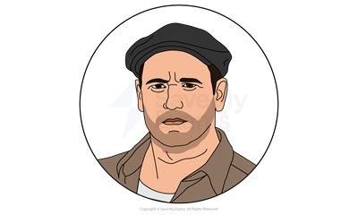
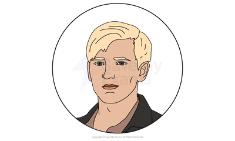
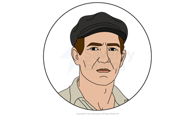
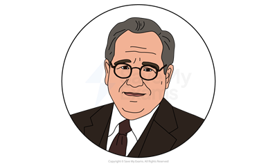

# A View from the Bridge: Characters

## A View from the Bridge: Characters

> **Spec point** — `spcpt_MFQ4PF5tq3frrWwn`

## Characters

Miller’s characters each represent different facets of the Italian-American community, and the relationships between them shed light on the prevalent themes of the text. When revising A View from the Bridge, try to focus not only on the key traits of each character but also on how they interact. Below you will find character profiles of:

- **Eddie**
- **Beatrice**
- **Catherine**
- **Rodolpho**
- **Marco**
- **Alfieri**

> **Exam Hint**
> When you discuss characters, it is important to be able to explain their dramatic purpose in terms of what they say, what they don’t say, what they do and what they don’t do. Remember that you are discussing a play: characters might still be visible on stage even when they are not speaking, and it pays to consider how they might be reacting to what is going on.

## A View from the Bridge: Characters: Eddie

> **Spec point** — `spcpt_bqfJpSr8xr2y9drF`

## Eddie

*Eddie Carbone*

- Eddie Carbone is a longshoreman of Italian immigrant stock whose job it is to load and unload boats in the Brooklyn shipyards:

  - He is the **tragic hero** of the play: the **protagonist** who makes mistakes that lead to his inexorable unravelling
  - His social position makes him a relatable “everyman” in whom the audience might see something of themselves:
  
    - The empathy that we feel for him only makes his downfall all the more tragic
- He is a dedicated family man:

  - He clearly sees it as “an honor” to take in Beatrice’s cousins, and sees it as “savin’ their lives”
  - Catherine tells Rodolpho that Eddie can be warm and generous, but we rarely see him when he is not in conflict with other characters
  - Eddie’s relationship with Beatrice is struggling: at the start of the play, the two have not been intimate in “three months”:
  
    - It is implied that Eddie’s interest in Catherine is coming between him and Beatrice
- Although Eddie loves Catherine, he is overprotective of his niece to the detriment of their relationship:

  - In the very first scene we see him seek to control Catherine’s behaviour, appearance, and even her job
  - When Catherine begins to spend more time with Rodolpho he becomes fiercely jealous of the young man for “stealing” her
  - His emotions towards Catherine are deeply confused, and he lacks the self-awareness and the vocabulary to properly navigate them
  - At times, he seems to view Catherine as a helpless child, while elsewhere his feelings may be considered incestuous:
  
    - His reference in Act I to the ways that “longshoremen” might look at Catherine suggests that he is not beyond viewing her as sexually desirable
    - In Act II he kisses Catherine on the mouth as though to claim her from Rodolpho
    - Beatrice seems aware of Eddie’s possible desires even if Eddie himself is not: she tells him in Act II that he “can never have her”
- He has a strong sense of justice, and his discussions with Alfieri highlight the distinction between justice and the law, a central theme of the play:

  - It is clear from the way that he and Beatrice tell the story of Vinny Bolzano that they agree with the way that the young man was treated:
  
    - Bolzano “snitched to the Immigration” and was made an outcast from the Italian-American community
    - This story **foreshadows** Eddie’s own fate, as he ultimately loses the respect of all who know him when he makes the same decision as Bolzano
  - Eddie believes that Rodolpho’s relationship with Catherine is unjust, but Alfieri makes clear that Eddie has no recourse in law
  - When his relationship with Catherine is threatened, Eddie breaks his own code of honour by betraying Marco and Rodolpho to the Immigration Bureau:
  
    - This act reveals that Eddie’s tragic flaw, or **hamartia**, is blind self-interest at the cost of his own principles

## A View from the Bridge: Characters: Beatrice

> **Spec point** — `spcpt_csDwzs2mv4hDtsrB`

## Beatrice

*Beatrice Carbone*

- Beatrice is Eddie’s wife, Catherine’s aunt by marriage, and cousin of Marco and Rodolpho:

  - Beatrice, not Eddie, has helped to arrange Marco and Rodolpho coming across illegally from Italy, demonstrating commendable dedication to her family:
  
    - Her involvement – and Eddie’s temperament – means that she will blame herself if something goes wrong: “I’m just afraid if it don’t turn out good you’ll be mad at me”
- Beatrice is loving and caring throughout the play, even in difficult emotional situations:

  - She calls Eddie “an angel” when he expresses willingness to take in Marco and Rodolpho
  - She celebrates Catherine’s achievements, telling Eddie that Catherine’s prospective employer “picked her out of the whole class”
  - She convinces Eddie to let Catherine accept the job offer using language that Eddie understands: “it’s an honor for her”
  - She is immediately affectionate towards Marco and Rodolpho
  - Beatrice is maternal and compassionate towards Catherine even as she warns her niece not to behave inappropriately around Eddie:
  
    - Not wanting to hurt Catherine’s feelings, she is quick to reassure Catherine that she is not jealous
- Beatrice plays the role of the mediator when Eddie creates uncomfortable or hostile situations:

  - She protects Catherine from Eddie’s anger at the end of Act I by openly telling her niece to dance with Rodolpho, rather than risking Catherine deciding to do so unprompted
  - Beatrice stands up for Catherine by gently ridiculing Eddie’s concerns about the new job: “She likes people. What’s wrong with that?”
- She is the first to warn Eddie that his behaviour towards Catherine has become unacceptable:

  - As Eddie waits for Rodolpho and Catherine to return from the pictures, Beatrice tells him that “The girl is gonna be eighteen years old, it’s time already”
  - Later she is even more explicit about the true nature of Eddie’s problem with Rodolpho and Catherine: “You want somethin’ else, Eddie, and you can never have her!”
- She is selfless, and makes sacrifices to try to keep the peace:

  - She refuses to attend Catherine’s wedding out of love for Eddie
  - She is willing to confront an awful truth if it saves Eddie’s soul: “The truth is not as bad as blood, Eddie!”

## A View from the Bridge: Characters: Catherine

> **Spec point** — `spcpt_RN6wrCmRxGnJQ3GB`

## Catherine

*Catherine*

- Catherine is Eddie’s seventeen-year-old niece, an attractive, lively girl who Eddie and Beatrice have looked after since she was a baby:

  - Although she considers Eddie and Beatrice to be her parents, she only ever addresses both by their first names:
  
    - It is likely that this **semantic** distancing makes it harder for Eddie to determine where the boundaries are in their relationship
- Catherine genuinely loves her uncle, and she seems to understand him in ways that other characters do not:

  - She tells Rodolpho that she can “tell a block away” when Eddie is “blue in his mind”
  - She also privately believes that the tension between Beatrice and Eddie is Beatrice’s fault for “goin’ at him all the time”
  - Naively, though, she does not suspect that Eddie might view her sexually until it is too late:
  
    - When Beatrice raises the idea in Act II, Catherine reacts with “horror”
- Catherine is a talented **stenographer**, about to start her first job despite Eddie’s objections:

  - She was chosen by her new employer after being at the top of her class
  - The early interaction between Eddie and Catherine about her job exemplifies a crucial facet of their relationship, which is that nothing that Catherine does is good enough for Eddie:
  
    - Eddie would rather that Catherine worked at “a lawyer’s office someplace in New York in one of them nice buildings”
  - Beatrice tells Eddie that Catherine is “crazy to start work”:
  
    - Her desperation suggests that Catherine yearns for some independence after living under Eddie’s control all of her life
- When Rodolpho arrives, Catherine is immediately attracted to him because of his sense of humour, his warmth and his musical talent:

  - Miller’s stage directions** **make clear that Catherine is “enthralled” by Rodolpho’s singing in Act I
  - In her first words to Rodolpho she speaks “wondrously”, seemingly enraptured from their first interaction
  - The relationship between Catherine and Rodolpho develops into an intense love that sees Catherine forced to choose between Rodolpho and Eddie
- Catherine demonstrates impressive strength of character when she sides with Rodolpho against the man who raised her:

  - At the end of Act I Catherine asks Rodolpho to dance in an act of “revolt”
  - She shows her independence again at the start of Act II when she chooses Rodolpho over Eddie:
  
    - Inspired by Rodolpho, she makes the decision to leave home, telling Eddie that “I just can’t stay here no more. You know I can’t”
  - Catherine’s respect for Eddie turns to hate and loathing by the end of the play:
  
    - She is independent enough in Act II to call Eddie a “rat” who “belongs in the sewer” to his face
- However, as Eddie dies at the very end of the play she retracts her words and expresses regret:

  - She murmurs that “I never meant to do nothing bad to you”, although we can never know whether Eddie truly believes her

## A View from the Bridge: Characters: Rodolpho

> **Spec point** — `spcpt_CHrWbQtdzPBwBZWr`

## Rodolpho

*Rodolpho*

- An attractive young man who arrives in the country illegally, Rodolpho has a lively sense of humour and makes an immediate and positive impact on the play:

  - His blonde hair and extroverted personality make him stand apart immediately on the stage:
  
    - His appearance and behaviour make him an attractive, likeable **counterpoint** to the stereotypically masculine Eddie
  - He also appears to be popular with the other longshoremen – something that Eddie misinterprets as his co-workers mocking Rodolpho:
  
    - By highlighting how easily Rodolpho is accepted by the other workers, Miller makes the point that traditional concepts of masculinity can co-exist with more modern, forward-thinking sensibilities
- Unlike his older brother Marco, Rodolpho is entranced by America and would enjoy being an American citizen:

  - He displays a palpable sense of wonder when describing Broadway and “where theatres are and the opera”
  - Marco describes Rodolpho as a free spirit: “he dreams, he dreams”
  - He wants to save money to buy a motorcycle so that he can travel around delivering messages:
  
    - This suggests a romantic sense of adventure, and a desire to break free of social expectations: a man with a motorcycle “is responsible. This man exists”
  - Eddie uses Rodolpho’s fascination with American culture against him by telling Catherine that Rodolpho is only using her to become an American citizen
- Rodolpho is multi-talented: he can cook, sing and make clothes:

  - Eddie’s distaste for Rodolpho’s talents is obvious from the moment he interrupts Rodolpho’s song in Act I
- Rodolpho’s love for Catherine is genuine and powerful:

  - Rodolpho demonstrates genuine compassion in his interaction with Catherine at the start of Act II:
  
    - He likens her relationship with Eddie to a trapped bird – an image that suggests that he values her freedom as much as she does
    - The tenderness of his physical interactions with Catherine contrasts greatly with Eddie’s display of sexual violence moments later
    - He is at pains to reassure Catherine that he truly cares for her, despite what Eddie believes
  - He nevertheless addresses Catherine with infantilizing language on occasion
- At the end of the play he tries to keep the peace by apologising to Eddie despite being completely innocent:

  - In doing this, Rodolpho might be seen as settling “for half”, making a compromise for the greater good
  - Eddie refuses to accept the lifeline that Rodolpho offers in a final moment of bleak contrast

## A View from the Bridge: Characters: Marco

> **Spec point** — `spcpt_X626sZxJ82fs6Qv8`

## Marco

*Marco*

- Marco, Rodolpho’s older brother, is very much strong yet reserved and only feels compelled to make his feelings known when he senses that an injustice has occurred:

  - Marco says and does less than other characters, but his actions are among the most significant and impactful in the play:
  
    - He does not speak in defence of Rodolpho when Eddie punches his brother at the end of Act I, but the stage direction to Marco is powerful in its simplicity: “Marco rises.”
    - When he lifts the chair to end the Act, he demonstrates his superior strength (and the danger that he poses to Eddie) with the absolute minimum of speech
    - He performs this act while “face to face with Eddie”, turning an innocent gesture into something almost threatening
    - In Act II, he accuses Eddie of contacting the Immigration Bureau and shows his disgust for him with one act: “Marco spits into Eddie’s face”
- Unlike his brother, Marco does not seek adventure or hope to achieve a dream – he wishes only to support his family:

  - His journey to America is a necessary sacrifice that shows his love for his family:
  
    - Marco tells Eddie that his children are so hungry that “They eat the sunshine”
    - Our knowledge of Marco’s family in Italy makes Eddie’s betrayal in Act II all the more reprehensible – by getting Marco sent home, he may have indirectly starved Marco’s children
- Marco has a strong sense of justice and sees revenge as a moral right despite the constraints of the law:

  - He tells Alfieri that Eddie would be killed in Italy for his actions
  - He insists that real justice is about more than is written in Alfieri’s “book”
  - Marco lies to Alfieri to secure his release from prison, clearly seeing his entitlement to justice as outweighing the lesser sin of deceit
- He kills Eddie by turning Eddie’s own knife on him:

  - The audience does not know whether Marco would have murdered Eddie had Eddie not pulled out the knife
  - While his murder of Eddie may be seen as self-defence, he shows no regret at the play’s end

## A View from the Bridge: Characters: Alfieri

> **Spec point** — `spcpt_yVm422QycMV9CMDM`

## Alfieri

*Alfieri*

- Alfieri is a Brooklyn lawyer who serves as a narrator and commentator as well as a character in the play; he bridges the divide between the audience and the characters:

  - He speaks directly to the audience (“you”) and, in amicable fashion, as a friendly authority on the events of the play
  - In his opening speech he reveals that he came from Italy to practise law in America when he was a young man:
  
    - He is therefore able to comment on the action of the play from the perspectives of both the Italian-American community and also the American legal system
  - His role is to oversee the action of the play and remain objective throughout:
  
    - His objectivity is tested, though: he wishes that he could have stepped in to prevent Eddie’s tragic downfall, but had no legal power to do so
- He places the events of the drama into geographical, historical and chronological context:

  - His opening speech establishes the Red Hook setting and gives the audience a sense of the location’s atmosphere and character
  - He likens the events of the tragedy to a classical tragedy set in “Syracuse” or “Calabria”, imbuing the Brooklyn slums with a sense of grandeur
  - Alfieri’s interjections throughout the play allow Miller to move time by hours, days and weeks:
  
    - This creates the sense of Eddie’s slow but inevitable moral deterioration while keeping the narrative moving at a brisk pace
- Alfieri’s message to the audience, which he repeats at the beginning and the end of the play, is that it is better to “settle for half” than to seek complete justice:

  - This is because the search for absolute justice sometimes results in unacceptable, awful consequences
  - He makes the same point to both Eddie and Marco when they visit him in his office, but neither is able to accept the wisdom of what he says:
  
    - Eddie and Marco opt for absolute justice instead of accepting moral compromise, setting them both on track to a fatal conclusion
- His final message to the audience asks us to question whether we might sympathise with Eddie, even after his heinous actions:

  - Even Alfieri, with his full and objective understanding of the issues at play, sees something admirable in Eddie’s honesty:
  
    - His own admission that he mourns Eddie, though, causes him some “alarm”

> **Exam Hint**
> High-grade responses demonstrate awareness of how characters see one another, as well as how the audience is guided to respond to them. Beatrice loves Catherine, but there is also a hint of jealousy, and she clearly believes her niece to be naive in terms of her behaviour around Eddie. Eddie, on the other hand, seems to see Catherine as, at turns, a child, an object of desire and as a piece of property. While Rodolpho treats Catherine with more respect as an individual, he nevertheless refers to her as a “little girl” at the start of Act II, which suggests that he – like Eddie – cannot help but see her as childlike.

**Sources **

Miller, A. (2010). A View From the Bridge. Penguin.
