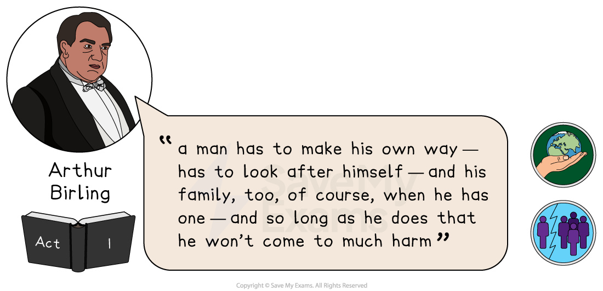
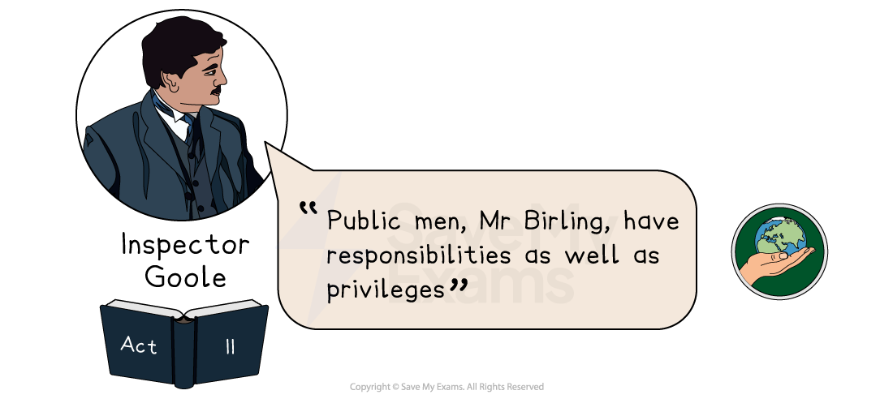
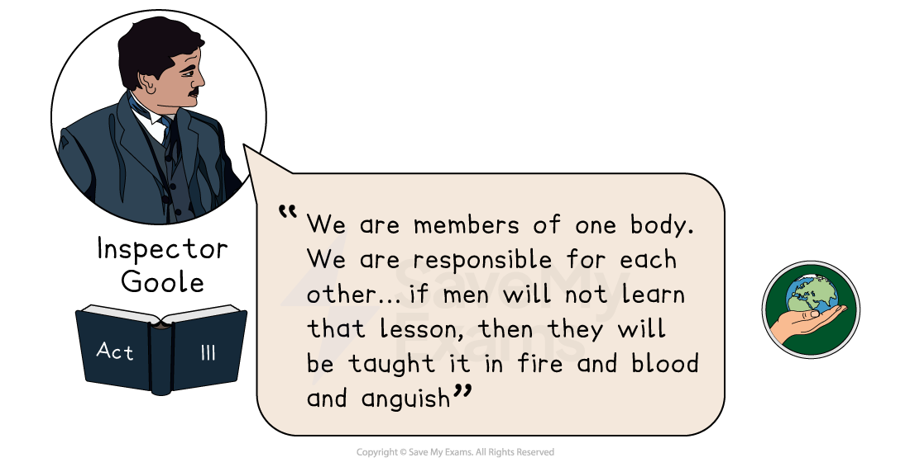
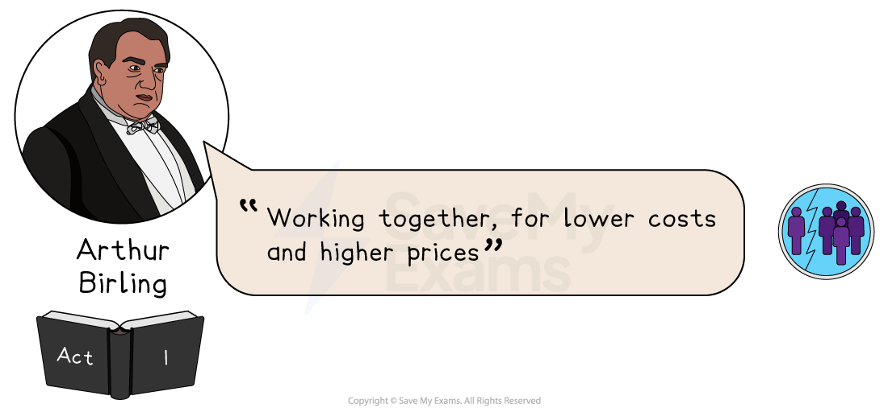
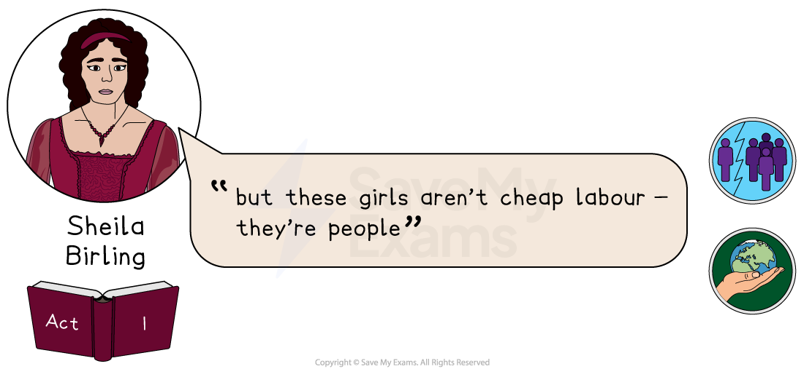
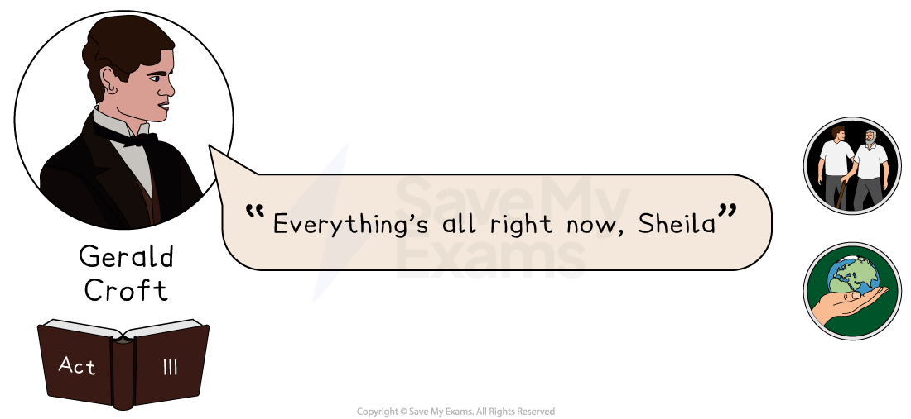
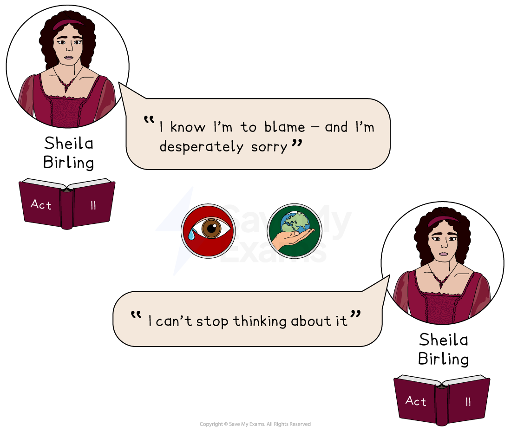
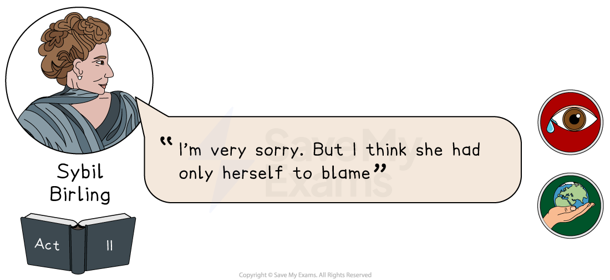
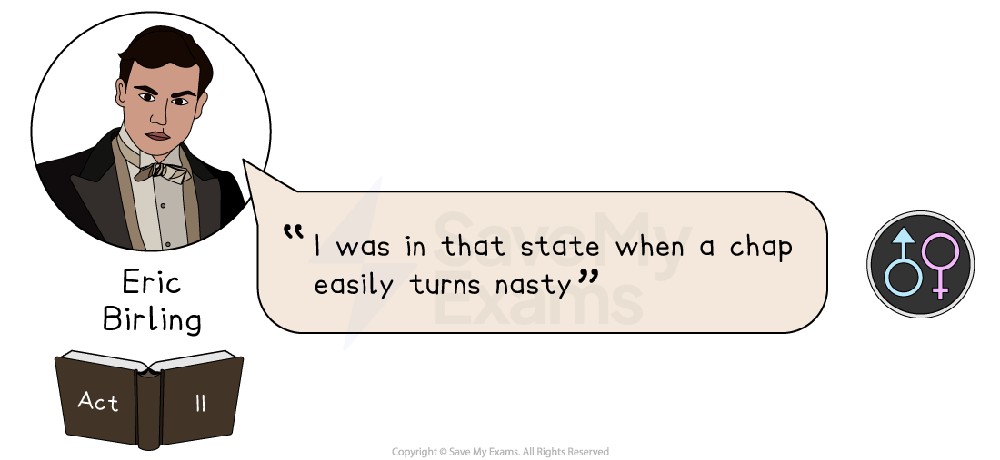
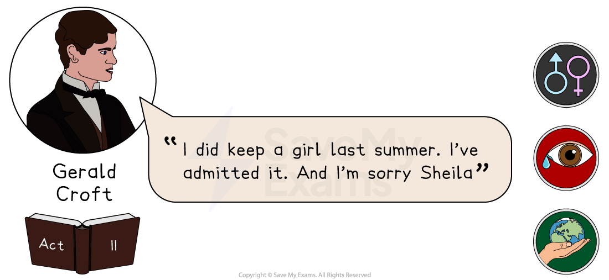

# An Inspector Calls: Key Text Quotations

## An Inspector Calls: Key quotations

> **Spec point** — `spcpt_C72pmGDKMhTrgGSJ`

## Key Quotations

Remember the assessment objectives explicitly states that you should be able to “use textual references, *including *quotations”. This means summarising, paraphrasing, referencing single words and referencing plot events are all as valid as quotations in demonstrating that you understand the play. It is important that you remember that you can evidence your knowledge of the text in these two equally valid ways: both through references *to *it and direct quotations *from *it.

Overall, you should aim to secure a strong knowledge of the text, rather than rehearsed quotations, as this will enable you to respond to the question. It is the quality of your knowledge of the text which will enable you to select references effectively.

If you are going to revise quotations, the best way is to group them by character, or theme. Below you will find definitions and analysis of the best quotations, arranged by the following themes:

- **[Responsibility](https://www.savemyexams.com/gcse/english-literature/aqa/17/revision-notes/3-modern-texts/an-inspector-calls/an-inspector-calls-key-quotations/#:~:text=Gender-,Responsibility,-Responsibility%20is%20one)**
- **[Capitalism versus Socialism](https://www.savemyexams.com/gcse/english-literature/aqa/17/revision-notes/3-modern-texts/an-inspector-calls/an-inspector-calls-key-quotations/#:~:text=evading%20social%20responsibility-,Capitalism%20versus%20Socialism,-An%20Inspector%20Calls)**
- **[Generational divide](https://www.savemyexams.com/gcse/english-literature/aqa/17/revision-notes/3-modern-texts/an-inspector-calls/an-inspector-calls-key-quotations/#:~:text=towards%20her%20parents-,Generational%20divide,-Priestley%20explores%20the)**
- **[Guilt](https://www.savemyexams.com/gcse/english-literature/aqa/17/revision-notes/3-modern-texts/an-inspector-calls/an-inspector-calls-key-quotations/#:~:text=when%20memorised%20together.-,Guilt,-For%20Priestley%2C%20guilt)**
- **[Class](https://www.savemyexams.com/gcse/english-literature/aqa/17/revision-notes/3-modern-texts/an-inspector-calls/an-inspector-calls-key-quotations/#:~:text=their%20social%20responsibility-,Class,-Priestley%20uses%20the)**
- **[Gender](https://www.savemyexams.com/gcse/english-literature/aqa/17/revision-notes/3-modern-texts/an-inspector-calls/an-inspector-calls-key-quotations/#:~:text=to%20her%20class-,Gender,-Priestley%20explores%20the)**

## An Inspector Calls: Key quotations: Responsibility

> **Spec point** — `spcpt_kscWXnXMSyyM4Z4d`

## Responsibility

Responsibility is one of the most **prevalent** themes within the play and the role of the Inspector is to highlight that all actions have consequences. He demands that the other characters be accountable for their actions and that they take responsibility for others. This message is also intended for the wider audience and for society in general.

` “... a man has to make his own way—has to look after himself—and his family, too, of course, when he has one—and so long as he does that he won’t come to much harm” – Arthur Birling, Act I`

**Meaning and context**

- At the beginning of Act I, Arthur delivers several lengthy monologues and this quote is spoken to Gerald and Eric just before the Inspector arrives

**Analysis**

- This quote reveals Arthur Birling’s self-centredness and his narrow-minded view of society
- His vocabulary reveals his sense of individualism as he believes that everyone should be responsible for themselves and their family and is devoid of any sympathy for those less fortunate than himself
- “A man has to…”  alludes to his ***patriarchal***** **values, that men should have more power and privilege than women

` `

`“Public men, Mr Birling, have responsibilities as well as privileges” – Inspector Goole, Act II`

**Meaning and context  **

- This quote is delivered in Act II by the Inspector and is directed to Arthur Birling
- The Inspector argues that members of a society have duties and obligations toward each other’s welfare and have a collective and ***social responsibility*** to take care of each other

**Analysis**

- As Arthur (and Sybil) hold prominent positions within society, the Inspector suggests they have an even greater duty of care toward others
- Birling’s hypocritical views about personal responsibility are unfitting for a character who has held prominent public positions
- While the Inspector alludes to ideas of “responsibility”, Arthur also repeatedly uses this word though he interprets responsibility in a very different way

` `

`“We are members of one body. We are responsible for each other… if men will not learn that lesson, then they will be taught it in fire and blood and anguish” – Inspector Goole, Act III`

**Meaning and context**

- This quote is from Inspector’s final speech in Act III to the Birlings before he exits the stage

**Analysis**

- This is the Inspector’s most significant and weighty statement in the play and Priestley warns of the dire consequences of evading **social responsibility**
- The language here is carefully composed and ***moralistic*** in tone
- The use of violent imagery and metaphor is powerful and suggests impending conflict
- Priestley warns the audience (and society) of the consequences of evading **social responsibility**

## An Inspector Calls: Key quotations: Capitalism versus socialism

> **Spec point** — `spcpt_z82qJxSc6hN2Qcx9`

## Capitalism versus Socialism

An Inspector Calls is a play that deals with ideas of fairness and inequality. Priestley used the play to argue that the economic system of **Capitalism** prevented equality and social justice and that another system, **Socialism**, which aims to share out wealth, would be fairer for all.

`“Working together, for lower costs and higher prices” – Arthur Birling, Act I`

**Meaning and context**

- This quote is from Act I and is directed toward Gerald Croft
- Arthur Birling is discussing his delight that one day Gerald’s family business will no longer be seen as rivals and that they may eventually join forces

**Analysis**

- Arthur’s priorities are those of business and he believes he needs to make as much profit as possible, regardless of the consequences
- He has no sense of responsibility or concern that his workers may need higher wages to live
- He believes his wages are fair and treats the pay strike at his factory with contempt for it threatens his profits

`“but these girls aren’t cheap labour - they’re people” – Sheila Birling, Act I`

**Meaning and context**

- This quote is from Act I and Sheila directs this quote to her father when he is discussing the workers in his factory
- Working-class women would have been one of the cheapest forms of labour available to factory owners

**Analysis**

- Although Sheila appears somewhat self-interested at the beginning of Act I, there are early indications (as evident in this quote) that she is a caring character
- This quote reveals her sensitive nature and her compassion and empathy for others less fortunate than herself
- The use of the word ‘but’ shows how she has interrupted and challenged her father’s views here and as the play progresses, her dialogue increasingly demonstrates an assertiveness towards her parents

## An Inspector Calls: Key quotations: Generational divide

> **Spec point** — `spcpt_5TBR736tFwqsS4Rn`

## Generational divide

Priestley explores the idea of generational change in An Inspector Calls: younger characters are more open to social and economic change, and as a result are in conflict with their parent’s generation, who are stuck in their ways.

` `

`“Everything’s all right now, Sheila” – Gerald Croft, Act III`

**Meaning and context**

- This quote is from the end of Act III and Gerald directs this line to Sheila in the hope that she will take back his engagement ring

**Analysis**

- Offering the ring again to Sheila at the end of the play suggests Gerald has not learned anything from the Inspector
- The use of the adverb ‘now’ shows that he believes that it is possible for everything to return to normal
- When Gerald realises there are no consequences for his behaviour, he no longer cares
- As Gerald falls between the younger and older generations, the audience will have hoped that he would have redeemed himself, but by the end of the play he reverts to his original stance

> **Exam Hint**
> Examiners love when students link ideas and themes in the given extract to the rest of the play. A fantastic way to do this is to include quotations from elsewhere in An Inspector Calls that show a connection, contrast, or character development.
> 
> However, it is equally valuable to include your own “paired quotations”: two quotations that might not feature in the extract but show these connections, or changes. These paired quotations are marked below and are great when memorised together.

## An Inspector Calls: Key quotations: Guilt

> **Spec point** — `spcpt_TRg7j5TkVbHp7hTx`

## Guilt

For Priestley, guilt is the result of accepting the personal and social responsibility of one’s actions. It is noteworthy that younger characters in An Inspector Calls express guilt, but not the older generation, suggesting that they are not willing to see their own flaws or those of the society they live in.

**Paired Quotations:**

`“I know I’m to blame - and I’m desperately sorry” – Sheila Birling, Act II`

`‘I can’t stop thinking about it ’– Sheila Birling, Act II`

**Meaning and context**

- These quotes are from Act II, after Sheila’s confession in Act I

**Analysis **

- Sheila is portrayed as both sympathetic and courageous as she is the first character (apart from the Inspector) to empathise with Eva Smith’s ***predicament***
- The personal pronoun ‘I’ is repeatedly used here to show that Sheila acknowledges her own personal guilt
- However, the Inspector insists that the guilt, as well as the responsibility, must be shared by all
- Sheila’s language becomes increasingly emotional and she continually displays genuine remorse for her actions

` “I’m very sorry. But I think she had only herself to blame” – Sybil Birling, Act II`

**Meaning and context**

- This quote is from Act II and Sybil Birling directs it toward the Inspector

**Analysis**

- Sybil is portrayed as one of the least compassionate characters in the play
- She refuses to express any guilt for their treatment of Eva
- She continues to fail to see or acknowledge that she has done anything wrong
- The older generation is sharply contrasted with the younger generation, as they are able to demonstrate their capacity for change and accept their social responsibility

## An Inspector Calls: Key quotations: Gender

> **Spec point** — `spcpt_kNYM3K46hVkdKK3V`

## Gender

Priestley explores the inequality between male and female characters in An Inspector Calls to criticise his society’s suppression of women’s rights and the mistreatment of women in general.

`“I was in that state when a chap easily turns nasty” - Eric Birling, Act III`

**Meaning and context**

- This quote is from Act III and is said by Eric Birling during his confession

**Analysis**

- While an audience may view Eric as a sympathetic character, his treatment of Eva reveals how he has also abused her
- Eric hints at the potential for sexual violence and reveals Eva did not want him to enter her room until he became ‘nasty’ and issued a threat
- This quote exposes the vulnerability of women who can be easily exploited by wealthy men like Eric

`“I did keep a girl last summer. I’ve admitted it. And I’m sorry Sheila.” – Gerald Croft, Act II`

**Meaning and context**

- This quote is from Act II and is during Gerald’s confession about his affair with Eva/Daisy

**Analysis**

- The three-part list in this quote suggests Gerald feels that it is all over and done with and he and Sheila can simply move on
- During his confession, Gerald he appears more concerned that his affair has been discovered, rather than having betrayed his fiancée
- Gerald’s confession of having a mistress is overlooked by Arthur and Sybil

> **Exam Hint**
> Aim for quality, not quantity. There are no rules about the number of references you should make to the whole text, but making 2–3 thoughtful, detailed and considered references, closely focused on the question, will attain higher marks than, for example, 6–7 brief and undeveloped references.
