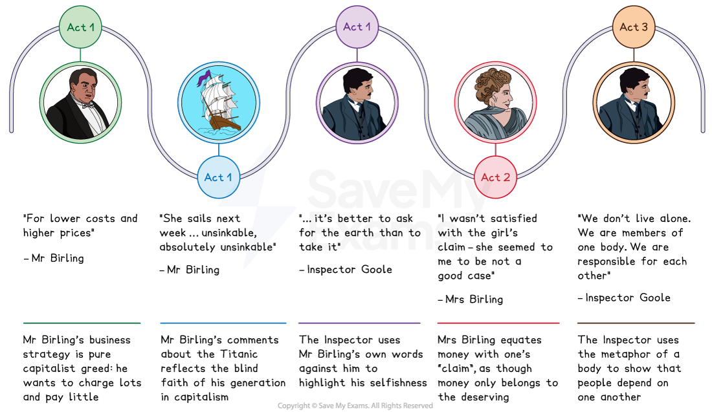
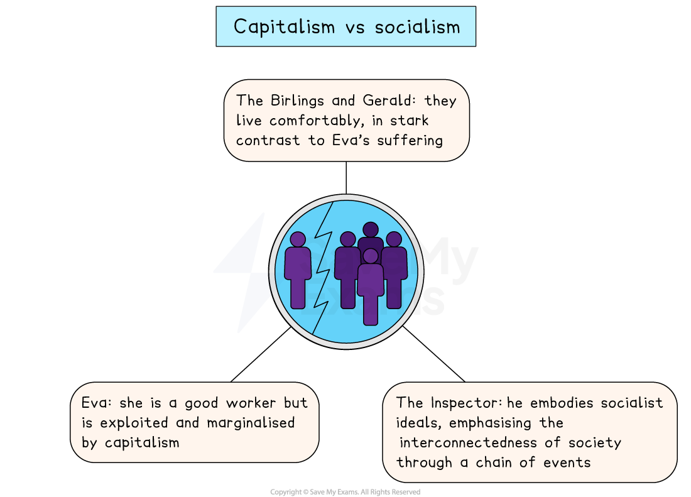

# An Inspector Calls Key Theme: Capitalism vs Socialism

## An Inspector Calls Key Theme: Capitalism vs socialism: Capitalism vs socialism timeline

> **Spec point** — `spcpt_WXFhQWYNnZmd4BC5`

## Capitalism vs socialism timeline

The theme of capitalism versus socialism in each Act of An Inspector Calls:

*An Inspector Calls capitalism versus socialism timeline*

## An Inspector Calls Key Theme: Capitalism vs socialism: What are the elements of capitalism vs socialism in An Inspector Calls?

> **Spec point** — `spcpt_yy9tXG2kSbnb6hRx`

## What are the elements of capitalism vs socialism in An Inspector Calls?

Priestley presents capitalism vs socialism in An Inspector Calls through his [characterisation](https://www.savemyexams.com/glossary/gcse/english-literature/characterisation-definition/):

- **The** **Inspector: **Embodies socialism; his investigation and moralistic speeches condemn how the poor and impoverished are victims of capitalist greed
- **Mr Birling** **and Gerald Croft: **Represent the greedy industrialists who treat workers like Eva Smith as cheap labour and refuse to raise wages
- **Eva Smith:** Her tragic fate shows the destructive potential of capitalism: she was fired for seeking a living wage, and denied charity on the basis of her perceived worth

> **Exam Hint**
> Examiners warn against answers that turn into a general essay about politics. Keep the argument inside the play, where Priestley puts the two positions into the mouths of particular characters.
> 
> For example, you could write: “Birling insists that ‘a man has to mind his own business’ just before the doorbell rings, so Priestley has the play contradict him almost immediately”. Attaching an idea to a particular moment on stage keeps you writing about the play rather than about politics.

## An Inspector Calls Key Theme: Capitalism vs socialism: The impact of capitalism vs socialism on characters

> **Spec point** — `spcpt_hswJhZKTZmQkZnR8`

## The impact of capitalism vs socialism on characters

Priestley, as a socialist, believed that wealth should be distributed throughout society, and that the wealthy and privileged have a responsibility to support the poorest in society. The play attacks the most selfish elements of capitalism by emphasising its *amoral* qualities:

*Capitalism versus socialism in An Inspector Calls*

| **Character** | **Impact** |
|---|---|
| **The Birlings and Gerald** | - Priestley contrasts the comfortable, affluent life of the Birlings with the distressing account of Eva’s wretched life:    - Gerald, son of the wealthy Crofts, also believes that Mr Birling was correct to sack a ‘troublemaker’ - Mr Birling, resistant to the Inspector’s message, protects his business to maximise profits:    - He treats his workers with contempt, displaying no sense of responsibility or concern for their welfare |
| **The Inspector** | - The Inspector [personifies](https://www.savemyexams.com/glossary/gcse/english-language/personification-definition/) socialist ideology by acting for the benefit of others rather than himself:    - His central message is that everyone is connected by a “chain of events”; the actions of the upper classes affect the less fortunate - The Inspector seizes control of the Birlings’ celebration, [symbolising](https://www.savemyexams.com/glossary/gcse/english-language/symbolism-definition/) Priestley’s hope that socialism could overcome capitalism |
| **Eva** | - Despite being a good worker, Eva is exploited and marginalised by the capitalist system:    - Priestley, through the Inspector, maintains that such a system creates inequalities in society and prevents social mobility |

## An Inspector Calls Key Theme: Capitalism vs socialism: Why does Priestley use the theme of capitalism vs socialism in his play?

> **Spec point** — `spcpt_D2pF6zhHMDZDWfq4`

## Why does Priestley use the theme of capitalism vs socialism in his play?

**1.  Setting and period**

- Priestley underscores how the wealthiest in society enjoy privileges and lives of excess, but are blind to the effects of their actions on the less fortunate in society
- The play is a** ***microcosm* of capitalist society, set in an industrial city, in the home of a wealthy manufacturer

**2. Plot driver **

- The play’s plot demonstrates what happens when powerful, greedy people prioritise money over the wellbeing of their fellow citizens
- For Priestley, Eva Smith represents “millions and millions and millions” of impoverished people, oppressed by an economic system that puts profit before people

**3. Audience appeal **

- Priestley’s 1945 audience was a more progressive and responsible generation, aware of workers’ rights and the rights of women like Eva
- Mr and Mrs Birling and Gerald reflect an outdated ideology from which society was seeking to move away

## An Inspector Calls Key Theme: Capitalism vs socialism: Exam-style questions on the theme of capitalism vs socialism

> **Spec point** — `spcpt_HxsRvbVMjMHKg37h`

## Exam-style questions on the theme of capitalism vs socialism

Try planning a response to the following essay questions as part of your revision of this theme:

- Explore how Priestley presents different attitudes towards social responsibility in An Inspector Calls?
- How does Priestley use Mr Birling to represent capitalism in An Inspector Calls?

#### Sources

Priestley, J.B.  (1992). An Inspector Calls. Heinemann.
